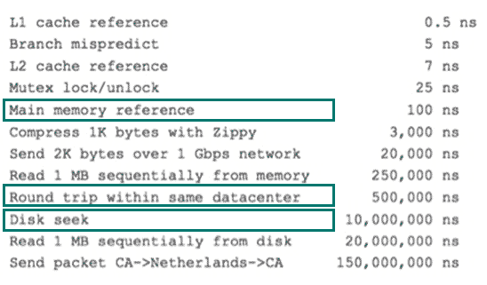
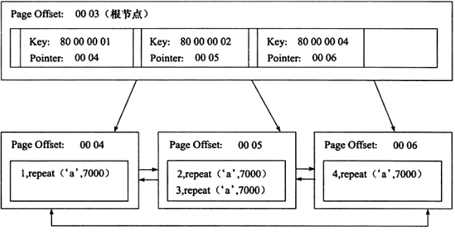
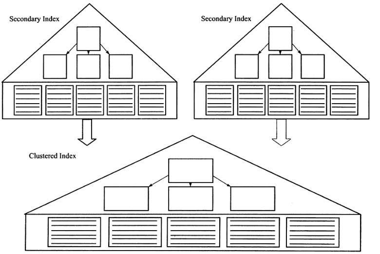
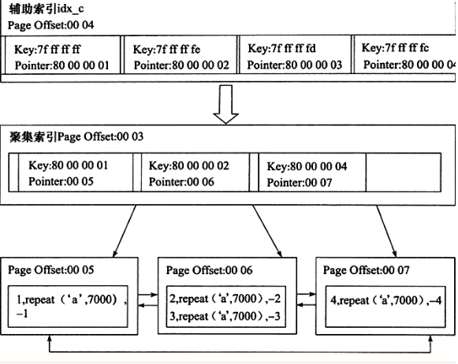
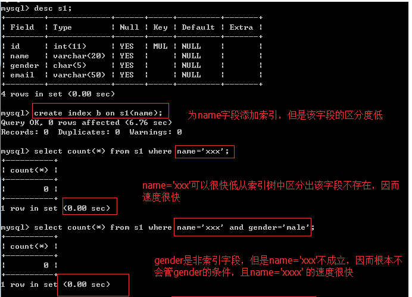
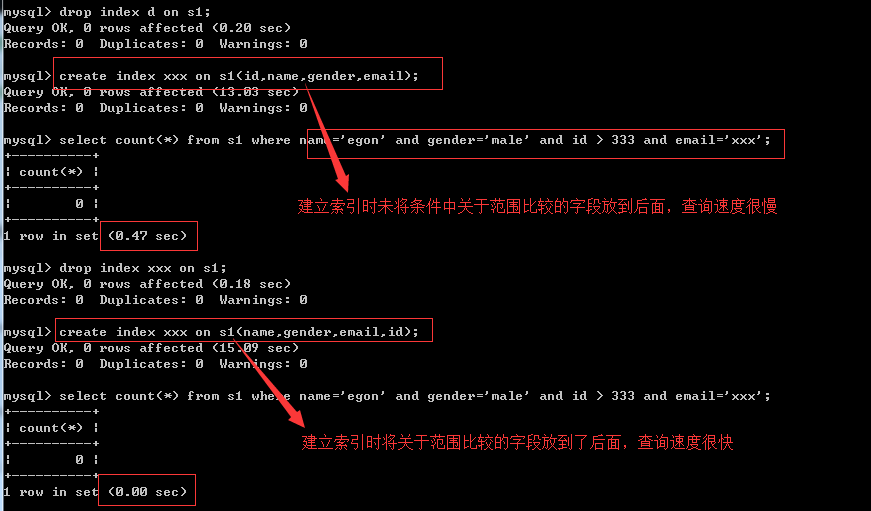

**阅读目录**

- [一 介绍](https://www.cnblogs.com/clschao/articles/10049133.html#_label1)
- [二 索引的原理](https://www.cnblogs.com/clschao/articles/10049133.html#_label2)
- [三 索引的数据结构](https://www.cnblogs.com/clschao/articles/10049133.html#_label3)
- [四 聚集索引与辅助索引](https://www.cnblogs.com/clschao/articles/10049133.html#_label4)
- [五 MySQL索引管理](https://www.cnblogs.com/clschao/articles/10049133.html#_label5)
- [六 测试索引](https://www.cnblogs.com/clschao/articles/10049133.html#_label6)
- [七 正确使用索引](https://www.cnblogs.com/clschao/articles/10049133.html#_label7)
- [八 联合索引与覆盖索引](https://www.cnblogs.com/clschao/articles/10049133.html#_label8)
- [九 查询优化神器-explain](https://www.cnblogs.com/clschao/articles/10049133.html#_label9)
- [十 慢查询优化的基本步骤](https://www.cnblogs.com/clschao/articles/10049133.html#_label10)
- [十一 慢日志管理](https://www.cnblogs.com/clschao/articles/10049133.html#_label11)

# 一 介绍

　　**为何要有索引?**

　　　　一般的应用系统，读写比例在10:1左右，而且插入操作和一般的更新操作很少出现性能问题，在生产环境中，我们遇到最多的，也是最容易出问题的，还是一些复杂的查询操作，因此对查询语句的优化显然是重中之重。说起加速查询，就不得不提到索引了。

　　**什么是索引？**

　　　　索引在MySQL中也叫做“键”或者"key"（primary key，unique key，还有一个index key），是存储引擎用于快速找到记录的一种数据结构。索引对于良好的性能非常关键，尤其是当表中的数据量越来越大时，索引对于性能的影响愈发重要，减少io次数，加速查询。（其中primary key和unique key，除了有加速查询的效果之外，还有约束的效果，primary key 不为空且唯一，unique key 唯一，而index key只有加速查询的效果，没有约束效果）
　　　　索引优化应该是对查询性能优化最有效的手段了。索引能够轻易将查询性能提高好几个数量级。
　　　　索引相当于字典的音序表，如果要查某个字，如果不使用音序表，则需要从几百页中逐页去查。

　　　　强调：一旦为表创建了索引，以后的查询最好先查索引，再根据索引定位的结果去找数据

 

　　　

[](javascript:void(0);)


```
                      30

        10                          40

   5         15               35          66

1    6    11   19          21   39     55    100
```


[](javascript:void(0);)

　　**你是否对索引存在误解？**

　　　　索引是应用程序设计和开发的一个重要方面。若索引太多，应用程序的性能可能会受到影响。而索引太少，对查询性能又会产生影响，要找到一个平衡点，这对应用程序的性能至关重要。一些开发人员总是在事后才想起添加索引----我一直认为，这源于一种错误的开发模式。如果知道数据的使用，从一开始就应该在需要处添加索引。开发人员往往对数据库的使用停留在应用的层面，比如编写SQL语句、存储过程之类，他们甚至可能不知道索引的存在，或认为事后让相关DBA加上即可。DBA往往不够了解业务的数据流，而添加索引需要通过监控大量的SQL语句进而从中找到问题，这个步骤所需的时间肯定是远大于初始添加索引所需的时间，并且可能会遗漏一部分的索引。当然索引也并不是越多越好，我曾经遇到过这样一个问题：某台MySQL服务器iostat显示磁盘使用率一直处于100%，经过分析后发现是由于开发人员添加了太多的索引，在删除一些不必要的索引之后，磁盘使用率马上下降为20%。可见索引的添加也是非常有技术含量的。

# **二 索引的原理**

　　**一 索引原理**

　　　　索引的目的在于提高查询效率，与我们查阅图书所用的目录是一个道理：先定位到章，然后定位到该章下的一个小节，然后找到页数。相似的例子还有：查字典，查火车车次，飞机航班等，下面内容看不懂的同学也没关系，能明白这个目录的道理就行了。 那么你想，书的目录占不占页数，这个页是不是也要存到硬盘里面，也占用硬盘空间。你再想，你在没有数据的情况下先建索引或者说目录快，还是已经存在好多的数据了，然后再去建索引，哪个快，肯定是没有数据的时候快，因为如果已经有了很多数据了，你再去根据这些数据建索引，是不是要将数据全部遍历一遍，然后根据数据建立索引。你再想，索引建立好之后再添加数据快，还是没有索引的时候添加数据快，索引是用来干什么的，是用来加速查询的，那对你写入数据会有什么影响，肯定是慢一些了，因为你但凡加入一些新的数据，都需要把索引或者说书的目录重新做一个，所以索引虽然会加快查询，但是会降低写入的效率。　　

　　　　**索引的影响**

　　　　　　1、在表中有大量数据的前提下，创建索引速度会很慢

　　　　　　2、在索引创建完毕后，对表的查询性能会发幅度提升，但是写性能会降低

　　　　**本质都是：通过不断地缩小想要获取数据的范围来筛选出最终想要的结果，同时把随机的事件变成顺序的事件，也就是说，有了这种索引机制，我们可以总是用同一种查找方式来锁定数据。**

　　　　数据库也是一样，但显然要复杂的多，因为不仅面临着等值查询，还有范围查询(>、<、between、in)、模糊查询(like)、并集查询(or)等等。数据库应该选择怎么样的方式来应对所有的问题呢？我们回想字典的例子，能不能把数据分成段，然后分段查询呢？最简单的如果1000条数据，1到100分成第一段，101到200分成第二段，201到300分成第三段......这样查第250条数据，只要找第三段就可以了，一下子去除了90%的无效数据。但如果是1千万的记录呢，分成几段比较好？稍有算法基础的同学会想到搜索树，其平均复杂度是lgN，具有不错的查询性能。但这里我们忽略了一个关键的问题，复杂度模型是基于每次相同的操作成本来考虑的。而数据库实现比较复杂，一方面数据是保存在磁盘上的，另外一方面为了提高性能，每次又可以把部分数据读入内存来计算，因为我们知道访问磁盘的成本大概是访问内存的十万倍左右，所以简单的搜索树难以满足复杂的应用场景。

　　**二 磁盘IO与预读**

　　　　前面提到了访问磁盘，那么这里先简单介绍一下磁盘IO和预读，磁盘读取数据靠的是机械运动，每次读取数据花费的时间可以分为寻道时间、旋转延迟、传输时间三个部分，寻道时间指的是磁臂移动到指定磁道所需要的时间，主流磁盘一般在5ms以下；旋转延迟就是我们经常听说的磁盘转速，比如一个磁盘7200转/min，表示每分钟能转7200次，也就是说1秒钟能转120次，旋转延迟就是1/120/2 = 4.17ms，也就是半圈的时间（这里有两个时间：平均寻道时间，受限于目前的物理水平，大概是5ms的时间，找到磁道了，还需要找到你数据存在的那个点，寻点时间，这寻点时间的一个平均值就是半圈的时间，这个半圈时间叫做平均延迟时间，那么平均延迟时间加上平均寻道时间就是你找到一个数据所消耗的平均时间，大概9ms，其实机械硬盘慢主要是慢在这两个时间上了，当找到数据然后把数据拷贝到内存的时间是非常短暂的，和光速差不多了）；传输时间指的是从磁盘读出或将数据写入磁盘的时间，一般在零点几毫秒，相对于前两个时间可以忽略不计。那么访问一次磁盘的时间，即一次磁盘IO的时间约等于5+4.17 = 9ms左右，听起来还挺不错的，但要知道一台500 -MIPS（Million Instructions Per Second）的机器每秒可以执行5亿条指令，因为指令依靠的是电的性质，换句话说执行一次IO的消耗的时间段下cpu可以执行约450万条指令，数据库动辄十万百万乃至千万级数据，每次9毫秒的时间，显然是个灾难，所以我们要想办法降低IO次数。下图是计算机硬件延迟的对比图，供大家参考：

　　　　 ****

　　　　考虑到磁盘IO是非常高昂的操作，计算机操作系统做了一些优化，**当一次IO时，不光把当前磁盘地址的数据，而是把相邻的数据也都读取到内存缓冲区内**，因为局部预读性原理告诉我们，当计算机访问一个地址的数据的时候，与其相邻的数据也会很快被访问到。每一次IO读取的数据我们称之为一页(page)。具体一页有多大数据跟操作系统有关，一般为4k或8k，也就是我们读取一页内的数据时候，实际上才发生了一次IO，这个理论对于索引的数据结构设计非常有帮助。

# 三 索引的数据结构

　　前面讲了索引的基本原理，数据库的复杂性，又讲了操作系统的相关知识，目的就是让大家了解，现在我们来看看索引怎么做到减少IO，加速查询的。任何一种数据结构都不是凭空产生的，一定会有它的背景和使用场景，我们现在总结一下，我们需要这种数据结构能够做些什么，其实很简单，那就是：每次查找数据时把磁盘IO次数控制在一个很小的数量级，最好是常数数量级。那么我们就想到如果一个高度可控的多路搜索树是否能满足需求呢？就这样，b+树应运而生（B+树是通过二叉查找树，再由平衡二叉树，B树演化而来，等到后面讲算法的时候再将，现在这个阶段，你大概了解一下就行了，别深究~~）。

　　　　

　　如上图，是一颗b+树，最上层是树根，中间的是树枝，最下面是叶子节点，关于b+树的定义可以参见[B+树](http://zh.wikipedia.org/wiki/B%2B树)，这里只说一些重点，浅蓝色的块我们称之为一个磁盘块或者叫做一个block块，这是操作系统一次IO往内存中读的内容，一个块对应四个扇区，可以看到每个磁盘块包含几个数据项（深蓝色所示，一个磁盘块里面包含多少数据，一个深蓝色的块表示一个数据，其实不是数据，后面有解释）和指针（黄色所示，看最上面一个，p1表示比上面深蓝色的那个17小的数据的位置在哪，看它指针指向的左边那个块，里面的数据都比17小，p2指向的是比17大比35小的磁盘块），如磁盘块1包含数据项17和35，包含指针P1、P2、P3，P1表示小于17的磁盘块，P2表示在17和35之间的磁盘块，P3表示大于35的磁盘块。真实的数据存在于叶子节点即3、5、9、10、13、15、28、29、36、60、75、79、90、99。非叶子节点只不存储真实的数据，只存储指引搜索方向的数据项，如17、35并不真实存在于数据表中。

　　###b+树的查找过程
　　　　如图所示，如果要查找数据项29，那么首先会把磁盘块1由磁盘加载到内存，此时发生一次IO，在内存中用二分查找确定29在17和35之间，锁定磁盘块1的P2指针，内存时间因为非常短（相比磁盘的IO）可以忽略不计，通过磁盘块1的P2指针的磁盘地址把磁盘块3由磁盘加载到内存，发生第二次IO，29在26和30之间，锁定磁盘块3的P2指针，通过指针加载磁盘块8到内存，发生第三次IO，同时内存中做二分查找找到29，结束查询，总计三次IO。真实的情况是，3层的b+树可以表示上百万的数据，如果上百万的数据查找只需要三次IO，性能提高将是巨大的，如果没有索引，每个数据项都要发生一次IO，那么总共需要百万次的IO，显然成本非常非常高。除了叶子节点，其他的树根啊树枝啊保存的就是数据的索引，他们是为你建立这种数据之间的关系而存在的。

　　###b+树性质
　　　　1**.索引字段要尽量的小**：通过上面的分析，我们知道IO次数取决于b+数的高度h或者说层级，这个高度或者层级就是你每次查询数据的IO次数，假设当前数据表的数据为N，每个磁盘块的数据项的数量是m，则有h=㏒(m+1)N，当数据量N一定的情况下，m越大，h越小；而m = 磁盘块的大小 / 数据项的大小，磁盘块的大小也就是一个数据页的大小，是固定的，如果数据项占的空间越小，数据项的数量越多，树的高度越低。这就是为什么每个数据项，即索引字段要尽量的小，比如int占4字节，要比bigint8字节少一半。这也是为什么b+树要求把真实的数据放到叶子节点而不是内层节点，一旦放到内层节点，磁盘块的数据项会大幅度下降，导致树增高。当数据项等于1时将会退化成线性表。

　　　　　　比如：你每个叶子节点只存两个数据的情况下，你如果想多加两个数据，你怎么办

　　　　　　　　

　　　　　　　　所以我们需要将树建的越低越好，因为每个磁盘块的大小是一定的，那么意味着我们单个数据库里面的单个数据的大小越大越好还是越小越好，你想啊，你现在叶子节点的磁盘块，两个数据就沾满了，你数据要是更大的话，你这一个磁盘块就只能放一个数据了亲，这样随着你数据量的增大，你的树就越高啊，我们应该想办法让树的层数低下来，效率才高啊，所以我们应该让每个数据的大小尽可能的小，那就意味着，你每个磁盘块存的数据就越多，你树的层级就越少啊，树就越低啊，对不对。并且数据的数量越大，你需要的磁盘块越多，磁盘块越多，你需要的树的层级就越高，所以我们应该尽可能的用更少的磁盘块来装更多的数据项，这样树的高度才能降下来，怎么才能装更多的数据项啊，当然是你的数据项越小，你的磁盘块盛放的数据量就越多了，所以如果一张表中有很多的字段，我们应该用什么字段来建立索引啊，如果你有id字段、name字段、描述信息字段等等的，你应该用哪个来建立索引啊，当然是id字段了，你想想对不对，因为id是个数字，占用空间最少啊。


　　　　2.**索引的最左匹配特性**：简单来说就是你的数据来了以后，从数据块的左边开始匹配，在匹配右边的，知道这句话就行啦~~~~，我们继续学下面的内容。当b+树的数据项是复合的数据结构，比如(name,age,sex)的时候，b+数是按照从左到右的顺序来建立搜索树的，比如当(张三,20,F)这样的数据来检索的时候，b+树会优先比较name来确定下一步的所搜方向，如果name相同再依次比较age和sex，最后得到检索的数据；但当(20,F)这样的没有name的数据来的时候，b+树就不知道下一步该查哪个节点，因为建立搜索树的时候name就是第一个比较因子，必须要先根据name来搜索才能知道下一步去哪里查询。比如当(张三,F)这样的数据来检索时，b+树可以用name来指定搜索方向，但下一个字段age的缺失，所以只能把名字等于张三的数据都找到，然后再匹配性别是F的数据了， 这个是非常重要的性质，即索引的最左匹配特性。

# **四 聚集索引与辅助索引**

　　**聚集索引是什么呢，其实就是我们说的那个主键，之前我们说Innodb存储引擎的表，必须有一个主键，还记得为什么吗，我们说过的...不记得了吧，看下面**

　　　　**还记得MyISAM存储引擎在创建表的时候会在硬盘上生成哪些文件吗，是不是有三个.frm\.MYD\.MYI结尾的三个文件，frm结尾的是表结构，MYD结尾的是数据文件，MYI结尾的就是索引文件，也就是说索引也是存在硬盘上的，那InnoDB引擎呢，创建一个表，在硬盘上会生成.frm\.idb结尾的两个文件，那索引的呢，难道InnoDB就用不了索引吗？怎么可能？之前咱们有没有建立过索引啊，primary key、unique key是不是都叫做索引啊，但是索引那个文件去哪了呢，索引是不可能在表结构.frm（存什么字段什么类型这些东西）的文件中，那就只剩下.idb结尾的数据文件了，索引就在这里面，InnoDB引擎的表，它的索引和数据都在同一个文件里面，所以我一直强调，使用InnoDB存储引擎的时候，每建一个表，就需要给一个主键，是因为这个主键是InnoDB存储引擎的.idb文件来组织存储数据的依据或者说方式，也就是说InnoDB存储引擎在存储数据的时候默认就按照索引的那种树形结构来帮你存。这种索引，我们就称为聚集索引，也就是在聚集数据组织数据的时候，就用这种索引。InnoDB这么做就是为了加速查询效率，因为你经常会遇到基于主键来查询数据的情况，并且通常我们把id字段作为主键，第一点是因为id占用的数据空间不大，第二点是你经常会用到id来查数据。如果你的表有两个字段，一个id一个name，id为主键，当你查询的时候如果where后面的条件是name=多少多少，那么你就没有用到主键给你带来的加速查询的效果（需要主键之外的辅助索引），如果你用where id=多少多少，就会按照我们刚才上面说的哪种树形结构来给你找寻数据了（当然不仅仅有这种树形结构的数据结构类型），能够快速的帮你定位到数据块。这种聚集索引的特点是它会以id字段作为依据，去建立树形结构，但是叶子节点存的是你表中的一条完整记录，一条完整的数据。记住这一点昂，一会将辅助索引的时候，和这个内容有关系，会讲到一个回表的概念。
**

　　**在数据库中，B+树的高度一般都在2~4层，这也就是说查找某一个键值的行记录时最多只需要2到4次IO，这倒不错。因为当前一般的机械硬盘每秒至少可以做100次IO，2~4次的IO意味着查询时间只需要0.02~0.04秒。**

　　**数据库中的B+树索引可以分为聚集索引（clustered index）和辅助索引（secondary index），**

　　**聚集索引与辅助索引相同的是：不管是聚集索引还是辅助索引，其内部都是B+树的形式，即高度是平衡的，叶子结点存放着所有的数据。**

　　**聚集索引与辅助索引不同的是：叶子结点存放的是否是一整行的信息**

　　**1、聚集索引**

[](javascript:void(0);)


```
#InnoDB存储引擎表示索引组织表，即表中数据按照主键顺序存放。而聚集索引（clustered index）就是按照每张表的主键构造一棵B+树，同时叶子结点存放的即为整张表的行记录数据，也将聚集索引的叶子结点称为数据页。聚集索引的这个特性决定了索引组织表中数据也是索引的一部分。同B+树数据结构一样，每个数据页都通过一个双向链表来进行链接。
    
#如果未定义主键，MySQL取第一个唯一索引（unique）而且只含非空列（NOT NULL）作为主键，InnoDB使用它作为聚簇索引。
    
#如果没有这样的列，InnoDB就自己产生一个这样的ID值，它有六个字节，而且是隐藏的，使其作为聚簇索引。

#由于实际的数据页只能按照一棵B+树进行排序，因此每张表只能拥有一个聚集索引。在多少情况下，查询优化器倾向于采用聚集索引。因为聚集索引能够在B+树索引的叶子节点上直接找到数据。此外由于定义了数据的逻辑顺序，聚集索引能够特别快地访问针对范围值得查询。
```


[](javascript:void(0);)

　　　　****

　　　　**聚集索引的好处之一：它对主键的排序查找和范围查找速度非常快，叶子节点的数据就是用户所要查询的数据。如用户需要查找一张表，查询最后的10位用户信息，由于B+树索引是双向链表，所以用户可以快速找到最后一个数据页，并取出10条记录**　　

[](javascript:void(0);)


```
#参照第六小结测试索引的准备阶段来创建出表s1
mysql> desc s1; #最开始没有主键
+--------+-------------+------+-----+---------+-------+
| Field  | Type        | Null | Key | Default | Extra |
+--------+-------------+------+-----+---------+-------+
| id     | int(11)     | NO   |     | NULL    |       |
| name   | varchar(20) | YES  |     | NULL    |       |
| gender | char(6)     | YES  |     | NULL    |       |
| email  | varchar(50) | YES  |     | NULL    |       |
+--------+-------------+------+-----+---------+-------+
4 rows in set (0.00 sec)

mysql> explain select * from s1 order by id desc limit 10; #Using filesort，需要二次排序
+----+-------------+-------+------------+------+---------------+------+---------+------+---------+----------+----------------+
| id | select_type | table | partitions | type | possible_keys | key  | key_len | ref  | rows    | filtered | Extra          |
+----+-------------+-------+------------+------+---------------+------+---------+------+---------+----------+----------------+
|  1 | SIMPLE      | s1    | NULL       | ALL  | NULL          | NULL | NULL    | NULL | 2633472 |   100.00 | Using filesort |
+----+-------------+-------+------------+------+---------------+------+---------+------+---------+----------+----------------+
1 row in set, 1 warning (0.11 sec)

mysql> alter table s1 add primary key(id); #添加主键
Query OK, 0 rows affected (13.37 sec)
Records: 0  Duplicates: 0  Warnings: 0

mysql> explain select * from s1 order by id desc limit 10; #基于主键的聚集索引在创建完毕后就已经完成了排序，无需二次排序
+----+-------------+-------+------------+-------+---------------+---------+---------+------+------+----------+-------+
| id | select_type | table | partitions | type  | possible_keys | key     | key_len | ref  | rows | filtered | Extra |
+----+-------------+-------+------------+-------+---------------+---------+---------+------+------+----------+-------+
|  1 | SIMPLE      | s1    | NULL       | index | NULL          | PRIMARY | 4       | NULL |   10 |   100.00 | NULL  |
+----+-------------+-------+------------+-------+---------------+---------+---------+------+------+----------+-------+
1 row in set, 1 warning (0.04 sec)
```


[](javascript:void(0);)

　　　　

　　　　**聚集索引的好处之二：范围查询（range query），即如果要查找主键某一范围内的数据，通过叶子节点的上层中间节点就可以得到页的范围，之后直接读取数据页即可**

[](javascript:void(0);)


```
mysql> alter table s1 drop primary key;
Query OK, 2699998 rows affected (24.23 sec)
Records: 2699998  Duplicates: 0  Warnings: 0

mysql> desc s1;
+--------+-------------+------+-----+---------+-------+
| Field  | Type        | Null | Key | Default | Extra |
+--------+-------------+------+-----+---------+-------+
| id     | int(11)     | NO   |     | NULL    |       |
| name   | varchar(20) | YES  |     | NULL    |       |
| gender | char(6)     | YES  |     | NULL    |       |
| email  | varchar(50) | YES  |     | NULL    |       |
+--------+-------------+------+-----+---------+-------+
4 rows in set (0.12 sec)

mysql> explain select * from s1 where id > 1 and id < 1000000; #没有聚集索引，预估需要检索的rows数如下，explain就是预估一下你的sql的执行效率
+----+-------------+-------+------------+------+---------------+------+---------+------+---------+----------+-------------+
| id | select_type | table | partitions | type | possible_keys | key  | key_len | ref  | rows    | filtered | Extra       |
+----+-------------+-------+------------+------+---------------+------+---------+------+---------+----------+-------------+
|  1 | SIMPLE      | s1    | NULL       | ALL  | NULL          | NULL | NULL    | NULL | 2690100 |    11.11 | Using where |
+----+-------------+-------+------------+------+---------------+------+---------+------+---------+----------+-------------+
1 row in set, 1 warning (0.00 sec)

mysql> alter table s1 add primary key(id);
Query OK, 0 rows affected (16.25 sec)
Records: 0  Duplicates: 0  Warnings: 0

mysql> explain select * from s1 where id > 1 and id < 1000000; #有聚集索引，预估需要检索的rows数如下
+----+-------------+-------+------------+-------+---------------+---------+---------+------+---------+----------+-------------+
| id | select_type | table | partitions | type  | possible_keys | key     | key_len | ref  | rows    | filtered | Extra       |
+----+-------------+-------+------------+-------+---------------+---------+---------+------+---------+----------+-------------+
|  1 | SIMPLE      | s1    | NULL       | range | PRIMARY       | PRIMARY | 4       | NULL | 1343355 |   100.00 | Using where |
+----+-------------+-------+------------+-------+---------------+---------+---------+------+---------+----------+-------------+
1 row in set, 1 warning (0.09 sec)
```


[](javascript:void(0);)

　　**2、辅助索引**

　　　　就是我们在查询的时候，where后面需要写id之外的其他字段名称来进行查询，比如说是where name=xx，没法用到主键索引的效率，怎么办，就需要我们添加辅助索引了，给name添加一个辅助索引。

　　　　表中除了聚集索引外其他索引都是辅助索引（Secondary Index，也称为非聚集索引）（unique key啊、index key啊），与聚集索引的区别是：辅助索引的叶子节点不包含行记录的全部数据。

　　　　叶子节点存放的是对应的那条数据的主键字段的值，除了包含键值以外，每个叶子节点中的索引行中还包含一个书签（bookmark），其实这个书签你可以理解为是一个{'name字段'，name的值，主键id值}的这么一个数据。该书签用来告诉InnoDB存储引擎去哪里可以找到与索引相对应的行数据。如果我们select 后面要的是name，我们直接就可以在辅助索引的叶子节点找到对应的name值，比如：select name from tb1 where name='xx'；这个xx值你直接就在辅助索引的叶子节点就能找到，这种我们也可以称为覆盖索引。如果你select后面的字段不是name，例如：select age from tb1 where name='xx'；也就是说，我通过辅助索引的叶子节点不能直接拿到age的值，需要通过辅助索引的叶子节点中保存的主键id的值再去通过聚集索引来找到完整的一条记录，然后从这个记录里面拿出age的值，这种操作有时候也成为回表操作，就是从头再回去查一遍，这种的查询效率也很高，但是比覆盖索引低一些，再说一下昂，再辅助索引的叶子节点就能找到你想找的数据可称为覆盖索引。再看看下面的解释：

　　　　由于InnoDB存储引擎是索引组织表，因此InnoDB存储引擎的辅助索引的书签就是相应行数据的聚集索引键或者称为主键的值。如下图

　　　　　　

　　　　辅助索引的存在并不影响数据在聚集索引中的组织，因此每张表上可以有多个辅助索引，但只能有一个聚集索引。当通过辅助索引来寻找数据时，InnoDB存储引擎会遍历辅助索引并通过叶子级别的指针获得只想主键索引的主键，然后再通过主键索引来找到一个完整的行记录，这种查找的效率也是非常高。

　　　　举例来说，如果在一棵高度为3的辅助索引树种查找数据，那需要对这个辅助索引树遍历3次找到指定主键，如果聚集索引树的高度同样为3，那么还需要对聚集索引树进行3次查找，最终找到一个完整的行数据所在的页，因此一共需要6次逻辑IO访问才能得到最终的一个数据页。

　　　　

　　概念基本就说完了，下面我们来点实际操作吧，看下面的内容~~~~

# **五 MySQL索引管理**

　　**一 功能**

```
#1. 索引的功能就是加速查找
#2. mysql中的primary key，unique，联合唯一也都是索引，这些索引除了加速查找以外，还有约束的功能
```

 

　　**二 MySQL常用的索引**

[](javascript:void(0);)

```
普通索引INDEX：加速查找

唯一索引：
    -主键索引PRIMARY KEY：加速查找+约束（不为空、不能重复）
    -唯一索引UNIQUE:加速查找+约束（不能重复）

联合索引：
    -PRIMARY KEY(id,name):联合主键索引
    -UNIQUE(id,name):联合唯一索引
    -INDEX(id,name):联合普通索引
```

[](javascript:void(0);)

 　　　索引操作：

[](javascript:void(0);)

```
添加主键索引:
创建的时候添加:  添加索引的时候要注意,给字段里面数据大小比较小的字段添加,给字段里面的数据区分度高的字段添加.
聚集索引的添加方式
创建的是添加
Create table t1(
Id int primary key,
)
Create table t1(
Id int,
Primary key(id)
)

表创建完了之后添加
Alter table 表名 add primary key(id)
删除主键索引:
Alter table 表名 drop primary key;


唯一索引:
Create table t1(
Id int unique,
)

Create table t1(
Id int,
Unique key uni_name (id)
)

表创建好之后添加唯一索引:
alter table s1 add unique key  u_name(id);
删除:
Alter table s1 drop index u_name;

普通索引:
创建:
Create table t1(
Id int,
Index index_name(id)
)
Alter table s1 add index index_name(id);
Create index index_name on s1(id);

删除:
Alter table s1 drop index u_name;
DROP INDEX 索引名 ON 表名字;
```

[](javascript:void(0);)

 

　　　　各种索引的应用场景：

[](javascript:void(0);)

```
举个例子来说，比如你在为某商场做一个会员卡的系统。

这个系统有一个会员表
有下列字段：
会员编号 INT
会员姓名 VARCHAR(10)
会员身份证号码 VARCHAR(18)
会员电话 VARCHAR(10)
会员住址 VARCHAR(50)
会员备注信息 TEXT

那么这个 会员编号，作为主键，使用 PRIMARY
会员姓名 如果要建索引的话，那么就是普通的 INDEX
会员身份证号码 如果要建索引的话，那么可以选择 UNIQUE （唯一的，不允许重复）

#除此之外还有全文索引，即FULLTEXT
会员备注信息 ， 如果需要建索引的话，可以选择全文搜索。
用于搜索很长一篇文章的时候，效果最好。
用在比较短的文本，如果就一两行字的，普通的 INDEX 也可以。
但其实对于全文搜索，我们并不会使用MySQL自带的该索引，而是会选择第三方软件如Sphinx，专门来做全文搜索。

#其他的如空间索引SPATIAL，了解即可，几乎不用
```

[](javascript:void(0);)

 

　　**三 索引的两大类型hash与btree**

 

[](javascript:void(0);)

```
#我们可以在创建上述索引的时候，为其指定索引类型，分两类
hash类型的索引：查询单条快，范围查询慢
btree类型的索引：b+树，层数越多，数据量指数级增长（我们就用它，因为innodb默认支持它）

#不同的存储引擎支持的索引类型也不一样
InnoDB 支持事务，支持行级别锁定，支持 B-tree、Full-text 等索引，不支持 Hash 索引；
MyISAM 不支持事务，支持表级别锁定，支持 B-tree、Full-text 等索引，不支持 Hash 索引；
Memory 不支持事务，支持表级别锁定，支持 B-tree、Hash 等索引，不支持 Full-text 索引；
NDB 支持事务，支持行级别锁定，支持 Hash 索引，不支持 B-tree、Full-text 等索引；
Archive 不支持事务，支持表级别锁定，不支持 B-tree、Hash、Full-text 等索引；
```

[](javascript:void(0);)

 

　　**四 创建/删除索引的语法**

[](javascript:void(0);)

```
#方法一：创建表时
    　　CREATE TABLE 表名 (
                字段名1  数据类型 [完整性约束条件…],
                字段名2  数据类型 [完整性约束条件…],
                [UNIQUE | FULLTEXT | SPATIAL ]   INDEX | KEY
                [索引名]  (字段名[(长度)]  [ASC |DESC]) 
                );


#方法二：CREATE在已存在的表上创建索引
        CREATE  [UNIQUE | FULLTEXT | SPATIAL ]  INDEX  索引名 
                     ON 表名 (字段名[(长度)]  [ASC |DESC]) ;


#方法三：ALTER TABLE在已存在的表上创建索引
        ALTER TABLE 表名 ADD  [UNIQUE | FULLTEXT | SPATIAL ] INDEX
                             索引名 (字段名[(长度)]  [ASC |DESC]) ;
                             
#删除索引：DROP INDEX 索引名 ON 表名字;
```

[](javascript:void(0);)

 

　　　　看下面的示范：

[](javascript:void(0);)

```
#方式一
create table t1(
    id int,
    name char,
    age int,
    sex enum('male','female'),
    unique key uni_id(id),
    index ix_name(name) #index没有key
);


#方式二
create index ix_age on t1(age);

#方式三
alter table t1 add index ix_sex(sex);

#查看
mysql> show create table t1;
| t1    | CREATE TABLE `t1` (
  `id` int(11) DEFAULT NULL,
  `name` char(1) DEFAULT NULL,
  `age` int(11) DEFAULT NULL,
  `sex` enum('male','female') DEFAULT NULL,
  UNIQUE KEY `uni_id` (`id`),
  KEY `ix_name` (`name`),
  KEY `ix_age` (`age`),
  KEY `ix_sex` (`sex`)
) ENGINE=InnoDB DEFAULT CHARSET=latin1
```

[](javascript:void(0);)

 

# **六 测试索引**

　　**一 准备**

[](javascript:void(0);)

```
#1. 准备表
create table s1(
id int,
name varchar(20),
gender char(6),
email varchar(50)
);

#2. 创建存储过程，实现批量插入记录
delimiter $$ #声明存储过程的结束符号为$$
create procedure auto_insert1()
BEGIN
    declare i int default 1;
    while(i<3000000)do
        insert into s1 values(i,'egon','male',concat('egon',i,'@oldboy'));
        set i=i+1;
    end while;
END$$ #$$结束
delimiter ; #重新声明分号为结束符号

#3. 查看存储过程
show create procedure auto_insert1\G 

#4. 调用存储过程
call auto_insert1();
```

[](javascript:void(0);)

 

　　**二 在没有索引的前提下测试查询速度**

```
#无索引：mysql根本就不知道到底是否存在id等于333333333的记录，也不知道存在几条id=333333333的记录，只能把数据表从头到尾扫描一遍，此时有多少个磁盘块就需要进行多少IO操作，所以查询速度很慢
mysql> select * from s1 where id=333333333;
Empty set (0.33 sec)
```

 

　　**三 在表中已经存在大量数据的前提下，为某个字段段建立索引，建立速度会很慢**

　　　　

　　　　或者用alter table s1 add primary key(id);加主键，建索引很慢的。

　　**四 在索引建立完毕后，以该字段为查询条件时，查询速度提升明显**

　　　　

　　　　**PS：**

　　　　**1. mysql先去索引表里根据b+树的搜索原理很快搜索到id等于333333333的记录不存在，IO大大降低，因而速度明显提升**

　　　　**2. 我们可以去mysql的data目录下找到该表，可以看到占用的硬盘空间多了**

　　　　**3. 需要注意，如下图**

　　　　****

　　**五 总结**

[](javascript:void(0);)

```
#1. 一定是为搜索条件的字段创建索引，比如select * from s1 where id = 333;就需要为id加上索引

#2. 在表中已经有大量数据的情况下，建索引会很慢，且占用硬盘空间，建完后查询速度加快
比如create index idx on s1(id);会扫描表中所有的数据，然后以id为数据项，创建索引结构，存放于硬盘的表中。
建完以后，再查询就会很快了。

#3. 需要注意的是：innodb表的索引会存放于s1.ibd文件中，而myisam表的索引则会有单独的索引文件table1.MYI

MySAM索引文件和数据文件是分离的，索引文件仅保存数据记录的地址。而在innodb中，表数据文件本身就是按照B+Tree（BTree即Balance True）组织的一个索引结构，这棵树的叶节点data域保存了完整的数据记录。这个索引的key是数据表的主键，因此innodb表数据文件本身就是主索引。
因为inndob的数据文件要按照主键聚集，所以innodb要求表必须要有主键（Myisam可以没有），如果没有显式定义，则mysql系统会自动选择一个可以唯一标识数据记录的列作为主键，如果不存在这种列，则mysql会自动为innodb表生成一个隐含字段作为主键，这字段的长度为6个字节，类型为长整型.
```

[](javascript:void(0);)

 　你想一下，是不是全部加索引就一定好的呢，首先，我们加上索引，查询时快了，但是写入的时候就慢了，还记得吗，每次插入新的记录，你的整个索引结构都会跟着改，所以如果你乱加索引，你会发现，即便是你的网站没有几个人在注册，或者说没有几个写入数据的操作，你的磁盘IO会居高不下，磁盘在疯狂的转，因为你每插入一条数据，我们的索引都需要重新建，重建的索引要写入硬盘里面的，还记得我们给那三百万条数据建索引的时候的速度吗？每次都要把所有的数据取出来，做好一个数据结构，然后再写回硬盘，也就是要经历很多的IO才能实现这个事儿，所以乱加索引的一个弊端就是，你很少的写入都会导致你的磁盘IO非常的高，导致效率很差，所以我们要学一下怎么正确的加索引。

# 七 正确使用索引

　　**一 索引未命中**

　　　　***\*并不是说我们创建了索引就一定会加快查询速度，\*******\*若想利用索引达到预想的提高查询速度的效果，我们在添加索引时，必须遵循以下问题\******
**

　　　　**1 范围问题，或者说条件不明确，条件中出现这些符号或关键字：****>、>=、<、<=、!= 、between...and...、\**like、\****

　　　　**大于号、小于号**

　　　　****

　　　　如果你写where id >1 and id <1000000;你会发现，随着你范围的增大，速度会越来越慢，会成倍的体现出来。

　　　　不等于！=

　　　　

　　　　between ...and...

　　　　

　　　　like  #测like的时候，你可以先把id的主键索引去掉，然后测一下like，然后加上index key，再测一下。就知道你忘了，看语句：create index email_index  on s1(email) ，email_index是索引名、on、 s1是表名（字段名），你会发现建索引的时间也是很慢的，desc s1;查看一下索引是不是创建成功了，看那个key字段是不是有个mul，有这个说明创建成功了。

　　　　like=后面如果没有那些特殊字符，通配符之类的，就跟等于是一个效果，精确匹配。

　　　　

　　　　#使用like的时候，通配符写在最前面，也是需要全匹配一遍，然后在比较字符串的第二个字符，最左匹配的规则，还记得吗。

　　　　**2 尽量选择区分度高的列作为索引,区分度的公式是count(distinct col)/count(\*)，表示字段不重复的比例，比例越大我们扫描的记录数越少，唯一键的区分度是1，而一些状态、性别字段可能在大数据面前区分度就是0，那可能有人会问，这个比例有什么经验值吗？使用场景不同，这个值也很难确定，一般需要join的字段我们都要求是0.1以上，即平均1条扫描10条记录**

 

[](javascript:void(0);)

```
#先把表中的索引都删除，让我们专心研究区分度的问题
mysql> desc s1;
+--------+-------------+------+-----+---------+-------+
| Field  | Type        | Null | Key | Default | Extra |
+--------+-------------+------+-----+---------+-------+
| id     | int(11)     | YES  | MUL | NULL    |       |
| name   | varchar(20) | YES  |     | NULL    |       |
| gender | char(5)     | YES  |     | NULL    |       |
| email  | varchar(50) | YES  | MUL | NULL    |       |
+--------+-------------+------+-----+---------+-------+
4 rows in set (0.00 sec)

mysql> drop index a on s1;
Query OK, 0 rows affected (0.20 sec)
Records: 0  Duplicates: 0  Warnings: 0

mysql> drop index d on s1;
Query OK, 0 rows affected (0.18 sec)
Records: 0  Duplicates: 0  Warnings: 0

mysql> desc s1;
+--------+-------------+------+-----+---------+-------+
| Field  | Type        | Null | Key | Default | Extra |
+--------+-------------+------+-----+---------+-------+
| id     | int(11)     | YES  |     | NULL    |       |
| name   | varchar(20) | YES  |     | NULL    |       |
| gender | char(5)     | YES  |     | NULL    |       |
| email  | varchar(50) | YES  |     | NULL    |       |
+--------+-------------+------+-----+---------+-------+
4 rows in set (0.00 sec)
```

[](javascript:void(0);)

 

　　　　

[](javascript:void(0);)

```
我们编写存储过程为表s1批量添加记录，name字段的值均为egon，也就是说name这个字段的区分度很低（gender字段也是一样的，我们稍后再搭理它）

回忆b+树的结构，查询的速度与树的高度成反比，要想将树的高低控制的很低，需要保证：在某一层内数据项均是按照从左到右，从小到大的顺序依次排开，即左1<左2<左3<...

而对于区分度低的字段，无法找到大小关系，因为值都是相等的，毫无疑问，还想要用b+树存放这些等值的数据，只能增加树的高度，字段的区分度越低，则树的高度越高。极端的情况，索引字段的值都一样，那么b+树几乎成了一根棍。本例中就是这种极端的情况，name字段所有的值均为'egon'

#现在我们得出一个结论：为区分度低的字段建立索引，索引树的高度会很高，然而这具体会带来什么影响呢？？？

#1：如果条件是name='xxxx',那么肯定是可以第一时间判断出'xxxx'是不在索引树中的（因为树中所有的值均为'egon’,看第一条的时候就知道你不在索引树里面了），所以查询速度很快

#2：如果条件正好是name='egon',查询时，我们永远无法从树的某个位置得到一个明确的范围，只能往下找，往下找，往下找。。。这与全表扫描的IO次数没有多大区别，所以速度很慢
```

[](javascript:void(0);)

 

　　　　**3 =和in可以乱序，比如a = 1 and b = 2 and c = 3 建立(a,b,c)索引可以任意顺序，mysql的查询优化器会帮你优化成索引可以识别的形式**

　　　　**4 索引列不能参与计算，保持列“干净”，比如from_unixtime(create_time) = ’2014-05-29’就不能使用到索引，原因很简单，b+树中存的都是数据表中的字段值，但进行检索时，需要把所有元素都应用函数才能比较，显然成本太大。所以语句应该写成create_time = unix_timestamp(’2014-05-29’)**

　　　　****

 

　　　　把上面的条件写成 where id = 3000/3;你会发现速度变得很快，因为等于号后面的数字，是在比较之前就计算出来了，不需要每次都计算一次每次都计算一次了，跟直接等于一个常数是一样的，所以很快。结论是不要让你的索引字段参与到计算中。

　　　　**5 and/or**

[](javascript:void(0);)

```
#1、and与or的逻辑
    条件1 and 条件2:所有条件都成立才算成立，但凡要有一个条件不成立则最终结果不成立
    条件1 or 条件2:只要有一个条件成立则最终结果就成立

#2、and的工作原理
    条件：
        a = 10 and b = 'xxx' and c > 3 and d =4
    索引：
        制作联合索引(d,a,b,c)
    工作原理:  #如果是你找的话，你会怎么找，是不是从左到右一个一个的比较啊，首先你不能确定a这个字段是不是有索引，即便是有索引，也不一定能确保命中索引了（所谓命中索引，就是应用上了索引），mysql不会这么笨的，看下面mysql是怎么找的：
        索引的本质原理就是先不断的把查找范围缩小下来，然后再进行处理，对于连续多个and：mysql会按照联合索引，从左到右的顺序找一个区分度高的索引字段(这样便可以快速锁定很小的范围)，加速查询，即按照d—>a->b->c的顺序

#3、or的工作原理
    条件：
        a = 10 or b = 'xxx' or c > 3 or d =4
    索引：
        制作联合索引(d,a,b,c)
        
    工作原理:
        只要一个匹配成功就行，所以对于连续多个or：mysql会按照条件的顺序，从左到右依次判断，即a->b->c->d
```

[](javascript:void(0);)

　　　　索引要加在数据区分度高的字段上

　　　　

　　　　在左边条件成立但是索引字段的区分度低的情况下（name与gender均属于这种情况），会依次往右找到一个区分度高的索引字段，加速查询

　　　　

　　　　

　　　　经过分析，在条件为name='egon' and gender='male' and id>333 and email='xxx'的情况下，我们完全没必要为前三个条件的字段加索引，因为只能用上email字段的索引，前三个字段的索引反而会降低我们的查询效率

　　　　

　　　　　　　

　　　　大家还有兴趣的话，可以去研究一下mysql的慢sql查询的日志，学一学如果筛选慢sql等操作和配置等，优化慢sql的方式是可以修改你查询语句的逻辑，还有更有效的方式就是加索引或者联合索引。

　　　　**6 最左前缀匹配原则（详见第八小节），非常重要的原则，对于组合索引mysql会一直向右匹配直到遇到范围查询(>、<、between、like)就停止匹配(指的是范围大了，有索引速度也慢)，比如a = 1 and b = 2 and c > 3 and d = 4 如果建立(a,b,c,d)顺序的索引，d是用不到索引的，如果建立(a,b,d,c)的索引则都可以用到，a,b,d的顺序可以任意调整。**

　　　　

　　　　**7 其他情况**

[](javascript:void(0);)

```
- 使用函数
    select * from tb1 where reverse(email) = 'egon';
            
- 类型不一致
    如果列是字符串类型，传入条件是必须用引号引起来，不然...
    select * from tb1 where email = 999;
    
#排序条件为索引，则select字段必须也是索引字段，否则无法命中
- order by
    select name from s1 order by email desc;
    当根据索引排序时候，select查询的字段如果不是索引，则速度仍然很慢
    select email from s1 order by email desc;
    特别的：如果对主键排序，则还是速度很快：
        select * from tb1 order by nid desc;
 
- 组合索引最左前缀
    如果组合索引为：(name,email)
    name and email       -- 命中索引
    name                 -- 命中索引
    email                -- 未命中索引


- count(1)或count(列)代替count(*)在mysql中没有差别了

- create index xxxx  on tb(title(19)) #text类型，必须制定长度
```

[](javascript:void(0);)

 

　　**二 其他注意事项**

[](javascript:void(0);)

```
- 避免使用select *
- count(1)或count(列) 代替 count(*)
- 创建表时尽量时 char 代替 varchar
- 表的字段顺序固定长度的字段优先
- 组合索引代替多个单列索引（经常使用多个条件查询时）
- 尽量使用短索引
- 使用连接（JOIN）来代替子查询(Sub-Queries)
- 连表时注意条件类型需一致
- 索引散列值（重复少）不适合建索引，例：性别不适合
```

[](javascript:void(0);)

 

# 八 联合索引与覆盖索引

　　**一 联合索引**

　　　　联合索引时指对表上的多个列合起来做一个索引，省的你查询的时候，where后面的条件字段一直再变，你就想给每个字段加索引的尴尬问题。联合索引的创建方法与单个索引的创建方法一样，不同之处在仅在于有多个索引列，如下

[](javascript:void(0);)

```
mysql> create table t(
    -> a int,
    -> b int,
    -> primary key(a),
    -> key idx_a_b(a,b)
    -> );
Query OK, 0 rows affected (0.11 sec)
```

[](javascript:void(0);)

 

　　　　

 

　　　　那么何时需要使用联合索引呢？在讨论这个问题之前，先来看一下联合索引内部的结果。从本质上来说，联合索引就是一棵B+树，不同的是联合索引的键值得数量不是1，而是>=2。接着来讨论两个整型列组成的联合索引，假定两个键值得名称分别为a、b如图

 　　　

　　　　可以看到这与我们之前看到的单个键的B+树并没有什么不同，键值都是排序的，通过叶子结点可以逻辑上顺序地读出所有数据，就上面的例子来说，即（1,1），（1,2），（2,1），（2,4），（3,1），（3,2），数据按（a,b）的顺序进行了存放。

　　　　因此，对于查询select * from table where a=xxx and b=xxx, 显然是可以使用(a,b) 这个联合索引的，对于单个列a的查询select * from table where a=xxx,也是可以使用（a,b）这个索引的。

　　　　但对于b列的查询select * from table where b=xxx,则不可以使用（a,b） 索引，其实你不难发现原因，叶子节点上b的值为1、2、1、4、1、2显然不是排序的，因此对于b列的查询使用不到(a,b) 索引

　　　　**注意建立联合索引的一个原则：**索引是有个最左匹配的原则的，所以建联合索引的时候，将区分度高的放在最左边，依次排下来，范围查询的条件尽可能的往后边放。

　　　　**联合索引的第二个好处是在第一个键相同的情况下，已经对第二个键进行了排序处理**，例如在很多情况下应用程序都需要查询某个用户的购物情况，并按照时间进行排序，最后取出最近三次的购买记录，这时使用联合索引可以帮我们避免多一次的排序操作，因为索引本身在叶子节点已经排序了，如下

[](javascript:void(0);)

```
#===========准备表==============
create table buy_log(
    userid int unsigned not null,
    buy_date date
);

insert into buy_log values
(1,'2009-01-01'),
(2,'2009-01-01'),
(3,'2009-01-01'),
(1,'2009-02-01'),
(3,'2009-02-01'),
(1,'2009-03-01'),
(1,'2009-04-01');

alter table buy_log add key(userid);
alter table buy_log add key(userid,buy_date);

#===========验证==============
mysql> show create table buy_log;
| buy_log | CREATE TABLE `buy_log` (
  `userid` int(10) unsigned NOT NULL,
  `buy_date` date DEFAULT NULL,
  KEY `userid` (`userid`),
  KEY `userid_2` (`userid`,`buy_date`)
) ENGINE=InnoDB DEFAULT CHARSET=utf8 |

#可以看到possible_keys在这里有两个索引可以用，分别是单个索引userid与联合索引userid_2,但是优化器最终选择了使用的key是userid因为该索引的叶子节点包含单个键值，所以理论上一个页能存放的记录应该更多
mysql> explain select * from buy_log where userid=2;
+----+-------------+---------+------+-----------------+--------+---------+-------+------+-------+
| id | select_type | table   | type | possible_keys   | key    | key_len | ref   | rows | Extra |
+----+-------------+---------+------+-----------------+--------+---------+-------+------+-------+
|  1 | SIMPLE      | buy_log | ref  | userid,userid_2 | userid | 4       | const |    1 |       |
+----+-------------+---------+------+-----------------+--------+---------+-------+------+-------+
1 row in set (0.00 sec)

#接着假定要取出userid为1的最近3次的购买记录，用的就是联合索引userid_2了，因为在这个索引中，在userid=1的情况下，buy_date都已经排序好了
mysql> explain select * from buy_log where userid=1 order by buy_date desc limit 3;
+----+-------------+---------+------+-----------------+----------+---------+-------+------+--------------------------+
| id | select_type | table   | type | possible_keys   | key      | key_len | ref   | rows | Extra                    |
+----+-------------+---------+------+-----------------+----------+---------+-------+------+--------------------------+
|  1 | SIMPLE      | buy_log | ref  | userid,userid_2 | userid_2 | 4       | const |    4 | Using where; Using index |
+----+-------------+---------+------+-----------------+----------+---------+-------+------+--------------------------+
1 row in set (0.00 sec)

#ps：如果extra的排序显示是Using filesort，则意味着在查出数据后需要二次排序(如下查询语句，没有先用where userid=3先定位范围，于是即便命中索引也没用，需要二次排序)
mysql> explain select * from buy_log order by buy_date desc limit 3;
+----+-------------+---------+-------+---------------+----------+---------+------+------+-----------------------------+
| id | select_type | table   | type  | possible_keys | key      | key_len | ref  | rows | Extra                       |
+----+-------------+---------+-------+---------------+----------+---------+------+------+-----------------------------+
|  1 | SIMPLE      | buy_log | index | NULL          | userid_2 | 8       | NULL |    7 | Using index; Using filesort |
+----+-------------+---------+-------+---------------+----------+---------+------+------+-----------------------------+


#对于联合索引（a,b）,下述语句可以直接使用该索引，无需二次排序
select ... from table where a=xxx order by b;

#然后对于联合索引(a,b,c)来首，下列语句同样可以直接通过索引得到结果
select ... from table where a=xxx order by b;
select ... from table where a=xxx and b=xxx order by c;

#但是对于联合索引(a,b,c)，下列语句不能通过索引直接得到结果，还需要自己执行一次filesort操作，因为索引（a，c)并未排序
select ... from table where a=xxx order by c;
```

[](javascript:void(0);)

 

　　**二 覆盖索引**

　　　　**InnoDB存储引擎支持覆盖索引（covering index，或称索引覆盖），即从辅助索引中就可以得到查询记录，而不需要查询聚集索引中的记录。**

　　　　使用覆盖索引的一个好处是：辅助索引不包含整行记录的所有信息，故其大小要远小于聚集索引，因此可以减少大量的IO操作

------

　　　　 注意：覆盖索引技术最早是在InnoDB Plugin中完成并实现，这意味着对于InnoDB版本小于1.0的，或者MySQL数据库版本为5.0以下的，InnoDB存储引擎不支持覆盖索引特性

------

　　　　对于InnoDB存储引擎的辅助索引而言，由于其包含了主键信息，因此其叶子节点存放的数据为（primary key1，priamey key2，...,key1，key2，...）。例如

[](javascript:void(0);)

```
select age from s1 where id=123 and name = 'egon'; #id字段有索引，但是name字段没有索引,该sql命中了索引，但未覆盖，需要去聚集索引中再查找详细信息。
最牛逼的情况是，索引字段覆盖了所有，那全程通过索引来加速查询以及获取结果就ok了
mysql> desc s1;
+--------+-------------+------+-----+---------+-------+
| Field | Type | Null | Key | Default | Extra |
+--------+-------------+------+-----+---------+-------+
| id | int(11) | NO | | NULL | |
| name | varchar(20) | YES | | NULL | |
| gender | char(6) | YES | | NULL | |
| email | varchar(50) | YES | | NULL | |
+--------+-------------+------+-----+---------+-------+
4 rows in set (0.21 sec)

mysql> explain select name from s1 where id=1000; #没有任何索引
+----+-------------+-------+------------+------+---------------+------+---------+------+---------+----------+-------------+
| id | select_type | table | partitions | type | possible_keys | key | key_len | ref | rows | filtered | Extra |
+----+-------------+-------+------------+------+---------------+------+---------+------+---------+----------+-------------+
| 1 | SIMPLE | s1 | NULL | ALL | NULL | NULL | NULL | NULL | 2688336 | 10.00 | Using where |
+----+-------------+-------+------------+------+---------------+------+---------+------+---------+----------+-------------+
1 row in set, 1 warning (0.00 sec)

mysql> create index idx_id on s1(id); #创建索引
Query OK, 0 rows affected (4.16 sec)
Records: 0 Duplicates: 0 Warnings: 0

mysql> explain select name from s1 where id=1000; #命中辅助索引，但是未覆盖索引，还需要从聚集索引中查找name
+----+-------------+-------+------------+------+---------------+--------+---------+-------+------+----------+-------+
| id | select_type | table | partitions | type | possible_keys | key | key_len | ref | rows | filtered | Extra |
+----+-------------+-------+------------+------+---------------+--------+---------+-------+------+----------+-------+
| 1 | SIMPLE | s1 | NULL | ref | idx_id | idx_id | 4 | const | 1 | 100.00 | NULL |
+----+-------------+-------+------------+------+---------------+--------+---------+-------+------+----------+-------+
1 row in set, 1 warning (0.08 sec)

mysql> explain select id from s1 where id=1000; #在辅助索引中就找到了全部信息，Using index代表覆盖索引
+----+-------------+-------+------------+------+---------------+--------+---------+-------+------+----------+-------------+
| id | select_type | table | partitions | type | possible_keys | key | key_len | ref | rows | filtered | Extra |
+----+-------------+-------+------------+------+---------------+--------+---------+-------+------+----------+-------------+
| 1 | SIMPLE | s1 | NULL | ref | idx_id | idx_id | 4 | const | 1 | 100.00 | Using index |
+----+-------------+-------+------------+------+---------------+--------+---------+-------+------+----------+-------------+
1 row in set, 1 warning (0.03 sec)
```

[](javascript:void(0);)

 

　　　　**覆盖索引的另外一个好处是对某些统计问题而言的。基于上一小结创建的表buy_log,查询计划如下**

[](javascript:void(0);)

```
mysql> explain select count(*) from buy_log;
+----+-------------+---------+-------+---------------+--------+---------+------+------+-------------+
| id | select_type | table   | type  | possible_keys | key    | key_len | ref  | rows | Extra       |
+----+-------------+---------+-------+---------------+--------+---------+------+------+-------------+
|  1 | SIMPLE      | buy_log | index | NULL          | userid | 4       | NULL |    7 | Using index |
+----+-------------+---------+-------+---------------+--------+---------+------+------+-------------+
1 row in set (0.00 sec)
```

[](javascript:void(0);)

 

　　　　innodb存储引擎并不会选择通过查询聚集索引来进行统计。由于buy_log表有辅助索引，而辅助索引远小于聚集索引，选择辅助索引可以减少IO操作，故优化器的选择如上key为userid辅助索引

　　　　**对于（a,b）形式的联合索引，一般是不可以选择b中所谓的查询条件。但如果是统计操作，并且是覆盖索引，则优化器还是会选择使用该索引，如下**

 

[](javascript:void(0);)

```
#联合索引userid_2（userid,buy_date）,一般情况，我们按照buy_date是无法使用该索引的，但特殊情况下：查询语句是统计操作，且是覆盖索引，则按照buy_date当做查询条件时，也可以使用该联合索引
mysql> explain select count(*) from buy_log where buy_date >= '2011-01-01' and buy_date < '2011-02-01';
+----+-------------+---------+-------+---------------+----------+---------+------+------+--------------------------+
| id | select_type | table   | type  | possible_keys | key      | key_len | ref  | rows | Extra                    |
+----+-------------+---------+-------+---------------+----------+---------+------+------+--------------------------+
|  1 | SIMPLE      | buy_log | index | NULL          | userid_2 | 8       | NULL |    7 | Using where; Using index |
+----+-------------+---------+-------+---------------+----------+---------+------+------+--------------------------+
1 row in set (0.00 sec)
```

[](javascript:void(0);)

 

# **九 查询优化神器-explain**

　　**关于explain命令相信大家并不陌生，具体用法和字段含义可以参考官网[explain-output](http://dev.mysql.com/doc/refman/5.5/en/explain-output.html)，这里需要强调rows是核心指标，绝大部分rows小的语句执行一定很快（有例外，下面会讲到）。所以优化语句基本上都是在优化rows。**

　　***\*关于explain，如果大家有兴趣，可以看看这篇博客，他总结的挺好的：http://www.cnblogs.com/yycc/p/7338894.html\****

[](javascript:void(0);)

```
执行计划：让mysql预估执行操作(一般正确)
    all < index < range < index_merge < ref_or_null < ref < eq_ref < system/const
    id,email
    
    慢：
        select * from userinfo3 where name='alex'
        
        explain select * from userinfo3 where name='alex'
        type: ALL(全表扫描)
            select * from userinfo3 limit 1;
    快：
        select * from userinfo3 where email='alex'
        type: const(走索引)
```

[](javascript:void(0);)

 

　　**http://blog.itpub.net/29773961/viewspace-1767044/**

# **十 慢查询优化的基本步骤**

[](javascript:void(0);)

```
0.先运行看看是否真的很慢，注意设置SQL_NO_CACHE
1.where条件单表查，锁定最小返回记录表。这句话的意思是把查询语句的where都应用到表中返回的记录数最小的表开始查起，单表每个字段分别查询，看哪个字段的区分度最高
2.explain查看执行计划，是否与1预期一致（从锁定记录较少的表开始查询）
3.order by limit 形式的sql语句让排序的表优先查
4.了解业务方使用场景
5.加索引时参照建索引的几大原则
6.观察结果，不符合预期继续从0分析
```

[](javascript:void(0);)

 

# 十一 慢日志管理

[](javascript:void(0);)

```
慢日志
            - 执行时间 > 10
            - 未命中索引
            - 日志文件路径
            
        配置：
            - 内存
                show variables like '%query%';
                show variables like '%queries%';
                set global 变量名 = 值
            - 配置文件
                mysqld --defaults-file='E:\wupeiqi\mysql-5.7.16-winx64\mysql-5.7.16-winx64\my-default.ini'
                
                my.conf内容：
                    slow_query_log = ON
                    slow_query_log_file = D:/....
                    
                注意：修改配置文件之后，需要重启服务
```

[](javascript:void(0);)

 

[](javascript:void(0);)

```
MySQL日志管理
========================================================
错误日志: 记录 MySQL 服务器启动、关闭及运行错误等信息
二进制日志: 又称binlog日志，以二进制文件的方式记录数据库中除 SELECT 以外的操作
查询日志: 记录查询的信息
慢查询日志: 记录执行时间超过指定时间的操作
中继日志： 备库将主库的二进制日志复制到自己的中继日志中，从而在本地进行重放
通用日志： 审计哪个账号、在哪个时段、做了哪些事件
事务日志或称redo日志： 记录Innodb事务相关的如事务执行时间、检查点等
========================================================
一、bin-log
1. 启用
# vim /etc/my.cnf
[mysqld]
log-bin[=dir\[filename]]
# service mysqld restart
2. 暂停
//仅当前会话
SET SQL_LOG_BIN=0;
SET SQL_LOG_BIN=1;
3. 查看
查看全部：
# mysqlbinlog mysql.000002
按时间：
# mysqlbinlog mysql.000002 --start-datetime="2012-12-05 10:02:56"
# mysqlbinlog mysql.000002 --stop-datetime="2012-12-05 11:02:54"
# mysqlbinlog mysql.000002 --start-datetime="2012-12-05 10:02:56" --stop-datetime="2012-12-05 11:02:54" 

按字节数：
# mysqlbinlog mysql.000002 --start-position=260
# mysqlbinlog mysql.000002 --stop-position=260
# mysqlbinlog mysql.000002 --start-position=260 --stop-position=930
4. 截断bin-log（产生新的bin-log文件）
a. 重启mysql服务器
b. # mysql -uroot -p123 -e 'flush logs'
5. 删除bin-log文件
# mysql -uroot -p123 -e 'reset master' 


二、查询日志
启用通用查询日志
# vim /etc/my.cnf
[mysqld]
log[=dir\[filename]]
# service mysqld restart

三、慢查询日志
启用慢查询日志
# vim /etc/my.cnf
[mysqld]
log-slow-queries[=dir\[filename]]
long_query_time=n
# service mysqld restart
MySQL 5.6:
slow-query-log=1
slow-query-log-file=slow.log
long_query_time=3
查看慢查询日志
测试:BENCHMARK(count,expr)
SELECT BENCHMARK(50000000,2*3);
```

[](javascript:void(0);)