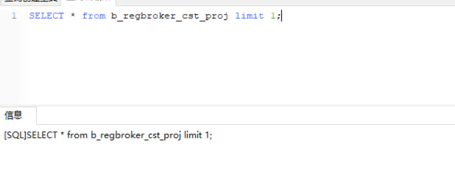

# 加索引如何避免锁表？

[](https://www.jianshu.com/u/4ff189e8d8ac)

[10xjzheng](https://www.jianshu.com/u/4ff189e8d8ac)关注

0.1152019.06.01 14:55:17字数 1,170阅读 11,164

2019-06-03 补充
此等锁表必须有两个条件：

1. 未提交事务；
   2.有需要表锁的操作，比如所有alter table操作。如果是update，insert这种行锁的操作，不会有问题
   ====================================================================================
   鉴于有经常有同事在生产环境添加索引导致死锁的情况，我们先来了解一下原因，然后再看看有没有解决方案。

首先历史原因，线上加索引是用了一个存储过程：


```ruby
CREATE DEFINER=`myscrm_cn`@`%` PROCEDURE `CreateIndexIfNotExistsWithColumns`(IN tableName varchar(200), IN columnName VARCHAR(200))
BEGIN
      DECLARE _tableCount   INT;
      DECLARE _indexCount   INT;
      SET _tableCount =
             (SELECT COUNT(1)
                FROM INFORMATION_SCHEMA.TABLES
               WHERE TABLE_SCHEMA = (SELECT schema()) AND TABLE_NAME = tableName);
      SET _indexCount =
             (SELECT count(1)
                FROM information_schema.statistics
                WHERE     TABLE_SCHEMA = (SELECT schema())
                     AND TABLE_NAME = tableName
                     AND INDEX_NAME = concat('IX_', columnName));
      IF _tableCount = 1 AND _indexCount = 0
      THEN
         SET @_sqlText =
                CONCAT(' CREATE INDEX `IX_',columnName,'` ON `',tableName,'`(',columnName,');');
          PREPARE stmt1 FROM @_sqlText;
          EXECUTE stmt1;
          DEALLOCATE PREPARE stmt1;
      END IF;
end
```

摒弃一切无关要素，我们只看核心语句：


```bash
CONCAT(' CREATE INDEX `IX_',columnName,'` ON `',tableName,'`(',columnName,');');
```

线上用的就是这么一个语句添加索引的。

首先，添加索引为什么会锁表呢？查阅一些资料说，如果当前表正在执行一个慢查询，此时添加索引，就可能会锁表。

我尝试在测试环境重现了一下。

首先，我在b_regbroker_cst_proj这个表执行了一个慢查询事务。


```ruby
BEGIN;
SELECT
    *
FROM
    `b_regbroker_cst_proj` a
INNER JOIN b_regbroker_brokerage b ON a.b_regbroker_cst_projId = b.cst_proj_id
LIMIT 5000;
# COMMIT;
```

这个查询正常完成要9s左右，够慢了，满足要求。

然后我要做的事情，就是在查询未完成的时间，给b_regbroker_cst_proj这个表添加索引。


```go
CREATE INDEX `IX_test` ON `b_regbroker_cst_proj` (`protect_node`);
```

好了，来试试，我先开启事务，先不提交。


image.png


然后创建索引：


image.png


好了，果然卡了：


image.png


哦耶，so funny。
此时无论这个表执行什么查询，都会卡住了：




image.png


image.png


此时我把事务提交，有没有用呢？


image.png


有用的：


image.png

查了一下下面这个lock的原因：


```csharp
Waiting for table metadata lock
```

- 1. 长事物运行，阻塞DDL，继而阻塞所有同表的后续操作
     通过show processlist可以看到TableA上有正在进行的操作（包括读），此时alter table语句无法获取到metadata 独占锁，会进行等待。
- 1. 未提交事物，阻塞DDL，继而阻塞所有同表的后续操作
     通过show processlist看不到TableA上有任何操作，但实际上存在有未提交的事务，可以在 information_schema.innodb_trx中查看到。在事务没有完成之前，TableA上的锁不会释放，alter table同样获取不到metadata的独占锁。
- 1. 通过show processlist看不到TableA上有任何操作，在information_schema.innodb_trx中也没有任何进行中的事务。这很可能是因为在一个显式的事务中，对TableA进行了一个失败的操作（比如查询了一个不存在的字段），这时事务没有开始，但是失败语句获取到的锁依然有效，没有释放。从performance_schema.events_statements_current表中可以查到失败的语句。

有没有更好的加索引解决方式呢？查文档
[文档](https://links.jianshu.com/go?to=https%3A%2F%2Fdev.mysql.com%2Fdoc%2Frefman%2F5.6%2Fen%2Finnodb-online-ddl.html)

mysql自5.6之后变提供了解决方式，运行线上无锁添加索引。


```csharp
ALTER TABLE tbl_name ADD PRIMARY KEY (column), ALGORITHM=INPLACE, LOCK=NONE;
```

重点说两个参数：

- ALGORITHM


```undefined
ALGORITHM=INPLACE
更优秀的解决方案，在当前表加索引，步骤：
1.创建索引(二级索引)数据字典
2.加共享表锁，禁止DML，允许查询
3.读取聚簇索引，构造新的索引项，排序并插
入新索引
4.等待打开当前表的所有只读事务提交
5.创建索引结束

ALGORITHM=COPY
通过临时表创建索引，需要多一倍存储，还有更多的IO，步骤：
1.新建带索引（主键索引）的临时表
2.锁原表，禁止DML，允许查询
3.将原表数据拷贝到临时表
4.禁止读写,进行rename，升级字典锁
5.完成创建索引操作
```

- LOCK


```php
LOCK=DEFAULT：默认方式，MySQL自行判断使用哪种LOCK模式，尽量不锁表
LOCK=NONE：无锁：允许Online DDL期间进行并发读写操作。如果Online DDL操作不支持对表的继续写入，则DDL操作失败，对表修改无效
LOCK=SHARED：共享锁：Online DDL操作期间堵塞写入，不影响读取
LOCK=EXCLUSIVE：排它锁：Online DDL操作期间不允许对锁表进行任何操作
```

好了，试下有没有用。


image.png


哈哈哈，卵用都没有。

我觉得我是理解错了，人家的无锁加索引，只是说加索引的语句不加锁，避免此时有update、insert、delete语句也持锁从而相互形成死锁。但是目前的问题是，有事务持了表锁，创建索引需要等待。等该事务提交，索引就能创建成功。但是在这个等待时间，其它sql都执行不了，这个很坑啊~~

结论：
总之，alter table的语句是很危险的(其实他的危险其实是未提交事物或者长事务导致的)，在操作之前最好确认对要操作的表没有任何进行中的操作、没有未提交事务、也没有显式事务中的报错语句。如果有alter table的维护任务，在无人监管的时候运行，最好通过lock_wait_timeout设置好超时时间，避免长时间的metedata锁等待。

加索引要避免锁表，需要先确定此时没有慢查询事务未提交，如果这个查询卡了30分钟，那么整个表的所有业务都会卡30分钟，这是很变态的。

所以大表加索引还是在没人用的时间加比较安全，要不就是先创建副本，再将表名改掉。