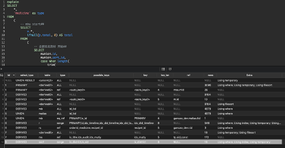
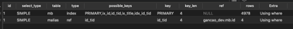
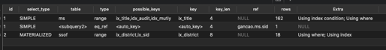
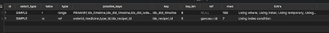
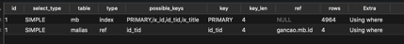
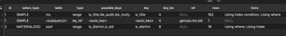

# 慢SQL优化实战笔记

[2](javascript:;)[2](javascript:;)[0](https://learnku.com/articles/47715#replies)

[ MySQL ](https://learnku.com/mysql)/ 62 / 0 / 发布于 4个月前 / 更新于 4个月前

# 一、存在问题

经过 sql 慢查询的优化，我们系统中发现了以下几种类型的问题:

```php
1.未建索引：整张表没有建索引；

2.索引未命中：有索引,但是部分查询条件下索引未命中；

3.搜索了额外的非必要字段，导致回表；

4.排序，聚合导致慢查询；

5.相同内容多次查询数据库；

6.未消限制搜索范围或者限制的搜索范围在预期之外，导致全部扫描；
```

# 二、解决方案

```php
1.优化索引，增加或者修改当前的索引；         

2.重写sql；

3.利用redis缓存，减少查询次数；

4.增加条件，避免非必要查询；

5.增加条件，减少查询范围；                          
```

# 三、案例分析

## **（一）药材搜索接口**

完整 sql 语句在附录，为方便阅读和脱敏，部分常用字段采用中文。

这儿主要讲一下我们拿到 Sql 语句后的整个分析过程，思考逻辑，然后进行调整的过程和最后解决的办法。

给大家提供一些借鉴，也希望大家能够提出更好的建议。


[](https://cdn.learnku.com/uploads/images/202007/26/32495/NVJW4Y8wxW.png!large)


这个 sql 语句要求是根据医生搜索的拼音或者中文，进行模糊查询，找到药材，然后根据医生选择的药库，查找下面的供应商，然后根据供应商，进行药材匹配，排除掉供应商没有的药材，然后根据真名在前，别名在后，完全匹配在前，部分匹配在后，附加医生最近半年的使用习惯，把药材排序出来。最后把不同名称的同一味药聚合起来，以真名 (另名) 的形式展现。

### **1．分析 sql**

- （1）14-8

第 14 排，id 为 8 的 explain 结果分析:

##### ①Explain

```php
8,DERIVED,ssof,range,"ix_district,ix_供应商id",ix_district,8,NULL,18,Using where; Using index; Using temporary
```

##### ②Sql

```php
SELECT DISTINCT (ssof.供应商id) AS 供应商id FROM  药库供应商关系表 AS ssof  WHERE ssof.药库id IN (  1, 2, 8, 9, 10, 11, 12, 13, 14, 15, 17, 22, 24, 25, 26, 27, 31, 33)  AND ssof.药方剂型id IN (1)
```

##### ③索引

```php
PRIMARY KEY (`id`),    UNIQUE KEY `ix_district` (        `药库id`, `药方剂型id`, `供应商id`    ) USING BTREE,KEY `ix_供应商id` (`供应商id`) USING BTREE
```

##### ④分析

使用了索引，建立了临时表，这个地方索引已经完全覆盖了，但是还有回表操作。

原因是用 in，这个导致了回表。如果 in 可以被 mysql 自动优化为等于，就不会回表。如果无法优化，就回表。

临时表是因为有 distinct，所以无法避免。

同时使用 in 需要注意，如果里面的值数量比较多，有几万个。即使区分度高，就会导致索引失效，这种情况需要多次分批查询。

**2． 12-7**

- （1）Explain

```php
7,DERIVED,<derived8>,ALL,NULL,NULL,NULL,NULL,18,Using temporary; Using filesort
```

- （2）Sql

```php
INNER JOIN (上面14-8临时表) tp ON tp.供应商id= ms.供应商id
```

- （3）索引

无

- （4）分析

对临时表操作，无索引，用了文件排序。

这一部分是对临时表和药材表进行关联操作的一部分，有文件排序是因为需要对药材表 id 进行 group by 导致的。

1、默认情况下，mysql 在使用 group by 之后，会产生临时表，而后进行排序（此处排序默认是快排），这会消耗的性能。

2、group by 本质是先分组后排序【而不是先排序后分组】。

3、group by column 默认会按照 column 分组，然后根据 column 升序排列；group by column order by null 则默认按照 column 分组，然后根据标的主键 ID 升序排列。

**3． 13-7**

- （1）Explain

```php
7,DERIVED,ms,ref,"ix_title,idx_audit,idx_mutiy",idx_mutiy,5,"tp.供应商id,const",172,NULL
```

- （2）Sql

```php
SELECT ms.药材表id, max(ms.audit) AS audit, max(ms.price) AS price, max(ms.market_price) AS market_price,max(ms.is_granule) AS is_granule,max(ms.is_decoct) AS is_decoct, max(ms.is_slice) AS is_slice,max(ms.is_cream) AS is_cream, max(ms.is_extract) AS is_extract,max(ms.is_cream_granule) AS is_cream_granule, max(ms.is_extract_granule) AS is_extract_granule,max(ms.is_drychip) AS is_drychip,            max(ms.is_pill) AS is_pill,max(ms.is_powder) AS is_powder, max(ms.is_bolus) AS is_bolus FROM 供应商药材表 AS ms INNER JOIN (                SELECT                    DISTINCT (ssof.供应商id) AS 供应商id                FROM                    药库供应商关系表 AS ssof WHERE  ssof.药库id IN (  1, 2, 8, 9, 10, 11, 12, 13, 14, 15, 17, 22, 24, 25, 26, 27, 31, 33 ) AND ssof.药方剂型id IN (1) ) tp ON tp.供应商id= ms.供应商id WHERE  ms.audit = 1  GROUP BY  ms.药材表id
```

- （3）索引

```php
   KEY `idx_mutiy` (`供应商id`, `audit`, `药材表id`)
```

- （4）分析

命中了索引，表间连接使用了供应商 id，建立索引的顺序是供应商 id，where 条件中 audit，Group by 条件药材表 id。

这部分暂时不需要更改。

**4．10-6**

- （1）Explain

```php
6,DERIVED,r,range,"PRIMARY,id,idx_timeline,idx_did_timeline,idx_did_isdel_statuspay_timecreate_payorderid,idx_did_statuspay_ischecked_isdel",idx_did_timeline,8,NULL,546,Using where; Using index; Using temporary; Using filesort
```

- （2）Sql

```php
SELECT 
       count(*) AS total, 
       rc.i AS m药材表id 
     FROM 
        处方药材表 AS rc 
        INNER JOIN 药方表AS r ON r.id = rc.药方表_id 
     WHERE 
         r.did = 40 
         AND r.timeline > 1576115196 
         AND rc.type_id in (1, 3) 
         GROUP BY 
    rc.i 
```

- （3）索引

```php
KEY `idx_did_timeline` (`did`, `timeline`),
```

- （4）分析

驱动表与被驱动表，小表驱动大表。

先了解在 join 连接时哪个表是驱动表，哪个表是被驱动表：

\1. 当使用 left join 时，左表是驱动表，右表是被驱动表；

\2. 当使用 right join 时，右表时驱动表，左表是驱动表；

\3. 当使用 join 时，mysql 会选择数据量比较小的表作为驱动表，大表作为被驱动表；

\4. in 后面跟的是驱动表，exists 前面的是驱动表；

**5． 11-6**

- （1）Explain

```php
6,DERIVED,rc,ref,"orderid_药材表,药方表_id",药方表_id,5,r.id,3,Using where
```

- （2）Sql

同上

- （3）索引

```php
  KEY `idx_药方表_id` (`药方表_id`, `type_id`) USING BTREE,
```

- （4）分析

索引的顺序没有问题，仍旧是 in 导致了回表。

**6．8-5**

- （1）Explain

```php
5,UNION,malias,ALL,id_tid,NULL,NULL,NULL,4978,Using where
```

- （2）Sql

```php
 SELECT 
      mb.id, 
      mb.sort_id, 
      mb.title, 
      mb.py, 
      mb.unit, 
      mb.weight, 
      mb.tid, 
      mb.amount_max, 
      mb.poisonous, 
      mb.is_auxiliary, 
      mb.is_auxiliary_free, 
      mb.is_difficult_powder, 
      mb.brief, 
      mb.is_fixed_recipe, 
      ASE WHEN malias.py = 'GC' THEN malias.title ELSE CASE WHEN malias.title = 'GC' THEN malias.title ELSE '' END END AS atitle, 
      alias.py AS apy, 
      CASE WHEN malias.py = 'GC' THEN 2 ELSE CASE WHEN malias.title = 'GC' THEN 2 ELSE 1 END END AS ttid 
 FROM 
      药材表 AS mb 
      LEFT JOIN 药材表 AS malias ON malias.tid = mb.id 
WHERE 
      alias.title LIKE '%GC%' 
      OR malias.py LIKE '%GC%'
```

- （3）索引

```php
KEY `id_tid` (`tid`) USING BTREE,
```

- （4）分析

因为 like 是左右 like，无法建立索引，所以只能建 tid。Type 是 all，遍历全表以找到匹配的行，左右表大小一样，估算的找到所需的记录所需要读取的行数有 4978。这个因为是 like 的缘故，无法优化，这个语句并没有走索引，药材表 AS mb FORCE INDEX (id_tid) 改为强制索引，读取的行数减少了 700 行。

**7．9-5**

- （1）Explain

```php
5,UNION,mb,eq_ref,"PRIMARY,ix_id",PRIMARY,4,malias.tid,1,NULL
```

- （2）Sql

同上

- （3）索引

```php
PRIMARY KEY (`id`) USING BTREE,
```

- （4）分析

走了主键索引，行数也少，通过。

**8．7-4**

- （1）Explain

```php
4,DERIVED,mb,ALL,id_tid,NULL,NULL,NULL,4978,Using where
```

- （2）Sql

  ```php
  SELECT 
     mb.id, 
     mb.sort_id, 
     mb.title, 
     mb.py, 
     mb.unit, 
     mb.weight, 
     mb.tid, 
     mb.amount_max, 
     mb.poisonous, 
     mb.is_auxiliary, 
     mb.is_auxiliary_free, 
     mb.is_difficult_powder, 
     mb.brief, 
     mb.is_fixed_recipe, 
     '' AS atitle, 
     '' AS apy, 
     CASE WHEN mb.py = 'GC' THEN 3 ELSE CASE WHEN mb.title = 'GC' THEN 3 ELSE 1 END END AS ttid 
  FROM 
     药材表 AS mb 
    WHERE 
     mb.tid = 0 
     AND (
         mb.title LIKE '%GC%' 
         OR mb.py LIKE '%GC%'
                              )
  ```

- （3）索引

```php
KEY `id_tid` (`tid`) USING BTREE,
```

- （4）分析

  `tid` int (11) NOT NULL DEFAULT ‘0’ COMMENT ‘真名药品的 id’,

他也是 like, 这个没法优化。

**9．6-3**

- （1）Explain

```php
3,DERIVED,<derived4>,ALL,NULL,NULL,NULL,NULL,9154,Using filesort
```

- （2）Sql

  UNION ALL

- （3）索引

无

- （4）分析

就是把真名搜索结果和别人搜索结果合并。避免用 or 连接，加快速度 形成一个 munion 的表，初步完成药材搜索，接下去就是排序。

这一个进行了 2 次查询，然后用 union 连接，可以考虑合并为一次查询。用 case when 进行区分，计算出权重。

这边是一个优化点。

**10．4-2**

- （1）Explain

```php
2,DERIVED,<derived3>,ALL,NULL,NULL,NULL,NULL,9154,NULL
```

- （2）Sql

  ```php
  SELECT 
     munion.id, 
     munion.sort_id, 
     case when length(
       trim(
            group_concat(munion.atitle SEPARATOR ' ')
                      )
                  )> 0 then concat(
                      munion.title, 
                      '(', 
                      trim(
                          group_concat(munion.atitle SEPARATOR ' ')
                      ), 
                      ')'
                  ) else munion.title end as title, 
        munion.py, 
        munion.unit, 
        munion.weight, 
        munion.tid, 
        munion.amount_max, 
        munion.poisonous, 
        munion.is_auxiliary, 
        munion.is_auxiliary_free, 
        munion.is_difficult_powder, 
        munion.brief, 
        munion.is_fixed_recipe, 
        --  trim( group_concat( munion.atitle SEPARATOR ' ' ) ) AS atitle,
                  ##  --  
         trim(
               group_concat(munion.apy SEPARATOR ' ')
               ) AS apy, 
           ##   
             max(ttid) * 100000 + id AS ttid 
       FROM 
              munion <derived4>
           GROUP BY 
              id -- 全部实名药材 结束##
  ```

- （3）索引

无

- （4）分析

这里全部在临时表中搜索了。

**11．5-2**

- （1）Explain

```php
2,DERIVED,<derived6>,ref,<auto_key0>,<auto_key0>,5,m.id,10,NULL
```

- （2）Sql

```php
Select fields from 全部实名药材表 as m  LEFT JOIN ( 个人使用药材统计表 ) p ON m.id = p.m药材表id
```

- （3）索引

无

- （4）分析

2 张虚拟表 left join

使用了优化器为派生表生成的索引

这边比较浪费性能，每次查询，都要对医生历史开方记录进行统计，并且统计还是几张大表计算后的结果。但是如果只是 sql 优化，这边暂时无法优化。

**12．2-1**

- （1）Explain

```php
1,PRIMARY,<derived7>,ALL,NULL,NULL,NULL,NULL,3096,Using where; Using temporary; Using filesort
```

- （2）Sql
- （3）索引
- （4）分析

临时表操作

**13．3-1**

- （1）Explain

```php
1,PRIMARY,<derived2>,ref,<auto_key0>,<auto_key0>,4,msu.药材表id,29,NULL
```

- （2）Sql
- （3）索引
- （4）分析

临时表操作

**14．null**

- （1）Explain

```php
NULL,UNION RESULT,"<union4,5>",ALL,NULL,NULL,NULL,NULL,NULL,Using temporary
```

- （2）Sql
- （3）索引
- （4）分析

临时表

**（二）优化 sql**

上面我们只做索引的优化，遵循的原则是:

```php
1.最左前缀匹配原则，非常重要的原则，mysql会一直向右匹配直到遇到范围查询(>、<、between、like)就停止匹配，比如a = 1 and b = 2 and c > 3 and d = 4 如果建立(a,b,c,d)顺序的索引，d是用不到索引的，如果建立(a,b,d,c)的索引则都可以用到，a,b,d的顺序可以任意调整。

2.=和in可以乱序，比如a = 1 and b = 2 and c = 3 建立(a,b,c)索引可以任意顺序，mysql的查询优化器会帮你优化成索引可以识别的形式。

3.尽量选择区分度高的列作为索引，区分度的公式是count(distinct col)/count(*)，表示字段不重复的比例，比例越大我们扫描的记录数越少，唯一键的区分度是1，而一些状态、性别字段可能在大数据面前区分度就是0，那可能有人会问，这个比例有什么经验值吗？使用场景不同，这个值也很难确定，一般需要join的字段我们都要求是0.1以上，即平均1条扫描10条记录。

4.索引列不能参与计算，保持列“干净”，比如from_unixtime(create_time) = ’2014-05-29’就不能使用到索引，原因很简单，b+树中存的都是数据表中的字段值，但进行检索时，需要把所有元素都应用函数才能比较，显然成本太大。所以语句应该写成create_time = unix_timestamp(’2014-05-29’)。

5.尽量的扩展索引，不要新建索引。比如表中已经有a的索引，现在要加(a,b)的索引，那么只需要修改原来的索引即可。
```

查询优化神器 - explain 命令

关于 explain 命令相信大家并不陌生，具体用法和字段含义可以参考官网 explain-output，这里需要强调 rows 是核心指标，绝大部分 rows 小的语句执行一定很快（有例外，下面会讲到）。所以优化语句基本上都是在优化 rows。

化基本步骤：

```php
0.先运行看看是否真的很慢，注意设置SQL_NO_CACHE

1.where条件单表查，锁定最小返回记录表。这句话的意思是把查询语句的where都应用到表中返回的记录数最小的表开始查起，单表每个字段分别查询，看哪个字段的区分度最高；

2.explain查看执行计划，是否与1预期一致（从锁定记录较少的表开始查询）；

3.order by limit 形式的sql语句让排序的表优先查；

4.了解业务方使用场景；

5.加索引时参照建索引的几大原则；

6.观察结果，不符合预期继续从0分析；
```

上面已经详细的分析了每一个步骤，根据上面的 sql，去除 union 操作， 增加索引。可以看出，优化后虽然有所改善。但是距离我们的希望还有很大距离，但是光做 sql 优化，感觉也没有多少改进空间，所以决定从其他方面解决。

**（三）拆分 sql**

由于速度还是不领人满意，尤其是个人用药情况统计，其实没必要每次都全部统计一次，再要优化，只靠修改索引应该是不行的了，所以考虑使用缓存。

接下来是修改 php 代码，把全部 sql 语句拆分，然后再组装。

- （1）搜索真名，别名 (缓存)

```php
SELECT  mb.id,  mb.sort_id,  mb.title,  mb.py,  mb.unit,  mb.weight,  mb.tid,  mb.amount_max,  mb.poisonous,  mb.is_auxiliary,  mb.is_auxiliary_free,  mb.is_difficult_powder,  mb.brief,  mb.is_fixed_recipe,  IFNULL(group_concat(malias.title),'') atitle,  IFNULL(group_concat(malias.py),'') apy  FROM  药材表 AS mb  LEFT JOIN 药材表 AS malias ON malias.tid = mb.id  WHERE  mb.tid = 0  AND (  malias.title LIKE '%GC%'  OR malias.py LIKE '%GC%'  or mb.title LIKE '%GC%'  OR mb.py LIKE '%GC%'  )  group by  mb.id
```


[](https://cdn.learnku.com/uploads/images/202007/26/32495/U2rawqzc2h.png!large)


- （2）如果命中有药材

##### ①排序

真名在前，别名在后，完全匹配在前，部分匹配在后

```php
//对搜索结果进行处理,增加权重
```

##### ②对供应商药材搜索

```php
SELECT ms.药材表id, max( ms.audit ) AS audit, max( ms.price ) AS price, max( ms.market_price ) AS market_price, max( ms.is_granule ) AS is_granule, max( ms.is_decoct ) AS is_decoct, max( ms.is_slice ) AS is_slice, max( ms.is_cream ) AS is_cream, max( ms.is_extract ) AS is_extract, max( ms.is_cream_granule) AS is_cream_granule, max( ms.is_extract_granule) AS is_extract_granule, max( ms.is_drychip ) AS is_drychip, max( ms.is_pill ) AS is_pill, max( ms.is_powder ) AS is_powder, max( ms.is_bolus ) AS is_bolus  FROM 供应商药材表 AS ms WHERE ms.audit = 1 AND ms.供应商idin (  SELECT DISTINCT  ( ssof.供应商id) AS 供应商id FROM  药库供应商关系表 AS ssof  WHERE  ssof.药库id IN ( 1,2,8,9,10,11,12,13,14,15,17,22,24,25,26,27,31,33 )  AND ssof.药方剂型id IN (1) ) AND ms.药材表id IN ( 78,205,206,207,208,209,334,356,397,416,584,652,988,3001,3200,3248,3521,3522,3599,3610,3624,4395,4396,4397,4398,4399,4400,4401,4402,4403,4404,4405,4406,4407,4408,5704,5705,5706,5739,5740,5741,5742,5743,6265,6266,6267,6268,6514,6515,6516,6517,6518,6742,6743 ) AND ms.is_slice = 1  GROUP BY ms.药材表id  
```


[](https://cdn.learnku.com/uploads/images/202007/26/32495/zxZ7T3ydXo.png!large)


##### ③拿医生历史开方药材用量数据 (缓存)

```php
SELECT  count( * ) AS total,  rc.i AS 药材表id FROM  处方药材表 AS rc  INNER JOIN 药方表AS r ON r.id = rc.药方表_id WHERE  r.did = 40  AND r.timeline > 1576116927  AND rc.type_id in (1,3) GROUP BY  rc.i
```


[](https://cdn.learnku.com/uploads/images/202007/26/32495/rG8XvAWqjC.png!large)


##### ④ 装配及排序微调


[](https://cdn.learnku.com/uploads/images/202007/26/32495/O3npKITs5x.png!large)


[](https://cdn.learnku.com/uploads/images/202007/26/32495/BgRyi4E20P.png!large)


[](https://cdn.learnku.com/uploads/images/202007/26/32495/xna7y7ZMYs.png!large)


- （3）小结

运行速度，对于开方量不是特别多的医生来说，两者速度都是 0.1 秒左右。但是如果碰到开方量大的医生，优化后的 sql 速度比较稳定，能始终维持在 0.1 秒左右，优化前的 sql 速度会超过 0.2 秒。速度提升约一倍以上。

最后对搜索结果和未优化前的搜索结果进行比对，结果数量和顺序完全一致。本次优化结束。

**四、附录：**

```php
SELECT sql_no_cache 
    *
FROM
    (
        -- mbu start##
        SELECT
            m.*,
            ifnull(p.total, 0) AS total
        FROM
            (
                --
全部实名药材
开始
##
SELECT
       munion.id,
       munion.sort_id,
       case when length(
        trim(
              group_concat(munion.atitle SEPARATOR ' ')
                 )
             )> 0 then concat(
           munion.title,
          '(',
      trim(
             group_concat(munion.atitle SEPARATOR ' ')
              ),
                ')'
             ) else munion.title end as title,
        munion.py,
        munion.unit,
        munion.weight,
        munion.tid,
        munion.amount_max,
        munion.poisonous,
        munion.is_auxiliary,
        munion.is_auxiliary_free,
        munion.is_difficult_powder,
        munion.brief,
        munion.is_fixed_recipe,
        --  trim( group_concat( munion.atitle SEPARATOR ' ' ) ) AS atitle,##
        --  trim( group_concat( munion.apy SEPARATOR  ' ' ) ) AS apy,##
              max(ttid) * 100000 + id AS ttid
           FROM
              (
                -- #union start
联合查找
,
得到全部药材
##
  (
       SELECT
              mb.id,
              mb.sort_id,
              mb.title,
              mb.py,
              mb.unit,
              mb.weight,
              mb.tid,
              mb.amount_max,
              mb.poisonous,
              mb.is_auxiliary,
              mb.is_auxiliary_free,
              mb.is_difficult_powder,
              mb.brief,
              mb.is_fixed_recipe,
              '' AS atitle,
              '' AS apy,
              CASE WHEN mb.py = 'GC' THEN 3 ELSE CASE WHEN mb.title = 'GC' THEN 3 ELSE 1 END END AS ttid
               FROM
                 药材表 AS mb
                     WHERE
                         mb.tid = 0
                       AND (
                              mb.title LIKE '%GC%'
                              OR mb.py LIKE '%GC%'
                                )
                        ) --
真名药材

结束
##
 UNION ALL
    (
      SELECT
            mb.id,
            mb.sort_id,
            mb.title,
            mb.py,
            mb.unit,
            mb.weight,
            mb.tid,
            mb.amount_max,
            mb.poisonous,
            mb.is_auxiliary,
            mb.is_auxiliary_free,
            mb.is_difficult_powder,
            mb.brief,
            mb.is_fixed_recipe,
            CASE WHEN malias.py = 'GC' THEN malias.title ELSE CASE WHEN malias.title = 'GC' THEN malias.title ELSE '' END END AS atitle,
            malias.py AS apy,
            CASE WHEN malias.py = 'GC' THEN 2 ELSE CASE WHEN malias.title = 'GC' THEN 2 ELSE 1 END END AS ttid
          FROM
                药材表 AS mb
                LEFT JOIN 药材表 AS malias ON malias.tid = mb.id
          WHERE
                malias.title LIKE '%GC%'
                OR malias.py LIKE '%GC%'
                      ) --
其他药材结束
##
                 -- #union end##
                ) munion
                GROUP BY
                    id --
全部实名药材

结束
##
                    ) m
            LEFT JOIN (
                --
个人使用药材统计

开始
##
    SELECT
          count(*) AS total,
          rc.i AS m药材表id
     FROM
           处方药材表 AS rc
           INNER JOIN 药方表AS r ON r.id = rc.药方表_id
      WHERE
           r.did = 40
            AND r.timeline > 1576115196
            AND rc.type_id in (1, 3)
       GROUP BY
              rc.i --
个人使用药材统计

结束
##
           ) p ON m.id = p.m药材表id -- mbu end ##
            ) mbu
    INNER JOIN (
        -- msu start
供应商药材筛选
##
        SELECT
            ms.药材表id,
            max(ms.audit) AS audit,
            max(ms.price) AS price,
            max(ms.market_price) AS market_price,
            max(ms.is_granule) AS is_granule,
            max(ms.is_decoct) AS is_decoct,
            max(ms.is_slice) AS is_slice,
            max(ms.is_cream) AS is_cream,
            max(ms.is_extract) AS is_extract,
            max(ms.is_cream_granule) AS is_cream_granule,
            max(ms.is_extract_granule) AS is_extract_granule,
            max(ms.is_drychip) AS is_drychip,
            max(ms.is_pill) AS is_pill,
            max(ms.is_powder) AS is_powder,
            max(ms.is_bolus) AS is_bolus
        FROM
            供应商药材表 AS ms
            INNER JOIN (
                SELECT
                    DISTINCT (ssof.供应商id) AS 供应商id
                FROM
                    药库供应商关系表 AS ssof
                WHERE
                    ssof.药库id IN (
                        1, 2, 8, 9, 10, 11, 12, 13, 14, 15, 17, 22,
                        24, 25, 26, 27, 31, 33
                    )
                    AND ssof.药方剂型id IN (1)
            ) tp ON tp.供应商id= ms.供应商id
        WHERE
            ms.audit = 1
        GROUP BY
            ms.药材表id -- msu end ##
            ) msu ON mbu.id = msu.药材表id
WHERE
    msu.药材表id > 0
    AND msu.is_slice = 1
order by
    total desc,
    ttid desc
```