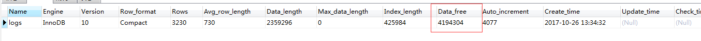
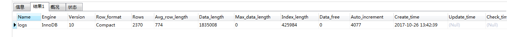

# mysql 查询慢，索引碎片

[datong3354](https://blog.csdn.net/datong3354) 2017-10-26 13:46:00  126  收藏

文章标签： [数据库](https://www.csdn.net/tags/NtzaUgysMTg1NC1ibG9n.html)

版权

mysql 查询所有碎片语句

SHOW TABLE STATUS LIKE 'logs'  ---------logs是带有索引的表名称

如果Data_free大于0 表示有索引碎片产生

 

可以使用如下语句清理碎片

OPTIMIZE TABLE `logs` -------logs表名称

 

再去查索引碎片

Data_free变成0，

 

大家可参考：http://www.cnblogs.com/woodytu/p/4513562.html