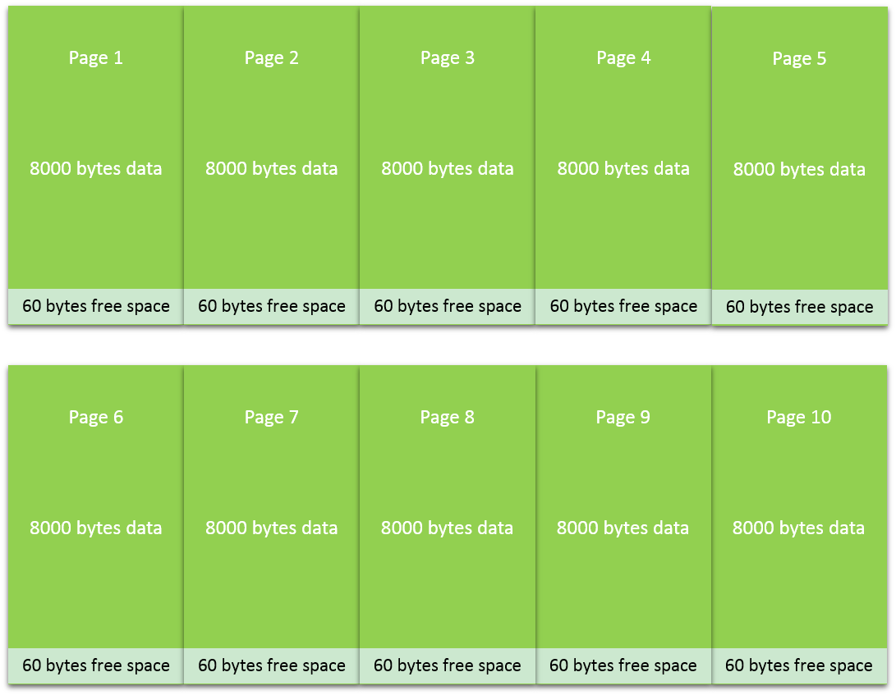
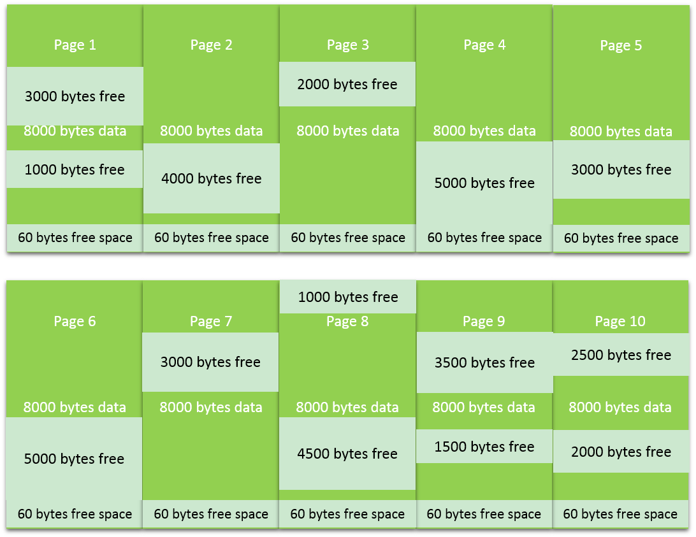
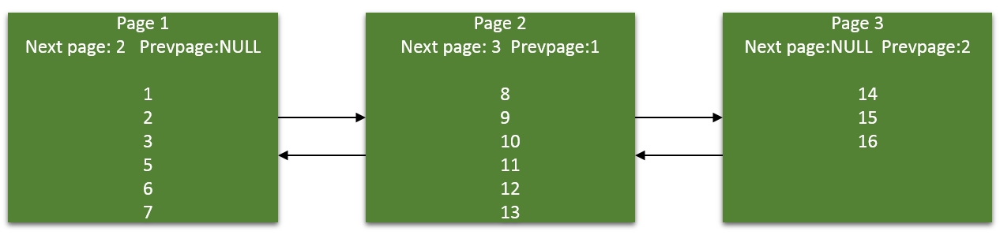

这篇文章会解释下不同类型的碎片。理解索引碎片的概念对有效检测和移除碎片非常重要。

# 什么是碎片

碎片可以定义为：任何情况下，在访问一个表时，造成比适量更多的磁盘IO操作或更长的磁盘IO操作。SELECT查询的最佳操作发生在，表的数据页是尽可能连续的，而且页是尽可能完整打包（fully packed）的。碎片会破坏这个规则，降低查询的性能。碎片可以发生在2个级别。一个是文件系统级，称为逻辑/物理磁盘碎片，还有一个是索引级碎片。在下面会分别介绍。

# 逻辑/物理磁盘碎片

逻辑碎片是在文件系统里，数据库文件的碎片，这和其他任何文件一样。这在文件系统不能分配给数据库文件连续空间时产生。这会造成磁头从数据库文件读时需要来回移动。SQL Server对此毫不知情，也不能用任何脚本去检查逻辑磁盘碎片。逻辑磁盘碎片可以因下列原因产生：

- 数据库文件与其它文件（系统文件和其他应用程序文件）放在同个磁盘；
- 数据库文件以小块大小频繁增长

移除逻辑碎片我们可以使用系统碎片整理工具，但是注意，在进行碎片整理时，我们需要停止SQL Server，不然的话碎片整理工具会跳过数据库文件，因为它正被SQL Server使用。

避免逻辑碎片的最佳方式是:

- 将数据库文件放在独立的硬盘，与其他应用程序和日志文件分开。
- 创建新数据库的时候，估计下数据库文件的大小并分配足够的空间避免数据库文件的频繁增长。
- 指定数据库文件增长选项为大块而不是频繁的小块增长。

# 索引层碎片

索引层碎片有2类：内部碎片和外部碎片。如果索引层碎片高的话，优化器将不能最优的使用索引。

# 内部碎片

内部碎片用索引的平均页饱和度（average page fullness of the index）来衡量（页密度）。一个100%满的页没有内部碎片。换句话说，内部碎片在索引页里有可用空间时发生，这个可以由insert/update/delete等DML语句操作造成。每一页基于索引的大小可以保存一定数量的记录，但这并不保证这个页总是保存最大数量的记录。内部碎片通常以字节的饱和度来统计，不是记录。一个索引页有90%的内部碎片可能已经插满记录了。剩下的10% bytes可能没有足够空间保存1条记录。在8K的页里，最大有8060bytes用来保存数据。剩下的空间被页头和行偏移数组使用。假设我们有100bytes定长的索引，共有800个索引条目。因此我们每页可以保存 8060/100=80条索引，剩下的60 bytes没有足够的空间保存更多的索引，这就需要10页来保存全部的索引结构。如果你要计算这个索引的平均饱和度，这个情况下是992.26%（8000/8060）。下图是对其的展示。

假设我们随机删除表里一半的索引，即将索引条目减小为400。那页的分布情况会如下图所示。这里有40600 bytes空余可用。这时候我们计算下平均饱和度 4000 * 10 /80600=49.62%。可以看到近一半的页面是空的，且索引有了内部碎片。

# 内部碎片如何影响SQL Server的性能？

1. 内部碎片会增加IO操作。当执行的查询扫描部分或全部的表/索引时，如果那个表/索引上面有内部碎片，它会增加额外的页读取。在我们的例子里，全部数据可以在5个页面里保存。当查询扫描索引时，需要读取10个页面，而不是5个页面，增加了近50%的IO。
2. 内部碎片降低缓存效率。当索引有碎片时，在缓存里就会占用更多的空间。在我们的例子里，这个索引会使用5个额外页来占用缓存，这个是可以用来缓存其他索引页的。这会降低缓冲命中率。依次增加物理IO，同样增加逻辑读。
3. 增加数据库文件。需要更多的空间来存储额外页，并降低备份和还原性能。

# 外部碎片

外部碎片发生在页的逻辑顺序和页的物理顺序不一致。外部碎片指的是索引的逻辑顺序和物理顺序缺少修正。它以索引叶子层页的无序占比来衡量。无序页就是分配给索引的下一个物理页和当前叶子页里里下一页指针指向的页不一致。

可以看到，这3页数据是按顺序存储的。换句话说，逻辑顺序和物理顺序是一样的，它保存了索引键从1到16。除了第3页，所有页都已经满了。

我们来看看插入4后，页面发生的变化。

 

在插入的4的时候，默认情况下应该在3和5之间插入，可惜页面1已经没有空间再插入一条记录了。唯一的选择只能把页面1分开，一半数据在页面1，另一半数据在新页（页面4）。从图中我们看出页面4的逻辑顺序和物理顺序已经不一致了。造成外部碎片有下列原因：

1. 当给新新表分配页的时候，SQL Server是从混合区开始分配页面的，直到满8个页。因此很有可能第一个8页是来自不同的8个区。
2. 当从表里删除一条记录时，这个页会从索引页里取消分配（页面取消分配不会立即发生），这会产生缺口，并增加碎片。　　
3. 一旦对象达到8页。SQL Server会从统一区开始分配新页。当把统一区分配给索引时，下一个区很可能已经分配给了其他的对象/索引。

# 外部碎片如何影响SQL Server的性能？

当读取单条记录时，外部碎片不会影响性能，因为是直接到页里拿记录。无序扫描也不会受外部碎片影响，因为使用IAM页就可以找到需要的区。在有序的索引扫描里，外部碎片才会成为性能下降因素。性能下降的原因是磁盘的磁头需要物理磁盘上来回跳，相比下连续的话就会持续的读操作。还要注意的是，一旦页被载入缓冲池，外部碎片也不会影响到性能。

注：此文章为[**WoodyTu**](http://www.cnblogs.com/woodytu/)学习MS SQL技术，收集整理相关文档撰写，欢迎转载，请在文章页面明显位置给出此文链接！
若您觉得这篇文章还不错请点击下右下角的**推荐**，有了您的支持才能激发作者更大的写作热情，非常感谢！

分类: [02.索引](https://www.cnblogs.com/woodytu/category/684628.html)

标签: [索引](https://www.cnblogs.com/woodytu/tag/索引/), [索引设计](https://www.cnblogs.com/woodytu/tag/索引设计/), [索引碎片](https://www.cnblogs.com/woodytu/tag/索引碎片/)