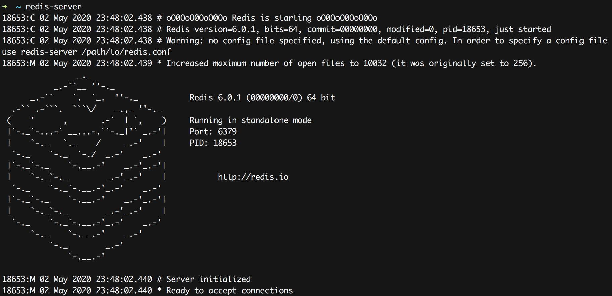
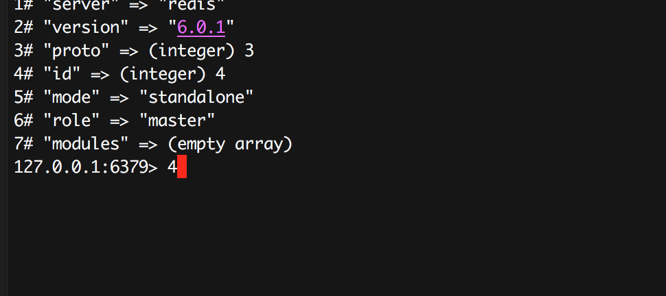

# Redis 6.0 客户端缓存特性及实践

Redis 6.0 [发布](http://antirez.com/news/132)了。

Redis 6.0的新特性也是在一步步的讨论和优化中确定的。

很多的特性已经在之前的RC等版本中介绍过了。

但是正式GA版中也有一些新的变化:

- [SSL](https://redis.io/topics/encryption)
- [ACL](https://redis.io/topics/acl): 更好，命令支持
- [RESP3](https://github.com/antirez/RESP3/blob/master/spec.md)
- [Client side caching](https://redis.io/topics/client-side-caching):重新设计
- Threaded I/O
- [Diskless replication on replicas](https://redis.io/topics/replication)
- Cluster support in Redis-benchmark and improved redis-cli cluster support
- [Disque in beta as a module of Redis](https://github.com/antirez/disque-module): 开始侵入消息队列领域
- [Redis Cluster Proxy](https://github.com/RedisLabs/redis-cluster-proxy)
- 支持RDB不再使用时可立即删除，针对不落盘的场景
- PSYNC2: 优化的复制协议
- 超时设置支持更友好
- 更快的RDB加载，20% ~ 30%的提升
- STRALGO，新的字符串命令，目前只有一个实现LCS (longest common subsequence)

@antirez 提到只是Redis历史上最大的一次版本更新，所以谨慎建议在应用的产品中还是多多测试评估，并且承诺一旦遇到大的bug就会紧急发布6.0.1版。果不其然，一天后就发布了 6.0.1版，修复了一个allocator的bug，这个bug是为了优化而引入的，现在暂时去掉了。

> I just released Redis 6.0.1. Unfortunately there was a bug in Redis 6.0.0 introduced just a few days before the release, that only happens when using the non-default allocator (libc malloc in this case triggers it). Optimization reverted, 6.0.1 released. Sorry for the issue.

本文主要关注**Client side caching**(客户端缓存)这一特性。

> [smallnest/RESP3](https://github.com/smallnest/resp3) 是Redis RESP3协议的解析库，你可以使用它和Redis底层通讯，或者包装它实现新版的Redis client库或者Redis Server端。


一年前，当 @antirez 参加完纽约Redis大会后，5:30就在旅店中醒来了，面对曼哈顿街头的美丽景色，在芸芸众生中思索Redis的未来。包括客户端缓存。

其实，客户端缓存特性是收到Redis Conf 2018的Ben Malec的影响，一下子打开了 @antirez 思路。 我们知道， 很多公司使用Redis做缓存系统，并且很好的提高了数据访问的性能，但是很多企业为了进一步应对热点数据，还是会在redis的client端缓存一部分热点数据，用来应对吃瓜事件。比如在微博我们经常遇到的是明星出轨、明星分分合合、突发事件等等，每年都会有几次突发的事件，微博除了使用Redis做缓存避免直接访问数据库，还会在前面加更多的cache层，比如`L1 cache`等，采用memcached等产品作为热数据的缓存。那么就有一个问题，如何能够**及时**的同步这些cache和redis的数据呢？Ben提供了非常有意思的想法。

伫立在曼哈顿的街头,@antirez 陷入了沉思，后来回到旅馆他开始实现初版的客户端的缓存。当然，最终Redis 6.0中实现和这个初版的实现差别很大，但是很是显然，从客户端的演化过程中我们还是能看到@antirez对这个特性所在的权衡(trade off)。关于这个历史本文不做太多的介绍，因为我们更关注于这个特性最终是什么样子的。

Redis实现的是一个服务端协助的客户端缓存，叫做`tracking`。客户端缓存的命令是:

```
CLIENT TRACKING ON|OFF [REDIRECT client-id] [PREFIX prefix] [BCAST] [OPTIN] [OPTOUT] [NOLOOP]
```

当`tracking`开启时， Redis会"记住"每个客户端请求的key，当key的值发现变化时会发送失效信息给客户端(invalidation message)。失效信息可以通过RESP3协议发送给请求的客户端，或者转发给一个不同的连接(支持RESP2+ Pub/Sub)。
当广播模式(broadcasting)开启时，参与`tracking`的客户端会收到它通过前缀订阅的key的相关的通知，即使它没请求过对应的key。同时还提供了`OPTIN`、`OPTOUT`等模式。

> 失效消息：当一个key的数据有修改的时候，需要告诉客户端它以前缓存的数据失效了，这时redis会主动发送一条失效消息

- **REDIRECT** : 将失效消息转发给另外一个客户端。当我们不使用RESP3而是使用老的RESP2和Redis通讯时，client本身不支持处理失效消息，所以可以开启一个支持Pub/Sub客户端处理失效消息。当然如果客户端支持RESP3也可以将失效消息转发给另外一个客户端。这个cace我们放在最后演示。
- **BCAST**: 使用广播模式开始`tracking`。在这种模式下客户端需要设置将track的key的前缀，这些key的失效消息会广播给所有参与的客户端，不管这些客户端是否请求/缓存额这些key。不开始广播模式时，Redis只会track那些只读命令请求的key，并且只会报告一次失效消息。
- **PREFIX** : 只应用了广播模式，注册一个key的前缀。所有以这个前缀开始的key有修改时，都会发送失效消息。可以注册多个前缀。如果不设置前缀，那么广播模式会track每一个key。
- **OPTIN**: 当广播模式没有激活时，正常**不会**track只读命令的key，除非它们在`CLIENT CACHING yes`之后被调用。
- **OPTOUT**: 当广播模式没有激活时，正常**会**track只读命令的key，除非它们在`CLIENT CACHING off`之后被调用。
- **NOLOOP**: 不发送client自己修改的key。

下面让我们一一介绍每个选项。

## 测试环境搭建

首先让我们介绍RESP3协议相关的选项，`REDIRECT <id>`放在最后介绍。

在尝试之前，你首先需要安装一个redis 6.x的版本，目前时6.0.1。在官方网站上有源代码的下载，编译安装也很简单：

```
make distclean
make
make test
sudo make install
```

相信很快就有编译好的二进制包可以下载。

启动server, 它会在6379端口启动一个服务:

```
redis-server
```

使用`redis-cli`访问,默认访问本机的6379实例:

```
redis-cli
```

当然你可以通过`-h`查看额外的参数配置，比如使用其它端口等等，这里我们使用最简单的例子，重点是了解客户端缓存的特性。

有时候为了更好的观察redis的返回结果，我们使用`telnet`而不是`redis-cli`作为client连接redis，因为redis-cli对结果做了处理，尤其是失效消息，你可能无法观测到。

## BCAST 广播模式 (`client tracking on`)

启动redis server:
[](https://colobu.com/2020/05/02/redis-client-side-caching/redis-server.png)

启动redis-cli:
[](https://colobu.com/2020/05/02/redis-client-side-caching/redis-cli.png)

当然，我们使用telnet来测试，方便观察redis的返回结果，刚才redis-cli用来更新key值，辅助测试。
连接上之后发送`hello 3`开启RESP3协议：

```
telnet client
➜  ~ telnet localhost 6379
Trying ::1...
Connected to localhost.
Escape character is '^]'.
hello 3
%7
$6
server
$5
redis
$7
version
$5
6.0.1
......
```

之后尝试开启`tracking`并读取`a`的值:

```
telnet client
client tracking on
+OK
set a 1
+OK
get a
$1
1
```

这个时候如果使用redis-cli作为另外一个client更新`a`的值，telnet这个client应该能获得通知:

```
redis-cli client
127.0.0.1:6379> set a 2
OK
```

观察telnet，它收到了一个失效消息：

```
telnet client
>2
$10
invalidate
*1
$1
a
```

注意它采用RESP3中的PUSH类型(`>`)。

如果这个使用你再使用redis-cli更新`a`的值，telnet不会再收到失效消息。 除非telnet client再`get a`一次，重新`tracking` a的值。

可以随时取消`tracking`:

```
telnet client
client tracking off
```

## tracking特定前缀的key (`client tracking on`)

上面的方式会tracking所有的key，如果你只想跟踪特定的key, 目前redis提供了一种方式，也就是前缀匹配的方式。你可以只tracking特定前缀的key。
它值应用了广播模式。

使用telnet client设定前缀和开启tracking：

```
telnet client
hello 3
.......

client tracking on prefix a bcast
+OK
client tracking on prefix user bcast
+OK
```

我们tracking两个前缀，以`a`开头的所有的key和以`user`开头的所有的key,所有`a`开头的所有的key和以`user`开头的所有的key(包括`a`和`user`)的key变动时它应该都收到消息。

然后我们使用redis-cli更新三个key: `abc`、`user:32432723213`和`feed:6532343243432`:

```
redis-cli
127.0.0.1:6379> set abc 100
OK
127.0.0.1:6379> set user:32432723213 good
OK
127.0.0.1:6379> set feed:6532343243432 abc
OK
```

telnet client收到`abc`和`user:32432723213`的失效消息,而不会收到`feed:6532343243432`的失效消息：

```
telnet client
>2
$10
invalidate
*1
$3
abc
>2
$10
invalidate
*1
$16
user:32432723213
```

你可以通过`client tracking off`停止客户端缓存。目前貌似不能只停止对单个的前缀的`tracking`。 即使你使用`client tracking off prefix user`也是取消对所有的key的`tracking`。

```
src/networking.c
......
} else if (!strcasecmp(c->argv[2]->ptr,"off")) {
    disableTracking(c);
} else {
......
```

## 选择加入

如果使用`OPTIN`,可以有选择的开启`tracking`。 只有你发送`client caching yes`之后的下一条的只读命令的key才会`tracking`, 否则**其它的只读命令中的key不会tracking**。

首先我们开始`optin`，读取a的指，这个时候使用redis-cli client修改a的值为1000，我们并没有收到`a`的失效消息。

```
telnet client
client tracking on optin
+OK

get a
$1
2
```

接下来我们发送`client caching yes`，紧接着获取a的值，这个时候如果再修改a的值，你就可以收到一条a的失效消息:

```
telnet client
client caching yes
+OK
get a
$4
1000

>2
$10
invalidate
*1
$1
a
```

必须是紧跟着`client caching yes`吗?是的，比如发送下面的命令，只会`tracking` b,而不是a:

```
telnet client
client caching yes
+OK
get b
_
get a
$4
2000
```

## 选择退出

如果使用`OPTOUT`,你也可以有选择的退出`tracking`。 只有你发送`client caching off`之后的下一条的只读命令的key才会停止`tracking`, 否则**其它的只读命令中的key都会被tracking**。

可以看到它和`OPTIN`正好相反，你可以根据你的场景来选择。

比如下面的例子，开启`OPTOUT`之后，对任意的key的变动都收到失效消息：

```
telnet client
client tracking on optout
+OK

get a
$4
3000
>2
$10
invalidate
*1
$1
a
```

这个时候如果我们想排除`b`这个key，可以只针对它进行设置:

```
telnet client
client caching no
+OK
get b
$1
3
```

之后对b的变动并不会收到b的失效消息。

**注意**: `OPTIN`和`OPTOUT`是针对的非BCAST场景，也就是只有你发送了key的只读命令后，才会跟踪相应的key。而广播模式是无论你是否发送过key的只读命令，只要redis修改了key，都会发送相应key(或者匹配前缀的key)的失效消息。

## NOLOOP

正常设置时，失效消息是发给所有参与的client，但是如果设置了`NOLOOP`,则不会发送给更新这个key的client。

```
telnet client
client tracking on bcast noloop
+OK
set a 1
+OK

client tracking off
+OK
client tracking on bcast
+OK

set a 1
+OK
>2
$10
invalidate
*1
$1
a
```

注意，取消tracking只需调用`client tracking off`即可。

## REDIRECT

最后，让我们看一下转发消息的处理。这是为了兼容RESP2协议一个处理方式，将失效消息转发给另外一个client。

首先我们查看redis-cli的client id:

```
redis-cli
127.0.0.1:6379> client list
id=4 addr=127.0.0.1:61017 fd=8 name= age=33103 idle=0 flags=N db=0 sub=0 psub=0 multi=-1 qbuf=26 qbuf-free=32742 obl=0 oll=0 omem=0 events=r cmd=client user=default
```

使用telnet连接redis,查看client id:

```
telnet client
client id
:12
```

telnet 客户端开启订阅失效消息：

```
telnet client
SUBSCRIBE __redis__:invalidate
*3
$9
subscribe
$20
__redis__:invalidate
:1
```

然后我们就可以将redis-cli的失效消息转发给telnet client:

```
redis-cli
client tracking on bcast redirect 12

127.0.0.1:6379> set a 1000
OK
```

可以看到telnet客户端收到了失效消息：

```
telnet client
*3
$7
message
$20
__redis__:invalidate
*1
$1
a
```

如果你要转发的目的client开启了RESP3协议，你就不需要RESP3 Pub/Sub了，因为RESP3原生支持Push消息。

redis的tracking feature的实现代码在:[tracking.c](https://github.com/antirez/redis/blob/unstable/src/tracking.c)。