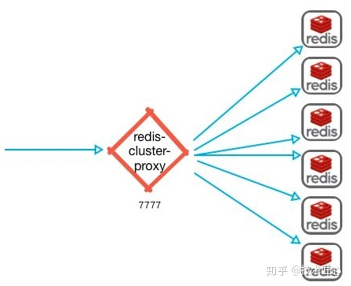

> "Redis 6.0.0 GA is out!"
> 这是2020.4.30 Redis作者 antirez 在其 [博客]([Redis 6.0.0 GA is out!](https://link.zhihu.com/?target=http%3A//antirez.com/news/132)) 宣布：Redis 6.0.0稳定版本发布了。
> 简单介绍一下Redis6.0 有哪些重要新特性。

## 1.多线程IO

Redis 6引入多线程IO，但多线程部分只是用来处理网络数据的读写和协议解析，执行命令仍然是单线程。之所以这么设计是不想因为多线程而变得复杂，需要去控制 key、lua、事务，LPUSH/LPOP 等等的并发问题。

## 2.重新设计了客户端缓存功能

实现了Client-side-caching（客户端缓存）功能。放弃了caching slot，而只使用key names。

*[Redis server-assisted client side caching](https://link.zhihu.com/?target=https%3A//redis.io/topics/client-side-caching)*

## 3.RESP3协议

RESP（Redis Serialization Protocol）是 Redis 服务端与客户端之间通信的协议。Redis 5 使用的是 RESP2，而 Redis 6 开始在兼容 RESP2 的基础上，开始支持 RESP3。

推出RESP3的目的：一是因为希望能为客户端提供更多的语义化响应，以开发使用旧协议难以实现的功能；另一个原因是实现 Client-side-caching（客户端缓存）功能。

*[RESP3](https://link.zhihu.com/?target=https%3A//github.com/antirez/RESP3/blob/master/spec.md)*

## 4.支持SSL

连接支持SSL，更加安全。

## 5.ACL权限控制

\1. 支持对客户端的权限控制，实现对不同的key授予不同的操作权限。

\2. 有一个新的ACL日志命令，允许查看所有违反ACL的客户机、访问不应该访问的命令、访问不应该访问的密钥，或者验证尝试失败。这对于调试ACL问题非常有用。

## 6.提升了RDB日志加载速度

根据文件的实际组成（较大或较小的值），可以预期20/30%的改进。当有很多客户机连接时，信息也更快了，这是一个老问题，现在终于解决了。

## 7.发布官方的Redis集群代理模块 Redis Cluster proxy

在 Redis 集群中，客户端会非常分散，现在为此引入了一个集群代理，可以为客户端抽象 Redis 群集，使其像正在与单个实例进行对话一样。同时在简单且客户端仅使用简单命令和功能时执行多路复用。

## 8.提供了众多的新模块（modules）API