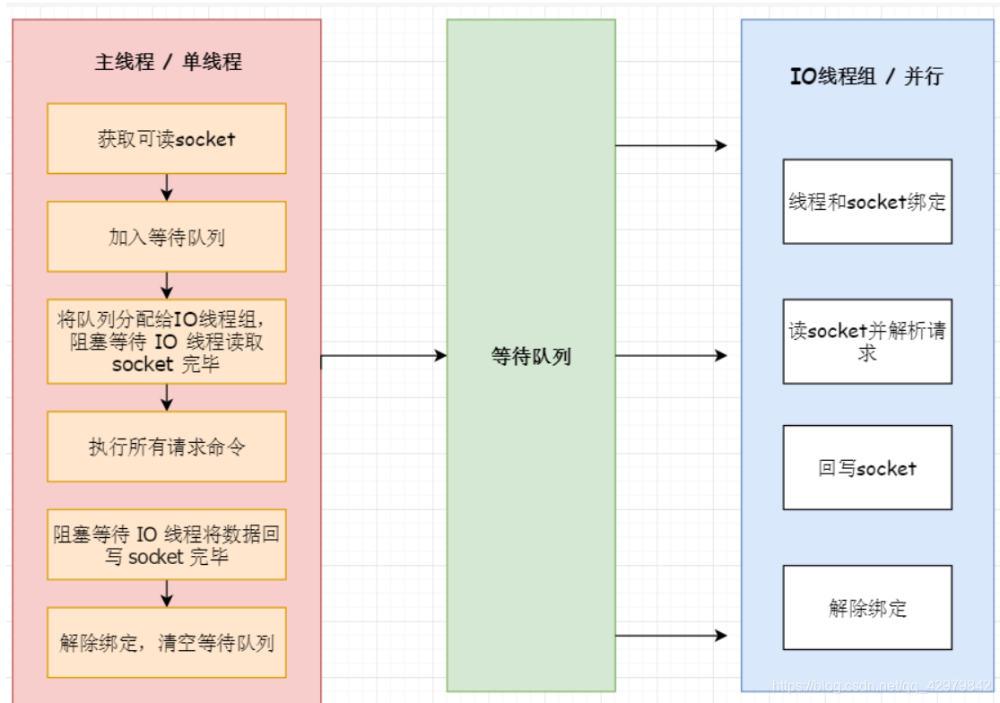
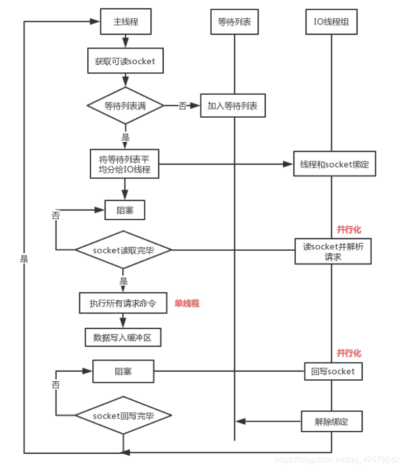

艺术致敬！


## 一、众多新模块（modules）API

  Redis 6中模块API开发进展非常大，因为Redis Labs为了开发复杂的功能，从一开始就用上Redis模块。Redis可以变成一个框架，利用Modules来构建不同系统，而不需要从头开始写然后还要BSD许可。Redis一开始就是一个向编写各种系统开放的平台。如：Disque作为一个Redis Module使用足以展示Redis的模块系统的强大。集群消息总线API、屏蔽和回复客户端、计时器、模块数据的AOF和RDB等。

## 二、更好的过期循环（expire cycle）

  Redis 6重新编写了Redis活动到期周期，以更快地回收已到期的key。

## 三、支持SSL

  Redis 6连接支持SSL，更加安全。

## 四、ACLs 权限控制

  Redis 6开始支持ACL，该功能通过限制对命令和key的访问来提高安全性。ACL的工作方式是在连接之后，要求客户端进行身份验证（用户名和有效密码）；如果身份验证阶段成功，则连接与指定用户关联，并且该用户具有限制。
  在默认配置中，Redis 6的工作方式与Redis的旧版本完全相同，每个新连接都能够调用每个可能的命令并访问每个键，因此ACL功能与旧版本向后兼容。客户和应用程序。依旧使用requirepass配置密码的，但现在只是为默认用户设置密码。

### 4.1 ACL使用

```
 1) ACL <subcommand> arg arg ... arg. Subcommands are:
 2) LOAD                             -- Reload users from the ACL file.
 3) SAVE                             -- Save the current config to the ACL file.
 4) LIST                             -- Show user details in config file format.
 5) USERS                            -- List all the registered usernames.
 6) SETUSER <username> [attribs ...] -- Create or modify a user.
 7) GETUSER <username>               -- Get the user details.
 8) DELUSER <username> [...]         -- Delete a list of users.
 9) CAT                              -- List available categories.
10) CAT <category>                   -- List commands inside category.
11) GENPASS [<bits>]                 -- Generate a secure user password.
12) WHOAMI                           -- Return the current connection username.
13) LOG [<count> | RESET]            -- Show the ACL log entries.
```

  Redis6中auth命令在Redis 6中进行了扩展，因此现在可以在两个参数的形式中使用它：

```
  #before Redis 6
  AUTH <password>
  #Redis 6
  AUTH <username> <password>
```

  默认情况下，有一个用户定义，称为`default`。可以使用ACL LIST命令来查看，默认配置的Redis实例的配置是：

```
#无密码
127.0.0.1:6379> ACL LIST
1) "user default on nopass ~* +@all"
#有密码
127.0.0.1:6379> ACL LIST
1) "user default on #ce306e0ee195cc817620c86d7b74126d0d66c077b66f66c10f1728cf34a214d3
127.0.0.1:6379> ACL WHOAMI
"default"
127.0.0.1:6379> ACL USERS
1) "default"
```

  每行的开头都是“ user”，后面跟用户名，`on`表示用户是启用的，否则是禁用的。`nopass`表示无密码，否则表示有密码认证。（`~*`）表示能够访问所有的key，`+ @ all`表示能够调用所有可能的命令。

### 4.2 ACL规则

**启用和禁止用户**

- `on`：启用用户：可以以该用户身份进行认证。
- `off`：禁用用户：不再可以与此用户进行身份验证，但是已经过身份验证的连接仍然可以使用。如果默认用户标记为off，则无论默认用户配置如何，新连接都将开始不进行身份验证，并且要求用户使用AUTH选项发送AUTH以进行身份验证。

**允许和禁止命令**

- `+<command>`：将命令添加到用户可以调用的命令列表中。
- `-<command>`：将命令从用户可以调用的命令列表中删除。
- `+@<category>`：添加该类别中要由用户调用的所有命令，有效类别为@ admin，@ set，@ sortedset等，通过调用ACL CAT命令查看完整列表。特殊类别@all表示所有命令，包括当前在服务器中存在的命令，以及将来将通过模块加载的命令。

```
127.0.0.1:6379> ACL CAT
 1) "keyspace"
 2) "read"
 3) "write"
 4) "set"
 5) "sortedset"
 6) "list"
 7) "hash"
 8) "string"
 9) "bitmap"
10) "hyperloglog"
11) "geo"
12) "stream"
13) "pubsub"
14) "admin"
15) "fast"
16) "slow"
17) "blocking"
18) "dangerous"
19) "connection"
20) "transaction"
21) "scripting"
```

- `-@<category>`：从客户端可以调用的命令列表中删除命令。
- `+<command>|subcommand`：允许使用本来禁用的命令的特定子命令。该语法不允许使用`-<command>|subcommand`，例如`-DEBUG|SEGFAULT`，只能以“ +”开头的加法运算符。如果命令整体上已处于活动状态，则此ACL将导致错误。
- `allcommands`：`+ @ all`的别名。
- `nocommands`：`-@ all`的别名。

**允许或禁止访问某些Key**

- ~：添加可以在命令中提及的键模式。例如~*和* allkeys 允许所有键。
  - resetkeys：使用当前模式覆盖所有允许的模式。如： ~foo: *~bar:* resetkeys ~objects: *，客户端只能访问匹配 object:* 模式的 KEY。

**为用户配置有效密码**

- ：将此密码添加到用户的有效密码列表中。例如，>mypass将“mypass”添加到有效密码列表中。该命令会清除用户的nopass标记。每个用户可以有任意数量的有效密码。
- <：从有效密码列表中删除此密码。若该用户的有效密码列表中没有此密码则会返回错误信息。
- ：将此SHA-256哈希值添加到用户的有效密码列表中。该哈希值将与为ACL用户输入的密码的哈希值进行比较。允许用户将哈希存储在users.acl文件中，而不是存储明文密码。仅接受SHA-256哈希值，因为密码哈希必须为64个字符且小写的十六进制字符。
- !：从有效密码列表中删除该哈希值。当不知道哈希值对应的明文是什么时很有用。
- nopass：移除该用户已设置的所有密码，并将该用户标记为nopass无密码状态：任何密码都可以登录。resetpass命令可以清除nopass这种状态。
- resetpass：情况该用户的所有密码列表。而且移除nopass状态。resetpass之后用户没有关联的密码同时也无法使用无密码登录，因此resetpass之后必须添加密码或改为nopass状态才能正常登录。
- reset：重置用户状态为初始状态。执行以下操作resetpass，resetkeys，off，-@all。

### 4.3 创建和编辑用户

```
127.0.0.1:6379> ACL SETUSER zijie
OK
`SETUSER`命令采用用户名和ACL规则列表以应用于用户。但是在上面的示例中，没有指定任何规则。如果用户不存在，这将使用默认属性来创建用户。如果用户已经存在，则上面的命令将不执行任何操作。
默认的用户状态：
127.0.0.1:6379> acl list
1) "user default on #ce306e0ee195cc817620c86d7b74126d0d66c077b66f66c10f1728cf34a214d3 ~* +@all"
2) "user zijie off -@all"   
```

刚创建的用户`zijie`是：

- 处于禁用状态，AUTH不起作用。

- 无法访问任何命令。

- 无法访问任何key。

- 没有设置密码。

  ```
  127.0.0.1:6379> ACL SETUSER zijie2 on >123 ~* +get
  OK
  127.0.0.1:6379> acl list
  1) "user default on #ce306e0ee195cc817620c86d7b74126d0d66c077b66f66c10f1728cf34a214d3 ~* +@all"
  2) "user zijie off -@all"
  3) "user zijie2 on #a665a45920422f9d417e4867efdc4fb8a04a1f3fff1fa07e998e86f7f7a27ae3 ~cached:* -@all +get"
  127.0.0.1:6379> ACL SAVE
  OK
  ```

  用户可以执行某些操作，但是会拒绝执行其他操作，权限动态生效：

```
127.0.0.1:6379> auth zijie2 123
OK
127.0.0.1:6379> get name
"zijie"
127.0.0.1:6379> set name:2 a
(error) NOPERM this user has no permissions to run the 'set' command or its subcommand
#ACL LIST 查看用户配置
127.0.0.1:6379> ACL LIST
1) "user default on #ce306e0ee195cc817620c86d7b74126d0d66c077b66f66c10f1728cf34a214d3 ~* +@all"
2) "user zijie off -@all"
3) "user zijie2 on #a665a45920422f9d417e4867efdc4fb8a04a1f3fff1fa07e998e86f7f7a27ae3 ~* -@all +get"
#用户名区分大小写，ACL GETUSER 易读性高于ACL LIST
127.0.0.1:6379> ACL GETUSER zijie2
1) "flags"
2) 1) "on"
2) "allkeys"
3) "passwords"
4) 1) "a665a45920422f9d417e4867efdc4fb8a04a1f3fff1fa07e998e86f7f7a27ae3"
5) "commands"
6) "-@all +get"
7) "keys"
8) 1) "*"
#使用RESP3易读性更高
127.0.0.1:6379> ACL GETUSER zijie2
1# "flags" => 1~ "on"
2~ "allkeys"
2# "passwords" => 1) "a665a45920422f9d417e4867efdc4fb8a04a1f3fff1fa07e998e86f7f7a27ae3"
3# "commands" => "-@all +get"
4# "keys" => 1) "*"
```

  使用另一个ACL SETUSER命令向用户添加多个模式：

```
127.0.0.1:6379> ACL SETUSER zijie3 on >123 ~zijie* +get
OK
127.0.0.1:6379> ACL SETUSER zijie3 on >123 ~zijie* +set
OK
127.0.0.1:6379> ACL SETUSER zijie3 on >123 ~zijie* +@read
OK
127.0.0.1:6379> ACL LIST
1) "user default on #ce306e0ee195cc817620c86d7b74126d0d66c077b66f66c10f1728cf34a214d3 ~* +@all"
2) "user zijie off -@all"
3) "user zijie2 on #a665a45920422f9d417e4867efdc4fb8a04a1f3fff1fa07e998e86f7f7a27ae3 ~* -@all +get"
4) "user zijie3 on #a665a45920422f9d417e4867efdc4fb8a04a1f3fff1fa07e998e86f7f7a27ae3 ~zijie* ~name* ~xx* -@all +@read +@hash +@bitmap +@geo -bitfield -hmset +set -geoadd -hincrby -hset -hincrbyfloat -georadiusbymember -hdel -hsetnx -bitop -georadius -setbit"
#删除用户
ACL DELUSER zijie3
```

### 4.4 命令类别

  ACL有类似"资源组“的概念，给一类命令一个别名，来达到快速授权。

```
127.0.0.1:6379> acl cat
 1) "keyspace"
 2) "read"
 3) "write"
 4) "set"
 5) "sortedset"
 6) "list"
 7) "hash"
 8) "string"
 9) "bitmap"
10) "hyperloglog"
11) "geo"
12) "stream"
13) "pubsub"
14) "admin"
15) "fast"
16) "slow"
17) "blocking"
18) "dangerous"
19) "connection"
20) "transaction"
21) "scripting"
127.0.0.1:6379> acl cat dangerous
 1) "flushdb"
 2) "sort"
 3) "swapdb"
 4) "replicaof"
 5) "shutdown"
 6) "replconf"
 7) "keys"
 8) "lastsave"
 9) "psync"
10) "cluster"
11) "module"
12) "acl"
13) "bgrewriteaof"
14) "info"
15) "debug"
16) "bgsave"
17) "sync"
18) "flushall"
19) "save"
20) "pfdebug"
21) "latency"
22) "role"
23) "slaveof"
24) "migrate"
25) "pfselftest"
26) "config"
27) "monitor"
28) "restore"
29) "slowlog"
30) "restore-asking"
31) "client"
127.0.0.1:6379> ACL SETUSER zijie4 on +@all -@dangerous >123 ~*
OK
127.0.0.1:6379> ACL GETUSER zijie4
1) "flags"
2) 1) "on"
2) "allkeys"
3) "passwords"
4) 1) "a665a45920422f9d417e4867efdc4fb8a04a1f3fff1fa07e998e86f7f7a27ae3"
5) "commands"
6) "+@all -@admin -@dangerous"
7) "keys"
8) 1) "*"
```

**授权子命令**

```
ACL SETUSER zijie5 -client +client|setname +client|getname 
```

### 4.5 使用外部ACL文件

  Redis6因为引入了权限机制，会有不同分工的用户；所以又引入了额外的配置项以及配置文件，通过ACL LOAD/ACL SAVE报错和加载acl文件。

```
[root@zijie ~]# cat /etc/Redis6.conf  | grep acl
aclfile /usr/local/Redis/users.acl
acllog-max-len 128
#Redis6开始密码加密存储
[root@zijie ~]# cat /usr/local/Redis/users.acl
user default on #ce306e0ee195cc817620c86d7b74126d0d66c077b66f66c10f1728cf34a214d3 ~* +@all
user zijie off -@all
user zijie2 on #a665a45920422f9d417e4867efdc4fb8a04a1f3fff1fa07e998e86f7f7a27ae3 ~* -@all +get
user zijie3 off ~zijie* ~name* -@all
#获取安全密码
127.0.0.1:6379> ACL GENPASS
"c550b646ef8f7f91908628db0d983b4ca061fcf36433baa770ea9ce09da64ef4"
```

### 4.6 哨兵和副本的ACL规则

  如果不想为Redis副本和Redis Sentinel实例提供对Redis实例的完全访问权限，则以下是一组命令，为了使一切正常工作，必须允许这些命令。
  对于Sentinel，允许用户在主实例和副本实例中访问以下命令：
  Sentinel不需要访问数据库中的任何密钥，因此ACL规则如下（注意：不需要AUTH，因为始终允许使用AUTH）：

```
ACL setuser sentinel-user >somepassword +client +subscribe +publish +ping +info +multi +slaveof +config +client +exec on
```

  Redis副本需要在主实例上将以下命令列入白名单：

- PSYNC，REPLCONF，PING

  不需要访问任何密钥，因此这转化为以下规则：

```
ACL setuser replica-user >somepassword +psync +replconf +ping on
```

  无需将副本配置为允许主服务器能够执行任何命令集：从副本的角度来看，主服务器始终被认证为root用户。

### 4.7 ACL LOG

  记录拒绝的命令，密钥访问和身份验证。

```
127.0.0.1:6379> acl log
 1)  1) "count"
     2) (integer) 1
     3) "reason"
     4) "auth"
     5) "context"
     6) "toplevel"
     7) "object"
     8) "auth"
     9) "username"
    10) "default"
    11) "age-seconds"
    12) "7.3860000000000001"
    13) "client-info"
    14) "id=18 addr=127.0.0.1:51882 fd=8 name= age=2 idle=0 flags=N db=0 sub=0 psub=0 multi=-1 qbuf=26 qbuf-free=32742 obl=0 oll=0 omem=0 events=r cmd=auth user=default"
```

## 五、RESP3 协议

  RESP（Redis Serialization Protocol）是 Redis 服务端与客户端之间通信的协议。
  RESP3 是 RESP version 2 的更新版本。RESP v2 大致从 Redis 2.0 开始支持（其实 1.2 就支持了，只不过 Redis 2.0 是第一个仅支持此协议的版本）。

```
   127.0.0.1:6379> hello 2
   1) "server"
   2) "Redis"
   3) "version"
   4) "6.0.5"
   5) "proto"
   6) (integer) 2
   7) "id"
   8) (integer) 7
   9) "mode"
    10) "standalone"
    11) "role"
    12) "master"
    13) "modules"
    14) (empty array)
    127.0.0.1:6379> hello 3
    1# "server" => "Redis" // 服务名称
    2# "version" => "6.0.5" // 版本号
    3# "proto" => (integer) 3 // 支持的最高协议
    4# "id" => (integer) 7 // 客户端连接 ID
    5# "mode" => "standalone" //  模式："standalone", "sentinel", "cluster"
    6# "role" => "master" //  "master" 或 "replica"
    7# "modules" => (empty array) // 加载的模块列表
```

## 六、客户端缓存（Client side caching）

  Redis 客户端缓存在某些方面进行了重新设计，特别是放弃了缓存槽（caching slot）方法而只使用 key 的名称。在分析了备选方案之后，在其他 Redis 核心团队成员的帮助下，这种方法最终看起来更好。
  客户端缓存重新设计中引入了广播模式（broadcasting mode）。在使用广播模式时，服务器不再尝试记住每个客户端请求的 key。 取而代之的是，客户订阅 key 的前缀：每次修改匹配前缀的 key 时，这些订阅的客户端都会收到通知。这意味着会产生更多的消息（仅适用于匹配的前缀），但服务器端无需进行任何内存操作。

## 七、多线程 IO（Threaded I/O）

  Redis 6 引入多线程IO，但多线程部分只是用来处理网络数据的读写和协议解析，执行命令仍然是单线程。之所以这么设计是不想因为多线程而变得复杂，需要去控制 key、lua、事务，LPUSH/LPOP 等等的并发问题。

```
io-threads 4 # 开启 4 个 IO 线程
io-threads-do-reads yes # 请求解析也是用 IO 线程
```


**流程简述如下：**

1、主线程负责接收建立连接请求，获取 socket 放入全局等待读处理队列
2、主线程处理完读事件之后，通过 RR(Round Robin) 将这些连接分配给这些 IO 线程
3、主线程阻塞等待 IO 线程读取 socket 完毕
4、主线程通过单线程的方式执行请求命令，请求数据读取并解析完成，但并不执行
5、主线程阻塞等待 IO 线程将数据回写 socket 完毕
6、解除绑定，清空等待队列

**该设计有如下特点：**
1、IO 线程要么同时在读 socket，要么同时在写，不会同时读或写
2、IO 线程只负责读写 socket 解析命令，不负责命令处理

## 八、其余特性

### 8.1 无盘复制&PSYNC2

  现在，Redis用于复制的 RDB 文件如果不再有用，将立即被删除。不过，在某些环境中，最好不要将数据放在磁盘上，而只放在内存中。

```
repl-diskless-sync no
repl-diskless-sync-delay 5
repl-diskless-load disabled
```

  复制协议 PSYNC2 现在得到了改进。Redis 将能够更频繁地部分重新同步，因为它能够修整协议中的最终 PING，从而使副本和主副本更有可能找到一个公共的偏移量。

### 8.2 Redis-benchmark支持集群

  从Redis6开始Redis-benchmark支持集群。

### 8.3 Redis-cli 优化、重写 Systemd 支持

### 8.4 Redis 集群代理与 Redis 6 一同发布（但在不同的 repo）

  在 Redis 集群中，客户端会非常分散，Redis6为此引入了一个集群代理，可以为客户端抽象 Redis 群集，使其像正在与单个实例进行对话一样。同时在简单且客户端仅使用简单命令和功能时执行多路复用。

### 8.5 RDB更快加载

  Redis 6.0，RDB 文件的加载速度比之前变得更快了。根据文件的实际组成（较大或较小的值），大概可以获得 20-30％ 的改进。除此之外，INFO 也变得更快了，当有许多客户端连接时，这会消耗很多时间，不过现在终于消失了。

### 8.6 SRANDMEMBER和类似的命令具有更好的分布

### 8.7 STRALGO 命令

  STRALGO 实现了复杂的字符串算法。 目前唯一实现的是 LCS（最长的公共子序列）。

```
127.0.0.1:6379> STRALGO LCS keys name zijie
"1"
127.0.0.1:6379> STRALGO LCS keys name zijie  len
(integer) 1
```

### 8.8 带有超时的 Redis 命令更易用

  除了 BLPOP 命令，其他用于接受秒的命令现在都接受十进制数字，而且实际分辨率也得到了改进，以使其永远不会比当前的“HZ”值更差，因为其不管连接客户端的数量。