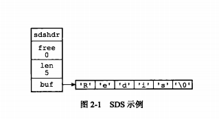
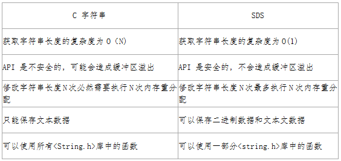
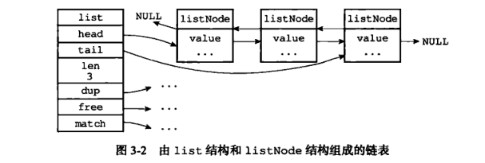
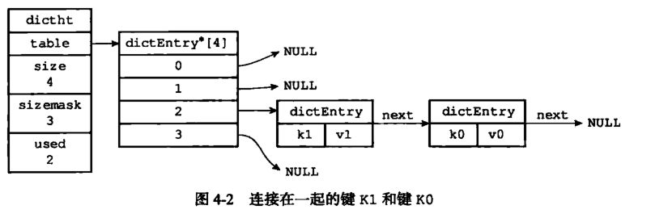
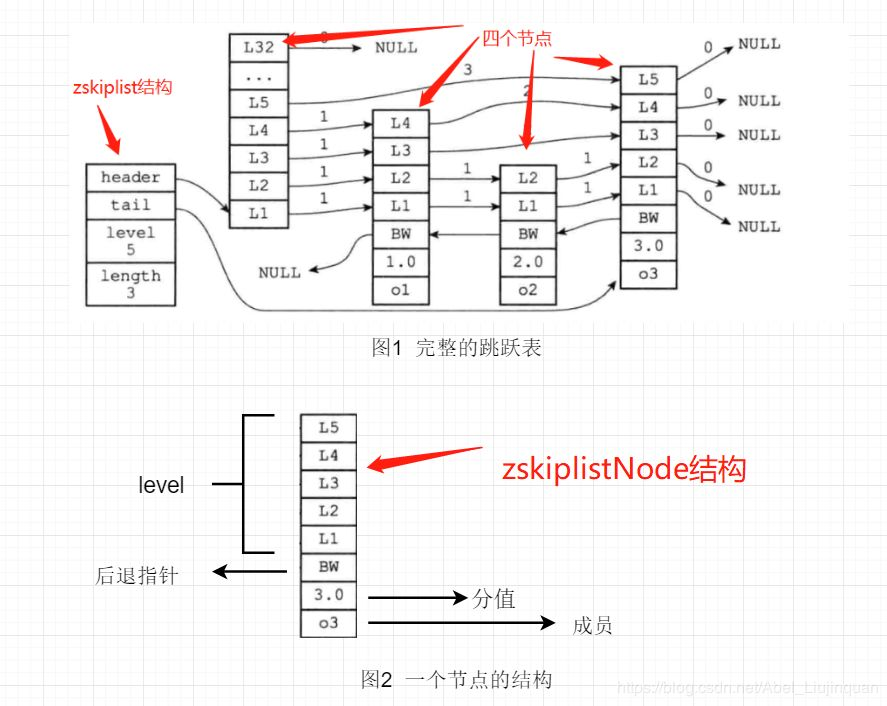
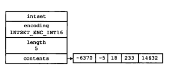
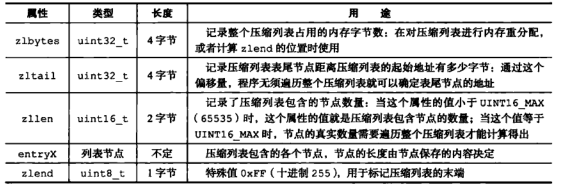

## Redis中五大数据结构的底层实现

田兆壮 2020-03-20 12:43:34

**作者介绍**

**田兆壮，**新炬网络开发工程师。具备扎实的Java、Scala开发经验，熟练使用Python和Shell等脚本语言；具备前后端开发能力，熟练使用关系型数据库和非关系型数据库以及开发中的调优；分布式方面精通RPC框架和消息中间件等开源框架的使用；在大数据领域熟练使用Hadoop生态系统中的开源软件，精读及实践过Spark资源调度算法、shuffle原理、算子调优、数据倾斜的解决等偏底层的原理。目前正在深入学习微服务架构，以及Flink的原理和使用。

 

**一、概述**

 

Redis是一个开源的使用ANSI C语言编写、遵守BSD协议、支持网络、可基于内存亦可持久化的日志型、Key-Value数据库，与Memcached类似，却优于Memcached的一个高性能的key-value数据库。下面让我们来详细介绍一下redis中五大数据结构的底层实现。

 

**二、简单动态字符串**

 

**1、概述**

 

Redis是一个开源的使用ANSI C语言编写的key-value 数据库，我们可能会较为主观的认为 Redis 中的字符串就是采用了C语言中的传统字符串表示，但其实不然，Redis没有直接使用C语言传统的字符串表示，而是自己构建了一种名为简单动态字符串（simple dynamic string SDS）的抽象类型，并将SDS用作Redis的默认字符串表示：redis>SET msg "hello world"

 

SDS 定义：

 

 

struct sdshdr{

   //记录buf数组中已使用字节的数量

   //等于 SDS 保存字符串的长度

   int len;

   //记录 buf 数组中未使用字节的数量

   int free;

   //字节数组，用于保存字符串

   char buf[];

}

 

图片来源：《Redis设计与实现》

 

我们看上面对于 SDS 数据类型的定义：

 

- len 保存了SDS保存字符串的长度
- buf[] 数组用来保存字符串的每个元素
- free j记录了 buf 数组中未使用的字节数量　　

 

**2、与C语言相比较**　

 

 

一般来说，SDS 除了保存数据库中的字符串值以外，SDS 还可以作为缓冲区（buffer）：包括 AOF 模块中的AOF缓冲区以及客户端状态中的输入缓冲区。后面在介绍Redis的持久化时会进行介绍。

 

**三、链表**

 

**1、概述**

 

链表提供了高效的节点重排能力，以及顺序性的节点访问方式，并且可以通过增删节点来灵活地调整链表的长度。

 

链表在Redis 中的应用非常广泛，比如列表键的底层实现之一就是链表。当一个列表键包含了数量较多的元素，又或者列表中包含的元素都是比较长的字符串时，Redis 就会使用链表作为列表键的底层实现。

 

每个链表节点使用一个**listNode**结构表示（adlist.h/listNode）：

 

 

typedef struct listNode{

​    //前置节点

​    struct listNode *prev;

​    //后置节点

​    struct listNode *next;

​    //节点的值

​    void *value; 

}listNode

 

链表的数据结构：

 

 

typedef struct list{

   //表头节点

   listNode *head;

   //表尾节点

   listNode *tail;

   //链表所包含的节点数量

   unsigned long len;

   //节点值复制函数

   void (*free) (void *ptr);

   //节点值释放函数

   void (*free) (void *ptr);

   //节点值对比函数

   int (*match) (void *ptr,void *key);

}list;

 

组成结构图

 

 

**2、Redis链表特性**

 

- 双端：链表具有前置节点和后置节点的引用，获取这两个节点时间复杂度都为O(1)。
- 无环：表头节点的 prev 指针和表尾节点的 next 指针都指向 NULL,对链表的访问都是以 NULL 结束。　　
- 带链表长度计数器：通过 len 属性获取链表长度的时间复杂度为 O(1)。
- 多态：链表节点使用 void* 指针来保存节点值，可以保存各种不同类型的值。

 

**四、字典**

 

**1、概述**

 

字典又称为符号表或者关联数组、或映射（map），是一种用于保存键值对的抽象数据结构。字典中的每一个键 key 都是唯一的，通过 key 可以对值来进行查找或修改。C 语言中没有内置这种数据结构的实现，所以字典依然是 Redis自己构建的。

 

哈希表结构定义：

 

 

typedef struct dictht{

   //哈希表数组

   dictEntry **table;

   //哈希表大小

   unsigned long size;

   //哈希表大小掩码，用于计算索引值

   //总是等于 size-1

   unsigned long sizemask;

   //该哈希表已有节点的数量

   unsigned long used;

 

}dictht

 

哈希表是由数组 table 组成，table 中每个元素都是指向 dict.h/dictEntry 结构，dictEntry 结构定义如下：

 

 

typedef struct dictEntry{

   //键

   void *key;

   //值

   union{

​     void *val;

​     uint64_tu64;

​     int64_ts64;

   }v;

 

   //指向下一个哈希表节点，形成链表

   struct dictEntry *next;

}dictEntry

 

key 用来保存键，val 属性用来保存值，值可以是一个指针，也可以是uint64_t整数，也可以是int64_t整数。

 

注意这里还有一个指向下一个哈希表节点的指针，我们知道哈希表最大的问题是存在哈希冲突，如何解决哈希冲突，有开放地址法和链地址法。这里采用的便是链地址法，通过next这个指针可以将多个哈希值相同的键值对连接在一起，用来解决**哈希冲突**。

 

 

**五、跳跃表**

 

**1、概述**

 

跳跃表（skiplist）是一种有序数据结构，它通过在每个节点中维持多个指向其他节点的指针，从而达到快速访问节点的目的。跳跃表是一种随机化的数据,跳跃表以有序的方式在层次化的链表中保存元素，效率和平衡树媲美 ——查找、删除、添加等操作都可以在对数期望时间下完成，并且比起平衡树来说，跳跃表的实现要简单直观得多。

 

Redis 只在两个地方用到了跳跃表，一个是实现有序集合键，另外一个是在集群节点中用作内部数据结构。

 

Redis中跳跃表节点定义如下：

 

 

typedef struct zskiplistNode {

   //层

   struct zskiplistLevel{

​      //前进指针

​      struct zskiplistNode *forward;

​      //跨度

​      unsigned int span;

   }level[];

 

   //后退指针

   struct zskiplistNode *backward;

   //分值

   double score;

   //成员对象

   robj *obj;

 

} zskiplistNode

 

多个跳跃表节点构成一个跳跃表：

 

 

typedef struct zskiplist{

   //表头节点和表尾节点

   structz skiplistNode *header, *tail;

   //表中节点的数量

   unsigned long length;

   //表中层数最大的节点的层数

   int level;

 

}zskiplist;

 

- header和tail指针分别指向跳跃表的表头和表尾节点；
- length属性记录节点的数量；
- level属性记录层数最高的几点的层数量；
- 下图分别展示了完整的跳跃表和单个节点的详细结构图：

 

 

**2、特性**

 

跳表具有如下性质：

 

- 由很多层结构组成
- 每一层都是一个有序的链表
- 最底层(Level 1)的链表包含所有元素
- 如果一个元素出现在 Level i 的链表中，则它在 Level i 之下的链表也都会出现。
- 每个节点包含两个指针，一个指向同一链表中的下一个元素，一个指向下面一层的元素。

 

**六、整数集合**

 

**1、概述**

 

《Redis 设计与实现》 中这样定义整数集合：“整数集合是集合建的底层实现之一，当一个集合中只包含整数，且这个集合中的元素数量不多时，redis就会使用整数集合intset作为集合的底层实现。”

 

我们可以这样理解整数集合，他其实就是一个特殊的集合，里面存储的数据只能够是整数，并且数据量不能过大。

 

 

typedef struct intset{

   //编码方式

   uint32_t encoding;

   //集合包含的元素数量

   uint32_t length;

   //保存元素的数组

   int8_t contents[];

 

}intset;

 

我们观察一下一个完成的整数集合结构图：

 

 

- encoding：用于定义整数集合的编码方式
- length：用于记录整数集合中变量的数量
- contents：用于保存元素的数组，虽然我们在数据结构图中看到，intset将数组定义为int8_t，但实际上数组保存的元素类型取决于encoding

 

**2、特性**

 

- 整数集合是集合建的底层实现之一
- 整数集合的底层实现为数组，这个数组以有序，无重复的范式保存集合元素，在有需要时，程序会根据新添加的元素类型改变这个数组的类型
- 升级操作为整数集合带来了操作上的灵活性，并且尽可能地节约了内存2
- 整数集合只支持升级操作，不支持降级操作

 

**七、压缩列表**

 

**1、概述**

 

压缩列表是列表键和哈希键的底层实现之一。当一个列表键只包含少量列表项，并且每个列表项要么就是小整数，要么就是长度比较短的字符串，那么Redis 就会使用压缩列表来做列表键的底层实现。

 

一个压缩列表的组成如下：　　

 

 

- zlbytes:用于记录整个压缩列表占用的内存字节数
- zltail：记录要列表尾节点距离压缩列表的起始地址有多少字节
- zllen：记录了压缩列表包含的节点数量
- entryX：要说列表包含的各个节点
- zlend：用于标记压缩列表的末端

 

**2、特性**

 

- 压缩列表是一种为了节约内存而开发的顺序型数据结构
- 压缩列表被用作列表键和哈希键的底层实现之一
- 压缩列表可以包含多个节点，每个节点可以保存一个字节数组或者整数值
- 添加新节点到压缩列表，可能会引发连锁更新操作。

 