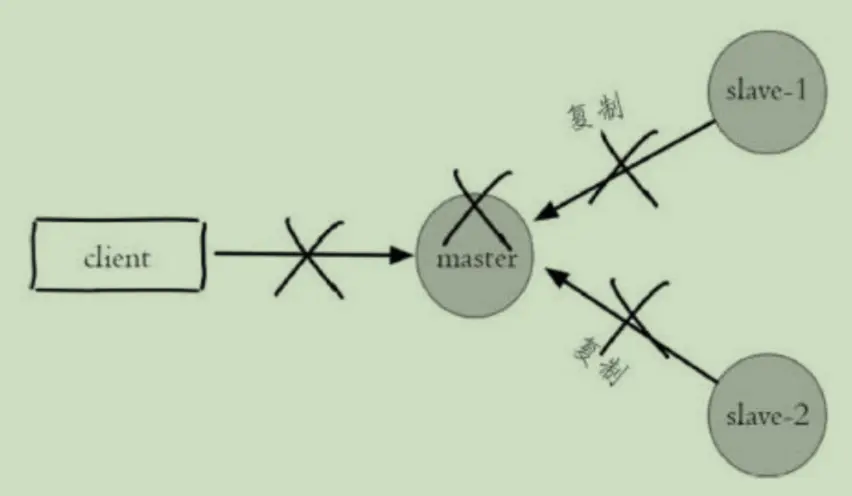
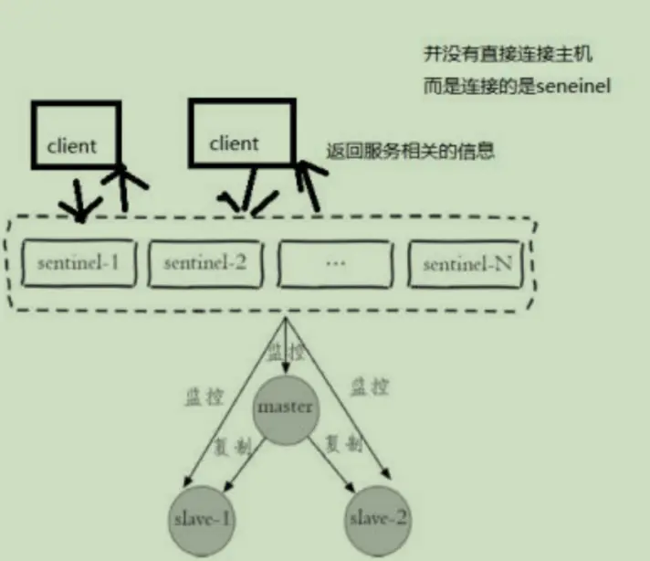
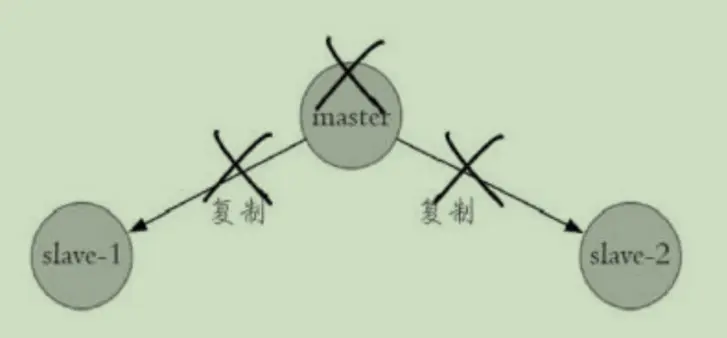
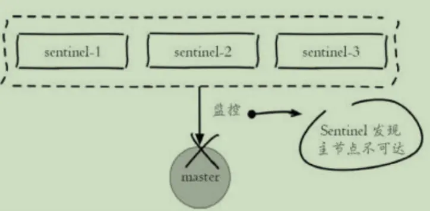
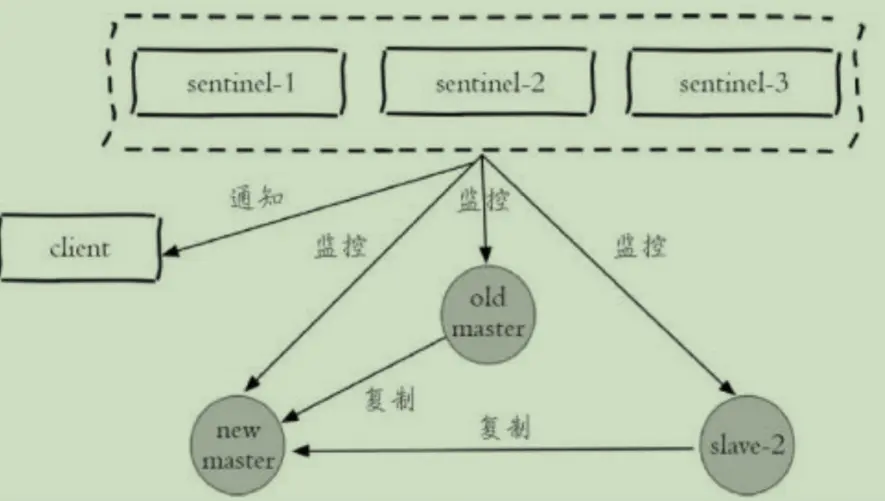
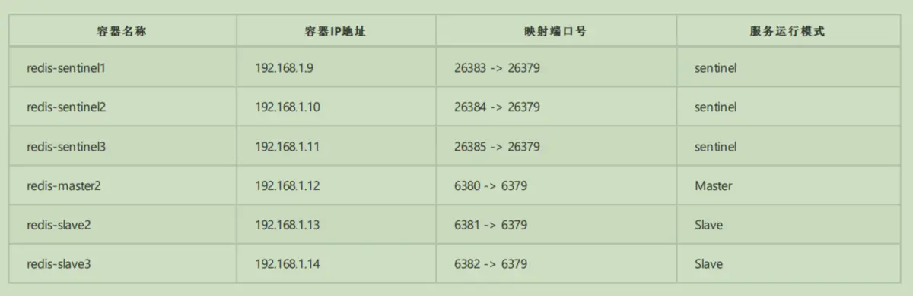
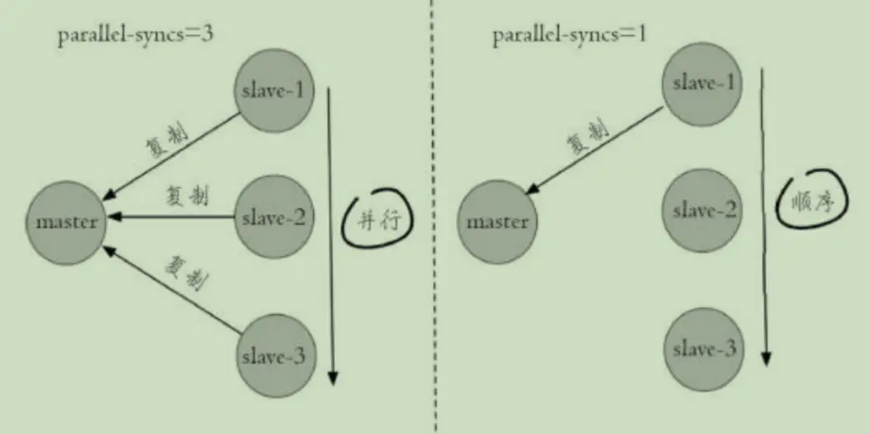

# Redis-哨兵机制

一、主从复制的问题
我们讲了 Redis 复制的主要内容，但 Redis 复制有一个缺点，当主机 Master 宕机以后，我们需要人工解决切换，比如使用 `slaveof no one` 。实际上主从复制 并没有实现高可用。
高可用侧重备份机器， 利用集群中系统的冗余，当系统中某台机器发生损坏的时候，其他后备的机器可以迅速的接替它来启动服务
如下图所示：




一旦主节点宕机，写服务无法使用，就需要手动去切换，重新选取主节点，手动设置主从关系。


## 那么如何解决呢？

如果我们有一个监控程序能够监控各个机器的状态及时作出调整，将手动的操作变成自动的。 Sentinel 的出现就是为了解决这个问题

# 二、哨兵机制的原理实现

- `Redis Sentinel` 一个分布式架构，其中包含若干个 Sentinel 节点和 Redis 数据节点，每个 Sentinel 节点会对数据节点和其余 Sentinel 节点进行监 控，当它发现节点不可达时，会对节点做下线标识。

- 如果被标识的是主节点，它还会和其他 Sentinel 节点进行“协商”，当大多数 Sentinel 节点都认为主节点不可达时，它们会选举出一个 Sentinel 节点来完成自动故障转移的工作，同时会将这个变化实时通知给 Redis 应用方。整个过程完全是自动的，不需要人工来介入，所以这套方案很有效地解决了 Redis 的高可用问题。
  如下图所示：

  

  基本的故障转移流程：

1. 主节点出现故障，此时两个从节点与主节点失去连接，主从复制失败。

   

2. 每个 Sentinel 节点通过定期监控发现主节点出现了故障

   

3. 多个 Sentinel 节点对主节点的故障达成一致会选举出其中一个节点作为领导者负责故障转移。

   

4. Sentinel 领导者节点执行了故障转移，整个过程基本是跟我们手动调整一致的，只不过是自动化完成的。

5. 故障转移后整个 Redis Sentinel 的结构,重新选举了新的主节点

### Redis Sentinel 具有以下几个功能：

- 监控：Sentinel 节点会定期检测 Redis 数据节点、其余 Sentinel 节点是否可达
- 通知：Sentinel 节点会将故障转移的结果通知给应用方
- 主节点故障转移：实现从节点晋升为主节点并维护后续正确的主从关系
- 配置提供者：在 Redis Sentinel 结构中，客户端在初始化的时候连接的是 Sentinel 节点集合 ，从中获取主节点信息。

##### 同时Redis Sentinel 包含了若个 Sentinel 节点，这样做也带来了两个好处：

- 对于节点的故障判断是由多个 Sentinel 节点共同完成，这样可以有效地防止误判。

- Sentinel 节点集合是由若干个 Sentinel 节点组成的，这样即使个别 Sentinel 节点不可用，整个 Sentinel 节点集合依然是健壮的。
  但是 Sentinel 节点本身就是独立的 Redis 节点，只不过它们有一些特殊，它们不存储数据， 只支持部分命令。

  

- 通过`docker-compose`构建好哨兵跟主从的环境

### Sentinel的核心配置

- `sentinel monitor mymaster 127.0.0.1 7000 2`
  监控的主节点的名字、IP 和端口，最后一个2的意思是有几台 Sentinel 发现有问题，就会发生故障转移，例如 配置为2，代表至少有2个 Sentinel 节点认为主节点 不可达，那么这个不可达的判定才是客观的。对于设置的越小，那么达到下线的条件越宽松，反之越严格。一般建议将其设置为 Sentinel 节点的一半加1(注意：最后的参数不得大于conut(sentinel）)

- `sentinel down-after-millseconds mymaster 30000`
  这个是超时的时间（单位为毫秒）。打个比方，当你去 ping 一个机器的时候，多长时间后仍 ping 不通，那么就认为它是有问题

- ```
  sentinel parallel-syncs mymaster 1
  ```

  当 Sentinel 节点集合对主节点故障判定达成一致时， Sentinel 领导者节点会做故障转移操作，选出新的主节点，原来的从节点会向新的主节点发起复制操 作， parallel-syncs 就是用来限制在一次故障转移之后，每次向新的主节点发起复制操作的从节点个数，指出 Sentinel 属于并发还是串行。1代表每次只能 复制一个，可以减轻 Master 的压力；

  

- `sentinel auth-pass <master-name> <password>`
  如果 Sentinel 监控的主节点配置了密码，sentinel auth-pass 配置通过添加主节点的密码，防止 Sentinel 节点对主节点无法监控。

- `sentinel failover-timeout mymaster 180000`
  表示故障转移的时间。

### Sentinel命令

#### sentinel支持的合法命令如下：

1. SENTINEL masters 显示被监控的所有master以及它们的状态.
2. SENTINEL master <master name> 显示指定master的信息和状态；
3. SENTINEL slaves <master name> 显示指定master的所有slave以及它们的状态； 4. SENTINEL get-master-addr-by-name <master name> 返回指定master的ip和端口， 如果正在进行failover或者failover已经完成，将会显示被提升为master的slave的ip和端口。
4. SENTINEL failover <master name> 强制sentinel执行failover，并且不需要得到其他sentinel的同意。 但是failover后会将最新的配置发送给其他sentinel。
   修改配置：
   `sentinel monitor test 127.0.0.1 6379 2` 添加新的监听
   `SENTINEL REMOVE test` 放弃对某个master监听
   `SENTINEL set failover-timeout mymaster 180000` 设置配置选项

##### 应用端调用

Master可能会因为某些情况宕机了，如果在客户端是固定一个地址去访问，肯定是不合理的，所以客户端请求是请求哨兵，从哨兵获取主机地址的信息，或者是 从机的信息。可以实现一个例子

1. 随机选择一个哨兵连接，获取主机、从机信息
2. 模拟客户端定时访问，实现简单轮训效果，轮训从节点
3. 连接失败重试访问

##### Sentinel 实现原理

讲完了 Sentinel 的代码实现，很多人对 Sentinel 还不懂其原理。那么接下来我们就来看下 Sentinel 的实现原理，主要分为以下三个步骤。

1. 检测问题，主要讲的是三个定时任务，这三个内部的执行任务可以保证出现问题马上让 Sentinel 知道。
2. 发现问题，主要讲的是主观下线和客观下线。当有一台 Sentinel 机器发现问题时，它就会主观对它主观下线。 但是当多个 Sentinel 都发现有问题的时候，才会出现客观下线。
3. 找到解决问题的人，主要讲的是领导者选举，如何在 Sentinel 内部多台节点做领导者选举，选出一个领导者。
4. 解决问题，主要讲的是故障转移，即如何进行故障转移。

##### 三个定时任务

首先要讲的是内部 S`entinel 会执行以下三个定时任务。

- 每10秒每个 Sentinel 对 Master 和 Slave 执行一次 Info Replication 。
- 每2秒每个 Sentinel 通过 Master 节点的 channel 交换信息（pub/sub）。
- 每1秒每个 Sentinel 对其他 Sentinel 和 Redis 执行 ping 。

第一个定时任务，指的是 Redis Sentinel 可以对 Redis 节点做失败判断和故障转移，在 Redis 内部有三个定时任务作为基础，来 Info Replication 发现 Slave 节点，这个命令可以确定主从关系。
第二个定时任务，类似于发布订阅， Sentinel 会对主从关系进行判定，通过 *sentinel*:hello 频道交互。了解主从关系可以帮助更好的自动化操作 Redis 。然后 Sentinel 会告知系统消息给其它 Sentinel 节点，最终达到共识，同时 Sentinel 节点能够互相感知到对方。 第三个定时任务，指的是对每个节点和其它 Sentinel 进行心跳检测，它是失败判定的依据。

##### 主观下线和客观下线

我们先来回顾一下 Sentinel 的配置。
`sentinel monitor mymaster 127.0.0.1 6379 2`
`sentinel down-after-milliseconds mymaster 30000`

#### 那么什么是主观下线呢？

每个 Sentinel 节点对 Redis 节点失败的“偏见”。之所以是偏见，只是因为某一台机器30秒内没有得到回复。

#### 那么如何做到客观下线呢？

这个时候需要所有 Sentinel 节点都发现它30秒内无回复，才会达到共识。

#### 领导者选举方式

- 每个做主观下线的sentinel节点，会向其他的sentinel节点发送命令，要求将它设置成为领导者
- 收到命令sentinel节点，如果没有同意通过其它节点发送的命令，那么就会同意请求，否则就会拒绝
- 如果sentinel节点发现自己票数超过半数，同时也超过了 `sentinel monitor mymaster 127.0.0.1 6379 2` 超过2个的时候，就会成为领导者
- 进行故障转移操作

#### 如何选择“合适的”Slave 节点

Redis 内部其实是有一个优先级配置的，在配置文件中 `slave-priority`，这个参数是 Salve 节点的优先级配置，如果存在则返回，如果不存在则继续。 当上面这个优先级不满足的时候， Redis 还会选择复制偏移量最大的 Slave节点，如果存在则返回，如果不存在则继续。之所以选择偏移量最大，这是因为偏移 量越小，和 Master 的数据越不接近，现在 Master 挂掉了，说明这个偏移量小的机器数据也可能存在问题，这就是为什么要选偏移量最大的 Slave 的原因。 如果发现偏移量都一样，这个时候 Redis 会默认选择 runid 最小的节点。

#### 生产环境中部署技巧

1. Sentinel 节点不应该部署在一台物理“机器”上。
   这里特意强调物理机是因为一台物理机做成了若干虚拟机或者现今比较流行的容器，它们虽然有不同的 ** IP ** 地址，但实际上它们都是同一台物理机，同 一台物理机意味着如果这台机器有什么硬件故障，所有的虚拟机都会受到影响，为了实现 Sentinel 节点集合真正的高可用，请勿将 ** Sentinel **节点部署在 同一台物理机器上。
2. 部署至少三个且奇数个的 Sentinel 节点。
3. 通过增加 Sentinel 节点的个数提高对于故障判定的准确性，因为领导者选举需要至少一半加1个节点。 奇数个节点可以在满足该条件的基础上节省一个节点。

#### 哨兵常见问题

哨兵集群在发现 master node 挂掉后会进行故障转移，也就是启动其中一个 slave node 为 master node 。在这过程中，可能会导致数据丢失的情况。

1. 异步复制导致数据丢失
   因为master->slave的复制是异步，所以可能有部分还没来得及复制到slave就宕机了，此时这些部分数据就丢失了。
2. 集群脑裂导致数据丢失
   脑裂，也就是说，某个master所在机器突然脱离了正常的网络，跟其它slave机器不能连接，但是实际上master还运行着。
   造成的问题：

- 此时哨兵可能就会认为master宕机了，然后开始选举，将其它 slave 切换成 master 。这时候集群里就会有2个 master ，也就是所谓的脑裂。 此时虽然某个 slave 被切换成了 master ，但是可能client还没来得及切换成新的 master ，还继续写向旧的 master 的数据可能就丢失了。 因此旧master再次恢复的时候，会被作为一个 slave 挂到新的 master 上去，自己的数据会被清空，重新从新的 master 复制数据。 怎么解决？
  `min-slaves-to-write 1`
  `min-slaves-max-lag 10`
  要求至少有1个slave，数据复制和同步的延迟不能超过10秒 如果说一旦所有slave，数据复制和同步的延迟都超过了10秒钟，那么这个时候，master就不会再接收任何请求了,上面两个配置可以减少异步复制和脑裂导致的数据丢失。

##### 1、异步复制导致的数据丢失

在异步复制的过程当中，通过 min-slaves-max-lag 这个配置，就可以确保的说，一旦 slave 复制数据和 ack 延迟时间太长，就认为可能 master 宕机 后损失的数据太多了，那么就拒绝写请求，这样就可以把master宕机时由于部分数据未同步到 slave 导致的数据丢失降低到可控范围内

##### 2、集群脑裂导致的数据丢失

集群脑裂因为 client 还没来得及切换成新的 master ，还继续写向旧的 master 的数据可能就丢失了通过 min-slaves-to-write 确保必须是有多少个从 节点连接，并且延迟时间小于 min-slaves-max-lag 多少秒。

###### 当然对于客户端需要怎么做呢？

对于 client 来讲，就需要做些处理，比如先将数据缓存到内存当中，然后过一段时间处理，或者连接失败，接收到错误切换新的 master 处理。

# redis日志参数说明

以下列出的是客户端可以通过订阅来获得的频道和信息的格式： 第一个英文单词是频道/事件的名字， 其余的是数据的格式。 注意， 当格式中包含 instance details 字样时， 表示频道所返回的信息中包含了以下用于识别目标实例的内容：
`<instance-type> <name> <ip> <port> @ <master-name> <master-ip> <master-port>`

- @ 字符之后的内容用于指定主服务器， 这些内容是可选的， 它们仅在 @ 字符之前的内容指定的实例不是主服务器时使用。
- +reset-master <instance details>：主服务器已被重置。
- +slave <instance details>：一个新的从服务器已经被 Sentinel 识别并关联。
- +failover-state-reconf-slaves <instance details>：故障转移状态切换到了 reconf-slaves 状态。
- +failover-detected <instance details>：另一个 Sentinel 开始了一次故障转移操作，或者一个从服务器转换成了主服务器。
- +slave-reconf-sent <instance details>：领头（leader）的 Sentinel 向实例发送了 SLAVEOF 命令，为实例设置新的主服务器。
- +slave-reconf-inprog <instance details>：实例正在将自己设置为指定主服务器的从服务器，但相应的同步过程仍未完成。
- +slave-reconf-done <instance details>：从服务器已经成功完成对新主服务器的同步。
- -dup-sentinel <instance details>：对给定主服务器进行监视的一个或多个 Sentinel 已经因为重复出现而被移除 —— 当 Sentinel 实例重启的时 候，就会出现这种情况。
- +sentinel <instance details>：一个监视给定主服务器的新 Sentinel 已经被识别并添加。
- +sdown <instance details>：给定的实例现在处于主观下线状态。
- -sdown <instance details>：给定的实例已经不再处于主观下线状态。
- +odown <instance details>：给定的实例现在处于客观下线状态。
- -odown <instance details>：给定的实例已经不再处于客观下线状态。
- +new-epoch <instance details>：当前的纪元（epoch）已经被更新。
- +try-failover <instance details>：一个新的故障迁移操作正在执行中，等待被大多数 Sentinel 选中（waiting to be elected by the majority）。
- +elected-leader <instance details>：赢得指定纪元的选举，可以进行故障迁移操作了。
- +failover-state-select-slave <instance details>：故障转移操作现在处于 select-slave 状态 —— Sentinel 正在寻找可以升级为主服务器的从 服务器。
- no-good-slave <instance details>：Sentinel 操作未能找到适合进行升级的从服务器。Sentinel 会在一段时间之后再次尝试寻找合适的从服务器 来进行升级，又或者直接放弃执行故障转移操作。
- selected-slave <instance details>：Sentinel 顺利找到适合进行升级的从服务器。
- failover-state-send-slaveof-noone <instance details>：Sentinel 正在将指定的从服务器升级为主服务器，等待升级功能完成。
- failover-end-for-timeout <instance details>：故障转移因为超时而中止，不过最终所有从服务器都会开始复制新的主服务器（slaves will eventually be configured to replicate with the new master anyway）。
- failover-end <instance details>：故障转移操作顺利完成。所有从服务器都开始复制新的主服务器了。
- +switch-master <master name> <oldip> <oldport> <newip> <newport>：配置变更，主服务器的 IP 和地址已经改变。 这是绝大多数外部用户都关 心的信息。