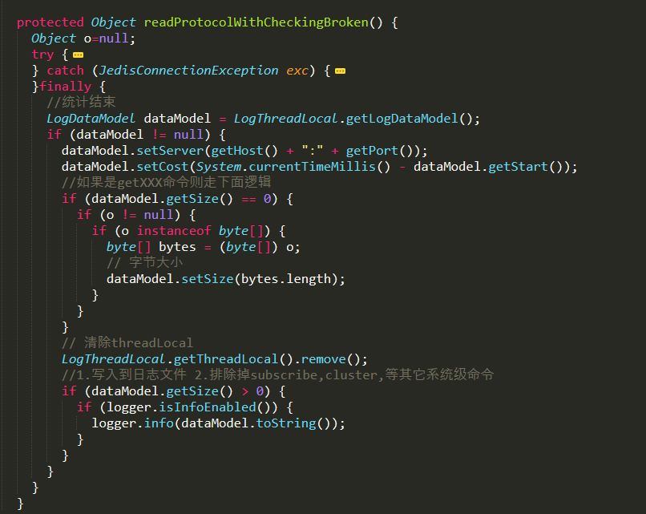

**序言**

 

图示：Redis热度排名

 

Redis当下很流行，也很好用，无论是在业务应用系统，还是在大数据领域都有重要的地位；但Redis也很脆弱，用不好，问题多多。2012年以前都是以memcached为主，之后转到Redis阵营，经历过单实例模式、主从模式、哨兵模式、代理模式，集群模式，真正公司层面用得好的很少，对于Redis掌控都很片面，导致实际项目中问题不少。

 

Redis要想用得好，需要整体掌握3个层面：

 

- 开发层面
- 架构层面
- 运维层面

 

其中架构与运维至关重要，多数中小型企业仅在开发层面满足常用功能，数据规模稍微大些，业务复杂度高些，就容易出现各种架构与运维问题。本文主旨是探讨Redis监控体系，目前业界当然也有很多成熟的产品，但个人觉得都很常规，只做到一些粗粒度的监控， 没有依据业务需求特点因地制宜去细化，从而反向的提供架构开发优化方案。

 

本文内容将围绕如下几个问题展开讨论：

 

- Redis监控体系有哪些方面？
- 构建Redis监控体系我们做了哪些工作？
- Redis监控体系应该细化到什么程度？
- 为什么使用ELK构建监控体系？

 

**需求背景**

 

项目描述

 

 

 

公司业务范围属于车联网行业，有上百万级的真实车主用户，业务项目围绕车主生活服务展开，为了提高系统性能，引入了Redis作为缓存中间件，具体描述如下：

 

- 部署架构采用Redis-Cluster模式；
- 后台应用系统有几十个，应用实例数超过二百个；
- 所有应用系统共用一套缓存集群；
- 集群节点数几十个，加上容灾备用环境，节点数量翻倍；
- 集群节点内存配置较高。

 

图示：Redis集群架构与应用架构示意图

 

问题描述

 

 

 

系统刚开始关于Redis的一切都很正常，随着应用系统接入越来越多，应用系统子模块接入也越来越多，开始出现一些问题，应用系统有感知，集群服务端也有感知，如下描述：

 

- 集群节点崩溃；
- 集群节点假死；
- 某些后端应用访问集群响应特别慢。

 

其实问题的根源都是架构运维层面的欠缺，对于Redis集群服务端的运行监控其实很好做，本身也提供了很多直接的命令方式，但只能看到服务端的一些常用指标信息，无法深入分析，治标不治本，对于Redis的内部运行一无所知，特别是对于业务应用如何使用Redis集群一无所知：

 

- Redis集群使用的热度问题？
- 哪些应用占用的Redis内存资源多？
- 哪些应用占用Redis访问数最高？
- 哪些应用使用Redis类型不合理？
- 应用系统模块使用Redis资源分布怎么样？
- 应用使用Redis集群的热点问题？

 

**监控体系**

 

监控的目的不仅仅是监控Redis本身，而是为了更好的使用Redis。传统的监控一般比较单一化，没有系统化，但对于Redis来说，个人认为至少包括：一是服务端，二是应用端，三是服务端与应用端联合分析。

 

**服务端：**

 

- 服务端首先是操作系统层面，常用的CPU、内存、网络IO，磁盘IO，服务端运行的进程信息等；
- Redis运行进程信息，包括服务端运行信息、客户端连接数、内存消耗、持久化信息 、键值数量、主从同步、命令统计、集群信息等；
- Redis运行日志，日志中会记录一些重要的操作进程，如运行持久化时，可以有效帮助分析崩溃假死的程序。

 

**应用端：**

 

应用端、获取应用端使用Redis的一些行为，具体哪些应用哪些模块最占用 Redis资源、哪些应用哪些模块最消耗Redis资源、哪些应用哪些模块用法有误等。

 

**联合分析：**

 

联合分析结合服务端的运行与应用端使用的行为，如：一些造成服务端突然阻塞的原因，可能是应用端设置了一个很大的缓存键值，或者使用的键值列表，数据量超大造成阻塞。

 

**解决方案**

 

为什么会选择Elastic-Stack技术栈呢？

 

多数的第三方只监控一些指标，对于明细日志还是采用ELK（Elasticsearch、Logstash、Kibana），也就是说用第三方监控指标之后，还得再搭建一个ELK集群看明细日志。

 

再就是说Elastic-Stack技术栈整合的优势，指标也可以、日志文件也可以，从采集开始到存储、到最终报表面板都整合得非常好，门槛很低。

 

下面详细聊聊我们具体怎么做的，做了哪些工作？

 

服务端系统

 

 

 

Elastic-Stack家族有Metricbeat产品，支持系统层面的信息收集，简单的配置下Elastic集群地址和系统指标模块即可上线，并且会在Kibana中创建已有的系统监控面板，非常简单快速，一般运维就可以搞定。

 

图示：metrcibeat示意图

 

系统指标信息收集配置样例如下：

 

 

服务端集群

 

 

 

收集Redis集群运行信息，业界通常做法都是采用Redis提供的info命令，定期收集。

 

info获取的信息包括如下：

 

- server：Redis服务器的一般信息
- clients：客户端的连接部分
- memory：内存消耗相关信息
- persistence：RDB和AOF相关信息
- stats：一般统计
- replication：主/从复制信息
- cpu：统计CPU的消耗command
- stats：Redis命令
- 统计cluster：Redis集群信息
- keyspace：数据库的相关统计

 

Elastic-Stack家族的Metricbeat产品也支持Redis模块，也是采用info命令获取的，但是有一些实现的局限性，如下描述：

 

- Redis集群的主从关系信息，Metricbeats表达不出来；
- Redis集群的一些统计信息，永远是累计增加的，如命令数，如果要获取命令数的波峰值，则无法得到；
- Redis集群状态信息变化，Metricbeats是无法动态的，如集群新增节点、下线节点等。

 

所以这里参考了CacheCloud产品（搜狐团队开源），我们自定义设计开发了 Agent，定时从Redis集群采集信息，并在内部做一些统计数值的简单计算，转换成Json，写入到本地文件，通过Logstash采集发送到Elasticsearch。

 

图示：Redis服务端运行信息采集架构示意图

 

服务端日志

 

 

 

Redis服务端运行日志采集很简单，直接通过Elastic-Stack家族的Filebeat产品，其中有Redis模块，配置一下Elastic服务端，日志文件地址即可。

 

图示：服务端日志采集过程

 

Redis运行日志采集配置：

 

 

应用端

 

 

 

应用端信息采集是整个Redis监控体系最重要的部分，也是实现最麻烦、链路最长的。首先是修改jedis（技术栈Java）源码，增加埋点代码，重新编译并引用到应用项目中，应用端对于Redis集群的任何命令操作，都会被捕捉，并记录下关键信息，之后写入到本地文件。

 

图示：Redis应用端行为采集架构图

 

应用端采集的数据格式如下：

 

图示：应用端采集的数据案例

 

**jedis修改：**

 

jedis改造记录的信息如下：

 

- r_host：访问Redis集群的服务器地址与端口，其中某一台ip:port；
- r_cmd：执行命令类型、如get、set、hget、hset等各种；
- r_start：执行命令开始时间；
- r_cost：时间消耗；
- r_size：获取键值大小或者设置键值大小；
- r_key：获取键值名称；
- r_keys：键值的二级拆分，数组的长度不限制。这里有必要强调一下，所有应用系统共用的是一套集群，所以应用系统的键值都是有规范的，按照特殊符号分割，如："应用名称_系统模块_动态变量_xxx“，主要便于我们区分。

 

在jedis改造有几处地方，如下：

 

- 类Connection.java文件，统计开始，记录命令执行开始时间；统计结束，记录命令结束时间、时间消耗等，并写入到日志流中；
- 类JedisClusterCommand文件，获取键的地方key，方便之后分析应用键的行为。

 

在类Connection.java文件中有2处：

 

图示：类Connection.java文件埋点代码的地方

 

图示：类Connection.java文件埋点代码的地方

 

类JedisClusterCommand文件埋点代码.java文件中有1处：

 

图示：类JedisClusterCommand文件埋点代码

 

**logback修改：**

 

应用端都会使用logback写入日志文件，同时为了更加精准，应用端写入日志时还需要获取应用端的一些信息，如下：

 

- app_ip：应用端部署在服务器上的IP地址；
- app_host：应用端部署在服务器上的服务器名称。

 

自定义一个Layout，自动获取应用端的IP地址与服务器名称：

 

图示：自定义Logback的Layout

 

**app配置：**

 

app配置属于最后收尾工作，主要是输出埋点的日志数据，配置日志logback.xml文件即可：

 

图示：配置应用端日志文件logback.xml

 

**日志采集：**

 

应用端日志采集采用Logstash，配置日志目录，指向Elastic集群，这样整体的监控日志采集部分就结束了。

 

日志分析

 

 

 

Redis服务端的日志分析比较简单，常规的一些指标而已，创建好关键的图表，容易看出问题。重点讨论应用端的日志分析。

 

图示：应用端使用Redis一些行为图表

 

ELK监控体系上线之后，我们连续观察分析两周，获得了一些监控成果，如：

 

- 应用端部分键值太大，居然超过1MB，这种键值访问一次消耗时间很大，会严重造成阻塞；
- 部分应用居然使用Redis当成数据库使用；
- 有将List类型当成消息队列使用，一次存取几十万的数据；
- 某些应用对于集群的操作频次特别高，几乎占用了一半以上；
- 还有很多，就不一一描述了。

 

后续方案

 

 

 

监控体系相当于架构师的眼睛，有了这个，Redis方面的优化改造方案就很好制定了：

 

- 应用端、误用的使用全部要改掉；
- 服务端，按照应用的数据，进行一些拆分，拆分出一些专用的集群，特定为一些应用使用或者场景；
- 开发者，后续有新业务模块需要接入Redis需要告知架构师们评审。

 

**结语**

 

监控体系项目前后经历过几个月，服务端部分短期内就完成的，应用端是随着应用发布逐步完成的。上线完成之后又经历几周的跟踪分析，才确定下来整体的优化方案。

 

监控体系本身并不是为了监控，而是发现问题、预见问题，最终提前解决问题，监控做得好，下班下得早。

 

Redis集群是个好东西，完全掌握还是需要很长的时间，特别是架构、运维层面，如果没有，请做好监控。

 

 

**> > > >**

 

**Q&A**

 

**Q1：请问单台机器一般部署几个Redis实例呢？**

 

**A：**依据服务器资源设置：

1、CPU核数，Redis是单线程工作模型，实际运行并非进程只有一个线程，这个要搞清楚；

2、内存，一个Redis进程配置部分内存，需要至少对等的内存闲置，fork子进程使用， 所以配置多实例要简单计算下；

3、网络，网络IO超过网卡限制，会出问题。

 

**Q2：直播中讲到的大key，hash要改成什么？分片吗？**

 

**A：**1、比如，一个车子的基本信息，包括很多区块部分，用hash确实非常好理解，但是过期之后整个hash都删除了，其实很多信息是固定的，不用定时过期的；2、拆分成小的string更合适。

 

**Q3：在客户端打印key和value，如果是bigkey的话，qps有个1000，打印日志就占用很高的机器负载了吧？**

 

**A：**1、打印的key，不包括value值内容，只有key以及value的大小；2、logback这些框架其实支持的性能相当不错的，可以配置成异步的方式，如果还不够，可以直接输出到Kafka队列等。

 

**Q4：请问ES怎么部署MongoDB慢查询报表平台呢？**

 

**A：**1、没有深度使用过MongoDB；2、基于Elastic-Stack做慢查询报表平台思路与Redis一样的，不管什么指标+日志全部都采集到ES完事。

 

**Q5：info all执行频繁，会经常阻塞服务器，怎么平衡它的性能呢？**

 

**A：**1、因为采集的是服务端运行的快照信息，定时采集，可以设定时间间隔大一些，比如5s；2、执行info all，是在 java客户端，可以修改jedis，在其中捕获info命令，采集数据，观察分析一段时间。

 

**Q6：请问应用端jedis要怎么埋点呢？**

 

**A：**1、原有jedis版本基于2.9，在2个类中修改埋点，参考了CacheCloud产品。最新版本的程序最近没有关注，思路一样；2、详细见本文中贴出的代码。

 

**Q7：监控的话，个人觉得放在K8S里面，不是最优方案，您对这个怎么看？**

 

**A：**1、本人未使用过K8S部署产品；2、Redis监控体系，整体服务端，应用端，在Docker中也仅服务端可以，将metrcibeats这些集成在一起，但也有一些服务端监指标计算，需要自己编写Agent来完成，也是可以到Docker中去。应用端的就没有办法了，这个属于前端的行为统计。

 

**Q8：请问您的ES有多少节点？要用ssd盘吗？**

 

**A：**1、标准集群，起步3个实例节点；2、固态硬盘应用看场景，业务系统用用可以，日志系统一般不需要，即使需要也可以做冷热隔离，少量的数据使用ssd，历史的数据全部hdd足矣。

 

**Q9：如果公司缺乏足够的人力物力，是用ES、Prometheus还是Zabbix做监控比较适合呢？能分别说一下它们各自最适用的情况吗？**

 

**A：**1、ES，Elastic-Stack，首选考虑，ES擅长的领域很多，应用系统查询加速、大数据领域、监控领域；2、其它两个产品主要是做指标型的监控，但实际项目中，仅仅指标监控是不够的，需要一个整体型的监控体系，便于联合分析。ES其实很多方面比时序数据库做得更好，腾讯有资深专家做过详细的ES与TSDB对比的测试，性能与功能都完全超过专门的时序数据库。