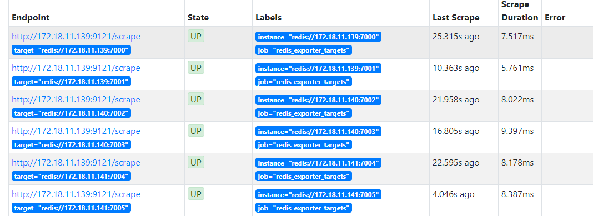
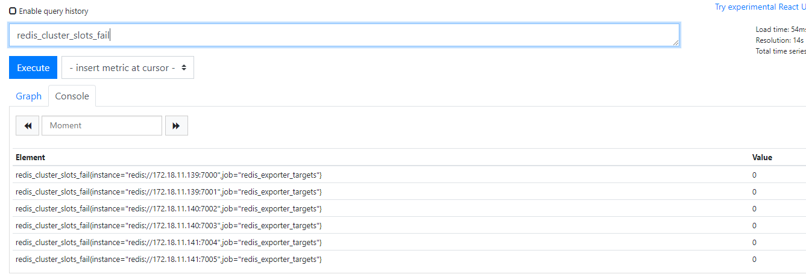
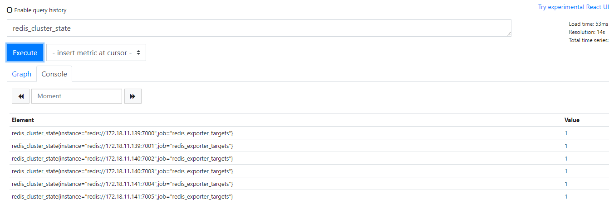

# Prometheus 监控Redis的正确姿势(redis集群)

`Prometheus` 监控 `Redis cluster`，其实套路都是一样的，使用 `exporter`。
`exporter` 负责采集指标，通过 `http` 暴露给 `Prometheus` 拉取。`granafa` 则通过这些指标绘图展示数据。`Prometheus` 收集的数据还会根据你设置的告警规则判断是否要发送给 `Alertmanager`， `Alertmanager` 则要判断是否要发出告警。

`Alertmanager` 告警分为三个阶段

- **Inactive** 触发告警的规则会被发送到这来。
- **Pending** 你设置的等待时间，即规则里面的 for
- **Firing** 发送告警到邮件、钉钉之类的

扯远了，开始监控 `Redis cluster`

#### redis_exporter 监控 Redis cluster

监控什么应用，使用的相应的 `exporter`，可以在官网查到。[EXPORTERS AND INTEGRATIONS
](https://prometheus.io/docs/instrumenting/exporters/)

`Redis` 使用 `redis_exporter` ，链接：[redis_exporter](https://github.com/oliver006/redis_exporter)

支持 Redis 2.x - 5.x

#### 安装及参数

[下载地址](https://github.com/oliver006/redis_exporter/releases)

```bash
wget https://github.com/oliver006/redis_exporter/releases/download/v1.3.5/redis_exporter-v1.3.5.linux-amd64.tar.gz   
tar zxvf redis_exporter-v1.3.5.linux-amd64.tar.gz
cd redis_exporter-v1.3.5.linux-amd64/
./redis_exporter <flags>
```

`redis_exporter` 支持的参数很多，对我们有用的就几个。

```bash
./redis_exporter --help
Usage of ./redis_exporter:
    -redis.addr string
    	Address of the Redis instance to scrape (default "redis://localhost:6379")
    -redis.password string
    	Password of the Redis instance to scrape
    -web.listen-address string
    	Address to listen on for web interface and telemetry. (default ":9121")
```

#### 单实例 redis 监控

```ruby
nohup ./redis_exporter -redis.addr 172.18.11.138:6379 -redis.password xxxxx &
```

`Prometheus` 添加单实例

```yaml
  - job_name: redis_since
    static_configs:
    - targets: ['172.18.11.138:9121']
```

#### Redis 集群监控方案

这个挺费劲的，网上查了很多资料，大都是监控单实例的

我试过的方案：
以下两种都会提示认证失败

```
level=error msg="Redis INFO err: NOAUTH Authentication required."
```

方法一

```ruby
nohup ./redis_exporter -redis.addr 172.18.11.139:7000 172.18.11.139:7001 172.18.11.140:7002 172.18.11.140:7003 172.18.11.141:7004 172.18.11.141:7005 -redis.password xxxxx &
```

方法二

```ruby
nohup ./redis_exporter -redis.addr redis://h:Lcsmy.312==/@172.18.11.139:7000 redis://h:Lcsmy.312==/@172.18.11.139:7001 redis://h:Lcsmy.312==/@172.18.11.140:7002 redis://h:Lcsmy.312==/@172.18.11.140:7003 redis://h:Lcsmy.312==/@172.18.11.141:7004 redis://h:Lcsmy.312==/@172.18.11.141:7005 -redis.password xxxxx &
```

本来想采取最low 的方法，一个实例启一个 `redis_exporter`。这样子的话，集群那里很多语句都用不了，比如 `cluster_slot_fail`。放弃该方法

```bash
nohup ./redis_exporter -redis.addr 172.18.11.139:7000  -redis.password xxxxxx  -web.listen-address 172.18.11.139:9121 > /dev/null 2>&1 &
nohup ./redis_exporter -redis.addr 172.18.11.139:7001  -redis.password xxxxxx  -web.listen-address 172.18.11.139:9122 > /dev/null 2>&1 &
nohup ./redis_exporter -redis.addr 172.18.11.140:7002  -redis.password xxxxxx  -web.listen-address 172.18.11.139:9123 > /dev/null 2>&1 &
nohup ./redis_exporter -redis.addr 172.18.11.140:7003  -redis.password xxxxxx  -web.listen-address 172.18.11.139:9124 > /dev/null 2>&1 &
nohup ./redis_exporter -redis.addr 172.18.11.141:7004  -redis.password xxxxxx  -web.listen-address 172.18.11.139:9125 > /dev/null 2>&1 &
nohup ./redis_exporter -redis.addr 172.18.11.141:7005  -redis.password xxxxxx  -web.listen-address 172.18.11.139:9126 > /dev/null 2>&1 &
```

最后只好去 `github` 提 `issue`。用我的中国式英语和作者交流，终于明白了。。。其实官方文档已经写了。

```yaml
scrape_configs:
  ## config for the multiple Redis targets that the exporter will scrape
  - job_name: 'redis_exporter_targets'
    static_configs:
      - targets:
        - redis://first-redis-host:6379
        - redis://second-redis-host:6379
        - redis://second-redis-host:6380
        - redis://second-redis-host:6381
    metrics_path: /scrape
    relabel_configs:
      - source_labels: [__address__]
        target_label: __param_target
      - source_labels: [__param_target]
        target_label: instance
      - target_label: __address__
        replacement: <<REDIS-EXPORTER-HOSTNAME>>:9121
  
  ## config for scraping the exporter itself
  - job_name: 'redis_exporter'
    static_configs:
      - targets:
        - <<REDIS-EXPORTER-HOSTNAME>>:9121
```

#### Redis 集群实际操作

启动 `redis_exporter`

```
nohup ./redis_exporter -redis.password xxxxx  &
```

**重点**
在 `prometheus` 里面如何配置：

```yaml
  - job_name: 'redis_exporter_targets'
    static_configs:
      - targets:
        - redis://172.18.11.139:7000
        - redis://172.18.11.139:7001
        - redis://172.18.11.140:7002
        - redis://172.18.11.140:7003
        - redis://172.18.11.141:7004
        - redis://172.18.11.141:7005
    metrics_path: /scrape
    relabel_configs:
      - source_labels: [__address__]
        target_label: __param_target
      - source_labels: [__param_target]
        target_label: instance
      - target_label: __address__
        replacement: 172.18.11.139:9121
  ## config for scraping the exporter itself
  - job_name: 'redis_exporter'
    static_configs:
      - targets:
        - 172.18.11.139:9121
```

这样子就能采集到集群的数据了。但是日志里提示

```
time="2019-12-17T09:10:49+08:00" level=error msg="Couldn't connect to redis instance"
```

午休的时候突然想明白了，只要能连接到一个集群的一个节点，自然就能查询其他节点的指标了。于是启动命令改为：

```
nohup ./redis_exporter -redis.addr 172.18.11.141:7005  -redis.password xxxxx &
```

`Prometheus` 配置不变

送上几张图片：






#### 告警规则

```yaml
groups:
- name:  Redis
  rules: 
    - alert: RedisDown
      expr: redis_up  == 0
      for: 5m
      labels:
        severity: error
      annotations:
        summary: "Redis down (instance {{ $labels.instance }})"
        description: "Redis 挂了啊，mmp\n  VALUE = {{ $value }}\n  LABELS: {{ $labels }}"
    - alert: MissingBackup
      expr: time() - redis_rdb_last_save_timestamp_seconds > 60 * 60 * 24
      for: 5m
      labels:
        severity: error
      annotations:
        summary: "Missing backup (instance {{ $labels.instance }})"
        description: "Redis has not been backuped for 24 hours\n  VALUE = {{ $value }}\n  LABELS: {{ $labels }}"       
    - alert: OutOfMemory
      expr: redis_memory_used_bytes / redis_total_system_memory_bytes * 100 > 90
      for: 5m
      labels:
        severity: warning
      annotations:
        summary: "Out of memory (instance {{ $labels.instance }})"
        description: "Redis is running out of memory (> 90%)\n  VALUE = {{ $value }}\n  LABELS: {{ $labels }}"
    - alert: ReplicationBroken
      expr: delta(redis_connected_slaves[1m]) < 0
      for: 5m
      labels:
        severity: error
      annotations:
        summary: "Replication broken (instance {{ $labels.instance }})"
        description: "Redis instance lost a slave\n  VALUE = {{ $value }}\n  LABELS: {{ $labels }}"
    - alert: TooManyConnections
      expr: redis_connected_clients > 1000
      for: 5m
      labels:
        severity: warning
      annotations:
        summary: "Too many connections (instance {{ $labels.instance }})"
        description: "Redis instance has too many connections\n  VALUE = {{ $value }}\n  LABELS: {{ $labels }}"       
    - alert: NotEnoughConnections
      expr: redis_connected_clients < 5
      for: 5m
      labels:
        severity: warning
      annotations:
        summary: "Not enough connections (instance {{ $labels.instance }})"
        description: "Redis instance should have more connections (> 5)\n  VALUE = {{ $value }}\n  LABELS: {{ $labels }}"
    - alert: RejectedConnections
      expr: increase(redis_rejected_connections_total[1m]) > 0
      for: 5m
      labels:
        severity: error
      annotations:
        summary: "Rejected connections (instance {{ $labels.instance }})"
        description: "Some connections to Redis has been rejected\n  VALUE = {{ $value }}\n  LABELS: {{ $labels }}"
```