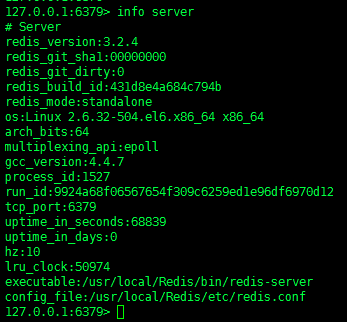
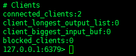
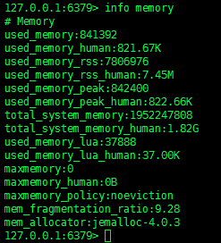
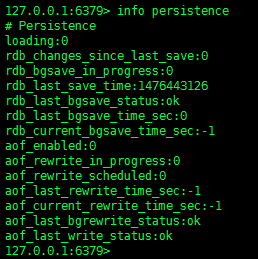
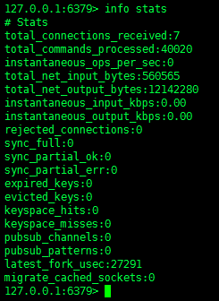
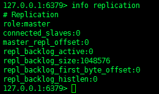
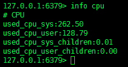
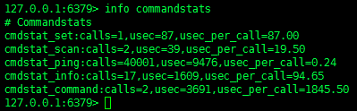
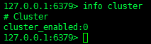
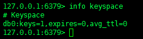

**INFO**命令会返回Redis服务器的状态信息和统计数据，计算机可以很简单地解析这些返回数据，用户也可以轻松地阅读这些返回数据。

可以通过以下的可选参数，选择查看特定分段的服务器信息：

- `server`：Redis服务器相关的通用信息
- `clients`：客户端连接的相关信息
- `memory`：内存消耗的相关信息
- `persistence`：RDB（Redis DataBase）和AOF（Append-Only File）的相关信息
- `stats`：通用统计数据
- `replication`：主/从复制的相关信息
- `cpu`：CPU消耗的统计数据
- `commandstats`：Redis命令的统计数据
- `cluster`：Redis集群的相关信息
- `keyspace`：数据库相关的统计数据


**INFO**命令还可以使用以下参数：

- `all`：返回所有的服务器信息
- `default`：只返回默认的信息集合

当不提供任何参数时，默认会使用`default`选项。

### 返回值

返回值为批量字符串，它是多条文本行的集合。

文本行可能包含一个分段名称（以一个`#`字符开始）或者一个属性。所有的属性都是`field:value`的格式，以`\r\n`结尾。**INFO**命令的返回值如下所示：

```
# Serverredis_version:3.2.4redis_git_sha1:00000000redis_git_dirty:0redis_build_id:431d8e4a684c794bredis_mode:standaloneos:Linux 2.6.32-504.el6.x86_64 x86_64arch_bits:64multiplexing_api:epollgcc_version:4.4.7process_id:1527run_id:9924a68f06567654f309c6259ed1e96df6970d12tcp_port:6379uptime_in_seconds:65994uptime_in_days:0hz:10lru_clock:48129executable:/usr/local/Redis/bin/redis-serverconfig_file:/usr/local/Redis/etc/redis.conf# Clientsconnected_clients:2client_longest_output_list:0client_biggest_input_buf:0blocked_clients:0# Memoryused_memory:842368used_memory_human:822.62Kused_memory_rss:7806976used_memory_rss_human:7.45Mused_memory_peak:842368used_memory_peak_human:822.62Ktotal_system_memory:1952247808total_system_memory_human:1.82Gused_memory_lua:37888used_memory_lua_human:37.00Kmaxmemory:0maxmemory_human:0Bmaxmemory_policy:noevictionmem_fragmentation_ratio:9.27mem_allocator:jemalloc-4.0.3# Persistenceloading:0rdb_changes_since_last_save:0rdb_bgsave_in_progress:0rdb_last_save_time:1476443126rdb_last_bgsave_status:okrdb_last_bgsave_time_sec:0rdb_current_bgsave_time_sec:-1aof_enabled:0aof_rewrite_in_progress:0aof_rewrite_scheduled:0aof_last_rewrite_time_sec:-1aof_current_rewrite_time_sec:-1aof_last_bgrewrite_status:okaof_last_write_status:ok# Statstotal_connections_received:6total_commands_processed:40011instantaneous_ops_per_sec:0total_net_input_bytes:560332total_net_output_bytes:6213500instantaneous_input_kbps:0.00instantaneous_output_kbps:0.00rejected_connections:0sync_full:0sync_partial_ok:0sync_partial_err:0expired_keys:0evicted_keys:0keyspace_hits:0keyspace_misses:0pubsub_channels:0pubsub_patterns:0latest_fork_usec:27291migrate_cached_sockets:0# Replicationrole:masterconnected_slaves:0master_repl_offset:0repl_backlog_active:0repl_backlog_size:1048576repl_backlog_first_byte_offset:0repl_backlog_histlen:0# CPUused_cpu_sys:100.86used_cpu_user:49.34used_cpu_sys_children:0.01used_cpu_user_children:0.00# Clustercluster_enabled:0# Keyspacedb0:keys=1,expires=0,avg_ttl=0
```

### 注意

请注意，根据Redis的不同版本，**INFO**命令可能会在返回值中添加或删除某些字段。因此，一个健壮的客户端应用程序应当在解析这个命令的返回值时，跳过未知的属性，并且能够正常处理缺失的字段。

Redis 2.4版本或更高版本的字段描述如下所示：

#### 1. `server`分段的字段含义

[](http://ghoulich.xninja.org/wp-content/uploads/sites/2/2016/10/image-01_info-server.png)

`server`分段中的所有字段的含义如下所示：

- `redis_version`：Redis服务器的版本号。
- `redis_git_sha1`：Git SHA1。
- `redis_git_dirty`：GIT脏数据标志。
- `os`：Redis服务器使用的操作系统。
- `arch_bits`：服务器架构（32位或64位）。
- `multiplexing_api`：Redis使用的事件循环机制。
- `gcc_version`：用来编译这个Redis服务器的GCC编译器的版本。
- `process_id`：Redis服务器进程的进程号（PID）。
- `run_id`：用于标识Redis服务器的随机值（Redis的哨兵模式和集群模式会使用这个随机值）。
- `tcp_port`：TCP/IP的监听端口。
- `uptime_in_seconds`：Redis服务器启动至今的时间，以秒为单位。
- `uptime_in_days`：Redis服务器启动至今的时间，以天为单位。
- `lru_clock`：每分钟都会递增的时钟，用于LRU（Least Recently Used，最近最少使用）缓存管理。
- `executable`：Redis服务器的可执行文件的路径。
- `config_file`：Redis服务器的配置文件的路径。

#### 2. `clients`分段的字段含义

[](http://ghoulich.xninja.org/wp-content/uploads/sites/2/2016/10/image-02_info-clients.png)

`clients`分段中的所有字段的含义如下所示：

- `connected_clients`：客户端连接的数量（来自从机的连接除外）。
- `client_longest_output_list`：当前的客户端连接之中，最长的输出列表。
- `client_biggest_input_buf`：当前的客户端连接之中，最大的输入缓冲区。
- `blocked_clients`：由于阻塞调用（**BLPOP**、**BRPOP**、**BRPOPLPUSH**）而等待的客户端的数量。

#### 3. `memory`分段的字段含义

[](http://ghoulich.xninja.org/wp-content/uploads/sites/2/2016/10/image-03_info-memory.png)

`memory`分段中的所有字段的含义如下所示：

- `used_memory`：Redis使用它的内存分配器（可以是标准的**libc**、**jemalloc**或**tcmalloc**分配器）分配的内存总量，以字节为单位。
- `used_memory_human`：Redis使用它的内存分配器分配的内存总量，显示为用户易于阅读的格式。
- `used_memory_rss`：操作系统所看到的为Redis分配的内存总量（也被称为“驻留集大小（Resident Set Size）”）。这个内存总量是由诸如`top(1)`和`ps(1)`之类的工具报告的。
- `used_memory_rss_human`：操作系统所看到的为Redis分配的内存总量，显示为用户易于阅读的格式。
- `used_memory_peak`：Redis消耗的内存峰值，以字节为单位。
- `used_memory_peak_human`：Redis消耗的内存峰值，显示为用户易于阅读的格式。
- `total_system_memory`：系统内存总量，以字节为单位。
- `total_system_memory_human`：系统内存总量，显示为用户易于阅读的格式。
- `used_memory_lua`：Lua脚本引擎使用的内存总量，以字节为单位。
- `used_memory_lua_human`：Lua脚本引擎使用的内存总量，显示为用户易于阅读的格式。
- `maxmemory`：Redis能够使用的最大内存上限（0表示没有限制），以字节为单位。
- `maxmemory_human`：Redis能够使用的最大内存上限，显示为用户易于阅读的格式。
- `maxmemory_policy`：Redis使用的内存回收策略，可以是`noeviction`、`allkeys-lru`、`volatile-lru`、`allkeys-random`、`volatile-random`或`volatile-ttl`。
- `mem_fragmentation_ratio`：`used_memory_rss`和`used_memory`之间的比率。
- `mem_allocator`：Redis使用的内存分配器，在编译时选择指定。

在理想情况下，`used_memory_rss`的值只应当比`used_memory`的值稍微高一点。当常驻集内存（rss）远大于已使用内存（used）时，这就意味着Redis服务器存在较多的内存碎片（内部的或外部的），这种情况可以通过检查`mem_fragmentation_ratio`的值估计出来。当已使用内存（used）远大于常驻集内存（rss）时，这就意味着有一部分Redis使用的内存被操作系统换出至磁盘了：可以预料到会产生明显的延时。

因为，Redis无法控制如何将它分配的内存映射至内存页面，当内存使用率飙升时，经常会导致较高的`used_memory_rss`值。

当Redis释放内存时，会将内存归还给分配器，然后分配器可能会（也可能不会）将内存归还给操作系统。`used_memory`的值和操作系统报告的内存消耗值可能会有一些差异。这可能是由于Redis正在使用和释放内存，但是释放的内存尚未归还给操作系统而导致的。通常，可以通过`used_memory_peak`的值来检查Redis是否存在这种问题。

#### 4. `persistence`分段的字段含义

[](http://ghoulich.xninja.org/wp-content/uploads/sites/2/2016/10/image-04_info-persistence.png)

`persistence`分段中的所有字段的含义如下所示：

- `loading`：表示Redis是否正在加载一个转储文件的标志。
- `rdb_changes_since_last_save`：从最近一次转储至今，RDB的修改次数。
- `rdb_bgsave_in_progress`：表示Redis正在保存RDB的标志。
- `rdb_last_save_time`：最近一次成功保存RDB的时间戳，基于Epoch时间。
- `rdb_last_bgsave_status`：最近一次RDB保存操作的状态。
- `rdb_last_bgsave_time_sec`：最近一次RDB保存操作消耗的时间，以秒为单位。
- `rdb_current_bgsave_time_sec`：如果Redis正在执行RDB保存操作，那么这个字段表示已经消耗的时间，以秒为单位。
- `aof_enabled`：表示Redis是否启用AOF日志功能的标志。
- `aof_rewrite_in_progress`：表示Redis是否正在执行一次AOF重写操作的标志。
- `aof_rewrite_scheduled`：表示一旦Redis正在执行的RDB保存操作完成之后，是否就会调度执行AOF重写操作的标志。
- `aof_last_rewrite_time_sec`：最近一次AOF重写操作消耗的时间，以秒为单位。
- `aof_current_rewrite_time_sec`：如果Redis正在执行AOF重写操作，那么这个字段表示已经消耗的时间，以秒为单位。
- `aof_last_bgrewrite_status`：最近一次AOF重写操作的状态。

`rdb_changes_since_last_save`字段表示自从调用**SAVE**命令或**BGSAVE**命令至今，Redis已经执行了会对数据集造成某种修改的所有操作的总次数。

如果启用了AOF功能，那么`persistence`分段将会新增额外的字段，如下所示：

- `aof_current_size`：AOF文件当前的大小。
- `aof_base_size`：最近一次启动或重写时的AOF文件的大小。
- `aof_pending_rewrite`：表示一旦Redis正在执行的RDB保存操作完成之后，是否就会调度执行AOF重写操作的标志。
- `aof_buffer_length`：AOF缓冲区的大小。
- `aof_rewrite_buffer_length`：AOF重写缓冲区的大小。
- `aof_pending_bio_fsync`：表示后台I/O队列中的fsync的暂停任务。
- `aof_delayed_fsync`：被延迟的fsync调用的计数器。

如果Redis正在执行加载操作，那么`persistence`分段将会新增额外的字段，如下所示：

- `loading_start_time`：开始执行加载转储文件操作的时间戳，基于Epoch时间。
- `loading_total_bytes`：转储文件的总大小。
- `loading_loaded_bytes`：已经加载的转储文件的大小，以字节为单位。
- `loading_loaded_perc`：已经加载的转储文件的百分比。
- `loading_eta_seconds`：预计完成加载转储文件需要消耗的时间，以秒为单位。

#### 5. `stats`分段的字段含义

[](http://http//ghoulich.xninja.org/wp-content/uploads/sites/2/2016/10/image-05_info-stats.png)

`stats`分段中的所有字段的含义如下所示：

- `total_connections_received`：Redis服务器接受的连接总数。
- `total_commands_processed`：Redis服务器处理的命令总数。
- `instantaneous_ops_per_sec`：每秒钟处理的命令数量。
- `total_net_input_bytes`：通过网络接收的数据总量，以字节为单位。
- `total_net_output_bytes`：通过网络发送的数据总量，以字节为单位。
- `instantaneous_input_kbps`：每秒钟接收数据的速率，以kbps为单位。
- `instantaneous_output_kbps`：每秒钟发送数据的速率，以kbps为单位。
- `rejected_connections`：Redis服务器由于`maxclients`限制而拒绝的连接数量。
- `sync_full`：Redis主机和从机进行完全同步的次数。
- `sync_partial_ok`：Redis服务器接受PSYNC请求的次数。
- `sync_partial_err`：Redis服务器拒绝PSYNC请求的次数。
- `expired_keys`：键过期事件的总数。
- `evicted_keys`：由于`maxmemory`限制，而被回收内存的键的总数。
- `keyspace_hits`：在主字典中成功查找到键的次数。
- `keyspace_misses`：在主字典中未能成功查找到键的次数。
- `pubsub_channels`：客户端订阅的发布/订阅频道的总数量。
- `pubsub_patterns`：客户端订阅的发布/订阅模式的总数量。
- `latest_fork_usec`：最近一次fork操作消耗的时间，以微秒为单位。
- `migrate_cached_sockets`：迁移已缓存的套接字的数量。

#### 6. `replication`分段的字段含义

[](http://ghoulich.xninja.org/wp-content/uploads/sites/2/2016/10/image-06_info-replication.png)

`replication`分段中的所有字段的含义如下所示：

- `role`：如果这个实例是某个Redis主机的从机，那么这个字段的值为“slave”；如果这个实例不是任何Redis主机的从机，那么这个字段的值是“master”。注意，一个从机可以是另一个从机的主机（Daisy Chaining，菊花链）。
- `connected_slaves`：已连接的Redis从机的数量。
- `master_repl_offset`：全局的复制偏移量。
- `repl_backlog_active`：表示Redis服务器是否为部分同步开启复制备份日志（backlog）功能的标志。
- `repl_backlog_size`：备份日志的循环缓冲区的大小
- `repl_backlog_first_byte_offset`：备份日志缓冲区中的首个字节的复制偏移量。
- `repl_backlog_histlen`：备份日志的实际数据长度。

如果这个Redis实例是一个从机，那么`replication`分段将会新增额外的字段，如下所示：

- `master_host`：Redis主机的主机名或IP地址。
- `master_port`：Redis主机监听的TCP端口。
- `master_link_status`：链路状态（连接/断开）。
- `master_last_io_seconds_ago`：最近一次和Redis主机交互至今的消耗时间，以秒为单位。
- `master_sync_in_progress`：表示Redis主机正在将数据同步至从机。

如果正在进行数据同步，那么`replication`分段将会新增额外的字段，如下所示：

- `master_sync_left_bytes`：在同步完成之前，还剩余的数据总量，以字节为单位。
- `master_sync_last_io_seconds_ago`：在一次SYNC操作期间，最近一次传输数据的I/O操作至今的消耗时间，以秒为单位。

如果主机和从机之间的链路断开了，那么`replication`分段将会新增额外的字段，如下所示：

- `master_link_down_since_seconds`：从链路断开至今的时间，以秒为单位。

对于每个从机来说，`replication`分段都会添加以下字段：

- `slaveXXX`：显示从机的id、IP地址、端口和状态。

#### 7. `cpu`分段的字段含义

[](http://ghoulich.xninja.org/wp-content/uploads/sites/2/2016/10/image-07_info-cpu.png)

`cpu`分段中的所有字段的含义如下所示：

- `used_cpu_sys`：Redis服务器消耗的系统CPU性能。
- `used_cpu_user`：Redis服务器消耗的用户CPU性能。
- `used_cpu_sys_children`：后台进程消耗的系统CPU性能。
- `used_cpu_user_children`：后台进程消耗的用户CPU性能。

#### 8. `commandstats`分段的字段含义

[](http://ghoulich.xninja.org/wp-content/uploads/sites/2/2016/10/image-08_info-commandstats.png)

`commandstats`分段会提供基于命令类型的统计数据，包括：命令调用次数、命令消耗的CPU时间总量、每次执行命令消耗CPU时间的平均值。

对于每个命令类型，`commandstats`分段每行的格式如下所示：

- `cmdstat_XXX`: `calls=XXX,usec=XXX,usec_per_call=XXX`
  其中，第一个XXX是命令的名称，第二个XXX是命令调用次数，第三个XXX是命令消耗的CPU时间总量（以微秒为单位），第三个XXX是每次调用命令消耗的CPU时间的平均值（以微秒为单位）。

#### 9. `cluster`分段的字段含义

[](http://ghoulich.xninja.org/wp-content/uploads/sites/2/2016/10/image-09_info-cluster.png)

`cluster`分段当前只包含一个字段：

- `cluster_enabled`：表示是否启用Redis集群功能的标志。

#### 10. `keyspace`分段的字段含义

[](http://ghoulich.xninja.org/wp-content/uploads/sites/2/2016/10/image-10_info-keyspace.png)

`keyspace`分段会提供关于每个数据库的主字典的统计数据。这些统计数据包括键的数量、具有过期时间的键的数量和键的平均生存时间。

对于每个数据库来说，`keyspace`分段每行的格式如下所示：

- `dbXXX`: `keys=XXX,expires=XXX,avg_ttl=XXX`
  其中，第一个XXX表示数据库的编号，第二个XXX表示键的数量，第三个XXX表示具有过期时间的键的数量，第四个XXX表示键的平均生存时间。