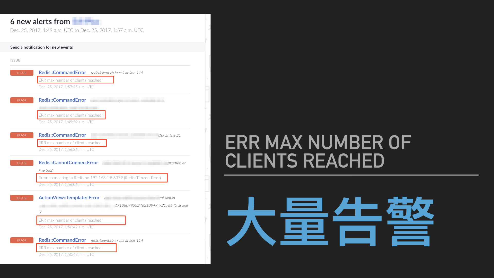
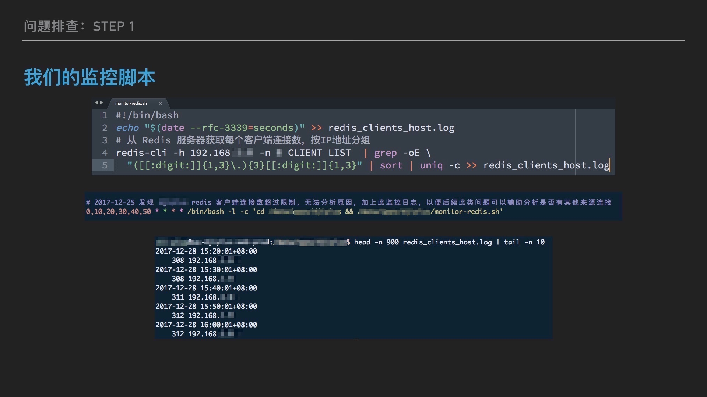
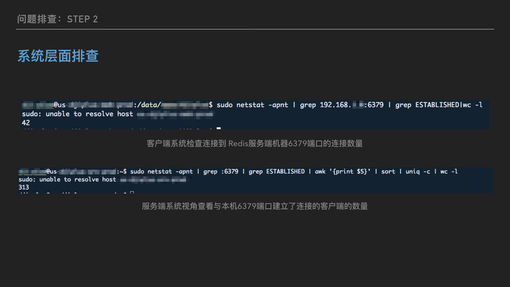
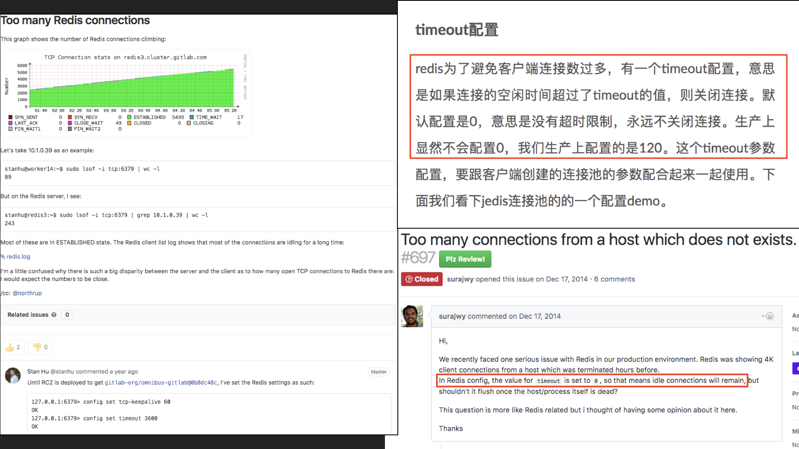
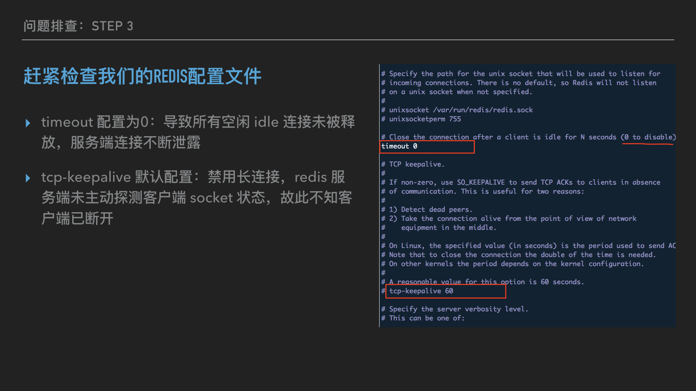
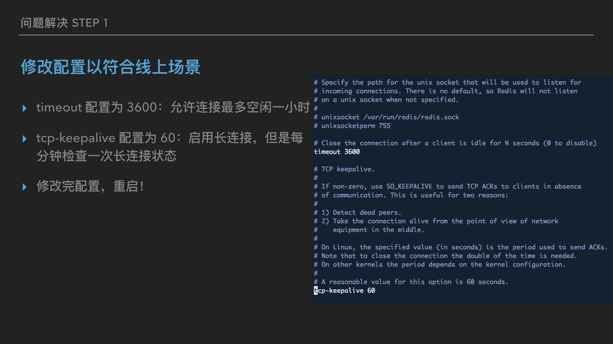
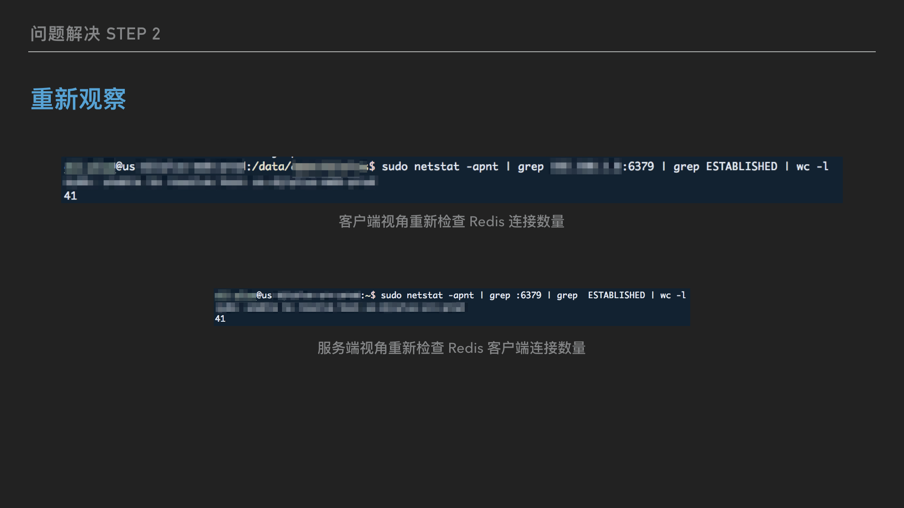
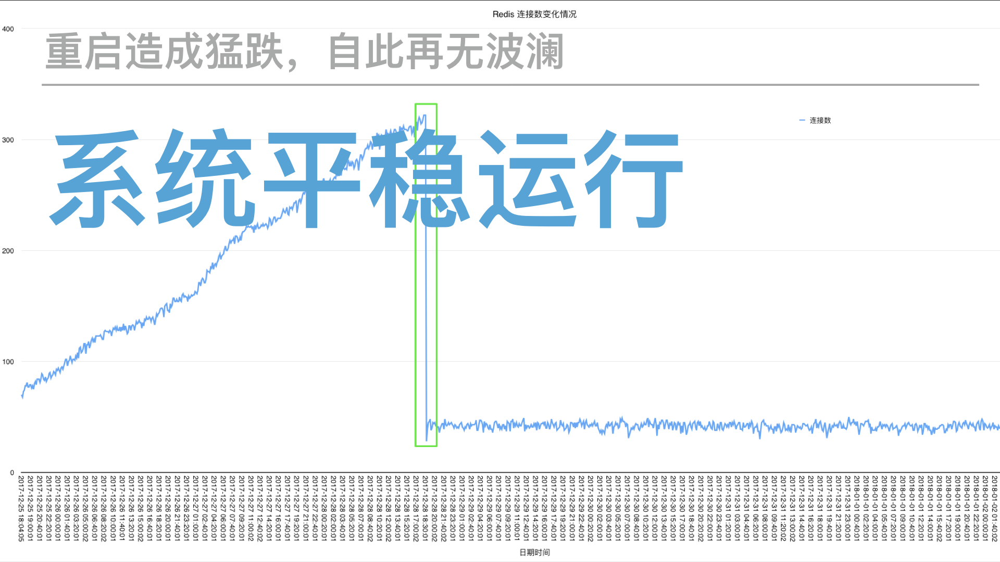

### 问题背景

去年圣诞节当天，突然收到一个我经手过的项目的告警邮件，错误消息显示**“Redis::CommandError: ERR max number of clients reached”**。 Redis 连接数告警

什么情况？难道这个项目翻车了？第一反应是这台服务器运行着自建的 Redis 数据库，但是客户端只有同个内网的一个 Ruby on Rails 的应用，怎么会有连接数爆掉的可能？

#### 理论连接数计算

老衲掐指一算：

1. **sidekiq 客户端所需连接数**: 对面 Rails 应用有 10 个 Unicorn 工作进程，每个unicorn进程初始化一个 sidekiq 客户端，一个 sidekiq 客户端默认连接池大小是 5，而且是懒惰策略，按需连接的，最大值是 10 x 5 = 50；
2. **显式 Redis 连接**: 程序代码里有一个 $redis 全局变量，初始化了一个 redis 连接，10个工作进程，也就是 10 个连接；
3. **sidekiq 服务端所需连接数**: sidekiq server 端 concurrency 配置是 10，那么按照官方文档，另有加上 2 个连接，也就是12个连接；
4. **Rails cache 所需连接数**: 按照`redis-store` gem 源码，默认连接池大小应该是 5，10个 unicorn 工作进程，按需连接，最大值是 10 x 5 = 50。

在不考虑其他可能还用到 Redis 连接的情况下，目前已知的最大 Redis 连接数需求是 122，这个数远小于 Redis 理论最大连接数啊，而且当时显示连接数到达上万！而且这个项目已经很少访问，压力极其小，不大可能会达到理论所需连接数啊！

一定是有**某种神秘力量**在主导这一切！！！

### 监控与分析

以上理论最大连接数分析只是定性分析，只能大概说明有一些诡异的东西存在，而想真正确认问题根源，还得做定量分析，只有数据才能说明一切！

#### 初步观察：Redis 数据库服务器端监控

事不宜迟，要采集数据，第一步就是加监控，所以当时就紧急写了一个定时采集 Redis 客户端数量（使用 redis 内建 `CLIENT LIST` 命令）的脚本，结合 crontab 定时运行，将结果写入文件，作为后续分析的基础。 监控脚本

通过监控脚本，发现几个有意思的现象：

1. 从 Redis 数据库服务端采集的数据看，**一直只有来自一台内网机器，也就是我前面说的 Rails 程序所在的服务器的连接**，说明这个 Redis 数据库不存在共享给其他应用的可能性；
2. 经过3天左右的监控，即从12.25到12.28，连续3天，Redis 连接数一直稳步上升，平均每日增加 70-80。在典型的系统资源泄露类（比如内存泄露）问题的场景中，这样的线条看起来特别熟悉，所以，真的是**连接数泄露**了？ 连接数数量稳步攀升

#### 进一步分析：Redis 数据库服务器端与客户端连接数对比分析

在有了上一步的发现之后，我继续用系统命令 `sudo netstat -apnt` 检查 `6379` 端口连接数发现，客户端机器也才只有 42 个左右的连接到 redis 服务器端，结合最开始的理论连接数分析，这个数量是比较合理的。

但是！但是！反过来去服务端机器用同样的命令检查，在服务端视角，却有多达300+个客户端建立的连接，而且都是在 ESTABLISHED 状态！这个数量和上面另一种监控方式得到的数量一致！ 服务器端与客户端 TCP 连接数不匹配

到底是什么情况？还能有这种操作？ 服务器端与客户端谁真谁假

### 问题根源

至此，Redis 连接数泄露是板上钉钉的事情了，可是又是为什么呢？为此，我在网上搜索了很多问答跟文章，后来总算找到了答案，果不其然，还是默认配置的问题。

#### Redis 默认配置

> redis 为了避免客户端连接数过多，有一个timeout配置，意思是如果连接的空闲时间超过了timeout的值，则关闭连接。默认配置是0，意思是没有超时限制，永远不关闭连接。生产上显然不会配置0…… redis timeout配置解释

OMG！赶紧打开我们的 redis 的配置文件验证是否如此，果不其然，redis一直保持着默认配置！ redis timeout 默认配置

至此，很好解释为什么连接数会泄露了，因为有很多空闲或者实际上客户端已经断开的连接，在服务器端一侧仍然保持着。那什么情况会导致这样的情况发生呢？

我猜测：

1. **网络通信差**: 按照 TCP 协议，客户端断开连接时，向服务器端发送 FIN 信号，但是服务端未接收到，客户端超时后放弃等待，直接断开，服务端由于通信故障，保持了 ESTABLISHED 状态，不过由于两端机器在同个内网，网络质量没有理由不行；
2. **客户端异常**: 客户端连接之后，由于代码运行过程中产生异常，导致未正常释放或者关闭连接，sidekiq 的worker很可能就有这类问题。这个的可能性非常大，毕竟我日常写 bug (*/ω╲*)。

### 问题修复

找到问题根源之后，修复起来就简直太简单了。事实上，开发领域就是如此，绝大部分时间都花在了找 bug 上，而改掉bug，可能只需要一分钟不到。

首先，修改了下 redis 数据库配置： redis 修改成建议配置

成功重启 redis 之后，重新运行前面的监控脚本，以便观察修复后情况，初步可以确认这下服务器端和客户端的连接数一致了：

配置生效重启后，多次重新检查两端看到的连接数，都一直保持一致了，说明服务端能正常释放一些 idle 连接了。

再又经过几天的脚本自动采集数据后分析，系统又恢复平稳运行了，连接数一直稳定在理论最大连接数之下。 redis 连接数稳定，稳定在理论最大连接数之下

### 总结

这个问题的根源其实很小，但是排查过程还是花了挺多时间，主要是需要等待采集到足够的数据后用于分析。其他心得体会：

1. 保护“案发现场”很重要，要想挖掘问题根源，必须保持环境可重现，这次出现问题的时候虽然第一时间重启了 redis 使服务恢复，但是由于没有修改任何配置，所以使得后来的监控能够发现问题根源；
2. 使用开源软件，必须对默认配置保持警惕，相信应该有人以前听说过 redis 默认监听`0.0.0.0`来源请求的安全漏洞；
3. 这个项目由于开始较早，当时并没有考虑使用 Redis 云数据库，自建数据库有风险，需要慎重对待，尽可能的情况下，专业的事情，交给专业的人去做。