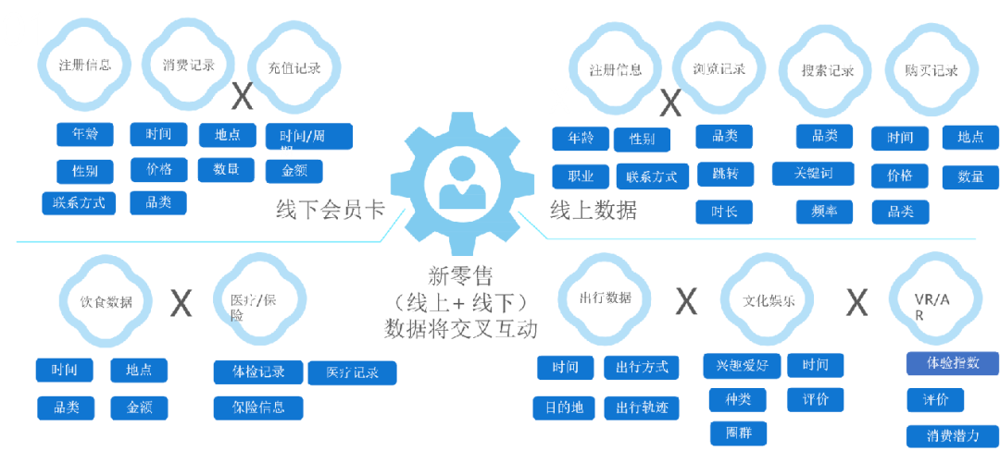

要做好整个企业的云原生体系建设，需要有个总体的视角，不谋全局者，不足以谋一域。我们将企业的架构进行全方面的梳理，并给出云原生体系建设总图，这个图当然不是一蹴而就就能建设完毕的，而是根据业务需求不断迭代演进出来的，但是我们要知道目标在哪里。

 

**企业架构的五个方面**

 

企业架构不仅仅是技术问题，还有流程问题和组织问题，总的来说分为五个方面，业务架构、技术架构、数据架构、研发流程和组织架构。

​    

 

**第一个是业务架构**，里面承载了企业所从事的业务的核心逻辑。目前大部分企业因为系统多是外采的，或者因为原来对于IT投入不够重视，处于单体架构的阶段。也有部分比较先进的企业，为了应对市场的快速变化，而采用了服务化的架构，构建了中台体系。而互联网公司因为要应对高并发流量，已经将服务拆分得更加细，实现了微服务架构。

 

**第二个是技术架构**，为了支撑业务代码的运行而建设的IT基础实施。最初企业多会采购物理机的方式运行业务代码，因为资源使用效率和灵活度的问题，很多企业采用了虚拟化平台。

 

从虚拟化平台到云平台的变化不在于技术，而在于使用模式，主要是三点，统一接口，抽象概念，租户自助，说白了就是让业务方不需要特别专业的底层技术能力，就能实现应用的部署，同时将运维人员从应对越来越多的业务方的噩梦中解放出来。

 

这一点很多企业出现了问题，一些采购了公有云或者OpenStack，仍然将所有的操作权限都放在运维那里，把云当成了虚拟化软件在用。容器进一步让应用从代码到运行无缝的连接起来，并且可以实现跨云的迁移。Service Mesh将微服务的治理放到统一的平台上来做，进一步解放业务方。

 

**第三个是数据架构**，在业务运行的过程中，会积累很多的数据。最初企业的系统多只做数据记录的作用，并没有发挥太多的价值，数据是散落在各个系统的数据库之中的，如果想进行分析，查看当前业务的运行情况，需要一个分析师将数据导出来，做成表格和报告，给领导看，这样时效性就会很差。

 

后来很多企业开始做数据的梳理，建设数据仓库，并且建设BI大屏，领导驾驶舱，支撑战略决策。当然这种方式没有办法和业务直接结合，于是才有的后来的数据运营驱动业务创新，我们在电商和社交APP上感受到的千人千面，智能推荐，都是例子。

 

**第四个是研发流程**，也即代码是如何发布上线的。最初企业的发布上线都是手工化的，后来随着服务数目增多，开始脚本化。脚本难以维护，容易出错，后来就有了统一的发布平台，和云平台相结合，进行自动化的发布流程管理。有了容器之后，发布模式有了一定的改变，强调开发和运维合作保障在线业务的SLA，而非仅仅运维保障，从而发布平台也要DevOps化。

 

**第五个是组织架构**，根据康威定律，组织架构和技术架构往往是相互影响的，如果仅仅调整技术架构，不调整组织架构，则不能发挥新技术的优势。最初企业往往是开发和运维完全隔离的，甚至是两个老大进行领导，因而不能融合，迭代速度慢，线上高可用无法保证。要改变这种方式，除了配备上面的技术平台之外，还需要成立中台组或者架构师组，来衔接开发和运维，最终实现开发和运维的融合，共同基于DevOps平台保障线上系统的可用性。

 

**云原生体系建设总图**

 

根据上面的梳理，我们会发现，云原生体系建设还是非常复杂的，最终会建成一个什么样呢？需要有一个目标的总体架构，只有有了目标，就可以根据业务的发展阶段，逐步向这个方向进行靠拢。

 

所以我这里画了一张云原生体系建设总图：

 

 

 

这张图左面是组织架构的部分，右面是技术架构的部分。左面和右面相同颜色的部分，就是相应的团队负责相应的技术架构的部分。

 

**我们先看右面技术架构的部分。**

 

最底层是数据中心的物理网络，对于数据中心的基本原理，《趣谈网络协议》中有一节专门描述。但是这里的数据中心是云数据中心，所以其设计会要求更高，在这个课程会更加详细的描述。

 

在物理网络之上是虚拟网络，最好整个数据中心有一个统一的SDN控制器，可以方便不同的环境之间的网络打通，例如物理机，Vmware虚拟机，OpenStack虚拟机，容器网络，都可以被统一的管理。SDN可以是使用硬件的，也可以使用软件的。

 

接着是OpenStack云平台，可以纳管物理机，Vmware虚拟机，KVM虚拟机，向上提供统一的接口。当然也可以不基于OpenStack创建云平台，而用云管平台。OpenStack的好处就是接口统一，业内和他配合的工具链比较丰富，有很多的运维工具可以直接基于OpenStack接口创建虚拟机，因而持续集成平台和OpenStack对接会轻松很多，实现基于云接口的应用编排。

 

无论是用OpenStack或者其他的云管平台，作为“云”，除了统一接口之外，还要有相应的租户管理体系，租户和用户要分层分权限，让平台管理员可以分配给业务方一定的权限，例如Quota，QoS等，可以让业务方对于应用部署有一定的自助能力。另外云还要提供一层对于底层技术的抽象，例如flavor作为CPU和内存的抽象，VPC作为网络的抽象，安全组作为防火墙的抽象等，这样业务不需要特别懂底层技术，就能有应用的部署能力。

 

基于OpenStack云平台，可以实现基于虚拟机镜像的运行环境，容器有镜像，虚拟机也有，在有容器之前，我们就可以对接持续集成平台，基于虚拟机的镜像实现应用的编排，将主流的运行环境全部打成镜像，并可以基于虚拟机镜像实现弹性伸缩。

 

基于OpenStack云平台以及虚拟机镜像，可以构建基于虚拟机的PaaS平台，也即数据库，消息队列，缓存等，都可以变成托管服务，让业务方点即可得，不用自己搭建，也不用考虑高可用如何配置，主备如何切换，PaaS如何扩容等等，这些全部由虚拟机镜像中的脚本自动化搞定。

 

在此之上是Kubernetes容器平台，他作为统一的编排层，可以将Vmware创建出来的虚拟机，KVM创建出来的虚拟机，以及物理机统一的纳管进来，还可以通过多Kubernetes管理，纳管公有云上的资源。Kubernetes里面的概念更贴近应用层，所以可以看成从资源层到应用层过渡的桥梁，将底层不同的资源全部屏蔽起来，对上提供统一的应用编排。

 

Kubernetes的编排能力比OpenStack强很多，对概念的抽象也更加对应用友好，因而持续集成平台可以从对接OpenStack，慢慢切换称为对接Kubernetes，可以实现跨云编排，迁移，与弹性伸缩。

 

有了Kubernetes，就不用使用虚拟机镜像做应用运行环境了，Docker镜像就是天然的运行环境，而且更加的标准化，可以跨云迁移。另外有了Kubernetes Operator，可以基于容器实现PaaS平台，也即数据库，缓存，消息队列的编排。

 

在往上就是应用层了，这里以电商业务为例子，业务层已经实现了微服务化，封为两层，下层为中台层，也即可复用的能力，强调资源整合和能力沉淀，包括第三方商家，供应链，决策，用户，商品，社交，交易等基础服务。上层为业务应用，强调贴近用户，快速应对市场变化，包含的系统非常多。当然不是任何一个业务都是要一下子拆这么细的，而是逐渐拆分的，如何逐步拆分成这样，也是本课程的重点。

 

为了支撑如此复杂的微服务架构，需要配备相应的工具链，例如API网关，微服务管理与治理平台，APM性能管理平台，日志中心，配置中心，分布式事务等。当然这些工具链也不是一下子都用起来，也是随着微服务的不断拆分，逐渐的使用。

 

这些工具的采用都多少对于应用有侵入性，如果想让微服务的治理能力下层到基础设施层，Service Mesh是一个好的选择。

 

另外还要有端到端统一的监控中心，要下能够监控基础设施，上能够监控应用的运行，这样在定位问题的时候，才能够互相印证。

 

**我们再来看左面的组织架构。**

 

为了讲右面的技术架构运行起来，要改变原来CIO下面一个技术总监，一个运维总监的情况。由于整个技术体系比较复杂，需要整个团队基于统一的流程和规范，才能方便管理，而如何保证整个系统的运行符合这个流程和规范，仅仅CIO一个人的精力不够，需要有一个架构委员会，这里面有专职的架构师，包括云的，运维的，微服务的，QA的，项目管理的，另外架构委员会里面还应该有各个组架构师代表。

 

架构委员会对于整个架构的运行，流程和规范的落地负责，并像CIO汇报。而且架构委员会会融合各个角色，不会出现开发和运维隔离的情况。架构委员会制定流程和规范，并要求各个开发和运维组执行。

 

开发组分成业务开发和中台开发组，业务开发组用于快速响应客户的需求，中台开发组不直接面向客户，每天想的事情就是能力如何复用，如何锻炼腰部力量，只有有一拨人专门考虑这个问题，才有可能积累称为中台。

 

业务开发和中台开发到底是否执行架构委员会制定的流程和规范，需要有一定的工具链的配合，因而就需要技术底座组，包括云，大数据，容器，微服务，已经相应的流程管理，规范管理，绩效看板等，可以让架构委员会通过工具链，实时审核架构当前的运行情况，并对不符合流程和规范的接口，测试，文档等及时纠正，并计入绩效看板。

 

看完了这些，你可能觉得，哇，云原生如此的复杂，直接放弃吧。

 

其实不是的，从来没有一种说法是一下子就达到这个状态，而且也不可能通过采购一个大平台，公司一下子就形成了云原生架构，这都需要迭代的进行，这正是要解决的问题。

 

接下来，我会逐层剖丝剥茧的解析这个迭代过程，主要的思路为：

 

- 遇到什么样的问题？
- 应该采取什么样的技术解决这个问题？如何解决这个问题的？
- 这个技术的实现有很多种，应该如何选型？
- 使用这个技术有没有最佳实践，能不能形成企业的相关规范？

 

**云原生体系演进阶段一：**

**拉通信息系统，重塑组织协同**

 

我们来看第一个阶段，拉通信息系统，重塑组织协同。

 

我们分别从企业架构的五个方面依次阐述。

 

1、阶段一的现状

 

 

 

**1）业务架构：单体应用，企业消息总线集成**

 

我们还是从业务架构入手分析，大部分企业的信息系统并没有做到这一点——拉通信息系统，重塑组织协同，因为大部分系统都是外部采购，或者外包公司开发，由不同的团队进行维护，这些都是烟囱系统，信息零散，格式不一致，无法拉通，无法协同。

 

以制造业为例子，如图所示，企业外采了CRM，MES，ERP，HR，PLM，SCM等系统，但是各自独立，各有各数据库，各有各的权限管理。

​      

 

这样的架构使得企业的各个部门无法协同，例如公司生产两种工业品A和B，其中A需要原材料A1和A2，B需要原材料B1和B2。突然有一天，销售人员发现市场情况有所变化，原来客户喜欢A和B是1:1的比例，现在突然B的需求量大了起来，变成了1:2的关系。

 

这些信息，销售人员都将一个个客户的需求登记到CRM里面，可是工厂并不知道这件事情，于是还是按照1:1的来生产，这样A就会滞销，B就会脱销。这就需要销售部门的老大根据报告，看到这种情况，给生产部门老大说，改变生产的比例，但是这又牵扯到原料，如果A1和A2，B1和B2还按照原来的数量采购，那没有原料，A和B也生产不出来，所以生产部门的老大要同供应链的老大去说。

 

另外还有不同车间的人员比例，明显生产B所需要的人才要多了，而且生产B的人要配备相应的绩效，这些HR都不知道，所以要有人告诉HR。另外市场发生变化之后，对于公司的收入和利润有什么影响，这也是两眼一抹黑。等这些都理清楚，那几个月都过去了，市场可能又发生变化了。

 

为了解决这个问题，在多年之前，很多企业就采购了企业服务总线ESB和数据交换工具，将不同的流程打通，做到信息拉通，数据集成，协同管理。

​      

 

企业消息总线可以实现不同系统之间不同接口的调用，哪怕这些接口格式，协议都不一样，有的是SOAP，有的是Restful，有的是RPC，有的是私有协议，他可以做协议的转换。使得一个系统发生的事情，另一个系统可以通过接口调用得到结果。也有的功能没有暴露接口，那可以通过数据交换工具，将一个系统的数据库里面的数据定时的导出来，放到另一个系统里面去，也实现了数据的拉通。

 

虽然这个体系结构比较原来的架构有了改进，但是仍然有问题，就是无法支撑业务快速创新。

 

**2）技术架构：物理机及虚拟化**

 

​             

 

在第一阶段，在传统架构下，基础设施层往往采取物理机或者虚拟化进行部署，为了不同的应用之间方便相互访问，多采取桥接扁平二层机房网络，也即所有的机器的IP地址都是可以相互访问的，不想互相访问的，多采用防火墙进行隔离。

 

无论是使用物理机，还是虚拟化，配置是相对复杂的，不是做过多年运维的人员，难以独立的创建一台机器，而且网络规划也需要非常小心，分配给不同业务部门的机器，网段不能冲突。例如使用Vmware，可能需要考一个特别有含金量的证书，才能很好的配置他。所有这一切，都需要运维部门统一进行管理，一般的IT人员或者开发人员既没有专业性，也不可能给他们权限进行操作，要申请机器怎么办，走个工单，审批一下，过一段时间，机器就能创建出来。

 

传统架构数据库层，由于系统由外包公司独立开发，或者不同开发部门独立开发，不同业务使用不同的数据库，有用Oracle的，有用SQL Server的，有用Mysql的，有用MongoDB的，各不相同。

 

传统架构的中间件层，每个团队独立选型中间件，可能会多种多样：

 

- 文件：NFS，FTP，Ceph，S3
- 缓存：Redis Cluster，主备，Sentinel, Memcached
- 分布式框架：Spring Cloud，Dubbo，Restful or RPC不同的部门自己选型
- 分库分表：Sharding-jdbc，Mycat
- 消息队列：RabbitMQ, Kafka
- 注册中心：Zk，Euraka，consul

 

**3）数据架构：数据抽取与统计分析**

 

这个阶段没有所谓的数据架构，由于业务是离散的，业务数据库里面的数据也是离散的，没有统一标准，虽然有了数据交换工具，会使得同一个数据很多份，各自分析。当然公司的领导和部门的领导都想看到当前企业的运行情况的，往往会有一个分析师的团队，从业务系统里面导出数据来，形成excel，然后利用自己对于流程和行业的理解进行分析，做出各种表格，图形，变成报告，交给公司领导或者部门领导看，领导肯定会根据报告进行讨论，然后根据运行情况调整战略和策略。

 

研发流程：测试与发布手工化及脚本化。

 

在物理机上部署，由于机器数目比较小，可以使用手动测试和发布的方法。无非是丢上去一个安装包，然后重启一下Tomcat，发布就结束了。

 

后来上了虚拟化，机器的数目多了起来，服务数目也多了，再手动的一个个部署，工作量就比较大了，这个时候多采取脚本化的部署方法，写shell，或者写Ansible脚本等，进行自动化的发布与上线。

 

当然脚本比较难维护，专业性强，所以上线还是由写脚本的运维统一完成。

 

**4）组织架构：研发与运维隔离**

 

组织状态相对简单。

 

运维部和开放部是天然分开的，谁也不想管对方，两边的老大也是评级的，本相安无事。

 

统一的运维组，管理物理机，物理网络，Vmware虚拟化等资源，同时部署上线由运维部负责。

 

开发组每个业务都是独立的，负责写代码，不同的业务沟通不多，开发除了做自己的系统外，还需要维护外包公司开发的系统，由于不同的外包公司技术选型差异较大，因而处于烟囱式的架构状态。

 

机房当然只能运维人员能碰，这里面有安全的问题，专业性的问题，线上系统严肃的问题。如果交给没有那么专业的开发去部署环境，一旦系统由漏洞，谁能担责任，一旦线上系统挂了，又是谁的责任，这个问题问出来，能够让任何争论鸦雀无声。

 

2、阶段一的问题

 

 

 

阶段一有问题吗？这要从业务角度出发，其实也本没有什么问题。

 

中间件，服务层，前端，全部由外包商或者乙方搞定，端到端维护，要改什么招手即来，而且每个系统都是完整的一套，部署方便，运维方便。

 

数据库无论使用Oracle, DB2，还是SQL Server都没有问题，只要公司有足够的预算，而且性能也的确杠杠的，里面存储了大量存储过程，会使得应用开发简单很多，而且有专业的乙方帮忙运维，数据库如此关键，如果替换称为Mysql，一旦抗不出挂了，或者开源的没人维护，线上出了事情，谁来负责？

 

如果一起安好，其实没有任何问题，这个时候上容器或者上微服务，的确自找麻烦。

 

那什么时候，才会觉得阶段一有问题呢？还是从业务角度出发。当你的系统需要灵活的响应业务变化的时候，才会感觉到痛。

 

例如本来你经营着一家超市，原来主要通过线下进行销售，此次冠状病毒突然使得大家都不能逛超市了，这个时候就需要能够线上下单，线上销售，但是由于疫情事发突然，你外采的供应链管理，ERP等系统根本没办法修改，加入自己的业务逻辑，你让外包公司开发的系统，也不能随便修改，因为这需要重新招标，瀑布式的开发，交付，上线。你根本来不及。

 

再如你是一个汽车厂商，原来主要通过4S店进行销售，突然国家出台了一项激励新能源车的政策，使得你想借此机会促进一下销售，但是你发现外采的和外包的系统同样不能修改，等你改完了，风口早就过去了。

 

没有办法快速迭代上线，是阶段一的主要问题，我们还是分别从企业架构的五个方面依次阐述。

 

**1）业务架构：架构耦合问题，架构腐化问题，技术债务问题**

 

外采的程序和外包的程序，为了交付方便，往往开发成为单体应用。你可能会说，如果变成我自己开发和维护，是不是就能够解决这个问题了？而且我有企业服务总线，可以灵活的对于多个单体应用接口做集成。那是不是也能够解决，快速迭代上线的问题呢？

 

自然，自己开发和维护，灵活性确实要强的多。但是如果你依然采取单体的架构，你将来仍然会存在因为耦合问题导致无法快速响应业务变化情况。

 

因为任何混合在一起的架构，都会不断地腐化，即便你花时间和精力重构了一遍，还会再腐化，再重构，再腐化。这是架构的天然宿命，也是人性而导致的。他不能避免，但是可以不断地修正。所以架构设计并不能避免架构腐化的问题，但是能够解决及时发现及时修正的问题。

 

如果你不相信这一点，那我们就举一个例子，看是不是天天发生在你的身边。

 

​      

就像图中显示的一样，左边是你的领导认为一个单体应用的内部架构，里面的几个模块，界限清楚，调用分明。而右面可能是实际的内部架构，界限已经十分模糊，很多逻辑都糅合在了一起。

 

​      

为什么会出现这种现象呢？

 

第一个原因就是没时间搞。对单体应用内部的界限是不可观测的。我们都知道，领导都非常重视功能和bug，因为功能和bug都是可以观测的，而且是会影响用户的体验的。而架构往往不受重视，是因为单体运用内部的架构，领导是看不到的。他看不到，他就不会给你留时间，在开发功能的时候，不断的去调整架构。

 

第二个原因，就是没动力搞。一旦代码的很多逻辑糅合在一起，那代码的可理解性就会非常的差。这个时候重构往往就更加的费时间。而领导又不肯留时间，那这时候开发人员就会想，反正领导也不重视，代码可理解性差呢，Code Review也Review不出啥来，那索性就头痛医头脚痛医脚好了。

 

第三个原因。就是没胆量搞。哪怕这时候有一个有技术洁癖技术理想的人想搞这个事情，但是他会发现，代码复杂，耦合性强，越是核心的逻辑，越是不敢动，因为线上出了问题，谁改谁负责，所以，只好层层封装。

 

以上的三点。都是不可避免的人性。作为管理者和架构设计者不能要求我们的程序员是圣人，也不能不考虑人性去解决这些问题。

 

所以由于以上三点，我们就观察到了非常常见的两个现象。第一个就是迭代速度慢。因为架构的耦合，往往A上线，明明不关B的事情，需要B配合，B上线明明不关C的事情，需要C配合，最后问了一圈，只好10个功能一起弄完一起上线，那上线周期以月为周期。第二个就是可复用性差，如果你是一个领导，你会经常问这样的问题，明明你记得某个模块里面有某个功能，当另外一个模块需要的时候，拿不出来，需要另外开发。

 

最终就形成了技术债务，就像咱们借P2P，借了一万，一个月后发现要还两万。同理，当领导一年前问你某个功能开发需要多长时间，你半天就搞定了，一年后，你说要一个星期，领导很困惑，以为你开始学会偷懒了，变成老油条了，其实领导已经不知道单体应用里面已经一团浆糊了。

 

**2）技术架构：资源申请慢，复用性差，高可用性差**

 

从技术架构的角度来看，基于虚拟机技术，资源申请非常的慢。因为虚拟机大量地依赖于人工的调度，需要运维人员非常清楚，要部署在什么地方，往往需要通过excel进行维护。另外VMware还有一个问题，它使用共享存储，会限制整个集群的规模，因为此时的应用不多，这个程度的规模还可以接受。

 

另外网络、虚拟化、存储等基础设施，没有抽象化的概念，复杂度非常高，开发接不了这个工作，必须依赖运维，就要审批。由统一的一帮人来做，而且他们要考证书，比如，网络要有思科的证书，虚拟化要有VMware的证书，要特别专业才能做这件事情，因此会极大地降低迭代速度。业务方无论做什么事，都要走审批，运维部的人根本忙不过来，就会降低资源的申请速度。

 

所以我们经常观察到这样的现象，业务部门要部署应用，本来需要80台机器，却要申请100台，因为流程比较慢，万一不够，就要重新申请，一旦申请的，就不愿意归还运维部，因为说不定什么时候要用上，这样资源利用率大大降低。

 

另外部署应用的时候，如果基于脚本部署，应该是环境越干净越一致，脚本部署的越顺畅，所以本来应该每次部署都是新创建的虚拟机，而且一旦一个系统被安装坏了，不必修复这个系统，重新创建一个虚拟机是最方便的。本来挺好的虚拟机的特性，被审批流程给破坏了，业务部门发现虚拟机坏了，想想重新申请太慢了，于是就忍忍，自己在虚拟机里面进行修复，十分浪费时间。

 

多种多样的中间件，每个团队独立选型中间件，没有统一的维护，没有统一的知识积累，无法统一保障SLA。一旦使用的消息队列，缓存，框架出了问题，整个团队没有人能够搞定这个事情，因为大家都忙于业务开发，没人有时间深入的去研究这些中间件的背后原理，常见的问题，如何调优等等。

 

**3）数据架构：数据分散质量差，单一维度统计分析，人为报告反馈链长**

 

这个时候的数据是非常分散的，不同的数据存在不同的业务系统中，如上面说的单体应用客户管理系统、生产系统、销售系统、采购系统、订单系统、仓储系统和财务系统等，或者同一个业务系统但由不同的机器在采集，这都导致了数据没有统一的标准，而是以割裂的形态存在，也就是数据孤岛。

 

但是业务的领导和部门的主管想了解业务的运行情况，就需要有人统计分析，这就是分析师，但是分析师因为生产流程太多了，数据太分散了，设备、系统、测量数据一堆，每个特性最少N个数据，一方面需要到处找人，一方面N多数据接口、N多数据格式，各自为战，数据对接不上。所以报告一般以周为单位给出，然后层层汇报，领导根据汇报，才能调整策略，然后再根据运行情况，再出报告，这个反馈链太长，要以月为单位了，不能适应市场的快速变化。

 

**4）研发流程：上线依赖人，部署风险高，脚本难维护**

 

上线依赖于人工和脚本，人是最不靠谱的，很容易犯错误，造成发布事故。而发布脚本、逻辑相对复杂，时间长了以后，逻辑是难以掌握的。而且，如果你想把一个脚本交给另外一个人，也很难交代清楚。

 

另外，并且脚本多样，不成体系，难以维护。线上系统会有Bug，其实发布脚本也会有Bug。

 

所以如果你上线的时候，发现运维人员对着一百项配置和Checklist，看半天，或者对着发布脚本多次审核，都不敢运行他，就说明出了问题。

 

**5）组织架构：研发运维标准不一，难保障端到端高可用**

 

线上的高可用性，业务层的开发人员不会做任何事情，他认为是线上一旦出事，应该由运维集中处理，迫使运维服务的发布人员依赖虚拟化机制，来提供高可用机制。我们都知道VMware有非常著名的简化运维的高可用机制，比如FT、HA、DR等类似的机制。

 

如果我们是从IT层来做高可用，有一个缺点，作为基础设施层来讲，它看上层没有任何的区别，所以没有办法区分业务优先级。比如说FT的模式，跑CPU指令，它不知道这是最核心支付的指令、还是日志的指令，再如数据中心之间的同步，存储层是无法区分交易数据和日志数据的。

 

这样就会造成一方面该同步的没有同步，不该同步的同步了很多，使得线上业务SLA降低了。另一方面浪费了存储和带宽的资源。而且一个服务到底是不是正常，需要应用层开放一个health接口来返回，如果应用层不做这件事情，基础设施只能通过看进程是否存在，端口是否监听等判断，很可能出现进程在，但是服务不可用的情况，也会降低SLA。

 

至此，我们看到了阶段一的问题，那应该如何解决这些问题呢？我们下一节详细解读。

 

**云原生体系演进阶段二：**

**构建中台体系，加速业务创新**

 

构建中台体系，加速业务创新。

 

上一节，我们讲了阶段一的很多问题，其实这些问题归根结底是一个字——散。系统散，数据散，流程散，组织散，而当前的市场竞争条件下，业务创新要争分夺秒，如此“散”的架构没有办法拧成一股绳，应对业务的快速变化，就像集团军作战，各个部队分兵作战，就不能形成合力。

 

因而要将这些系统，数据，流程，组织重新组合，形成公司的“腰部力量”，强调能力的沉淀，强调融合与复用。只有有了“腰部力量”，才能灵活应对业务的快速变化，这就像打篮球，“腰部力量”是最重要的，无论是投三分球，还是在空中做花哨的投篮动作，看起来是在手腕，其实真正的能力在腰部。

 

这就是我们常说的中台。中台这个词很火，有的人觉得很好，有的人觉得太虚，但是名字无所谓，其实就是构建公司的可复用能力。

 

1、中台的定义

 

 

 

这里给中台下一个相对完整而准确的定义：

 

​      

这个概念需要解读一下。中台是为了体现IT技术，IT系统，IT部门的业务价值而诞生的概念。这一点如果作为一个纯技术，很难感受到这一点，感觉中台就是忽悠，如果在一家技术为主导的公司也很难感受到这一点，觉得技术的价值马老板都清清楚楚，还需要“体现”吗？

 

但是在传统企业，可不像互联网公司这样重视技术，业务部门的老大在中国的市场经济搏杀了几十年，最后混出来靠的一个是中国过去几十年的快速发展及人口的红利，二是老板们对于市场，营销，供应链的把控。当然这种野蛮生长的过程，并没有对IT技术和IT系统有什么感觉，所以往往会重业务而轻技术，重硬件而轻软件。

 

当然低成本人口红利的野蛮生长阶段已经过去，老板们也发现过去的这一套有点玩不转了，差异化客户体验驱动产品创新阶段已经到了，他们开始眼红互联网公司的兴起了，于是开始设立了CIO这个职责。

 

只不过大部分公司的情况是，CIO作为高管，在业务老大那里话语权还不高，毕竟钱是业务部门赚的，真正IT预算都是业务老大要批的，所以在传统企业，能够体现业务价值非常重要，这是中台这个词的核心，也即定义中的“面向业务场景”以及“支撑业务快速迭代”所强调的，CIO要让CEO，业务部门理解IT部门和IT系统的价值。

 

2、中台的误区

 

 

 

之所以对于中台的定义这么复杂，另外一个问题就是，大家对于中台的理解经常出现错误，最终导致企业构建中台不正确，却怪中台太虚，不落地。

 

这里总结了中台五大误区。

 

**1）误区一：中台构建的太早**

 

中台是企业已有系统积淀，解决了业务温饱问题，要进一步解决业务创新问题时候用的。

 

如果你是一家创业公司，那解决温饱问题，确定业务模式最为重要，如果这个时候花大量的时间建设中台，一是你本来就没什么可沉淀的，二是沉淀了也可能因为创业方向变化而白沉淀，三是过于重视技术耽误了你取得业务成功的时间。

 

其实大家只要看看阿里什么时候搞的中台，就明白了。中台要有共性，淘宝，天猫，聚划算，1688都是电商业务。中台要先在一个业务取得成功，淘宝2003年创立，天猫创立较晚，两者时间差比较大，淘宝的系统才能演进为中台。

 

**2）误区二：对中台期望太高**

 

中台可能被吹的太牛，有时候被当成了万金油，似乎什么都能解决。例如中台能够使业务创新这件事情，就属于期待过高。

 

中台没有办法让业务创新，只能“支撑”业务创新，说白了就是中台其实就是可复用能力，这种能力是一种内功，是一种支撑能力，但是替代不了业务能力。

 

如果业务方自己想不出业务创新的方法，或者不愿意想业务创新的方法，只想吃老本，那中台帮不上任何忙。但是如果业务方能够想出50种(约数)创新的方法，但是不知道哪个对的时候，中台的可复用能力就帮上忙了，其中业务中台可以使得业务方在这50个方法里面快速的尝试，而数据中台使得业务方能够快速看到这些方法的尝试结果，这样就能快速找到业务突破的方向。

 

**3）误区三：觉得中台太简单**

 

以为中台就是现有系统的接口组合，以为通过ESB将服务编排一下就解决了。将ERP,CRM等后台系统通过ESB暴露出去不是中台。

 

第一个原因是，CRM里面有客户，而手机APP里面的用户中心也是客户，但是两者有明显的区别，CRM里面是后台管理语言，是给公司内部的人看的，也是按照公司内部的人管理最方便的方式组合信息的，他不是前台业务语言，从后台的CRM到APP上的用户中心中间还有一定距离。

 

这里常见的例子是，有的银行的App比较难用，而支付宝和微信支付就对用户友好，有的航班的App比较难用，而航旅纵横就对用户友好，如果仔细观察，你能发现其中的区别吗，很多银行的App将柜员系统中的概念和操作方式直接搬到了App上，很多航班将柜台系统中的概念和操作方式也是直接搬到了App上。

 

第二个原因就是上面说过的，单体应用群通过ESB暴露出去，虽可以实现信息拉通，但是无法达到中台快速迭代的目标。

 

**4）误区四：觉得中台太复杂**

 

很多传统企业一听中台，就觉得一下子要上N各系统，将原来的服务拆分的七零八落的，然后看看自己手里就这几十号人，应该搞不定，于是望而却步，任务中台太复杂，这是互联网公司的事情，传统企业不应该参与。

 

其实这是误解，中台的构建有两种方式，封装式和重构式，传统企业往往害怕的是重构式，然而其实中台的建设有渐进的过程，可以保留原来的系统，通过逐渐的封装，构建自己的中台。

 

**5）误区五：觉得中台太技术**

 

有的企业比较有钱，觉得中台的构建就是个技术问题，只要花钱买一个一线互联网公司的大平台就搞定了中台，这也是一个很大的误区，因为你没有自己的架构师团队和中台团队，没有自己的流程和规范，没有自己沉淀可复用能力的方法论，还是没办法应对业务的快速迭代。这就像你在健身房看到一个健身教练用一个很牛的器械练了六块腹肌，你就把器械买来，自己不练，那也没有腰部力量呀。

 

3、中台建设的两种方式

 

 

 

**1）封装式**

 

​      

传统企业由于采购大量传统服务，可采用封装式构建中台。

 

前台APP或者门户一旦需求改变，后台采购系统或核心稳态系统不可能随之改变，所以中间封装中台服务层。

 

传统服务多使用SOAP协议暴露接口，可通过ESB或者API网关转换为RESTFul接口对上暴露。

 

服务层采用最新微服务架构进行开发，适应前台快速迭代。

 

**2）重构式**

 

​      

互联网公司历史包袱轻，大型银行，运营商等由于技术力量充足，可对于部分系统进行全方位的重构为微服务架构，并以此为底座构建中台。

 

可全面实现自主可控，和快速迭代。

 

4、中台如何解决第一阶段的问题

 

 

 

接下来，我们来看中台如何解决第一阶段的问题，我们还是从企业架构的五个方面逐个分析。

 

**1）业务架构：架构服务化，侧重变化多和复用性，领域拆分与解耦**

 

​      

上一节，我们讲了影响快速迭代的问题是架构腐化问题，那如何解决这个问题呢？就是通过服务化的方式，将不同的业务领域拆分到不同的工程里面去。

 

这样第一会增加可理解性，工程更加的简洁，每个工程只做一个领域的事情，职责单一，这样就会既容易修改，也容易Review。其实按照人性角度来讲，易Review更加重要，因为拆分后的服务虽然聚焦于某个领域，也会腐化，易Review能够早日发现腐化，早日修复。

 

第二会增加可测试性，越是耦合在一起的庞大代码，测试覆盖率越低，越容易出现问题，而拆分后的服务测试更加容易展开，覆盖率变高。测试覆盖率是验证架构有没有腐化的指标，也是领导或者架构委员会能够看到的，也有利于及时制止和修复腐化。

 

第三，也即最重要的就是可观测性，服务化之后，一般要有服务统一的注册发现和接口管理平台，通过这个平台，服务之间的调用关系以及接口的设计和文档，领导和架构委员会都能看到。

 

调用关系变乱是架构腐化的重要指标，服务之间的调用应该分层单向调用，严禁循环调用的，如果多个服务之间的调用一团乱麻，那就说明腐化了，应该及时制止和修复。另外接口不符合规范，也是架构腐化的重要指标，接口如果开始出现模糊，或者传入大量的参数，甚至传入Hashmap将参数通过key-value的方式传递，那就说明里面的架构已经腐化了，应及时制止和修复。

 

这样就是实现了架构始终保持在轻债务的阶段，这样开发敢改，同事容易Review，QA容易测试，领导和架构委员会也看得到的效果。

 

而且服务化拆分后，会将很多内部的功能，暴露成接口对外提供服务，并且接口经过Review和设计，而且文档和调用方式都在注册中心上，非常方便其他服务调用，从而实现可复用性。

 

从而最终实现了快速迭代。

 

你可能会问，你说了半天服务化，和前面的中台啥关系呢？中台这个词其实是给业务方听的，具体到技术手段，就是服务化。作为技术部门，需求都是从业务方来的，业务方其实不关心我们拆了多少服务，就是希望能够快速完成需求，而服务化就是为了完成这个目标的，只不过你说服务化，甚至拆分啊，架构啊，业务领导听不懂，所以就说为了更快响应他们的需求，给他们建设了中台。

 

那服务化应该从哪里开始呢？

 

这里很多技术人员都会犯的错误是，从数据库出发，看数据库结构如何设计的，按照数据库最容易拆分的方式进行拆分。这样是不对的，没有站在业务的角度去考虑问题。应该借鉴领域驱动设计的思路，从业务流程的梳理和业务领域的划分出发，来划分不同的服务，虽然最后映射到数据库可能会拆分的比较难受，但是方向是对的，只有这样才能适应未来业务的快速变化，起到中台应该起到的作用。我个人认为，方向比手段要重要，方向对，当前痛一点没什么，但是当前不痛，方向错了，还是解决不了问题。

 

当然领域驱动设计在落地的过程中可能存在各种问题，比如前期规划时间过长，前期设计阶段考虑不到细节的场景，落地的时候会经常碰到和前期设计不一致的地方，需要返工等现象。其实互联网公司也大多没有安装领域驱动设计的完整流程来做，但是这里面的流程梳理和领域划分，还是很必要的。

 

领域划分好了，接下来就要开始拆分出服务，进行服务化了。从哪里入手呢？比较落地的方法是随着新需求的不断到来，渐进的进行拆分，而变化多，复用性是两大考虑要素。

 

这么说有点虚，我们举个现实的例子。例如按照领域的划分，对于电商业务来讲，一个单体的Online服务，应该拆分成下面这些服务：

 

​      

但是绝不是发起一项运动，闭门三个月，一下子都拆分出来，一方面没有相应的工具链，流程，员工的能力的适配，将使得服务化失控，这也是我们经常观察到，很多企业服务化之后，一下子失控，从而不断的加班，业务SLA降低，需求接的更慢了等现象，然后就放弃了服务化，回归单体应用，然后骂中台，微服务是垃圾。

 

领域驱动设计的结果仅仅是一个规划，使得后台的技术人员在和业务的领域专家讨论业务流程和场景的时候，对于业务有更深入的理解，并且通过DDD的输出有一个完整的地图。但是接下来后台技术部门不应该闷头开始就按这个拆了。因为领域知识从业务部门到技术部门的传递一定有信息的丢失，这也是DDD落地被诟病的地方，就是业务方规划的时候是这样说的，落地来需求的时候，却是另外一种说法，导致根据DDD落地好的领域，接需求接的更加困难了。

 

所以赵本山说，不看广告，看疗效。对于服务拆分，DDD是一个完整的地图，但是具体怎么走，要不要调整，需要随着新需求的不断到来，渐进的进行拆分，DDD领域设计的时候，业务方会说不清，但是真的需求来的时候，却是实实在在的，甚至接口和原型都能做出来跟业务看。

 

需求到来的时候，技术部门是能感受到上一节讲过的架构耦合导致的两个现象：

 

- 耦合现象一：你改代码，你要上线，要我配合
- 耦合现象二：明明有某个功能，却拿不出来

 

第一个现象就是变化多，在业务的某个阶段，有的领域的确比其他的领域有更多的变化，如果耦合在一起，上线，稳定性都会相互影响。例如图中，供应链越来越多，活动方式越来越多，物流越来越多，如果都耦合在Online里面，每对接一家物流公司，都会影响下单，那太恐怖了。

 

第二个现象就是可复用，例如用户中心和认证中心，根本整个公司应该只有一套。

 

在《重构：改善代码的既有设计》有一个三次法则——事不过三，三则重构。

 

​       

这个原则也可以用作服务化上，也即当物流模块的负责人发现自己接到第三家物流公司的时候，应该就考虑要从Online中拆分出来了。另外就是，当有一个功能，领导或者业务方发现明明有，还需要再做一遍，这种现象出现第三次的时候，就应该拆分出来作为一个独立的服务了。

 

这种根据业务需求逐渐拆分的过程，会使得系统的修改一定是能够帮助到业务方的，同时系统处在一种可控的状态，随着工具链，流程、团队、员工能力的增强慢慢匹配到服务化的状态。

 

这个阶段服务化的结果如下图所示：

 

​      

**2）技术架构：基础设施云化，统一接口，抽象概念，租户自助**

 

服务化的过程，工具链很重要，技术架构就是解决这个问题的。

 

​       

经过业务层的的服务化，也对运维组造成了压力。

 

应用逐渐拆分，服务数量增多。随着服务的拆分，不同的业务开发组会接到不同的需求，并行开发功能增多，发布频繁，会造成测试环境，生产环境更加频繁的部署。而频繁的部署，就需要频繁创建和删除虚拟机。如果还是采用上面审批的模式，运维部就会成为瓶颈，要不就是影响开发进度，要不就是被各种部署累死。

 

这就需要进行运维模式的改变，也即基础设施层云化。

 

虚拟化到云化有什么不一样呢？云计算带来的改变，统一接口，抽象概念，租户自助。

 

首先是接口统一，例如基于OpenStack实现，大部分部署工具支持其接口，可基于开源工具实现发布的工具化和平台化。

 

其次是概念的抽象。

 

原来出现服务器机型碎片化，资源分配碎片化的现象。Flavor抽象资源配比（4G 8G 计算优化型，网络优化型，存储优化型），统一硬件配置，提升利用率，硬件上线效率提升。

 

VPC屏蔽物理网络复杂性，冲突问题和安全问题，使得租户可自行配置网络。原来的网络使用的都是物理网络，问题在于物理网络是所有部门共享的，没办法交给一个业务部门自由的配置和使用。因而要有VPC虚拟网络的概念，每个租户可以随意配置自己的子网，路由表，和外网的连接等，不同的租户的网段可以冲突，互不影响，租户可以根据自己的需要，随意的在界面上，用软件的方式做网络规划。

 

其三是租户自助。

 

也即人工创建，人工调度，人工配置的集中管理模式已经成为瓶颈，应该变为租户自助的管理，机器自动的调度，自动的配置。

 

自动调度代替人工调度，区域可用区抽象对机房机架交换机的感知。

 

云提供租户概念，有账号子账号体系，有quota，可以让租户在管理员许可的范围内自助操作，加快环境部署速度。

 

**3）数据架构：统一指标体系，建设数据仓库，支撑管理决策**

 

服务化之后，各个系统的业务数据格式统一了，制定了统一标准，并且上游系统设计的时候会考虑到下游的使用，下游系统设计的时候，会考虑到和上游兼容，统一的客户ID，订单ID等能够将整个业务流程串起来，有利于建设统一的指标体系。

 

有了这个基础，就可以建设统一的数据仓库了。数据仓库的构建不能像第一阶段一样再数据库里面，或者业务系统里面直接进行分析，需要通过数据接入，将数据抽取出来，经过一定的处理，放到数据仓库里面来。

 

​      

这就需要建设大数据的技术平台。

 

**第一个步骤叫数据的收集。**数据的收集有两个方式，第一个方式是拿，专业点的说法叫抓取或者爬取，例如Nutch就是这样爬取全网的数据的，建设数据中台，你需要融合外部数据，为经营做决策，就需要通过爬取的方式。另外一个方式就是推送，有很多终端可以帮我收集数据，比如硬件终端的推送，应用系统的埋点等，这些是融合内部数据。还有数据是从数据库里面抽取出来的，就要用到DataX等数据交换工具。

 

**第二个步骤是数据的传输。**一般会通过队列方式进行，因为数据量实在是太大了，数据必须经过处理才会有用，可是系统处理不过来，只好排好队，慢慢的处理。例如Kafka就是常用的队列，有时候传输的过程中要对数据做预处理，这就是常说的ETL，Extract-Load-Transform。

 

**第三个步骤是数据的存储。**存储的数据量比较大，需要使用大容量的存储，可以使用分布式文件系统 HDFS，对象存储OSS，以及Hbase, MongoDB等NoSql的数据库。

 

**第四个步骤是数据的处理和分析。**这里主要分离线处理，例如Map-Reduce, Hive, Spark，也有实时流处理，例如Flink, Spark Streaming, Storm等。

 

**第五个步骤就是对于数据的检索和挖掘。**检索多用ElasticSearch，可以做即席分析，例如Kylin, Impala, ClickHouse, Hawk，也会有一些算法可以进行数据挖掘，例如Spark ML里面的分类，聚类等。

 

数据平台的建设，还只是建设了一个技术平台，作为中台，还应该有业务属性，也即数据仓库，也即从业务领域的角度建立一些表，方便进行业务角度的分析。

 

咱们前面服务化的时候，梳理了业务领域的划分以及业务流程，这在数仓建设中也是很有用的。如图所示，里面有商品域，采购域，物流域，交易域，这些都是和服务相对应的。我们建设数仓的时候，里面的指标设计也是按照业务流程来的，这也是和服务相对应的。

 

当基于业务领域划分和业务流程梳理，总结出来的数据仓库及指标，是能够反映业务的运行过程的，在此之上，建设BI报表，和领导驾驶舱，可以将原来以周为单位的经营情况反馈过程，缩短到天甚至小时。

 

​    

这里面有一个制造业的例子，就是经过数仓的建设和指标的梳理，已经可以很好的做业务运营监控了。

 

​       

**4）研发流程：发布模式平台化，构建持续集成流程，质量和绩效看板**

 

我们再来看研发流程，云平台的建设提供了统一的接口，这使得发布模式可以更容易的对接资源，实现平台化，并基于平台构建持续集成流程。

 

因为如果云计算不管应用，一旦出现扩容，或者自动部署的需求，云平台创建出来的虚拟机还是空的，需要运维手动上去部署，根本忙不过来。因而云平台，也一定要管理应用。基于云计算OpenStack的虚拟机分层镜像发布和回滚机制，构建发布平台，可实现大规模批量部署和弹性伸缩。

 

基于虚拟机的PaaS托管中间件，简化租户创建，运维，调优中间件的难度。云平台的PaaS负责创建的中间件的稳定，保证SLA，当出现问题的时候，会自动修复，从而业务方不用管PaaS中间件的部署和SLA了。

 

发布平台提供基于虚拟机镜像+PaaS中间件，做完整的应用的部署和上线，称为编排。基于编排，就可以进行很好的持续集成，例如每天晚上，自动部署一套环境，进行回归测试，从而保证修改的正确性。

 

要求业务对于高可用性设计要在应用层完成，而不能完全依赖于基础设施层的能力了。每一个服务都有实现良好的无状态化处理，幂等服务接口设计。每个服务都要设计有效探活接口，以便健康检查感知到服务状态。通过制定良好的代码检查规范和静态扫描工具，最大化限制因为代码问题造成的系统不可用。

 

**5）组织架构：成立中台组/架构师组，衔接研发和运维**

 

上面的技术问题说完了，接下来说一说组织问题，根据康威定理，组织方面就需要有一定的调整。

 

上面说过，中台是为了能够集团军作战，能够协调各种力量为业务快速迭代服务，要建设腰部力量，除了上面所说的各种系统，人当然是最重要的，人不能调度起来，系统建设的再好也白搭。

 

所以不能再运维组和开发组隔离了，而要成立架构师组，或者就像前面图中的架构委员会，当然这个架构组一开始试点不用很大，试点阶段一定要有这个角色，来横向协调各种资源，并且挂在CIO下面，有一定的话语权。

 

这就是前面总图里面，我把架构委员会叫做军机处的原因，军机处当时就是为了打仗调动资源设置的机构，直接向皇帝负责，虽然下面的六部都不直接汇报给军机处，但是军机处作为皇帝的辅助大脑，可以监视整个架构的情况。

 

另外一个比较好的比喻就是政委，在架构委员会里面有各个组的代表，所以指定流程的时候，各个组的意见也会参考，架构委员会制定的流程，各个组的代表有责任将流程贯彻下去，这就相当于军队里面政委的作用，我党的军队如此有战斗力，和政委的存在以及贯彻党的思想十分密切。

 

应该建立独立的前端组，统一前端框架，界面一致，所有人掌握统一的前端开发能力，积累前端代码，在有新的需求的时候，能够快速的进行开发。

 

建立中间件组，这部分人不用贴近业务开发，每天的任务就是研究如何使用这些中间件，如何调优，遇到问题如何Debug，形成知识积累。如果有统一的一帮人专注中间件，就可以根据自身的情况，选择有限几个中间件集中研究，限定业务组只使用这些中间件，可保证选型的一致性，如果中间件被这个组统一维护，也可以提供可靠的SLA给业务方。

 

将业务开发组分出一部分来，建立中台组，将可以复用的能力和代码，交由这几个组开发出服务来，给业务组使用，这样数据模型会统一，业务开发的时候，首先先看看有哪些现成的服务可以使用，不用全部从零开发，也会提高开发效率。

 

5、阶段二的问题

 

 

 

其实大部分的企业，到了这个阶段，已经可以解决大部分的问题了。能够做到架构服务化，基础设施云化的公司已经是传统行业在信息化领域的佼佼者了。中台开发组基本能够解决中台的能力复用问题，持续集成也基本跑起来了，使得业务开发组的迭代速度明显加快。集中的中间件组或者架构组，可以集中选型，维护，研究消息队列，缓存等中间件。在这个阶段，由于业务的稳定性要求，很多公司还是会采用Oracle商用数据库，也没有什么问题。

 

实现到了阶段二，在同行业内，已经有一定的竞争优势了。

 

那什么情况下才会觉得阶段二有问题呢？

 

我们发现，当传统行业不再满足于在本行业的领先地位，希望能够对接到互联网业务的时候，上面的模式才出现新的痛点。

 

对接互联网所面临的最大的问题，就是巨大的用户量所带来的请求量和数据量，会是原来的N倍，能不能撑得住，大家都心里没底。

 

例如有的客户推出互联网理财秒杀抢购，原来的架构无法承载近百倍的瞬间流量。

 

有的客户对接了互联网支付，甚至对接了国内最大的外卖平台，而原来的ESB总线，就算扩容到最大规模(13个节点)，也可能撑不住。

 

有的客户虽然已经用了Dubbo实现了服务化，但是没有熔断，限流，降级的服务治理策略，有可能一个请求慢，高峰期波及一大片，或者请求全部接进来，最后都撑不住而挂一片。

 

有的客户希望实现工业互连网平台，可是接入的数据量动辄PB级别，如果扛的住是一个很大的问题。

 

有的客户起初使用开源的缓存和消息队列，分布式数据库，但是读写频率到了一定的程度，就会出现各种奇奇怪怪的问题，不知道应该如何调优。

 

有的客户发现，一旦到了互联网大促级别，Oracle数据库是肯定扛不住的，需要从Oracle迁移到DDB分布式数据库，可是怎么个迁移法，如何平滑过渡，心里没底。

 

有的客户服务拆分之后，原来原子化的操作分成了两个服务调用，如何仍然保持原子化，要不全部成功，要不全部失败，需要分布式事务，虽然业内有大量的分布式方案，但是能够承载高并发支付的框架还没有。

 

当出现这些问题的时候，才应该考虑进入第三个阶段，微服务化。

 

下一节，我们来看阶段三如何解决这些问题。

 

**云原生体系演进阶段三：**

**探索互联网模式，优化产品体验**

 

探索互联网模式，优化产品体验。

 

上一节的最后，我们讲了阶段二可能面临的问题，如果公司想探索互联网模式，就会遇到这些问题。

 

其实互联网模式并不是每家企业都需要经过的阶段，但是是很多传统企业头部公司乐意探索的方向，例如工业企业有工业互联网，零售行业有新零售，金融行业有互联网金融等。

 

互联网模式的特点。有一种误区认为互联网模式就是做一个网站，或者做一个APP，其实不是的。吴恩达在AI Conference的讲座中，提到了他对什么是互联网公司商场 + 网站 ≠ 互联网公司，也即如果你是一个传统的商场，仅仅是做了一个网站，那不叫互联网化。

 

​       

真正标识一个互联网公司的，有以下几点：

 

**A/B测试，让数据说话：**当你有一个页面需要改进，你的网站设计成什么样，你的APP设计成什么样，是你们一层层的回报，然后让老大决策的么？大老板往往很危险，因为他不一定了解客户的偏好，而主观认为的偏好，在实际测试的时候，往往结果大相径庭，所以不要让老板拍板，而是让数据说话，通过在线测试两种方案的结果，得出最后的结论，虽然做不到迅猛提升，但是可以保证每一次的修改，都是正向的。

 

**更短的周期：**你的应用的迭代速度必须足够的快，而且迭代是基于数据的，根据数据的反馈，不断的小步快跑，这需要组织和流程有很强的适应能力。和传统公司几个月升一次级不同，互联网公司几乎每天都升级，当你打开各种APP的时候，你会发现界面动不动就改了。

 

**工程师和PM做决策：**如何才能快速上线呢？如果每次上线都要一百多人开大会，让老大做决定，那肯定快不了，应该让工程师和PM做决策，他们才是真正听得到炮火的人，你需要让他们独立负责一块内容，独立决策，独立上线，独立负责，所有的PM并行工作，才使得更新速度飞快。

 

所以互联网模式可不仅仅是一个网站和APP的事情，我们还是从企业架构的五个方面来依次阐述。

 

1、业务架构：架构微服务化，侧重服务治理能力

 

 

 

阶段二的服务化是按照业务领域进程拆分的，而互联网模式下，我们会遇到性能问题，因而需要进一步的拆分。

 

假设第一个阶段我们拆分出来了订单服务，订单服务是大促的时候，最容易出现性能瓶颈的，我们就以他为例子。

 

性能问题的常用解决方案有，数据库读写分离，数据库分库分表，使用缓存。就像下面图展示的一样，从单一的数据库，到数据库读写分离，缓存使用Memcached，到数据库使用分布式数据库，缓存使用Redis。每次基础设施改变，影响所有业务方，耦合严重，修改复杂。

 

 

 

​                  

为了解决这个问题，常用的方式是纵向分层拆分。

 

- 原子层generic：将数据库缓存操作封装在这一层，提供原子化接口；
- 组合层compose：组合多次调用，实现复杂的业务逻辑，封装公共业务逻辑；
- controller层：实现特定场景的业务逻辑。

 

​      

有的时候，当并发量再高的时候，还会进一步拆分。

 

例如上面的Order-compose服务中，有两部分逻辑，他们的高并发场景完全不同，一部分逻辑是订单生命周期的管理，也即核心交易逻辑，这部分主要是写入，而且是和交易相关的，是需要事务能力的。另一部分是订单关联状态查询，这部分主要是读取，关联的表比较多，但是不需要事务的能力。

 

这两部分处理高并发的策略不同，应该拆分出来。其中Order-Center主要处理订单生命周期的管理，里面涉及状态机，分布式事务，分布式数据库分库分表等。而Order-Searcher主要用于关联查询，如果用分布式数据库，很难找到合适的分库ID，因而使用ElasticSearch，可以各种关联查询，但是不需要事务，只读性能高。

 

​      

当服务拆分的粒度比较细了之后，就需要服务治理的能力。

 

第一：服务依赖的管理，就是一个服务到底调用了哪些，被哪些服务调用，如果依赖管理比较混乱，就会比较痛苦，比如说你要发布一个应用，你可能不知道这个应用被谁依赖了，有没有有一个特别关键的应用在依赖于我这个应用，会不会我升级了以后是否会引发关键业务的不稳定，是应该白天发布，还是凌晨发布，这个时候我们就特别需要希望有一个系统能够看到任何一个服务都被哪些服务依赖以及依赖于哪些服务。

 

第二：调用统计问题，对于调用记录有一个统计和告警，例如有没有接口突然调用失败率增高，有没有接口突然时延增长，都应该及早发现，而不能因为因为一次发布引入一个bug，导致时延变长但无人知晓，等到流量一来，直接就可能压挂了。再就是有没有接口再也没有人调用，这个接口是否可以下线，这在接口升级的时候，常常采取先添加接口，再下线接口的方式，就需要这样一个统计系统。

 

第三：服务之间要设定熔断，限流，降级策略，一旦调用阻塞应该快速失败，而不应该卡在那里，处于亚健康状态的服务要被及时熔断，不产生连锁反应。非核心业务要进行降级，不再调用，将资源留给核心业务。要在压测到的容量范围内对调用限流，宁可慢慢处理，也不用一下子都放进来，把整个系统冲垮。

第四：第九，调用链分析问题，一旦出现慢的时候，相对比较难以发现慢的点，尤其是当服务数目多，调用链长了之后。

 

2、技术架构：基础设施容器化，统一微服务框架和工具链

 

 

 

为了解决服务治理的问题，需要配备相应的工具链，也即技术架构的部分。

 

​      

在这个阶段，要实现微服务框架与开源技术栈的统一。一开始微服务做的比较混乱，有用Spring Cloud，有用Dubbo的，需要一个统一的开源技术栈。另外，还要构建一个持续集成的平台，通过Agent和虚拟镜像部署软件包。

 

统一微服务框架之前，我们情况是这样的，一开始用服务注册服务发现，还是比较简单的。后来发现，我们还需要分流、需要降级、配置中心、认证鉴权、监控统计等，在业务代码之外加的越来越多，大家的代码写得到处都是，而且依赖于不同人的水平不一样，有的人写得好，有的人写得差，这就是一个当时遇到的问题。

 

​      

后来我们就把它抽象成为了一个Agent，这个Agent在程序启动的过程中，通过jar直接带起来，使得统一的服务框架组件在Agent里面实现，并且提供统一的界面进行配置，这样业务方可以只写业务代码，基本上就搞定了这件事。

 

​       

- 拆分成的服务太多了，没办法一个个配置，需要统一的一个配置中心，将配置下发。
- 拆分成的服务太多了，没办法一个个看日志，需要统一的日志中心，将日志汇总。
- 拆分成的服务太多了，很难定位性能瓶颈，需要通过APM全链路应用监控，发现性能瓶颈，及时修改。
- 拆分成的服务太多了，不压测一下，谁也不知道到底能够抗住多大的量，因而需要全链路的压测系统。

 

服务数目的增多，对运维又造成了很大的压力，原来是基于虚拟机镜像来构建应用运行环境的，因为部署的应用越来越多，我们发现虚拟镜像的模板越来越多，会出现上千个无法复用的模板，好像每个小组织都有自己的一个东西，毕竟它还不是一个标准，所以接下来我们就拥抱了容器的标准。

 

并且Auto Scaling原来是基于虚拟镜像的，现在使用Kubernetes来做。Kubernetes作为统一的对接资源的编排平台，无论是Vmware上，还是KVM机器上，还是物理机上，公有云上，上面都可以有Kubernetes统一平台。这个时候只需要对Kubernetes下发一个编排，就可以实现跨多个地方进行部署。

 

在基于虚拟机的运行环境和PaaS中间件之外，基于Kubernetes也可以有自己的容器镜像和运行环境，以及基于容器镜像PaaS中间件。

 

3、数据架构：个性化推荐与精准营销，业务融合数据，数据驱动创新题

 

 

 

上一个阶段的数据架构，还是将企业的运营情况通过BI报表实时的反馈给领导层，但是仍然需要领导层根据报表，下决策来调整业务。没有和业务真正的结合。到阶段三，数据和业务要真正的融合，实现数据驱动业务创新了。

 

​    

一种方式就是前面提到的A/B测试，通过他来优化产品体验。前面咱们讲过了埋点数据的收集，基于埋点数据，我们可以做用户的行为分析，如下图所示。可以做用户的事件分析，漏斗分析，留存分析，粘性分析。

 

​      

对于每一个不确定的Release版本，可以通过A/B测试来决定用户到底喜欢哪个样式，例如下图的D版本在各个位置的点击率和非D版本的点击率的比较。

​      

 

​     

第二种方式就是建立标签体系，给用户打各种标签，从而根据标签进行推荐与精准营销。

 

通过标签建立用户画像，并根据用户画像进行推荐。

 

​      

第三种方式是提供接口给业务方调用，例如供应商系统需要对供应商进行评级，供应商评级需要供应商的商品销售数据、评论数据、退货数据、质量数据，供应商采购的交期数据等等。数据中台可以提供接口给供应商系统。

 

4、研发流程：DevOps流程，一切即代码，不可改变基础设施

 

 

 

微服务化之后，对于部署上线的流程也有很大的挑战，服务的数目就会非常的多，每个服务都会独立发布，独立上线，因而版本也非常多。

 

原来基于虚拟机镜像的部署也遇到了问题，是因为虚拟机镜像实在是太大了，动不动几百个G，如果一共一百个服务，每个服务每天一个版本，一天就是10000G，这个存储容量，谁也受不了。

 

这个时候，容器就有作用了。镜像是容器的根本性发明，是封装和运行的标准，其他什么namespace，cgroup，早就有了。

 

原来开发交付给运维的，是一个war包，一系列配置文件，一个部署文档，但是由于部署文档更新不及时，常常出现运维部署出来出错的情况。有了容器镜像，开发交付给运维的，是一个容器镜像，容器内部的运行环境，应该体现在Dockerfile文件中，这个文件是应该开发写的。

 

这个时候，从流程角度，将环境配置这件事情，往前推了，推到了开发这里，要求开发完毕之后，就需要考虑环境部署的问题，而不能当甩手掌柜。由于容器镜像是标准的，就不存在脚本无法标准化的问题，一旦单个容器运行不起来，肯定是Dockerfile的问题。

 

而运维组只要维护容器平台就可以，单个容器内的环境，交给开发来维护。这样做的好处就是，虽然进程多，配置变化多，更新频繁，但是对于某个模块的开发团队来讲，这个量是很小的，因为5-10个人专门维护这个模块的配置和更新，不容易出错。自己改的东西自己知道。

 

如果这些工作量全交给少数的运维团队，不但信息传递会使得环境配置不一致，部署量会大非常多。

 

容器作用之一就是环境交付提前，让每个开发仅仅多做5%的工作，就能够节约运维200%的工作，并且不容易出错。

 

容器的另外一个作用，就是不可改变基础设施。

 

容器镜像有个特点，就是ssh到里面做的任何修改，重启都不见了，恢复到镜像原来的样子，也就杜绝了原来我们部署环境，这改改，那修修最后部署成功的坏毛病。

 

因为如果机器数目比较少，还可以登录到每台机器上改改东西，一旦出了错误，比较好排查，但是微服务状态下，环境如此复杂，规模如此大，一旦有个节点，因为人为修改配置导致错误，非常难排查，所以应该贯彻不可改变基础设施，一旦部署了，就不要手动调整了，想调整从头走发布流程。

 

这里面还有一个概念叫做一切即代码，单个容器的运行环境Dockerfile是代码，容器之间的关系编排文件是代码，配置文件是代码，所有的都是代码，代码的好处就是谁改了什么，Git里面一清二楚，都可以track，有的配置错了，可以统一发现谁改的。

 

​      

持续交付流水线，是以Master和线上对应的，自己分支开发的模式。按需自动化构建及部署，线上环境还是需要人工触发的，但基本上是通过流水线代码处理的方式来做的。

 

容器化带来的另外一个问题，服务规模越来越大，增加速度越来越快，需求指数性增加，大家都需要一个环境。比如一个集群一千个容器，如果三个小组各开发一个项目，想并行开发，每个人都需要一个环境，一下子需要三千个容器。这时候就需要中间件的灰度发布和流量染色的能力。

 

在最外层的网关上，可以做两个环境之间流量的分发，以及在微服务的Agent里面也可以做一个分发。最终，我们会有一个基准环境，就是Master对应的环境。

 

 

两个小组，一组开发了五个服务，另外一组开发了六个服务，他们部署的时候不需要一千个全部布一遍，只需要布五个，布六个。在请求调用的时候，从这五个里面互相调，不在这五个里面，在基准环境调，另外六个也是。这样就把三千个变成一千零十几个，环境大幅度减少。

 

这个时候环境的合并怎么办？环境合并和代码合并逻辑一致，统一在发布平台管理，谁后合并谁负责Merge。这是我们的一个效果，我们节省了非常多的机器。

 

有了流量染色以后，还可以得到单元化和多机房的染色。如果我们做高可用，至少需要两个机房，那么就存在一个问题，当一个机房完全挂了怎么办？微服务框架可以把它引流到另外一个机房。服务请求之后，还应该回来，因为应该本机房优先，毕竟本机房的容量大得多。所以我们建议整个部署模式，总分总的部署模式。

 

首先第一个总，要有统一的发布平台，无论发布到哪个Kubernetes，都应该通过一个平台。其次，你应该有一个多Kubernetes统一的管理，有多个机房，就有多个Kubernetes，我们并不建议跨机房。然后，我们建议应用层要有统一的视图，即使Kubernetes出现了问题，应用层可以把流量切到另外一个环境。就是这样一个总分总的模式。

 

另外Kubernetes也面临升级的问题，它更新比较快，经常升级。虽然业界有各种平滑的最佳实践，但是很难保证它升级的时候不出事。一旦Kubernetes出现状况，你也不想停里面的应用，可以采用分流的方式。

 

​     

5、组织架构：研发和运维融合，应用交付提前到开发，应用治理下沉到运维

 

 

 

到了微服务阶段，实施容器化之后，你会发现，然而本来原来运维该做的事情开发做了，开发的老大愿意么？开发的老大会投诉运维的老大么？

 

这就不是技术问题了，其实这就是DevOps，DevOps不是不区分开发和运维，而是公司从组织到流程，能够打通，看如何合作，边界如何划分，对系统的稳定性更有好处。

 

其实开发和运维变成了一个融合的过程，开发会帮运维做一些事情，例如环境交付的提前，Dockerfile的书写。

 

运维也可以帮助研发做一些事情，例如微服务之间的注册发现，治理，配置等，不可能公司的每一个业务都单独的一套框架，可以下沉到运维组来变成统一的基础设施，提供统一的管理。

 

      

至此，整个云原生体系建设，才算基本完整了。

 

作者丨popsuper1982

来源丨刘超的通俗云计算（ID：popsuper1982）

dbaplus社群欢迎广大技术人员投稿，投稿邮箱：editor@dbaplus.cn