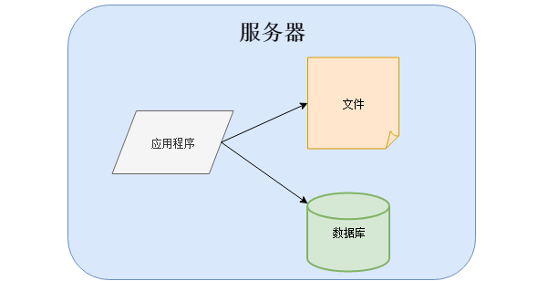
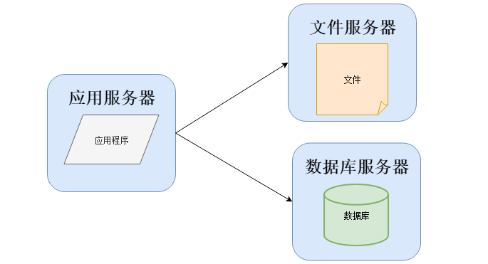
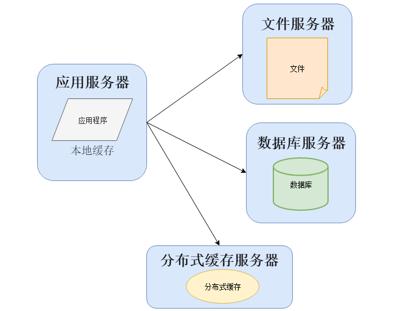
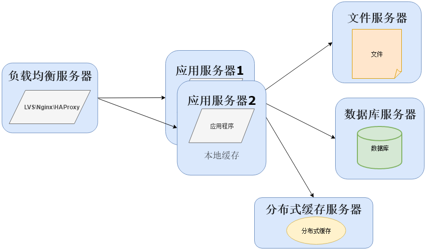
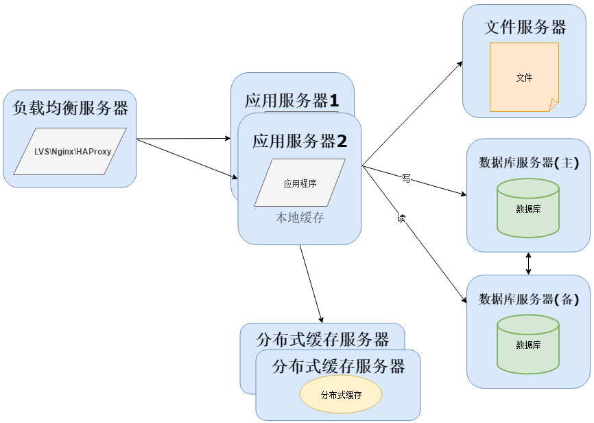
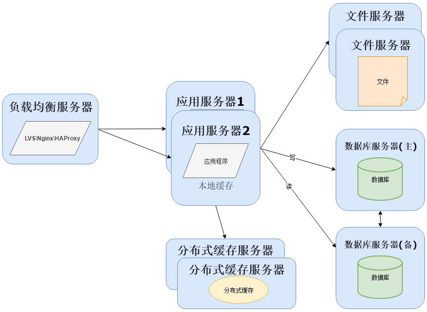
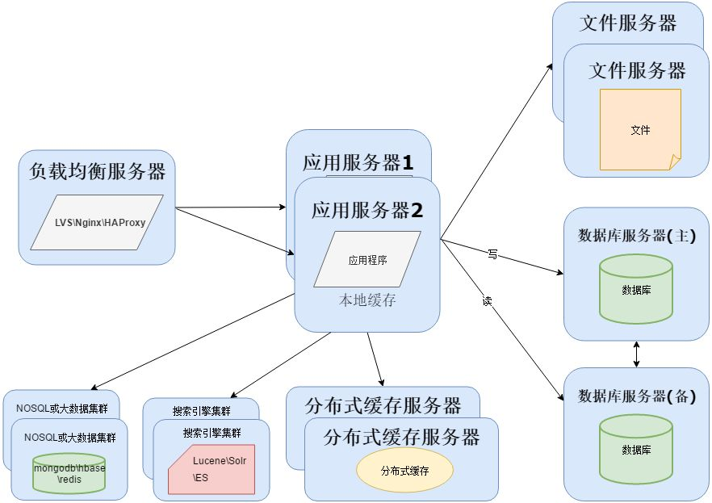
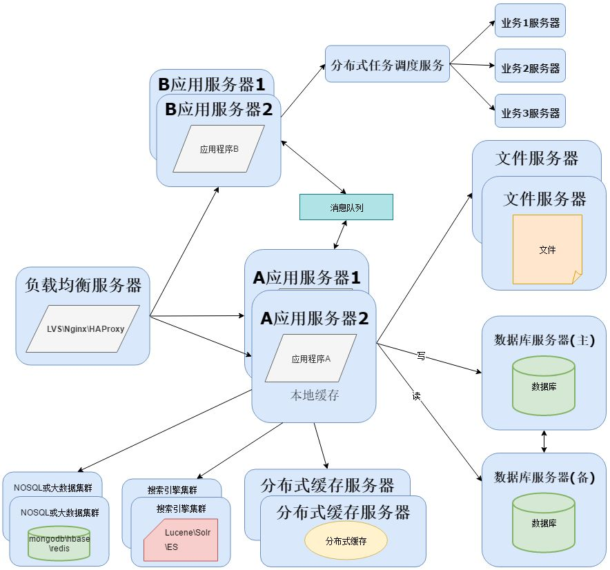
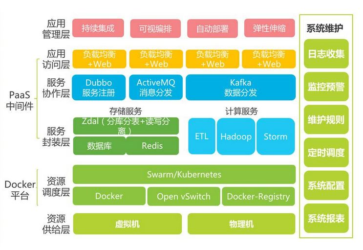

## 从软件架构演变看运维的分工与融合

李博文 2020-03-24 10:40:04

**作者介绍**

**李博文，**新炬网络高级工程师。精通JAVA开发和运维，开发过运营商系统，物联网系统，电网系统，燃气系统，高校系统等大型系统，拥有ITSS服务经理，项目管理师，架构师等认证，拥有丰富的开发经验，擅长软件开发与运维。

 

天下大势，分久必合，合久必分。

——《三国演义》第一回

 

越简单越稳定，越高级越脆弱，递弱代偿。

——《物演通论》王东岳

 

**软件项目最初没有的运维部门**

 

大概12年前，最初进入软件开发领域，那时一个人需要学很多的开发技能和运维技能，上能后端做服务，下能前端写页面，左能做DBA，右能做架构，中间还能运维。

 

那时开发和运维其实没有界限，基本都是一体的，当然也有可能因为公司规模不是特别大，所以分工也没有那么细，也听说过专门有运维部门的公司，但是那时软件运维人员的水平也只能做重复性的工作。硬件和网络运维这里不讲，而那种比较贵的DBA，中小公司一般不会请，所以基本上开发≈运维。软件生命周期中最长的部分在运维阶段，在那个时候开发是要负责整个生命周期的。

 

那个时候架构很简单，有的应用程序、数据库、文件都部署在一台服务器上：

 

 

或者是分开部署，将应用程序、数据库、文件各自部署在独立的服务器上，并且根据服务器的用途配置不同的硬件，达到最佳的性能效果：

 

 

数据库的选择一般情况下有三个：大、中型系统使用Oracle或者MSSQL，毕竟会有厂商进行支持，DBA的质量也比较高。小型系统一般使用MySQL，使用的好坏基本依赖开发人员对MySQL的熟悉程度。然而到了今天，会有专业的人在做开源或者非开源数据库的维护，数据库市场也迎来了百花齐放的春天。

 

**随着业务扩展开始出现分工**

 

当越来越多的人开始使用软件系统，开发的工作日渐繁忙，多数时候在忙着写代码和做项目，运维的工作很多时候无法抽身。这个时候会将几个之前开发系统的程序员组成一个新的组织，这个就是软件运维部门的雏形，他们为了解决一些性能上的问题，可能改变系统架构与部署，比如加入缓存：

 

 

在大部分系统中，都会利用缓存技术改善系统的性能，使用缓存主要源于热点数据的存在，大部分访问都遵循28原则（即80%的访问请求，最终落在20%的数据上），所以我们可以对热点数据进行缓存，减少这些数据的访问路径，提高用户体验。

 

缓存实现常见的方式是本地缓存、分布式缓存。本地缓存，顾名思义是将数据缓存在应用服务器本地，可以存在内存中，也可以存在文件，OSCache就是常用的本地缓存组件。本地缓存的特点是速度快，但因为本地空间有限所以缓存数据量也有限。分布式缓存的特点是，可以缓存海量的数据，并且扩展非常容易，在软件系统中常常被使用，速度按理没有本地缓存快，常用的分布式缓存是Memcached、Redis。

 

当然在用户量继续增长的情况下，应用服务器作为系统的入口，会承担大量的请求，我们往往通过应用服务器集群来分担请求数。应用服务器前面部署负载均衡服务器调度用户请求，根据分发策略将请求分发到多个应用服务器节点这时：

 

 

常用的负载均衡技术硬件的有F5，价格比较贵，软件的有LVS、Nginx、HAProxy。LVS是四层负载均衡，根据目标地址和端口选择内部服务器，Nginx是七层负载均衡和HAProxy支持四层、七层负载均衡，可以根据报文内容选择内部服务器，因此LVS分发路径优于Nginx和HAProxy，性能要高些，而Nginx和HAProxy则更具配置性，如可以用来做动静分离（根据请求报文特征，选择静态资源服务器还是应用服务器）。

 

随着用户量继续增加，数据库成为最大的瓶颈，改善数据库性能常用的手段是进行读写分离以及分表，读写分离顾名思义就是将数据库分为读库和写库，通过主备功能实现数据同步。分库分表则分为水平切分和垂直切分，水平切换则是对一个数据库特大的表进行拆分，例如用户表。垂直切分则是根据业务不同来切换，如用户业务、商品业务相关的表放在不同的数据库中：

 

 

业务量越来越大，产生的文件越来越多，单台的文件服务器已经不能满足需求。需要分布式的文件系统支撑。常用的分布式文件系统有NFS：

 

 

由于项目数据量持续增加，数据库的压力会越来越大，并且传统关系型数据无法处理海量数据。这时需要分离数据存储，对于海量数据的查询和分析，我们使用NOSQL数据库和大数据技术再加上搜索引擎可以达到更好的性能。常用的NOSQL数据库有MongoDB、HBase（依赖Hadoop大数据）、Redis，搜索引擎有Lucene、Solr、Elasticsearch等：

 

 

**单独软件运维部门**

 

当越来越多的开源或者非开源技术加入到项目中，项目成员也会变得越来越多，开始各司其职对现在使用的各种软件进行运行维护和实施部署。

 

一个项目的具体实施并不是编写一个应用程序那么简单，还涉及到为应用程序提供支撑的其他软件，这为单独成立软件运维部门提供了条件。

 

项目运行时间长了以后，会因为技术落后或者性能瓶颈而进行重构，软件运维部门会和开发部门合作，对项目架构进行重构，一般情况下开发会拆分业务，形成分布式应用程序，而应用拆分成分布式，可以使用阿里的Dubbo或者SpringCloud搭建服务：

 

 

为了实现分布式系统，这里需要用到消息队列，消息队列的主要作用有3个：解耦、异步、削峰。消息队列可以选择：RabbitMQ、ZeroMQ 、ActiveMQ 、Kafka。

 

**软件运维部门和开发部门融合**

 

随着技术的发展，近几年自动化运维，自动化部署，自动化测试的兴起，特别是DevOps概念的提出，运维部门和开发部门融合的趋势越来越明显。又开始了开发即是运维的轮回，但这次不同的是，机器替代了人肉运维。

 

DevOps 就是开发（Development）和运维（Operations）这两个领域的合并，那么，为什么要合并这两个领域？原因很多，但首要原因是：目前的两个领域工作流程是脱节的。绝对的脱节。很多公司的开发部门和运维部门之间存在的深刻矛盾，其实就是这个“脱节”造成的。

 

为了解决“脱节”问题，需要使用到很多自动化工具，以及自动化维护平台。于是架构进一步升级：

 

 

持续开发

 

 

 

与瀑布模型不同的是，软件可交付成果被分解为短开发周期的多个任务节点，在很短的时间内开发并交付。

 

这个阶段包括编码和构建阶段，并使用Git和SVN等工具来维护不同版本的代码，以及Ant、Maven、Gradle等工具来构建/打包代码到可执行文件中，这些文件可以转发给自动化测试系统进行测试。

 

持续测试

 

 

 

在这个阶段，开发的软件将被持续地测试bug。对于持续测试，使用自动化测试工具，如Selenium、TestNG、JUnit等。这些工具允许质量管理系统完全并行地测试多个代码库，以确保功能中没有缺陷。在这个阶段，使用Docker容器实时模拟“测试环境”也是首选。一旦代码测试通过，它就会不断地与现有代码集成。

 

持续集成

 

 

 

这是支持新功能的代码与现有代码集成的阶段。由于软件在不断地开发，更新后的代码需要不断地集成，并顺利地与系统集成，以反映对最终用户的需求更改。更改后的代码，还应该确保运行时环境中没有错误，允许我们测试更改并检查它如何与其他更改发生反应。

 

Jenkins是一个非常流行的用于持续集成的工具。使用Jenkins，可以从Git存储库提取最新的代码修订，并生成一个构建，最终可以部署到测试或生产服务器。可以将其设置为在Git存储库中发生更改时自动触发新构建，也可以在单击按钮时手动触发。

 

持续部署

 

 

 

它是将代码部署到生产环境的阶段。在这里，我们确保在所有服务器上正确部署代码。如果添加了任何功能或引入了新功能，那么应该准备好迎接更多的网站流量。因此，系统运维人员还有责任扩展服务器以容纳更多用户。

 

由于新代码是连续部署的，因此配置管理工具可以快速，频繁地执行任务。Puppet，Chef，SaltStack和Ansible是这个阶段使用的一些流行工具。

 

容器化工具在部署阶段也发挥着重要作用。Docker和Kubernetes是流行的工具，有助于在开发，测试，登台和生产环境中实现一致性。除此之外，它们还有助于轻松扩展和缩小实例。

 

持续监控

 

 

 

通过监控软件的性能来提高软件的质量。这种做法涉及运营团队的参与，他们将监视用户活动中的错误/系统的任何不正当行为。这也可以通过使用专用监控工具来实现，该工具将持续监控应用程序性能并突出问题。

 

使用的一些流行工具是Splunk、ELK Stack、Nagios、NewRelic和Sensu。这些工具可帮助密切监视应用程序和服务器，以主动检查系统的运行状况。它们还可以提高生产率并提高系统的可靠性，从而降低IT支持成本。发现的任何重大问题都可以向开发团队报告，以便可以在持续开发阶段进行修复。

 

**小结**

 

软件架构不是一蹴而就的，系统架构并不是一开始设计时就具备完整的高性能、高可用、高伸缩等特性的，它是随着用户量的增加，业务功能的扩展逐渐演变完善的，在这个过程中，开发模式、技术架构、设计思想也发生了很大的变化，就连技术人员也从几个人发展到一个部门甚至一条产品线。

 

这就像物种的演变，从简单到复杂，但是越是复杂的生物，要生存所付出的代价也会越多。反而简单的生物存活的更久更好更成功，这就是递弱代偿。

 

系统架构越来越复杂，确实能应付很多情况，但付出的运维成本也会越来越大，于是又开始将分工出去的运维部分融合，也许过一段时间，又会出现新的分工，谁知道呢？