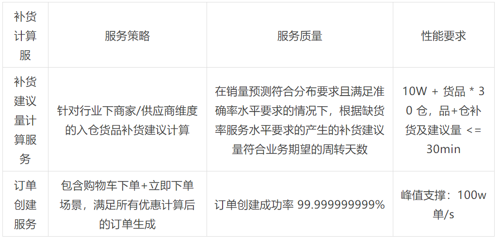
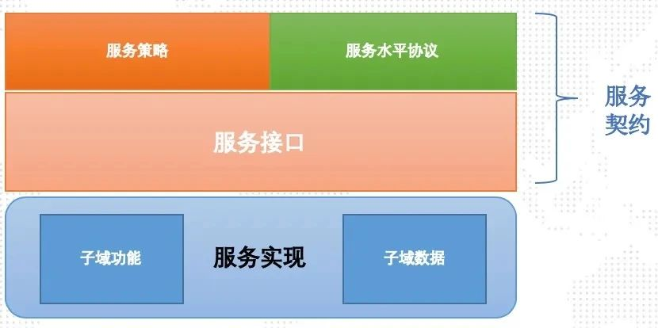
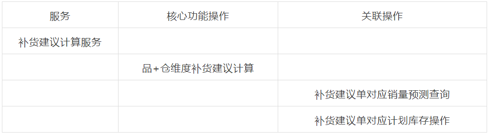
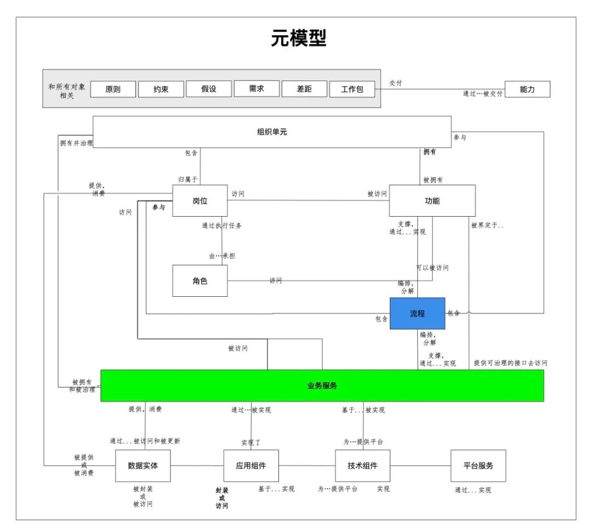
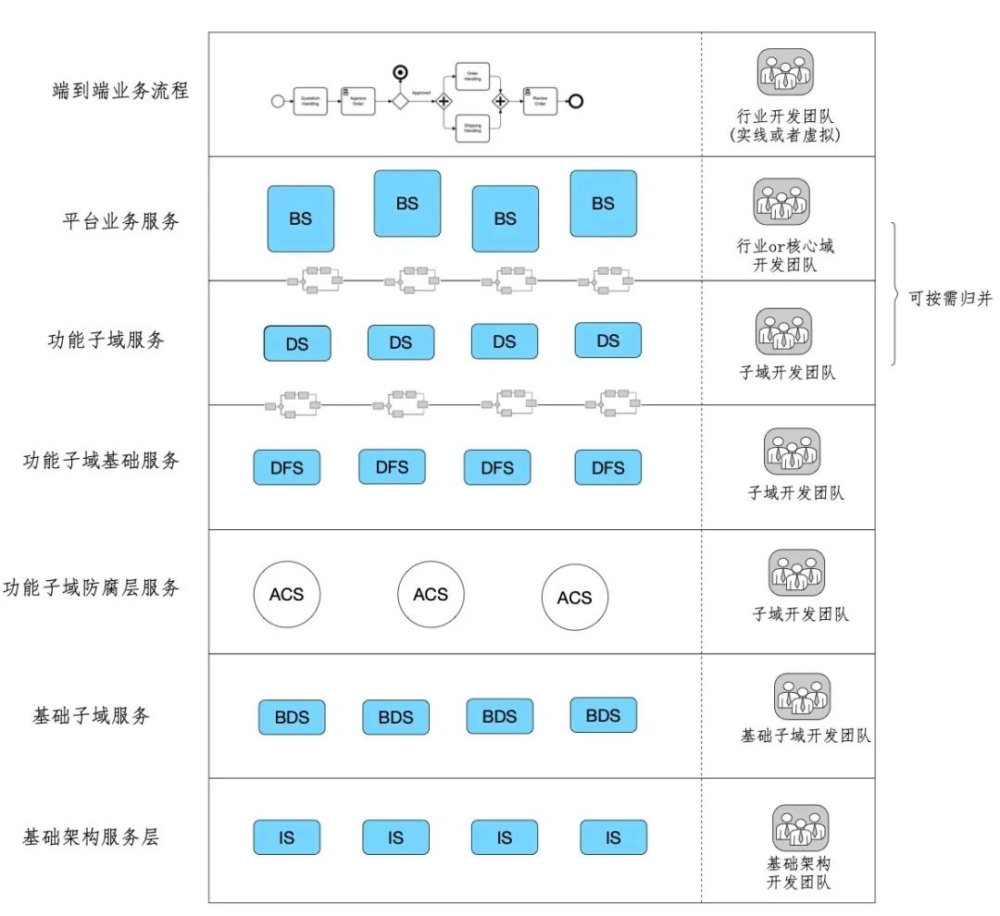
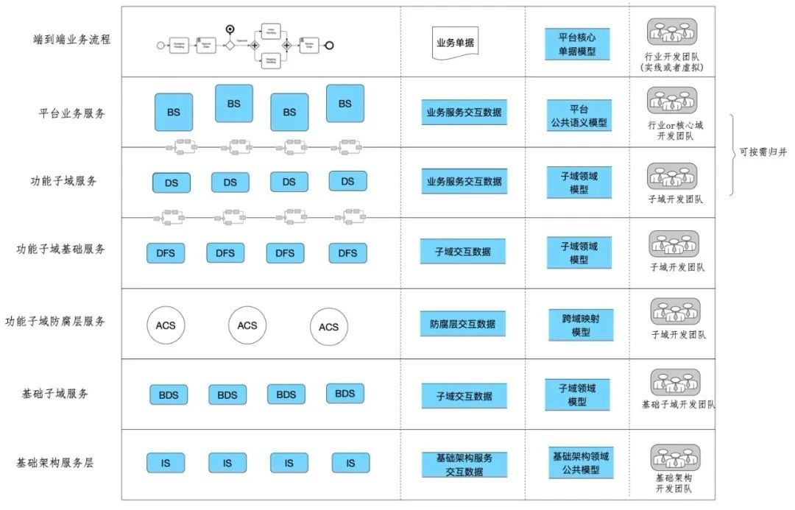
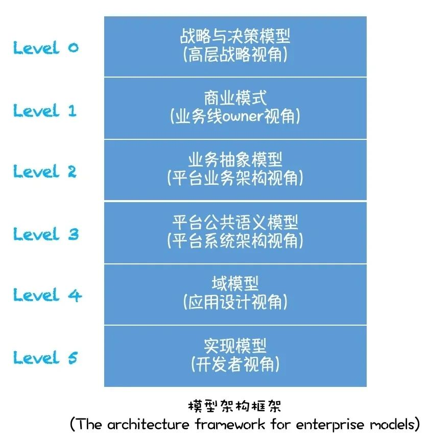
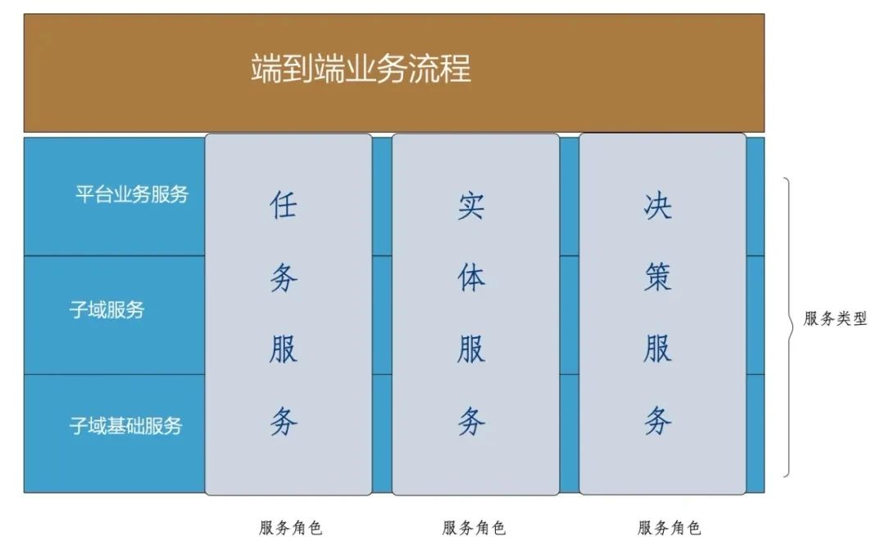

如何统一看待和区别分层架构、微服务架构、分布式架构等主流架构？什么是 SOA？我们采用 SOA 的目的是什么？什么是服务化的本质？如何设计服务以及服务化架构呢？本文，阿里高级技术专家程彦将分享他对面向服务架构的一些看法，并给出相关的步骤和方案。

 

自从提倡 SOA 架构风格以来，个人觉得软件架构并未有特别突破的变革，主要是在 SOA 面向服务架构风格基础上不断演化迭代，基于服务的 EA 明确分层架构也好，微服务也罢，都是在面向服务架构基础上的适应不同的场景的迭代升级。

 

我先抛出一个观点，我觉得服务化架构的本质，和西方教育界深受影响的古希腊哲学家苏格拉底的“产婆术”的教育思想本质上是非常相通的：苏格拉底的“产婆术”思想强调教育是一个“接生”的过程，教师就是“接生婆”，人们之所以接受教育是为了寻找“原我”以不断完善自身。也就是教育的目的在于唤醒而不再于塑造。

 

同理服务化架构的本质也不仅仅在采用什么样的技术框架实现和塑造，更重要的是在于通过不停地在共创中反问、反思、反省等方式进行对业务的本质的不断追溯、抽象、综合归纳演绎，我们的每一个架构师都是服务化架构的接生婆，我们的使命是建立真正反映业务本质并驱动业务不断向前的架构。

 

我们是否足够深入理解业务的本质，做了足够的归纳演绎以及综合抽象，是否清晰的反应到了我们的服务化的根基：业务模型、域模型以及平台公共语义模型上？这是我们每一个参与服务化的每一个产品、架构师、TL 和核心开发同学需要回答的第一个根本问题。

 

**定义**

 

面向服务的架构（SOA）：SOA 是一种架构风格，致力于将业务功能保持一致的服务（系统服务，应用服务，技术服务）作为设计、构建和编排组合业务流程以及解决方案的基本单元。

 

**目的**

 

我们采用 SOA 的架构是为了什么呢？

 

为了更好的复用？为了更好的责任切分？为了接口和实现的分离，提升灵活性和隔离性？还是为了更好的接口分类和管理？

 

以上说法其实都没错，但是面向服务化的架构 SOA 的目的远远超过接口技术细节的设计与定义，其核心的关注点在于服务的业务内容以及内涵，而不仅仅是如何设计和实现。

 

同时，SOA 更多的也不是如何构建一个服务，任何人都可以很容易地创建一个服务，这并不是 SOA 的核心挑战，而是如何赋能企业构建有业务价值意义的完整业务语义的服务集合。

 

面向服务的架构致力于在企业内的不同的业务环境内，建设业务功能驱动的服务，从而将服务组装成有价值、更高级别的业务流程和解决方案平台。

 

面向服务的架构的真正的价值体现在当可重用的服务被灵活组合、编排在一起来构建敏捷的、灵活的业务流程，其中敏捷体现在服务可以快速调整，独立演化；灵活性体现在服务由于其业务功能定义明确，边界清晰且功能内聚性强，同时服务具备各自独立完整生命周期，可被灵活组装。

 

如果面向服务架构能为企业提供了重大的价值，那么这些价值通过什么来体现的呢？

 

**价值体现**

 

- 行为一致性

 

面向服务的架构允许我们为业务流程、任务或者决策拥有唯一的共同的入口，也就是，不管服务访问的路径如何，服务给业务提供的业务行为都是一致的。

 

- 数据一致性

 

面向服务的架构允许我们为业务数据信息提供单一的访问入口，也就是它提供给业务一致的、企业内部共识的公用数据访问。

 

- 模块化及敏捷性

 

面向服务的架构 SOA 为业务功能、业务决策和业务信息的模块化提供了非常好的机制。同时，在模块化实现好的情况下，这些模块可以在多个业务流程和场景中被灵活复用和重新组合，从而为业务竞争力和创造性提供灵活性和敏捷度支持。

 

- 功能与数据的解耦

 

面向服务的架构 SOA 提供了业务功能和信息集成的同时，减少了他们之间的依赖和耦合性。也就是，独立的业务功能单元，应用系统，可以一起协同工作，同时各自又具备各自的演进计划，生命周期和业务目标。

 

- 高度可管理性

 

SOA 提供给我们通过定义服务水平协定在服务模块粒度支撑我们的业务目标，我们可以不断的设定、监控和优化调整组件，应用以及系统所承载服务的考核。

 

其中行为一致性和数据一致性作为服务的核心价值根基。

 

**服务**

 

1、定义

 

 

 

首先我们先定义一下服务是什么？

 

服务是通过服务契约的方式来提供业务功能的独立单元，同时受服务契约所明确管理。

 

服务是设计、构建和编排组合一个完整业务实体中业务解决方案的基础单元。服务契约指定了服务消费方和提供方之间所有的交互约定，包括：

 

- 服务接口；
- 接口文档；
- 服务策略；
- 服务质量；
- 服务可用性；
- 性能。

 

那我们经常听到模块、组件等其他的软件构件，服务和他们有什么区别呢？其中最核心的区别在于服务本身是被明确管理的，其服务质量和性能是通过服务水平协定（SLA）被明确管理的，而模块以及组件并无此约束。此外，服务的全生命周期包含从设计、部署到增强升级和维护都是可管理的。

 

举例（下列内容仅做示例展示用，非适用于严格场景）：

 

 

2、服务构成

 

 

 

服务自身主要包含两个主要方面，第一方面也是服务最核心的方面就是服务的接口，另外一方面则是服务的实现。服务非常好的实现了接口和实现的分离。

 

 

**1）服务接口**

 

服务接口指定了服务的操作，也就是服务是做什么的(What),操作的输入输出参数，以及用来约定如何使用和提供这些能力的协议。

 

服务通常包含围绕着一个核心的业务功能操作以及相关联的操作。例如补货建议计算服务中核心的操作是生成货品+仓维度的补货建议单，其他相关操作包含查询补货建议单相关销量预测操作，查询补货建议单对应计划库存操作。

 

 

**2）服务实现**

 

服务实现指的是服务如何通过其明确定义的接口提供其能力。服务实现可以通过以下方式实现：

 

- 完全基于编码实现；
- 基于其他服务的编排而成；
- 基于已有应用适配封装而成；
- 以上情况混合实现。

 

核心点是服务如何被实现的对于服务消费方来说是透明的，服务消费方仅仅需要关心的是服务是做什么的，而不是如何被实现的。

 

服务可以提供在保持服务接口或者行为约定不改变的情况下，提供根据不同的行业不同场景提供各种不同的实现。

 

服务实现在保持服务接口或者行为约定不改变的情况下，可以自由进行升级和切换。服务实现既可以是静态的更新升级，也可以使动态路由实时切换实现，如对应到不同的行业以及不同的业务场景的自动实现切换。

 

不管服务实现如何升级或者按需自动路由切换，只用服务的行为和契约不会发生改变，用户也就是服务的消费者根本不会感知到任何不同。

 

我们可以把服务接口想象成室内普通电源国标插口，服务策略为室内非防水情况下适用，服务契约想象成 24X7 的 220v 电压供电能力（其中 180V～250V 50Hz 是质量要求，24x7 稳定性要求，电流供给 <= 10A 是性能要求），此国标插座（服务提供方）可以给包含与此接口匹配且符合契约的任何电器（消费方）交互并提供供电能力，支持其运转。

 

服务接口定义了交互的的风格和细节，而服务的实现定义了一个特定的服务提供方或者特定的业务实现如何提供其能力。

 

这种类似连接点/插口的设计极大的方便了更松耦合的业务功能解决方案。

 

3、服务接口与服务实现的逻辑构成

 

 

 

服务接口与实现的构成也有两个重要的不同方面，分别是执行功能的方法和执行的信息数据。换句话说，一个服务是由一个业务服务操作集合以及对应操作的输入输出的抽象业务服务数据模型组成。这层业务服务数据模型是企业业务层次或者平台业务层次的业务实体的抽象，独立于底层数据存储与实现。

 

此业务数据模型是和各子域密切相关联，但是超越各子域以上的，在完整的业务线或者平台层次上达成一致的业务数据模型，也就是说在各子域之间达成共识且约定的严格明确的公共模型，主要用于平台业务流程中不同域服务的交互，是平台层次统一的业务语言，我把它暂时称为平台业务数据模型。此平台业务数据模型通常需要包含平台统一语义的业务术语表，平台各域核心实体表，平台各域核心实体交互图等。

 

 

接口与实现的逻辑构成：

 

**1）服务操作**

 

服务操作声明定义了这个操作的输入以及输出参数。

 

**2）平台业务实体模型**

 

平台业务实体模型描述了服务中输入输出数据的结构以及含义。服务接口中的信息和服务实现中逻辑数据之间的差异是至关重要的。

 

在服务接口层次上，最重要的是信息必须在业务服务之间进行交互来赋能业务流程并完成业务流程。这些信息必须在参与流程的所有业务服务间达成一致且在服务之间通用，也就是平台层次所有服务公用且标准的业务实体模型，同时此业务实体模型必须在平台业务语义上明确且完成，确保可以支撑平台所有端到端的业务。此平台层级的业务实体模型并不是一蹴而就的，但是可以随着平台的重心变化不断迭代完善成型的。

 

然而不同的是，从内部来看，很多服务在各自实现的子域内部都有这些信息的不同的超集，可能潜在的存在不同的数据格式。幸运的是，我们不需要感知也不需要在所有关联服务的相关子域实体模型上达成共识，即使不是不可能，但是也不太现实。与之相反，服务接口和服务实现的分离设计允许非常方便的进行平台业务实体模型和服务所在子域领域模型进行映射转换。

 

**3）服务接口最后一个重要的方面就是服务水平协议 SLA。**服务水平 SLA 协议指定了服务的的两个重要方面的指标，分别是业务上的指标和技术上的指标：

 

- 技术指标：响应时间RT，并发吞吐量 Throughput，可用性 Availability，可靠性 Reliablity；
- 业务指标：完成的业务功能的质量或者完成度，如产生的补货建议是否满足业务预期的周转缺货KPI要求：周转下降 10 天，缺货率下降5%。

 

**服务化分层架构**

 

理解服务化分层架构，首先要对 TOGAF Meta-Model 有个清晰的理解，从元模型可以看出业务服务和业务流程的上承业务，下启系统平台的核心作用，一定要深刻理解业务服务和业务流程在企业架构中的重要性，下面我把我翻译后画的版本给大家放在这里，给大家做个参考，TOGAF 不多做解释，如有需要，大家可以交流。

 

 

通常情况下，我们会按照不同行业的不同的业务流程去搭建系统，如供应链最初在大家电 3W 行业孕育，我们按照 3W 的行业和业务场景搭建了平台商家相适应的计划系统；后续自营行业又根据自己的行业也搭建了自营的计划系统；后续小电数码、国际以及其他业务快速发展，跟随业务快跑的同时，也各自建立的各自的业务流程。在这个过程中，BPM 为建造不同的业务系统提供非常好的抽象支撑，但是经常的结果是，BPM 被用作构建了更高层抽象的，也更高效的，但是却是烟囱式的应用，而不没有更好的贡献更多的支撑到整体上能快速应对业务变化而更灵活，更敏捷的业务平台或者系统。

 

而这正是面向服务的架构中业务规则以及决策作为服务要发挥更大作用的地方。面向服务的架构允许我们将特定业务流程中的业务规则和业务决策抽象分离出来变成业务规则或者决策服务，这些规则和决策服务就可以被灵活应用到不同的业务流程中，从而这些服务可以被统一管理和演化升级。

 

BPM + SOA 一起提供了支撑企业架构的完美组合。BPM 提供更高层抽象定义业务流程的能力，以及与流程相关联的重要监控和管理能力；业务服务提供了支撑业务流程的核心的功能、决策以及信息。面向服务的架构则提供能力将服务组合在一起来支撑和创建灵活且敏捷的端到端的企业业务。如果只有 BPM 而没有 SOA 对于创建单独的业务应用或许非常有用，但是通常是创建的烟囱式的应用，很难扩展到企业内或者平台内不同的业务线。如果只有 SOA 而没有BPM虽然可以创建可重用且一致性高的服务，但是缺少将这些服务快速搭建业务流程并支撑端到端业务的能力，也无法支撑建立具有竞争力且可以随着外部竞争环境进行敏捷反应的业务。

 

下图显示了一个建议的的封层服务化架构图，各分层如下：

 

- 端到端业务流程

 

业务流程是按照一定业务规则决定的顺序执行的业务操作组成。高层级的业务功能，通常跨越应用域或者业务线。通常由行业开发团队开发，此行业开发团队可以具备明确的实现组织结构，也可以由跨团队的相关域共同组成虚线团队。例如，电商业务中，用户选购下单交互流程；供应链业务中的补货调拨计划流程等。

 

- 平台业务服务

 

高度模块化的业务功能单元，由不同类型的子域服务组合编排而来，可作为业务流程的编排单元。跨行业通用的业务服务可由功能所在核心域开发团队编排开发，行业内通用的业务服务可以由行业开发团队负责编排开发。例如，补货审批服务

 

- 子域服务

 

平台各功能子域提供的服务，对平台可见，用于平台业务服务的组合编排，也可以作为更高层的业务流程编排的基础单元。子域服务通常由平台各子域开发团队负责开发。例如，销量计划服务，补货建议计算服务。

 

- 子域基础服务

 

用于支撑各功能子域服务的基础服务，对子域可见，对平台不可见，用于子域服务的编排。

 

子域基础服务通常由平台各子域开发团队负责开发。例如，入仓决策服务，计划单据服务，计划库存服务等。

 

- 基础子域服务

 

或称为基础业务域服务，提供平台基础业务服务，为各个功能子域或平台业务服务提供基础业务功能及数据服务。例如：商家服务，货品服务，库存服务等。

 

- 基础架构服务层

 

提供不同层次所公用的基础架构服务，如用用户管理，权限管理，操作审计等等。

 

 

我们通常按照上述分层结构来描述平台架构或者企业内部架构，看上去好像层次结构清晰明了，但是却是不完整的，因为此面向服务的架构描述缺失了平台系统架构中一个核心部分，暨信息及信息模型分层，这一点非常之关键，往往会决定架构的成功与否。

 

为了使架构更完整同时也更真实，我们需要添加对应的完整信息抽象（实体模型 or 领域模型）：

 

- 核心单据模型

 

端到端业务流程中操作的核心单据，承载业务核心价值的信息单元模型，例如，销售订单，采购订单，补货计划单等。此模型通常是平台公共语义模型的核心子集。

 

- 平台公共语义模型

 

定义了平台层业务流程、业务服务交互数据。在平台层面或企业层面，端到端业务流程中交互信息的公共语义模型，此模型不仅对平台业务流程中交互的各实体进行了明确的定义，而且包含了业务流程中所需要的完整的业务语义实体，同时各业务语义实体边界明确，责任清晰。核心单据模型通常是平台公共语义模型的子集。

 

平台公共语义模型包含下层子域的对外服务实体子集，按照端到端的完整平台业务语义，可由平台各功能子域模型所共享给平台的核心实体子集有机整合而成，也可由平台业务模型全新定义，或者从 TOP-DOWN 以及 BOTTOM-UP 两个方向共同融合而成。需要注意的是此模型必然是无法一蹴而就，需要经过无数迭代而不断完善，但其一定是不可或缺的。平台的诸多架构决策和不断演化完善需要基于此模型来进行。

 

- 子域领域模型

 

平台各功能子域的领域模型，用于驱动各功能子域的应用系统设计和开发。子域领域模型需要保持动态稳定，通过防腐层同所依赖的外域或者外部服务进行隔离，防止外部服务污染子域内的核心业务语义，同时保持域内业务功能灵活可控。子域领域模型仅通过其对外服务实体子集对外可见，其余对外不可见。

 

- 跨域映射模型

 

用于各子域领域模型实现对外部模型的防腐依赖。

 

- 基础架构服务层

 

提供不同层次所公用的基础架构信息模型，如用户模型，权限模型等。

 

 

**信息架构模型框架**

 

现在来讨论下服务化分层架构重视度并不太高的另一个重要侧面：信息架构，之所以说信息架构非常之重要，是因为信息架构与服务化架构是一个密不可分的完整的整体。我对信息架构模型进行了分层划分，下面从 TOP_DOWN 方向来讨论不同的分层模型。

 

 

**Level 0：战略与决策模型（高层战略视角）**

 

这层次模型用于定义企业的战略方向和商业目的，从而定义了企业内任何系统平台开发的方向和终局。这必然作为企业内任何系统平台开发的基本背景和基调，影响任何系统平台开发项目的中长期目标定义和终局设定。

 

**Level 1：商业模式（业务线 owner 视角）**

 

这层模型从业务线 owner 的视角，用运营主体的业务术语描述其商业模式的本质，包括其整体结构，业务流程，以及组织结构等。

 

**Level 2：业务抽象概念模型**

 

这层模型从业务架构的视角用信息化的方式对单个业务线或者多个业务线的业务进行抽象。Level 1 描述是对于企业业务来说有意义的东西或者事情，而 Level 2 则给予这些有意义的东西以更严格且清晰的定义，明确其内涵以及外延并体系化，同时根据不同行业线的业务内容进行提取抽象，抽象出共性的内容，用于更高效灵活的描述和定义业务 。

 

Level 1 描述的是业务运营人员所感知的业务流程，Level 2 不仅描述了这些业务流程，更重要的是抽象并描述了了这些业务流程所应该包含的底层业务功能。

 

同样的，Level 1 描述对企业业务来讲所有重要的东西，Level 2 描述的是组织想要管理的信息后面最根本的内容。Level 1 描述的事情是 Level 2 定义的基本实体的实际业务中对应的样本或事例。

 

简而言之，Level 2 是 Level 1 的抽象（Abstraction）与综合（Synthesis）。为了达成这一视图，必须要仔细分析和归纳，有时候需要演绎的方式来定义出隐藏在企业业务运营主体视图下根本结构和内容。

 

**Level 3：平台公共语义模型**

 

Level 3 层公共语义模型同 Level 2 层业务概念模型保持紧密一致，在此基础上增加了服务化视角的语义。Level 3 公共语义模型描述的内容是在必须在平台层业务服务间共享的具有一致语义的业务实体和信息，是平台层一致的共享信息模型。这层模型用于描述平台层服务接口交互的共享信息，基于平台完整业务语义下所有服务所公共数据的标准化视图模型。简而言之，平台公共语义模型，定义了业务平台层次基本业务服务语义，是平台各业务服务之间，平台业务流程和平台业务服务交互的统一语言。

 

**Level 4：域模型**

 

Level 4 层域模型定位于平台各子域的领域模型/实体模型，用于对各子域的核心业务功能进行抽象。域模型是平台各子域的标准模型，不仅明确定义的各子域功能服务暨服务接口的语义，同时也包含各子域内服务实现中的关键实体的定义。域模型从整体上来说是平台各子域的私有模型，除了服务语义外整体不对外可视。公共信息中的服务视图是域模型的子集。

 

域模型核心用于除了用于暴露到平台子域的业务服务设计与实现外，同时也用于驱动域内服务功能的设计和实现。

 

域模型是需要保持动态稳定的，除非域内业务发生本质变化，域模型应该是相对稳定的。域模型稳定性最大的敌人是外部的依赖，如何不受外部依赖的侵蚀而逐渐腐败，域防腐层存在的最主要原因。子域防腐层维护外部依赖服务和子域模型之间的动态映射，维护域模型的独立性，保护域模型不受有害侵蚀。

 

域模型我理解基本和我们通常谈的领域模型基本接近，对于各域内业务的抽象，驱动各域技术设计方案设计和实现，至于具体的模型表现形式，采用基于亚里士多德的物质本源的思想（“Material Cause,Formal Cause,Efficient Cause,Final Cause" —> 实体+属性+关系）的ER图，还是基于我们老祖宗老子道家思想("人法地、地法天、天法道、道法自然" —> 实体+行为)的思想的领域驱动 DDD 的方式，个人认为各有伯仲，组中能清楚表达出业务本质即可，后面单独写一篇抽象建模的文章聊一下这两种不同的思想。

 

**Level 5：实现模型**

 

此层模型为开发者视角的实现模型，也就是我们系统实现核心的对象模型，是我们系统落地的基石。

 

**设计服务**

 

我们初步了解的什么是服务，以及什么是服务化的分层？那如何设计服务以及服务化架构呢？下面给出基本步骤和方案。

 

1、理解整体背景

 

 

 

首先，我们要理解服务化架构的整体背景。我们必须理解我们所支撑的业务和业务根本驱动力以及所有的业务流程，业务场景以及业务用例；同时对于平台系统，我们还必须理解公司的战略所赋予平台的使命是什么？我们平台中长期的目标是什么？平台的终局是什么？这些组合和在一起才是服务化架构的完整的上下文背景。这些必须要反映到我们的业务模型、平台公共语义模型和各域模型中去。

 

然后，我们需要提出并回答如下问题：

 

- 我们当前支撑的是什么样的业务？（业务模型）
- 这个业务或者这些业务的中长期目标和短期目标分别是什么？
- 平台的短中长期目标是什么？平台的终局是什么？
- 上述目标是否存在冲突，如何平衡和取舍？
- 实现这些目标，需要完成什么样的成果？
- 这些成果如何衡量？
- 取得这些成果，需要什么样的能力和信息？
- 实现这些能力需要什么样的流程、服务、实体以及规则
- 现有的服务、应用或者系统提供了那些基本能力和信息？

 

前面六个问题描述了整体的架构需求（包括业务和平台），而剩下的问题则描述了整个服务化架构的上下文以及引入了服务目录库的需求。我们服务不能只从单个服务的角度来看，而必须从整个服务集合的角度来反应完整的业务语义和平台语义。我们的服务集合也就是服务目录库必须具备完整的上下文语义，必须能识别出：

 

- 整体的上下文背景，包括完整的业务语义和平台语义；
- 服务职责范围；
- 关联的服务的分组；
- 服务的类型和角色。

 

服务目录库的设计必须支持两个主要的设计时目标：

 

- 第一个目标是要提供一种机制来帮助理解服务整体的上下文背景，用于更好的服务选择及更高效的服务重用。特别是，这个服务实现了什么样的责任，以及如何和其他的服务相关联；

- 第二个目标是要提供一种机制来识别一个特定服务的责任边界，用来指引服务的实现。这是一个非常关键的点，特别是在避免服务的功能和数据重复上非常重要，不仅仅是避免重复建设，更核心的是要以此保证业务功能和数据的一致性。

   

服务目录库中的服务可以按照服务类型以及服务角色来进行组织。服务类型请参照服务化分层架构内容里的描述；服务角色包含任务服务角色、实体服务角色和决策服务角色，请参照后面小节描述。

 

2、服务设计原则

 

 

 

面向服务化的架构的其中一个成功的关键是创建一个具备完整业务语义的服务集合以便于可以方便一起进行组合编排来支撑不同的业务流程以及丰富的业务场景。

 

我们经常谈论各功能域要提供松耦合的服务，是因为服务间的松耦合是非常重要的，特别是通过减少服务间的依赖以便于服务可以在不同的场景中被复用，以及可以起到隔离变更影响的作用。但是如何才能尽可能的实现这个目标呢？

 

首先我们来看下对于服务最重要点是什么？首先就是这个服务提供了什么样的业务功能，其次这个服务对业务有价值的数据产生了那些影响。从这两个点上我们就可以比较容易得出两种类型的耦合在服务接口设计中是特别重要的：

 

- 数据依赖；
- 功能依赖。

 

举例来说明下：

 

交易服务协调所有的活动，然后依赖其他服务来帮助完成流程。交易服务依赖于或者说耦合于用户服务，商品服务，库存服务，营销服务、订单服务以及支付服务等。

 

为啥交易服务没有实现所有的功能？

 

首先是因为我们想在其他高级别流程或者服务中重用底层的能力。

 

第二是交易服务服务并不负责用户服务，商品服务，库存服务，营销服务、订单服务以及支付服务。交易服务只是使用它们，而不是负责实现它们。

 

用户服务被用作管理客户信息访问，它具有唯一的责任来提供、维护和更新客户信息，这样做的目的是为了可以在任何需要访问客户数据服务的地方重用客户服务。比代码重用更重要的是隔离或者是集中式访问客户信息，因为只有唯一的路径访问数据，数据就总是一致的，真正实现 Source Of Truth。因此，尽管有很多服务包含交易服务，购物车，订单历史等服务需要访问客户服务,通过松耦合的这种模式去管理这些依赖是比较容易被理解的。

 

通过创建服务来执行用户管理，商品管理，库存管理，以及营销管理等，就可以在任何可以用到的地方，执行保持一致性的这些业务功能。

 

敲黑板：好的服务设计并不仅仅是关注重用性，更重要的是要提供一致性,既包含功能一致性，也包含数据一致性。

 

那么下一个问题是你如何决定有哪些服务以及这些服务分别是什么呢？同样，你用功能分解和信息隔离组合在一起来决定服务有哪些并且各自是什么？

 

- 对线上交易功能的分解引导去识别用户、商品、库存、营销、订单以及支付等相关功能服务；
- 对信息的隔离引导我们去识别用户和商品等作为交易订单中的共享信息；
- 面向服务的架构中服务设计的问题需要跨越多个以致于所有的流程中来一起考虑。

 

因此，服务设计原则基本原则如下：

 

- 避免服务间的功能重复；
- 避免服务间的功能缺失；
- 避免数据重复；
- 实现数据的协同访问；
- 具备统一、一致的方式来执行给定的功能。

 

在服务化设计中，如何实现上述的这些原则呢？答案是提出并回答如下问题：

 

- 谁负责这个功能？
- 这个功能在哪里被用到的？
- 谁负责管理这些指定的数据？
- 谁负责定义和实现那些特别的业务规则？
- 流程中的哪个步骤具备执行这个任务所需要的特定的知识。

 

这些问题的答案会帮你来识别如下信息：

 

- 服务应该做什么？
- 服务对什么负责？
- 同样重要的是，识别服务不应该做什么，而应该依赖其他的服务来支撑。

 

3、服务颗粒度与类型

 

 

 

我们通常设计服务时候一个很大的疑惑是我的服务到底要设计成什么样的颗粒度，应该更粗粒度一些，还是更细粒度一些？答案是：没有一个统一正确的服务颗粒度标准。那怎么办？我如何设计我的服务的颗粒度呢？虽然没有统一的标准，但是我们可以依赖下面的因素来决定合适的服务粒度：

 

- 谁是服务的潜在消费方？其他服务，业务流程还是外部合作方？
- 服务在哪里被消费，通过什么样的路径被消费，也就是服务的拓扑结构是什么？
- 服务的性能要求是什么？
- 服务预期的业务范围或者边界是什么？

 

在几乎任何复杂的环境或者系统平台中，我们可以预期到多种多样类型的服务。这些服务具有不同的类型和颗粒度，可以参考服务化分层中的内容，也可以见下面的描述：

 

- 端到端的业务流程

 

业务流程通常跨越整个企业或者平台多个业务域，通常是由底层服务构建而成

 

- 平台业务服务

 

业务服务是最粗粒度的服务，业务服务提供高度抽象的，组合的业务功能给到平台或者企业。业务服务的功能和数据同业务流程所需要的业务语义紧密结合。数据整合服务在这个层次提供端到端的业务流程所需要的整合后的数据。

 

- 子域服务

 

子域服务是中等粒度的，他们提供特别针对于每个业务子域的业务相关服务,被本域内的不同业务服务所使用，但是未必暴露出子域外

 

- 子域基础服务

 

子域基础服务通常是最小粒度的服务，他们提供更低层次的服务，用来提供子域内子域业务功能的基本功能支撑

 

- 基础子域服务

 

子域基础服务通常也提供教小粒度的服务，用于支撑上层业务功能服务的业务功能完整实现。

 

- 基础架构服务层

 

基础架构提供了在更高层级服务构建中细粒度的能力，独立于任何业务域。这些服务需要和业务相关明确区分开来，例如安全认证，权限管理以及纯粹技术编排服务。

 

4、服务角色

 

 

 

独立于服务的粒度，职责范围以及服务创建以外的另外一个重要考量或者说是侧面是：服务在服务组合或者流程编排中所承担的角色是什么？

 

那么怎么来区分不同的角色呢？我们使用关注点隔离的架构原则。例如，我们在构建应用中就使用了将数据同逻辑隔离作为重要的概念。这样不仅提供了不同关注点解耦的可能以及机会，而且允许采用不同的方式，在不同的地方来实现这些不同的关注点。

 

对业务流程进行单独管理的BPM就是一个非常好的例子，BPM作为另外一个关注点分离的例子，将业务流程方案从其他逻辑中分离出来，可以使工作流程可以在一个特定的层次或者环境内进行执行和管理, 这样就可以实现通过快速的建立新的流程模型来快速响应业务的变化。同时面向服务的架构SOA提供了将业务服务作为构建业务流程的基础构件的功能。

 

业务规则系统BRMS同样也作为一个关注点分离的例子，将业务规则或者业务决策从其他应用逻辑中区分开来，这样业务规则和业务决策也可以在一个特定的层次被执行和管理，从而就可以很容易的被变更来支持新的业务需求。这里，业务规则以及决策服务也是面向服务的机构来暴露出规则和决策服务来支撑规则和决策与业务流程的分离。

 

通常我们通过较粗粒度的来定义三大类服务角色来构建不同的服务层次：

 

- 任务服务角色

 

任务服务通常实现一个完整的业务功能，既可以是基本业务功能，也可以是复杂的业务功能，如计算某个货品在某个仓的补货量，或者一个简单的业务校验，如此货品在此仓是否可补。

 

此服务类型颗粒度范围较广，包含从独立的子域基础服务到大的平台业务服务都可以具有任务服务角色，更小颗粒度的服务倾向于具有更通用的目的,更大的可重用的潜力。业务服务几乎总是承担任务服务的角色，通常是小颗粒度服务较大的组合，可以被设计成支持一个或者更多特定的流程。因此这些服务通常在跨业务流程中广泛复用的潜力更低。但是也是正常的，因为他们通常是有其他可重用的服务组成的。

 

通常，具有业务角色的服务是主动服务，通过主动行为来提供价值。

 

- 实体服务角色

 

主要管理访问业务实体的服务具有这个角色。业务实体的例子如用户、类目、商品、价格、库存、购物车，主要对应主要的业务信息。实体通常是中到大型实体，倾向于独立于任何特定的业务流程,而可做为多个不同业务流程的组成部分。具有实体服务角色的服务通常通过适配和提供需要的信息来实现任务的方式来支撑任务服务。实体服务通常都具备较大的重用的潜力。

 

- 规则 / 决策服务角色

 

规则 / 决策服务是通过执行业务规则来提供业务决策的服务，如补货计划自动审核服务。

 

规则 / 决策服务通常用作对复杂问题进行判断或者支持变化频繁的业务规则，如复杂且多变的审核规则等。

 

规则 / 决策服务通常为小到中等大小颗粒度，通常用来组装成更大的服务。规则/决策服务是可以不同层次不同类型的服务，包括平台业务服务，子域服务，子域基础服务等，但是通常情况下规则/决策服服务也来支撑这些服务类型。

 

 

我们通过组合这些不同类型的服务角色来提供灵活的业务能力，从而用来支持业务流程内的活动。我们提供了一些基本原则来帮助我们进行服务组合以便于帮我们减少依赖，限制耦合以及最大化灵活性。

 

服务层次以及组合基本原则：

 

- 业务流程的任务通过任务服务实现，业务流程路由的核心规则由规则/决策服务来提供，而不是定义在流程网关内。这一块内容后续详细说明；
- 更高层次的任务为核心的业务服务由其他更小的服务组成；
- 服务依赖严格单向原则，上层服务可以依赖下层次服务以及同一层次服务，但是下层服务不可以依赖上层服务；
- 一个任务服务可以组合规则/决策服务、实体服务以及其他任务服务；
- 但是一个实体服务不允许直接调用其他实体服务。

 

现在我们可以通过丰富的流程，实体和决策服务的集合，可以创建新的不同的服务组合，把规则的灵活可变的好处同服务化架构的模块化，灵活性以及重用性结合起来作为业务系统平台级别的基本架构方式。

 

**服务化如何成功？**

 

1、大规划

 

 

 

大的规划首先要明确 2-3 年内的服务化的目标。大的规划切记事无巨细，而是根据长期规划设定明确的指导性原则和要求，在体系化的基础上鼓励协同和创新。

 

2、小目标

 

 

 

服务化不应该是运动式的大跃进推进，而应该是坚持试点、推广、总结、扩大试点，从而由点到面，逐步落实的方法，由各域根据规划的体系化要求，再各自情况暨各自成熟度来设定各自服务化目标，制定一个个小目标，快速迭代，敏捷式的总结推进。

 

3、真共识

 

 

 

建立共识的根本是要讲清楚服务化的目标、架构、设计、开发背后的清楚的逻辑，让每个人想的清楚，听的明白。

 

4、接地气

 

 

 

接地气同达成共识一样，要用朴素的工程师语言讲清楚目标和逻辑，而不是拿各种看上去非常光鲜亮丽的各种名词来充当台面，讲的人解释不清楚，听得人一头雾水，没有体系化逻辑来支撑落地，最终很难达到服务化真正的目标的。

 

5、结硬寨

 

 

 

服务化是一个庞大的，迭代的，渐进的体系化工程，不是快闪战，不是突袭战，是场持久战，一定要有曾国藩的“结硬寨，打呆仗”的耐心和准备，踏踏实实落地迭代推进，小步快跑，在坚持体系化思考的基础上进行持续总结改进，通过一个接一个战斗，一个小胜利接一个小胜利，一个战役接一个战役不停的攻城略地的基础上逐渐迈向成功。

 

6、Think Fast & Slow

 

 

 

一句话，高效的方式就是慢想、快干。我们不一定缺少高执行力的人，但是一定缺少能独立思考并体系化行事的人。

 

作者丨 程彦

来源丨 阿里技术（ID：ali_tech）

dbaplus社群欢迎广大技术人员投稿，投稿邮箱：editor@dbaplus.cn