[toc]

# show engine innodb status \G

1. **mysql> show engine innodb status \G** 
2. **---LOG**
3. **（Innodb 事务日志相关信息，包括当前的日志序列号（Log sequence number），已经刷新同步到那个序列号，最近的check point到那个序列号了。除此之外，还显示了系统从启动到现在已经做了多少次check point，多少次日志刷新。）**
4. **---（注：小括号为官方解释。）**
5.  **Log sequence number 2560255（当前的日志序列号,log buffer中已经写入的LSN值,//字节，日志生成的最新位置，最新位置出现在log buffer中）**
6.  **Log flushed up to 2560255（刷新到日志重做日志文件的lsn,已经刷新到redo logfile的LSN值//字节，日志已经写入到log file的位置，1-2=log buffer日志量，最好是<=1M）**
7.  **Pages flushed up to 2560255（写入磁盘的脏页的lsn。记录在checkpoint中//字节，脏页的数量(日志字节数来衡量)，2-3=脏页的数量(日志字节为单位)）**
8.  **Last checkpoint at 2560246（刷新到磁盘的lsn,最近一次checkpoint时的LSN值//字节，共享表空间上的日志记录点，最后一次检查点，及崩溃恢复时指定的起点，3-4就是崩溃恢复多跑的日志，值越大说明需要提升checkpoint的跟进速度）**
9.  **0 pending(挂起) log flushes, 0 pending chkp writes**
10.  **10 log i/o's done, 0.00 log i/o's/second**

 

解析：

- Log sequence number：日志序列号：现在已经产生到的日志量（字节）
  - 不同时刻的lsn的值的差值/时间差==日志的产生速度
- Log flushed up to：刷出去了多少日志
  - Log sequence number - Log flushed up to== 当前logbuffer的值
  - 所以，此值应<<1M
  - 不同时刻的差值/时间间隔==日志的写入速度
- Pages flushed up to
  - Log sequence number - Pages flushed up to 值很小，说明脏页写入的很快
- Last checkpoint at：检查点。系统启动的时候，日志恢复的起点，肯定比Pfut的值低。防止系统崩
  - Log flushed up to - Last checkpoint at == 系统要恢复的日志数
  - Pages flushed up to - Last checkpoint at == checkpoint的跟进速度，如果大的话，说明checkpoint需要增大。

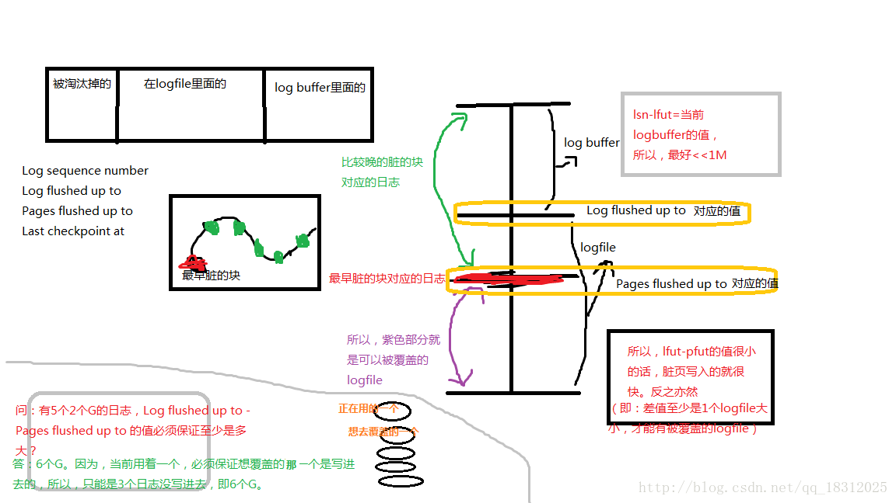

问：有5个2个G的日志，Log flushed up to - Pages flushed up to 的值必须保证至少是多大？
答：6个G。因为，当前用着一个，必须保证想覆盖的下一个是写进去的，所以，只能是3个日志没写进去，即6个G。

------

## 四个参数能反应出来什么

1.日志的生成速度？

- 不同时刻的Log sequence number的值的差/时间差==每秒生成的日志量

2.日志的写入速度？

- Log flushed up to

3.脏页的写入速度？

- Log flushed up to - Pages flushed up to ==脏页的写入速度

4.数据库的启动时间是多少？

- 启动时要回滚的日志数

------

# Checkpoint详解

## 引子

checkpoint是一个内部事件，这个事件激活以后会触发数据库写进程(DBWR)将数据缓冲(DATABUFFER CACHE)中的脏数据块写出到数据文件中。

## check point是做什么的

在数据库系统中，写日志和写数据文件是数据库中IO消耗最大的两种操作，在这两种操作中写数据文件属于分散写，写日志文件是顺序写，因此为了保证数据库的性能，通常数据库都是保证在提交(commit)完成之前要先保证日志都被写入到日志文件中，而脏数据块则保存在数据缓存(buffer cache)中再不定期的分批写入到数据文件中。也就是说日志写入和提交操作是同步的，而数据写入和提交操作是不同步的。这样就存在一个问题，当一个数据库崩溃的时候并不能保证缓存里面的脏数据全部写入到数据文件中，这样在实例启动的时候就要使用日志文件进行恢复操作，将数据库恢复到崩溃之前的状态，保证数据的一致性。**检查点是这个过程中的重要机制，通过它来确定，恢复时哪些重做日志应该被扫描并应用于恢复**。

一般所说的checkpoint是一个数据库事件(event)，checkpoint事件由checkpoint进程(LGWR/CKPT进程)发出，当checkpoint事件发生时DBWn会将脏块写入到磁盘中，同时数据文件和控制文件的文件头也会被更新以记录checkpoint信息。

## 作用

checkpoint主要2个作用：

- **保证数据库的一致性**，这是指将脏数据写入到硬盘，保证内存和硬盘上的数据是一样的;

- **缩短实例恢复的时间**，实例恢复要把实例异常关闭前没有写出到硬盘的脏数据通过日志进行恢复。如果脏块过多，实例恢复的时间也会很长，检查点的发生可以减少脏块的数量，从而提高实例恢复的时间。

  通俗的说checkpoint就像word的自动保存一样。

## Checkpoint所做的事情

**将缓冲池（buffer pool）中的脏页刷回磁盘**。每次刷新多少页到磁盘，每次从哪里取脏页，以及什么时间触发Checkpoint。在InnoDB存储引擎内部，Checkpoint负责这些事。

## checkpoint分类

有2种Checkpoint：

- Sharp Checkpoint（完全检查点）
- Fuzzy Checkpoint（模糊检查点）

## checkpoint的具体解释

### 1.Sharp Checkpoint（完全检查点）

数据库关闭时，会将所有的脏页都刷新回磁盘，这是默认的工作方式。参数 **innodb_fast_shutdown=1**

### 2.Fuzzy Checkpoint（模糊检查点）

但是若在数据库运行时也使用完全检查点，那数据库的可用性就会受到很大影响。
所以，在InnoDB存储引擎内部使用Fuzzy Checkpoint进行页的刷新，即**只刷新一部分脏页**，而不是将所有的脏页刷回磁盘。

#### Fuzzy checkpoint工作过程

- 先读LRU list，把一部分脏页（相对冷的）写到磁盘上；
- 再找Frush list，把最早脏的写到磁盘上。（更新检查点）

#### Fuzzy Checkpoint又分为4种

- ①Master Thread Checkpoint
- ②FLUSH_LRU_LIST Checkpoint
- ③Async/Sync Flush Checkpoint（异步/同步 flush检查点）
- ④Dirty Page too much Checkpoint

##### 1）Master Thread Checkpoint

对于Master Thread 中发生的Checkpoint，差不多以每秒或每十秒的速度从缓冲池的脏页列表中刷新一定比例的页回去磁盘。这个过程是异步的，即此时InnoDB存储引擎可以进行其他的操作，用户查询线程不会阻塞。
–》即：常规性的fuzzy checkpoint，写入操作不阻塞用户线程

##### 2）FLUSH_LRU_LIST Checkpoint

FLUSH_LRU_LIST Checkpoint是因为InnoDB存储引擎需要保证LRU列表中需要有差不多100个空闲页可供使用。在innodb1.1X版本以前，需要检查LRU列表中是否有足够的可用空间操作发生在用户查询线程中，显然会阻塞用户的查询操作。若没有100个可用空闲页，那么innodb会将LRU列表末端的页移除。如果这些页中有脏页，那就要进行Checkpoint，而这些页是来自LRU列表的，因此成为FLUSH_LRU_LIST Checkpoint。
–》即：Flush lru list checkpoint：flush list上的脏页数量超过阈值；会阻塞用户线程。

##### 3）Async/Sync Flush list Checkpoint

（在数据库的报错日志里能够看到！）
Async/Sync Flush list Checkpoint指的是重做日志文件不可用的情况，这时需要强制将一些页刷新回磁盘，而此时脏页是从脏页列表中选取的。若将已经写入到redo log的LSN（Log sequence number）记作redo_lsn，将已经刷新回磁盘最新页的LSN记为checkpoint_lsn，则可定义：
**redo_lsn - checkpoint_lsn == checkpoint_age**
又定义：
**async_water_mark==75% \* total_redo_log_file_size
sync_water_mark==90% \* total_redo_log_file_size**
假设每个redo log的大小是1G，并且定义两个redo log，则redo log总共2G。
则，async_water_mark=1.5G，sync_water_mark=1.8G。则：

- ① **checkpoint_age< async_water_mark** 时，不需要刷新任何脏页到磁盘；
- ② **async_water_mark < checkpoint_age<
  sync_water_mark**（即：有25%的日志能被覆盖时） 时，触发Async Flush，从Async Flush
  列表中刷新足够的脏页回磁盘。最终满足①；
- ③ **checkpoint_age > sync_water_mark**
  时（即有90%的日志能被覆盖时），极少发生，除非设置的redo log太小，并且在进行类似LOAD DATA的BULK
  INSERT操作。此时触发Sync Flush操作，从Flush列表中刷新足够的脏页回磁盘，使得刷新后满足①。

注意：在较早版本的innodb中，Async Flush list Checkpoint会阻塞发现问题的用户查询线程，而Sync Flush list Checkpoint会阻塞所有的用户查询线程，并且等待脏页刷新完成。
但在5.6版本（即innodb1.2x版本）开始，这部分的刷新操作同样放入到了单独的Page Cleaner Thread中，所以不会再阻塞用户查询线程了。

##### 4）Dirty Page too much Checkpoint

即脏页的数量太多，导致innodb存储引擎强制进行 检查点。
目的：还是为了保证buffer pool缓冲池中有足够的可用的页。
可由参数 **innodb_max_dirty_pages_pct** 控制。

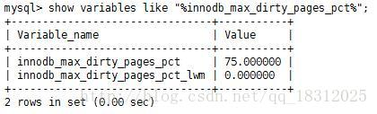

innodb_max_dirty_pages_pct参数官方文档解释：

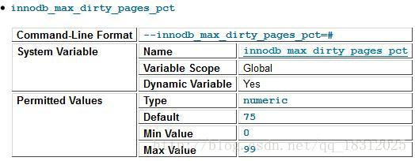

innodb_max_dirty_pages_pct_lwm参数解释：

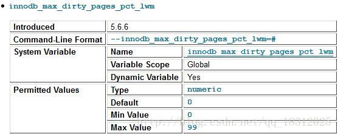

发现，该**参数值默认为75**，即：当buffer pool中脏页的数量占据75%时，强制进行Checkpoint，刷新一部分的脏页到磁盘。
（在innodb1.0x以前，该参数默认是90，之后的版本都为75。）

------

# 能够触发写操作的一些因素

## 1. 常规性写入操作：（影响不大）

- 1.master thread
- 2.io write 写入线程
- 3.每次写入的量 –》怎么控制？ 增加写入线程的数量。

## 2. flush 列表太大

会触发对用户线程的阻塞
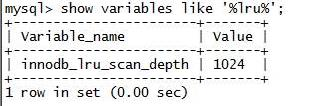
增加后：频繁的写。（影响不大）

## 3. 可以覆盖的日志太少了：（影响大）

- 增加日志的大小和组的数量
- 避免同步和异步
- 脏页的总量【一般调成90%】（影响大）

防止因为写入操作而导致系统hang住！

------

# 控制写入操作

## 1.控制每次写入的量

- 1.innodb_io_capacity（可以调节每次写入的数据量）
  - 假设我们使用闪盘，io可以达到50万iops
  - 【IOPS：Input/Output Operations Per Second，即每秒进行读写（I/O）操作的次数，多用于数据库等场合，衡量随机访问的性能。】
    200,300,400,500
    看一下脏页的数量是否还是过多（指标）
- 2.innodb_lru_scan_depth
  - 每次查找脏页的深度
- 3.调整log file的大小和组数
- 4.脏页的比例：75%（默认）、90%（推荐）（但系统崩溃的时候恢复时会比较慢）…

------

## 如何来确认系统的写入操作是大还是小

1、如何来调整写入这个操作？

- innodb_io_capacity（容量）–》调大可加大脏页写入速度
- innodb_lru_scan_depth –》调大可加大脏页写入速度
- 增加log file组数和大小
- 加大或者缩小innodb_max_dirty_pages_pct

2、为什么增大或者减小写入操作？

- 1.我们要确认系统是写入还是读取为主的系统（调不调）
  如果是以写入为主的系统，就需要加大上面的相关参数。
- 2.观察我们的系统的io状况【iostat -x 1】【%util达到70%左右、w/s也很好，说明参数调的很好】
  来确认调整的合理程度。（调多少）
- 3.通过double write 写入来监控我们的系统的写入压力够不够（让写入压力大一些好）

（如果w/s太大，就是写的太快，此时就应降低写功能）

> wrqm/s 反映的是double write的功能
> InnoDB_dblwr_writes：写的次数
> InnoDB_dblwr_pages_written：写的页数
> pages：writes的值能够看一次写多少页】

- 4.通过日志产生速度和脏页刷新速度的差值
- 5.脏页和pool的比值（看此时脏页的数量大小）

## 参数innodb_fast_shutdown脏页刷新控制参数

在关闭时，参数innodb_fast_shutdown影响着表的存储引擎为innodb的行为。该参数可取值为0、1、2，默认值为1。

- 0：表示在MySQL数据库关闭时，innodb需要完成所有的full purge（）和merge（合并） insert buffer
  ，并且将所有的脏页刷新回磁盘。这需要一段时间，有时甚至需要几个小时来完成。如果在进行innodb升级时，必须将这个参数调为0，然后再关闭数据库。
- 1：是参数innodb_fast_shutdown的默认值，表示不需要完成上述的full purge和merge
  insert操作，但是在缓冲池中的一些数据脏页还是会刷新回磁盘。
- 2：表示不完成full purge和merge insert
  buffer操作，也不将缓冲池中的数据脏页写回磁盘，而是将日志都写入日志文件。这样不会有任何事务的丢失，但是下次MySQL数据库启动时，会进行恢复操作。

当正常关闭MySQL数据库时，下次的启动应该会非常“正常”。但是如果没有正常地关闭数据库，比如用kill 命令关闭数据库，在MySQL数据库运行中重启了服务器，或者在关闭数据库时，将参数innodb_fast_shutdown设为了2时，下次MySQL数据库启动时都会对InnoDB存储引擎的表进行恢复操作。

## 恢复参数 innodb_force_recovery

参数 innodb_force_recovery 影响了整个innodb存储引擎恢复的状况。该参数值默认为0，代表当发生需要恢复时，进行所有的恢复操作，当不能进行有效恢复时，如数据页发生了corruption（损坏），mysql数据库可能发生宕机（crash），并把错误写到错误日志去。

但是，在某些情况下，可能并不需要进行完整的恢复操作，因为用户自己知道怎么恢复。比如在对一个表进行alter table操作时发生意外了，数据库重启时会对innodb表进行回滚操作，对于一个大表来说这需要很长时间，可能是几个小时。这时用户可以自行进行恢复，如可以把表删除，从备份中重新导入数据到表，可能这些操作的速度要远远快于回滚操作。

参数**innodb_force_recovery** 还可以设置为6个非零值：1~6。大的数字包含了前面所有小数字表示的影响：

- 1：SRV_FORCE_IGNORE_CORRUPT：忽略检查到的corrupt页。
- 2：SRV_FORCE_NO_TRX_UNDO：阻止Master Thread 线程的运行，如Master Thread线程需要进行full purge操作，而这会导致crash。
- 3：SRV_FORCE_NO_TRX_UNDO：不进行事务的回滚操作。
- 4：SRV_FORCE_NO_IBUF_MERGE：不进行插入缓冲的合并操作。
- 5：SRV_FORCE_NO_UNDO_LOG_SCAN：不查看撤销日志（undo log），InnoDB存储引擎会将未提交的事务视为已提交。
- 6：SRV_FORCE_NO_LOG_REDO：不进行前滚的操作。

需要注意：在设置了参数innodb_force_recovery大于0后，用户可以对表进行select、create和drop操作，但insert、update和delete这类DML操作是不允许的。

------

# 前滚和回滚

如果系统因为执行了一个非常大的DML或者DDL操作，导致系统hang住，我们想断掉这个操作，怎么办？
①kill thread –》要前滚
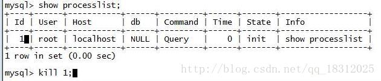

②kill process –》要回滚

# 数据库性能监控

## 1.性能指标

怎么来监控？
（1）通过**show engine innodb status \G** 来看log的部分：

1.  

   Log sequence number 2560255 （当前的日志序列号）

2.  

   Log flushed up to 2560255 （刷新到日志重做日志文件的lsn）

3.  

   Pages flushed up to 2560255 （写入磁盘的脏页的lsn。记录在checkpoint中）

4.  

   Last checkpoint at 2560246 （刷新到磁盘的lsn）

5.  

   0 pending(挂起) log flushes, 0 pending chkp writes

6.  

   10 log i/o's done, 0.00 log i/o's/second

- 1
- 2
- 3
- 4
- 5
- 6

（2）通过一些参数来看：

- innodb_dblwr_pages_written：看写的快慢
- Com_select
- Com_delete
- Com_update -》增删改查的统计量
- Com_commit -》提交的事务数
- InnoDB_dblwr_writes：写的次数
- InnoDB_dblwr_pages_written：写的页数
  【pages：writes的值能够看一次写多少页】

（3）iostat
观察系统的io状况的命令

# 压力测试的工具

- 测IO的：测出IOPS–》fifo、orion等
- 测网络的：测出吞吐量–》传包
- 测数据库
  - tpcc-mysql ：它自己建立业务系统，模拟业务操作，进行压力测试。
  - loadrunner：可以模拟我们的真实的生产系统，进行压力测试。（业务部门做的，需要开发编程等…）
  - tcpcopy：引流进行压力测试。

## TPCCMySQL 小工具的使用

README手册：

1.  

   1.Build binaries

2.  

   cd scr ; make ( you should have mysql_config available in $PATH)

3.  

   \2. Load data

4.  

   ① create database mysqladmin create tpcc1000

5.  

   ② create tables mysql tpcc1000 < create_table.sql

6.  

   ③create indexes and FK ( this step can be done after loading data) mysql tpcc1000 < add_fkey_idx.sql

7.  

   ④ populate data

8.  

   1）simple step tpcc_load -h127.0.0.1 -d tpcc1000 -u root -p "" -w 1000 |hostname:port| |dbname| |user| |password| |WAREHOUSES| ref. tpcc_load --help for all options

9.  

   2）load data in parallel check load.sh script

10.  

    3.start benchmark

11.  

    ①./tpcc_start -h127.0.0.1 -P3306 -dtpcc1000 -uroot -w10 -c32 -r10 -l10800

12.  

    ②|hostname| |port| |dbname| |user| |WAREHOUSES| |CONNECTIONS| |WARMUP TIME| |BENCHMARK TIME|

13.  

    ③ref. tpcc_start --help for all options

- 1
- 2
- 3
- 4
- 5
- 6
- 7
- 8
- 9
- 10
- 11
- 12
- 13

常用参数：

- -w 10 –》加载10个数据仓库就不少了！（实验用三四个就行！）
- -h 往哪个地址
- -d 哪个数据库

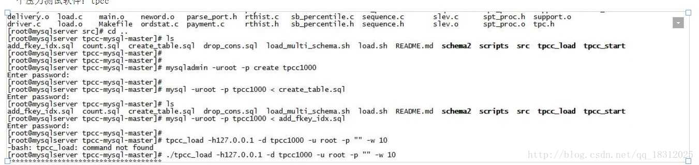

------

# 数据库性能相关指标小结

show glabal status like ‘%wait%’;
show glabal status like ‘%thread%’;
show glabal status like ‘%abor%’;
show glabal status like ‘%question%’;
show glabal status like ‘%que%’;
show glabal status like ‘%full%’;
show glabal status like ‘%scan%’;
show glabal status like ‘%slow%’;
show glabal status like ‘%read%’;
show glabal status like ‘%write%’;
show glabal status like ‘%log%’;
show glabal status like ‘%commit%’;
show glabal status like ‘%Com%’;
QPS
TPS
buffer hit
show glabal status like ‘%disk%’;
show glabal status like ‘%max%’;
show glabal status like ‘%page%’;
show glabal status like ‘%fsync%’;

show status 看的是运行状态，是不能调的！
show variables 看的是变量，可以调！

上面这些参数的详解：

## 1.show glabal status like ‘%wait%’;

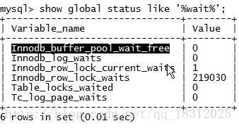

Innodb_buffer_pool_wait_free：buffer pool没有空闲内存了。【如果每秒增长的值比较高 –》能覆盖的磁盘太少了！即 脏页太多！！】
【脏页太多的一个最经典的指标！！！】
Innodb_log_waits：因log buffer不足导致等待的次数。

## 2.show glabal status like ‘%thread%’;

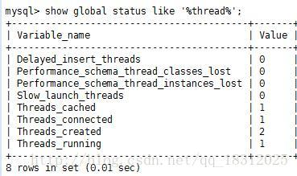

- Threads_cache：在缓存池子里缓存了几个。例如先建立20个线程放在池子里，当短连接上来之后，就分配给它，用完就释放
- Threads_connected：当前的连接数
- Threads_created：系统一共累计建立了多少线程，若此值很大，则系统频繁的建立和断开线程！则 thread_cache_size小了，容易干（溢出）！
- Threads_running：当前活跃的线程的数量。一共有多少个想干活的。

当created的值很大时：
show variables like ‘%thread%’;

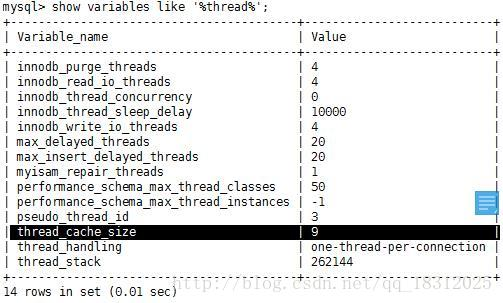

看到thread_cache_size的值为9。假设有100个线程上来了，缓存池子缓存了9个，忽然断开。则需要新建立91个线程。
所以，**当thread_cache_size增大，可理解为池子增多了**。则Threads_created的数量就会降下来了。
thread_concurrency：真正在干活的数量。（截的图上没有…）
48core*2个线程==96个线程 –》cpu能够服务的线程数

### Threads_running和 thread_concurrency的关系

- ①running的数<64，就把concurrency设置为0
- ②running值>>128，就把concurrency设置为128（最大值）
- ③running值∈（10,200）–》尝试调整：concurrency
  先调成60：然后算tps和qps；然后80，若发现tps和qps上升了，则好；再100，若发现tps或qps下降了，则降低，调成80就好。

我们有个限制：concurrency<=cpu的core *2/4 –》（4是能并发的处理4个线程）

### max_connection：允许的最大连接数

默认151。最好调成三四百。
所以，当Threads_created 等于151时，就该调max_connection了。

## 3.show glabal status like ‘%abor%’;

被异常终止的连接的数量。

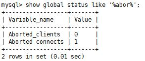

Aborted_connection的值很大时，说明被异常终止的连接的数量很多。

## 4.show glabal status like ‘%question%’;

描述数据库的处理能力。

## 5.show glabal status like ‘%que%’;

Queries：sql查询（增删改）的数量。

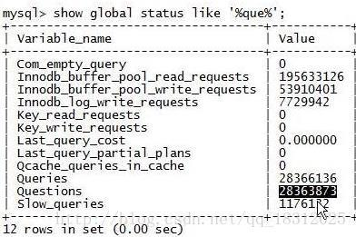

### Com_stmt_execute：累积的SQL语句的执行数量。

【发现Queryes的值与它差不多】

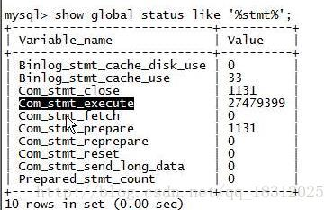

## 6.show glabal status like ‘%full%’;

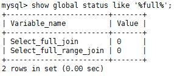

select_full_join：应用到其他表，没有使用索引的连接的数量；
select_full_range_join：应用到其他表，在引用的表中使用范围搜索的连接的数量。

## 7.show glabal status like ‘%scan%’;

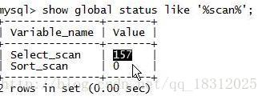

Select_scan：系统全表扫描的累计值。

## 8.show glabal status like ‘%slow%’;

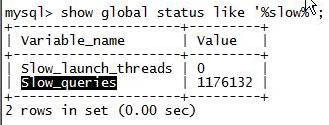

Slow_queries：慢查询（后面会讲）的数量。

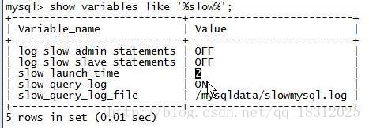

slow_launch_time：2秒。
一个SQL语句的执行时间超过2秒–》认为是一个慢sql，就记录在/mysql/data/slowmysql.log，同时slow_queries的值+1

## 9.show glabal status like ‘%read%’;

read往往意味着物理读。

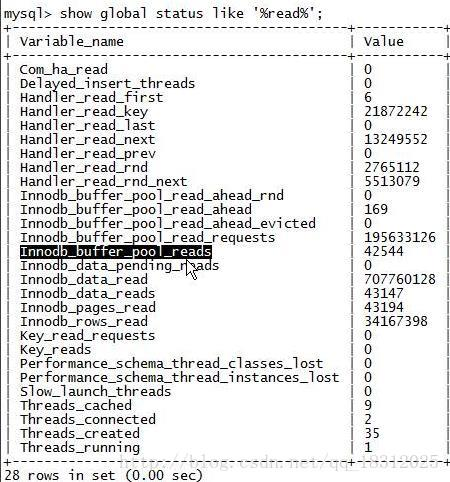

- Innodb_buffer_pool_reads：在buffer pool里找值没找到发生物理读的累积次数。【不同时刻的差值/间隔==buffer pool每秒发生的物理读】
- Innodb_buffer_pool_read_ahead：预读 数是169。此值如果高的时候，就是全表扫描。
- Innodb_buffer_pool_read_requests：innodb_buffer 中总的请求数。
  - （buffer hit）命中率==(requests-reads)/requests
- Innodb_data_pending_reads：挂起数。数据库系统里面曾经出现的IO请求，但由于IO已经满了，就会出现pending，被挂起了。

## 10.show glabal status like ‘%write%’;

写请求。

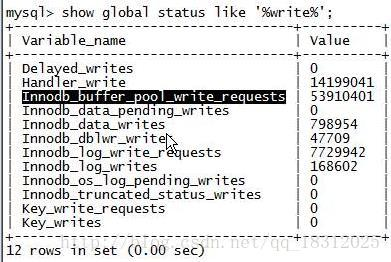

- Innodb_buffer_pool_write_requests：写请求的总数。
- Innodb_dblwr_writes：double write 写的次数。（写脏页）
- innodb_log_writes：日志写的次数。【写负载一般关注两点：写脏页、日志写】
- innodb_os_log_pending_writes：日志挂起的次数，【大了就说明：写功能可能坏了–》cache的电池】

## 11.show glabal status like ‘%log%’;

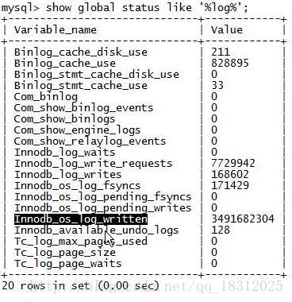

Innodb_log_waits：先往log buffer里写，logfile里写redo log时，如果满了，就会有等待。

## 12.show glabal status like ‘%commit%’;

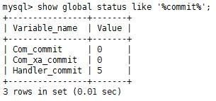

Com_commit的提交数量。与rollback一起，可以算 命中率。

## 13.show glabal status like ‘%Com%’;

关于累计值。

经常关注的几个：

- Com_commit：执行的commit的数量；
- Com_delete：执行的删除数量；
- Com_insert：执行的插入数量；
- Com_select：执行的查询数量；
- Com_stmt_execute：总的sql执行的数量。
- QPS：不同时刻的Questions的差值/时间差
  - QPS：Query Per Second，每秒查询率
- TPS：（Com_rollbacl+Com_commit）/时间差
  - TPS：Transaction Per Second，每秒事务处理量。

## 14.show glabal status like ‘%disk%’;

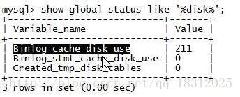

## 15.show glabal status like ‘%max%’;

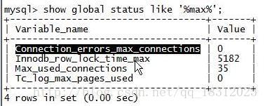

- ①Connection_errors_max_connections的值>0：因为超过了最大连接数而导致的错误，应该保持是0才正常。
- ②Max_used_connections：一定<<事务的Max_connections

## 16.show glabal status like ‘%page%’;

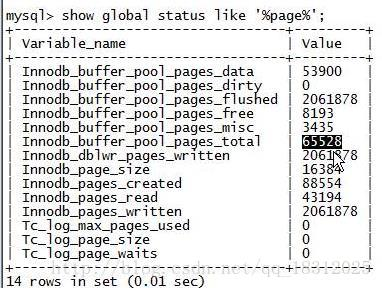

- Innodb_buffer_pool_pages_tocal：innodb buffer pool的总大小；
- Innodb_buffer_pool_pages_dirty：脏页的数量
- Innodb_dblwr_pages_written：double write 的字节数

## 17.show glabal status like ‘%fsync%’;

文件系统。

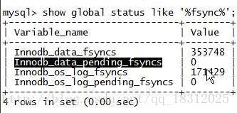

- Innodb_data_fsyncs：是物理写。跳过文件系统的缓存，直接往磁盘写。一般指日志。

一般是：数据先写到文件系统的缓存，然后再写到磁盘！

- Innodb_data_pending_fsyncs：写日志的时候的物理写。
- Innodb_os_log_pending_fsyncs：redo log的pending fsyncs() 次数

## 18.show global status like ‘%dbl%’;

判断数据库系统繁忙度。

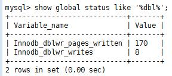
（现在的比值是21:1，意思就是每次写，写21个页。）
注意比值：当written/writes比值为128:1时，就是写操作比较繁忙，压力比较大。
小于128时，就是不繁忙。

为什么是128:1就是繁忙的？（图解：）
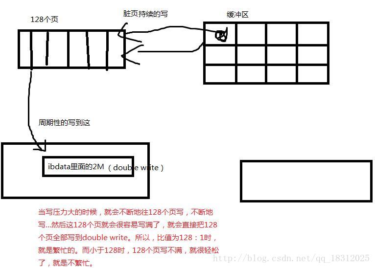