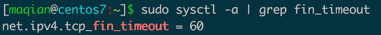

# 一次孤儿socket过多导致负载高的问题排查过程

 2020年3月3日*01:06:19*[ 评论](https://www.dyxmq.cn/network/tcpip/out-of-socket-memory.html#respond)

## 一、问题现象

客户报障，说使用了我们的网关设备后网络经常中断。具体的情形是用我们设备做代理上网后，流量图显示流量每隔两分钟就会直线下跌一次，同时就伴随着内网用户断网。

经过排查后发现问题原因是设备负载太高了导致，出问题时候的负载趋势图为：

从图形来看，负载是每1-2分钟就会上升一次，而且上升得特别明显，最高到达了五十多。但设备只是一个4核的设备，这么高的负载肯定是无法承受了。可以断定断网是负载高导致的。

于是继续分析mpstat中对CPU的采样，看看是什么原因导致的设备负载高：

| 12345678 | linux 2.6.30-**os** (localhost) 02/27/20 **_x86_64_**	(4 CPU) Average:   CPU  %usr  %nice  %sys  %soft %**idle**Average:   all  17.50  4.75  18.00  29.75 27.75Average:    0  17.00  5.00  16.00  4.00 57.00Average:    1  17.17  0.00  18.18  60.61  0.00Average:    2  16.16  13.13  16.16  1.01 53.54Average:    3  20.00  0.00  21.00  54.00  1.00 |
| -------- | ------------------------------------------------------------ |
|          |                                                              |

从cpu抽样数据可以看到，出问题的时候，有2个CPU都已经跑满了，其中占用最高的是`soft`，两个核占用都超过了一半。`soft`是系统软中断调用，是内核层面的原因导致，需要进一步排查内核中的问题。

内核问题一般回打印到messages或者dmesg，我们的设备是都保存到了一个dmesg文件中，因此下一步思路就是分析dmesg了。果然，查看dmesg就看到了大量的错误信息：

| 12345 | TCP: time wait **bucket** **table** overflow...**Out** **of** **socket** memory...TCP: **too** **many** **of** **orphaned** sockets |
| ----- | ------------------------------------------------------------ |
|       |                                                              |

经过查找资料后，整理出来三个错误日志的意思：

- `TCP: too many of orphaned sockets`: 太多的孤儿socket
- `Out of socket memory`: socket占用的内存超出
- `TCP: time wait bucket table overflow`: 保存TIME-WAIT状态socket的哈希表槽溢出

对比错误日志产生的时间和系统负载增加的时间发现两者都能对上，负载高的时候打印日志更频繁，负载低的时候几乎没有什么日志。这就说明导致负载高的原因和这三条日志有关了，下一步思路是分析为什么要打印这些日志了。

## 二、分析孤儿socket

### 2.1 什么是孤儿socket

说到孤儿socket的原因是`Out of socket memory`日志，说实话在遇到这个问题之前我并不知道有孤儿socket的存在，也是在网上查这个日志信息才知道的。产生这个日志的原因有两个：

1. 孤儿socket太多，超出系统阈值，阈值可通过`cat /proc/sys/net/ipv4/tcp_max_orphans`查看。
2. TCP缓冲区超出系统阈值，缓冲区的大小可通过`cat /proc/sys/net/ipv4/tcp_mem`查看。

通过另外两个日志信息基本可以判断是第一种情况了——孤儿socket太多导致的。那么孤儿socket到底是什么呢？

大部分的资料都是这么描述孤儿socket的：孤儿socket是已经没有和文件句柄绑定、但是仍然存在于内核没有被释放的socket。

这个说法相当官方，并且笼统，虽然说的并没有错误。实际用接地气的话来描述的话就是那些已经执行了`close()`但是状态还没有到达`CLOSED`状态的socket。

回忆一下TCP四次挥手的过程：

客户端执行`close()`函数来关闭socket，此时会发送`FIN`包到服务端，客户端socket的状态是FIN-WAIT-1，等到服务端ACK后状态变成FIN-WAIT-2。然后服务端也执行`close()`，此时socket就变成了TIME-WAIT状态，等到2MSL时间过去后才变成CLOSED。孤儿socket指的是**状态在FIN-WAIT-1到TIME-WAIT**之间的socket，他们已经准备释放了，但是还没有达到完全释放的条件。

### 2.2 分析孤儿socket状态

在确定了问题原因是孤儿socket导致的之后，排查的思路就是确定孤儿socket的状态了。

查看系统支持的最大孤儿socket数量：

查看当前socket使用状态：

| 1234 | # 方法1cat /proc/net/sockstat# 方法2ss -s |
| ---- | ----------------------------------------- |
|      |                                           |

可以看到当前环境中孤儿socket有65506个，距离超出系统负载就差一点点了。而closed和timewait状态的socket更是有10w+个之多，这种情况下内核确实承受了它这种配置不该承受的压力。

此时，下一步的排查思路就变成了为什么会有这么多socket无法完全释放了。

## 三、问题原因分析

当问题定位孤儿socket后，网上所有的教程都是通过放大tcp_max_orphans参数来解决，实际上是否真正能解决问题呢？调大之后会不会导致孤儿socket继续增加，是否会导致系统运行异常，这些都是有待确认的。

因为是线上环境，为了避免调整导致网络环境出现更大的异常，所以没有直接按照教程把值往上调整一倍，而是增加了5%左右。调整完成后，实际上并没有太大的效果，孤儿socket还是一直增加到了上限，dmesg也是一直打印日志，因此可以认为这种方法不可取，再往大调只会导致情况更加恶化。具体的原因还得具体再分析。

### 3.1 统计连接数

根据上面ss命令的结果能看到，系统处于关闭状态（执行了`close()`或者`shutdown()`之后）的socket数量很多，总量加起来接近30w个，因此首要的问题是如何定位到是什么程序产生的socket。

通过`ss`命令统计出所有的连接状态：

| 1    | ss -ant >ss**.txt** |
| ---- | ------------------- |
|      |                     |

因为连接数量很多，统计需要很长时间，所以定位到文件避免后面需要多次执行命令浪费时间。

拿回来后，分别统计出各个socket状态的数量：

其中，最多的是FIN-WAIT-1和TIME-WAIT状态，总共有差不多17w个。它们一个是主动关闭socket的状态，一个是被动关闭socket的状态，都属于客户端socket的状态，所以问题应该出现在我们作为客户端主动发起的连接上身上。

在知晓了这一点之后，要做的应该是统计出连接的五元组信息，哪个IP、哪个端口最多，然后通过lsof命令定位到具体的程序。但是结合业务逻辑来分析，很容易就想到是我们设备上的代理程序，根本无需再统计这些信息。

因为我们设备是作为代理上网，代理程序势必要作为客户端去连接服务端，只有他才可能产生这么大规模的连接数。下一步排查的思路应该就是查它了，为什么它会产生这么多无法释放的socket。

### 3.2 抓包

从上面统计的状态来看，FIN-WAIT-1和TIME-WAIT状态都是处于我们已经做完了自己的事情，等待服务端响应时候的状态，我们自身出问题的可能性较小，多半是服务端除了问题导致的，所以再往下的排查思路应该是对端。

要确定是否是对端的问题，抓包就可以了，抓取wan口所有的TCP数据包，抓100w个：

| 1    | tcpdump -i **eth2** tcp -nnv -c 1000000 -w e2**.pcap** |
| ---- | ------------------------------------------------------ |
|      |                                                        |

拿到数据包后，第一步，统计所有FIN状态的数据包，在过滤器中输入：

| 1    | tcp**.flags****.fin** eq 1 |
| ---- | -------------------------- |
|      |                            |

> 为什么要统计FIN状态的数据包？
>
> 因为大量的socket都处于被关闭之后的状态，所以分析的重点就是FIN过程（即四次挥手）中那些连接。

统计出来，`FIN`包一共有45w个，占了所有包的45%：

这明显是一个不合理的数字，正常网络环境中不可能出现这么大比例的FIN包。随机找到一个连接追踪流分析：

> 左边被打马赛克的是设备的IP地址，右边的是服务端地址。服务端地址实际上是微信的服务器地址，通过应用特征分析属于微信下载小视频的流量。

很明显能看到，设备发送了FIN出去之后，并没有收到预期中的服务端回复，一直在重传等待服务端回复。直到差不多14秒之后才收到了服务端的回复信息。

到这里，就可以得到初步结论了，问题原因应该是下面二者之一：

1. 微信服务器出了问题，回复数据包太慢了。
2. 出口网络环境存在问题，运营商线路不稳定。

## 四、解决方案

解决FIN-WAIT-1和TIME-WAIT状态的方案百度有很多，基本上都是说调整fin超时时间或者其他内核参数来解决。

调整fin超时时间是调整下面这个内核参数：

理论上说这个方案是有效的，并且同时还调整了以下参数：

| 1234 | # 允许重用处于TIME-WAIT状态的socketnet**.ipv4****.tcp_tw_reuse** = 1# 开启快速回收socketnet**.ipv4****.tcp_tw_recycle** = 1 |
| ---- | ------------------------------------------------------------ |
|      |                                                              |

然而实际上，调整之后，即使超时时间只有1秒，孤儿socket还是溢出了，因为内网的用户流量实在太大，即使只占用1秒对设备而言也是无法承受的。

> 接下来只能是协调运营商和腾讯去排查了，看看为什么网络状态会如此之差！
>
> 是道德的沦丧，还是钱没给够？我猜是后者！