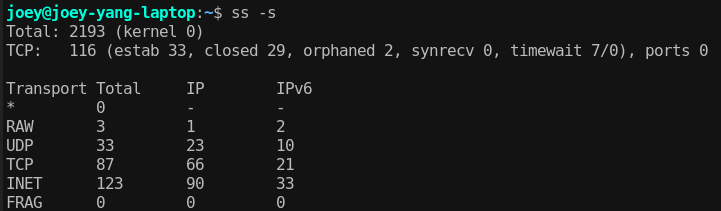

# [DevOps] Linux内核参数优化及原理

Jan 22, 2020

## 引言

后端业务体量达到一定程度，总会有机会遇到性能瓶颈，这些瓶颈除了出现在代码上，或在依赖组件上，也有可能出在操作系统层面，比如不合适的Linux内核参数。本篇整理一下**常用的内核参数的原理和使用**,尤其是**网络相关参数，以及在容器环境中**需要注意的地方。

Mark一下Linux性能优化大师Brendan Gregg的网站，和Netflix分享的文章，我们遇到问题时，**首先需要用这些利器定位分析产生性能瓶颈的原因**，如果的确是操作系统的瓶颈，**修改Linux内核参数则是不得已而用之的“处方药”**:

- http://www.brendangregg.com/linuxperf.html
- https://medium.com/netflix-techblog/linux-performance-analysis-in-60-000-milliseconds-accc10403c55

修改内核参数的方法很简单，root权限下更改 **/etc/sysctl.conf** 文件， 再执行**sysctl -p**即可，或是用**ansible**的sysctl module直接批量修改（不建议用ansible直接批量执行shell命令方式修改内核参数，ansible的sysctl已经保障了幂等性）。下面主要探讨一些原理，以及真实案例，分三个部分：

- 网络相关的内核参数，net.* 中常用的
- 非网络相关的，如fs. *kernel.* 等等
- 容器环境中如何使用，从Docker到Kubernetes集群

## 网络相关内核参数

对于Linux服务器来说，net.* 下面的内核参数是比较常用的，尤其提供TCP的服务来说。先上一个TCP状态转换图帮助理解：


#### net.ipv4.tcp_tw_reuse

tcp_tw_reuse默认为0关闭，设置为1打开，作用是让**处于TIME_WAIT的状态的TCP连接**的资源可以不用等2MSL，1s之后直接被复用，重新发起SYN包，经过**SYN - FIN_ACK- RST - SYN - SYN_ACK**重新进入**ESTABLISHED状态**。

通俗一点解释，比如下面这个图是本机ss命令随便截的，有7个TIME_WAIT状态的TCP连接，可以想象一下，就在2分钟内（Linux默认的2MSL时间），可能有浏览器关闭了页面，或是短连接获取完数据自己关闭，**用ACK消息回复对端FIN之后，仍然不敢直接复用而是进入TIME_WAIT状态**，因为：

- 虽然TCP保证了顺序，但复杂的网络状况可能导致多次包重传，**对端在FIN之前**的 **数据包** 可能都还没有过来，直接复用原来的连接可能会导致新的连接收到上个连接中重传的“幽灵数据包”
- 担心**收到FIN之后回复的ACK**对端收不到，于是本端苦苦等待网络包最长存在时间的两倍来**兜底**



因此，对于服务器来说，TCP连接在**被动关闭的情况下，并不存在TIME_WAIT状态**，很多时候是**不需要修改这个参数的**，如果出现**TIME_WAIT过多，也不要盲目配置此参数**，想一想原因，netstat找一找是哪些连接在TIME_WAIT，可能的典型场景有这些：

- **用于压测的客户端机器**：作为客户端不停地发起大量TCP连接
- **短连接调用的微服务场景**：A服务调B服务，B服务调C服务，虽然大家都是服务器，但是互相调用时，**调用方也是客户端**(用http2，gRPC等**只产生少量长连接的RPC协议**除外)
- **转发大量请求到外部服务**：比如Nginx，HAProxy，Traefik等反向代理，或是服务端有对外调用第三方开放平台服务的场景，因为大部分平台提供的都是HTTP API，比较容易产生TIME_WAIT的积压

另外，服务端在**内存充裕**的情况下，也可以增大**net.ipv4.tcp_max_tw_buckets**来提高最大允许的TIME_WAIT状态的TCP连接数量

注：**绝大多数net.ipv4**下的内核参数，在**net.ipv6**下也有同样的参数，如直接提供ipv6服务，配置相同

#### net.ipv4.tcp_tw_recycle

首先写结论，这个参数**永远都不要用，并且Linux 4.10之后已经移除了这个参数**。这里有一篇写的很好的Blog说明，https://vincent.bernat.ch/en/blog/2014-tcp-time-wait-state-linux, 本文也参考翻译了这里的部分内容，对于解决TIME_WAIT积压的问题，首先找到是否是应用本身的问题，减少不该建立的连接，基本上tcp_tw_reuse已经足够，recycle是比较危险的，尤其是经过NAT之后的时间戳问题会导致次生灾害。

#### net.ipv4.tcp_fin_timeout

默认60s，在网络状况很好的情况下可以减少到10-30s,有部分文章解释这个参数是修改2MSL时间来减少TIME_WAIT，这是**错误的解释**。

因为，这个参数只能改**4次挥手第2步完成（收到FIN_ACK）进入FIN_WAIT_2后，最长等待的超时时间**。一般Nginx等反向代理机器配置这个参数，是因为Nginx作为客户端来说，后端服务都是在局域网，理论上网络状况很好，没有必要在FIN_WAIT_2状态等待太久。

### net.ipv4.tcp_syncookies

笔者找了几个CentOS和Ubuntu的Server查看，此参数默认已经是打开了，不确定是那个版本开始的，打开可以**防止大部分SYN洪水攻击**。这里有一篇讲解TCP SYN Cookies和SYN Flood攻击的文章：https://segmentfault.com/a/1190000019292140。总结一下重点：

- SYN Flood原理是**伪造大量三次握手的第一次SYN包**，让对端产生大量**半连接状态的TCP连接直至资源耗尽**
- SYN Cookies防止SYN Flood的原理是**通过记录第一个SYN包部分信息Hash，然后在握手最后一步ACK来校验**，校验成功后才真正分配连接资源
- SYN Cookies**消耗少量计算资源**，避免了伪造SYN包导致大量半连接状态的TCP连接

SYN Cookies是一种用HMAC手段来达到**延迟初始化和资源分配**的目的，搭配下面两个参数可以对半连接状态做更多的优化：

- **net.ipv4.tcp_synack_retries**： 默认5，如果SYN没有SYN_ACK，默认重试5次，可以适当降低
- **net.ipv4.tcp_max_syn_backlog**：在达到ESTABLISHED之前，半连接状态的TCP连接最大数量，默认值不同发行版不同，找了几种版本看默认值都在128~512之间，视网络状况和具体应用可以适当调整

注：这里的**syn_backlog**和linux中listen系统调用中的**backlog**参数区别在于，listen参数中的backlog是监听的port最大允许的**未ACCEPT的ESTABLISHED状态连接数和SYNC_RCVD状态连接数之和**，而syn_backlog是系统层面最大允许的半连接数(**SYNC_RCVD状态**的连接)之和：

```
#include <sys/socket.h>
int listen(int sockfd, int backlog);
/* "man listen"命令可以查看参数含义 */
```

linux遵循的**POSIX标准**，并**不完全是TCP标准**，backlog不会影响accept()之后的连接数，而是像一个待处理缓冲区，具体分析可以参考这些文章：

- http://veithen.io/2014/01/01/how-tcp-backlog-works-in-linux.html
- https://segmentfault.com/a/1190000019252960

#### net.core.tcp_somaxconn

这个参数也有不少人**误解**，有些Nginx的Tuning方案认为这是**最大连接数**，建议把这个值从默认值128改大一些，甚至改到65535，这种理解是**不正确**的。

首先来理解一下这个参数的含义，somaxconn**不是**指每个listen端口的的最大连接数，而是指 **max backlogged connections**, backlog的含义可以看上面的文章，大致可以理解为在**应用层accept之前**的缓冲区大小。

因此，如果**服务端处理能力有盈余，及时accept了，就没必要调整这个参数**了，尤其是现在主流框架都是**单独的I/O线程循环accept和read**，真正的处理都放到Worker线程，128足矣，边缘入口服务如**Nginx机器改成512（Nginx默认listen backlog参数为511）也足矣**。

这个参数可以**在服务端繁忙时缓解connection refuse**的说法的没有错的。比如：

- 秒杀，抢票这种对边缘流量入口节点产生瞬间大流量冲击的场景
- 预防或缓解DDoS攻击

这些情况下是可以增大somaxconn的值作为**辅助手段**的。毕竟，**让用户等待转圈圈总比浏览器直接跳出来CONNECTION_REFUSED要好**。但是话又说回来，又有多少互联网企业会遇到上述两种极高并发的场景呢？

#### net.ipv4.ip_local_port_range

默认值”32768 60999”,含义是端口号从32768到60999都可以作为建立TCP连接的端口，默认接近3w个连接基本足够了，使用场景与tcp_tw_reuse类似。优先去找**过多连接导致端口号耗尽的根本原因**，切忌盲目修改内核参数，即使看起来没有太大副作用。

#### net.ipv4.tcp_congestion_control

能够修改**TCP拥塞控制算法**，低内核版本的Linux就不用改这个了，在**4.9及以上版本的内核，Linux提供了新的TCP拥塞控制算法BBR**。说到拥塞控制，又是一个很大的话题了，大学期间学习的《计算机网络》告诉我们，滑动窗口像是一个TCP传输数据的发送-确认缓冲区，而**拥塞窗口cwnd和接收窗口rwnd**共同控制着传输的滑动窗口的大小，滑动窗口的大小直接决定了传输的吞吐量。

因此，一个合适的**拥塞控制算法**会影响服务传输数据的**RTT和带宽利用率**，这对高I/O的应用，如**文件下载，多媒体播放，音视频通信等**服务端是非常重要的，毕竟这些应用动辄传输GB级别的数据，而不是一般Web应用传输KB, MB级别的页面或JSON数据。

传统的拥塞控制算法：

- **reno**：在不同阶段采用**慢启动，拥塞避免，快速恢复，快速重传**这些不同策略，比如一开始**指数增长**窗口大小，到达**慢开始门限（ssthresh）**后进入**线性增长**的拥塞避免阶段，遇到丢包，RTT延长等事件再降下去
- **cubic**：reno进化版，**目前大部分Linux版本默认的拥塞控制算法**，由三次函数控制，宏观上可以分为**稳定阶段，探测阶段，公平收敛阶段**，能比较平滑地**试探最大带宽**

新的拥塞控制算法 BBR：

这个算法的具体原理和实现笔者没有继续深究，看了一些资料，思路大体上是站在更高维度去探测低延迟高吞吐的点，**不拘泥于个别包的RTT增加或丢包这种偶然事件**，而传统的拥塞控制算法的思路感觉是“在出现意外事件赶紧降窗”。

举个栗子，传统的拥塞控制算法，下载文件时可能看到的是这样的： 10Kb/s,20Kb/s,…5Mb/s,5.1Mb/s…, 这时出现了丢包事件,瞬间2.5Mb/s, 3Mb/s，而BBR可能看到是一直是6Mb/s, 因为BBR更关注全局情况，更不容易受偶然事件影响，与最大带宽的契合度更高。

虽然没完全搞清楚原理，但笔者最直观的感受是，海外购置的科学上网VPS服务器**开启BBR后，下载文件的速度大约是原来的2倍，网速忽上忽下的感觉少了很多**。Mark一下这两个链接，一个是各种拥塞控制算法的详细讲解，另一个是IETF上公开的算法详解：

- https://cloud.tencent.com/developer/article/1369617
- https://tools.ietf.org/html/draft-cardwell-iccrg-bbr-congestion-control-00

如今随着网络基础设施的发展，千兆万兆带宽遍地都是，**BBR更适合**相比于十年前更加**稳定高速**的网络，毕竟**Windows 10已经默认使用BBR作为TCP拥塞控制算法**，在**内核版本4.9**以上的Linux上开启BBR也很容易，副作用或许是：如果在上世纪kbps带宽的网络上提供TCP服务，效果可能不如reno，cubic？下面是Linux上开启BBR的方式：

```
# vim /etc/sysctl.conf  
net.core.default_qdisc = fq
net.ipv4.tcp_congestion_control = bbr
net.ipv4.tcp_notsent_lowat = 16384
# sysctl -p
```

一些实时通信应用也有使用**KCP，QUIC**等不依赖TCP协议的方式来传输数据，其中最大的原因就是**TCP局限性，导致RTT和吞吐量不满足这些应用场景**。HTTP3.0也是基于UDP的QUIC来传输了。估计不久的将来，大学课本就不能继续写HTTP协议是基于TCP的协议了。

#### net.ipv4.tcp_keepalive_time

默认长连接TCP KeepAlive包是两小时发送一次（7200），Nginx等反向代理服务，可以降低这个参数的值。本身提供长连接的服务比如WebSocket，大多都会有应用层/协议层的保活机制，个人感觉其实没有必要改这个参数。

#### net.ipv4.ip_forward

ip forward即对IP包做路由，大多数情况下是不需要的，如果被打开了，可以设置为0关闭掉。**多网卡做软路由的场景，则需要打开这个功能**。需要注意：**在Kubernetes集群中，需要打开ip forward功能，否则某些CNI实现会出问题**

#### Socket Read/Write Memory

有4个参数控制着Socket发送（Write）、接收（Read）数据的缓冲区大小。这个缓冲区是不分TCP UDP的，TCP在net.ipv4下面也有单独设置缓冲区大小的参数。下面这样可以把缓冲区增大到8MB～16MB，可以视网络状况、应用场景、机器性能来增大缓冲区。

```
net.core.wmem_default = 8388608
net.core.rmem_default = 8388608
net.core.wmem_max = 16777216
net.core.rmem_max = 16777216
```

## 其他常用内核参数

一些特定的应用，会有一些特殊的内参数核要求或优化方案，这里举一些用到过的例子。

#### vm.max_map_count

具体含义如下：

> This file contains the maximum number of memory map areas a process may have. Memory map areas are used as a side-effect of calling malloc, directly by mmap and mprotect, and also when loading shared libraries.

这是**ElasticSearch**推荐配置的一个内核参数，因为ES使用**mmapfs，大量分片索引数据需要映射到虚拟内存中**，链接：
https://www.elastic.co/guide/en/elasticsearch/reference/current/vm-max-map-count.html

```
vm.max_map_count=262144
```

#### fs.file-max 与 ulimit

顾名思义，指的是Linux系统最大能打开的File Descriptor数量，用Windows的话说就是”最大句柄数“。

这个参数**非常常用**，因为Linux下**一切皆文件**，你以为你只是打开了一个TCP连接，虽然不存在读写磁盘文件，但也是要占用文件描述符的！

推荐配置: fs.file-max=65536

这里需要注意此参数和**ulimit里面nofile**的区别：

**fs.file-max是操作系统层面的；而ulimit是限制用户级别的**, 二者是需要搭配一起修改的：

- 修改当前登录session的最大打开文件数： “ulimit -n 4096”
- 持久化修改某用户的最大打开文件数，在 **/etc/security/limits.conf** 添加 “user hard/soft nofile 4096”, nofile意思就是number of open files.

注： 不仅是file descriptor, ulimit可以限制的参数很多，比如core dump的大小，虚拟内存的大小，最大进程数等等，“ulimit -a”可以查看详细。

#### fs.inotify.max_user_watches

**可以watch的文件最大数量**，默认值比较小，在开发或使用nodejs相关工具的时候会经常用到，比如：

- **nodemon，webpack**等工具会监听文件变化来Hot reload
- 使用**chokidar**等文件监听库开发相关应用

当然涉及到文件watch都有可能需要在linux下修改此参数，只是**nodejs生态圈对file watch使用更加普遍**，Linux下安装VSCode也会提示最好修改此参数，推荐把这个参数设置大一些：

```
fs.inotify.max_user_watches=524288
```

## 在容器环境下的内核参数调整

上面讲了一些常用的内核参数Tuning的场景和原理，那么问题来了：**如果是运行在容器环境中（docker, containerd 等等），或是在Kubernetes集群部署，有没有什么不同呢**？

笔者做了一些试验，发现网上有很多**错误，片面，不准确**的资料，比如：

- 修改宿主机的内核参数，会带到容器中（**不准确，高版本内核大多数参数修改不生效**）
- 使用特权容器启动，在InitContainer中直接修改内核参数（**不正确的方案**，特权模式容器以及在容器中产生影响宿主机的副作用，是**不安全，不负责**的办法，即使需要特别的权限，也应该通过**mount和capability等机制**实现）
- Kubernetes集群中，在kubelet启动参数添加“–experimental-allowed-unsafe-sysctls”就可以在yaml里面添加修改内核参数的命令了（**不准确**，视版本而定，高版本Kubelet是–allowed-unsafe-sysctls）

容器技术并不是传统的虚拟化技术，容器是与宿主机**公用内核**的，因此这个问题并没有那么简单，我们从Docker开始，逐一来看。

##### ulimit修改

- Docker Daemon的启动参数指定 –default-ulimit，可以让后续启动的容器继承
- 单个Container，run时指定–ulimit参数可以定制ulimit，比如”docker run -d –ulimit nofile=65535”

##### sysctl修改

sysctl的**最终形态实际上是挂载在 /proc/sys/ 下面的文件 （这也是查看内核参数修改是否生效的直接办法）**，因此对于容器来说，指定sysctl是要覆盖 /proc/sys 的文件的，docker run有 **–sysctl** 参数，可以指定特定的内核参数覆盖到/proc/sys/中。

> Note: Not all sysctls are namespaced. Docker does not support changing sysctls inside of a container that also modify the host system. As the kernel evolves we expect to see more sysctls become namespaced.

Docker文档中有这么一段话，这就是为什么有人说改宿主机可以继承，有人说必须指定sysctl才可以, **两个说法都是片面的**。翻译概括一下就是：**已经命名空间隔离掉的参数才可以指定，否则继承宿主机**。下面是笔者在几个内核版本的Linux下的测试结果：

- 3.10-4.4版本内核：net.* 参数，宿主机设置，**容器继承生效**
- 3.10-4.4版本内核：容器启动命令指定 –sysctl net.* 参数，**容器启动报错**
- 4.14以上版本内核：net.* 参数，**宿主机设置，容器中无效**，容器指定sysctl后生效

内核不停地在更新，笔者没有**挨个版本**试哪个参数在哪个内核版本被Namespaced掉了。个人感觉升级到stable的最新内核版本是安全的，即使是生产环境，追求稳定不代表需要因循守旧, **越新的内核可以隔离配置的sysctl越多**。

#### 插曲：/proc目录下的其他文件

说个题外话，这里还有一个类似的问题：**在容器中看到的 /proc/cpuinfo, /proc/meminfo 中CPU、内存信息是容器，还是宿主机的**？

目前，Docker容器中/proc/xxx看到的CPU Memory等仍然是**宿主机的信息**，因为这两个路径并没有挂载文件覆盖。笔者之前遇到过一个问题,在容器环境中，jvm启动如果**不指定Xms, Xmx** (最小，最大堆内存大小)，jvm会默认使用物理内存的四分之一到二分之一，很容易在**限制了总内存大小的容器中**出现**OOM**问题。解决这个问题有两个方案：

- **指定应用使用的内存大小**，不管Runtime是jvm，v8，binary裸奔，都有办法去控制应用本身占用的内存大小
- **利用挂载修改容器内看到的CPU和内存**： 这里有篇文章，亲测有效https://medium.com/@Alibaba_Cloud/kubernetes-demystified-using-lxcfs-to-improve-container-resource-visibility-86f48ce20c6。像是美团HULK，阿里Pouch这种自主研发（参考Docker开发）的私有容器技术，做了很多定制和优化，也顺便解决了这个问题。

#### Kubernetes集群中内核参数修改

有了上面对Docker的理解，K8S本身作为不关心Container Runtime实现的平台，修改内核参数最终是靠**CRI**的具体实现的，比如Docker。Kubernetes用标准化的方式去声明，**背后调用Docker API和docker run –sysctl 做了一样的事情**。

在Kubernetes集群中，宿主机有几个需要注意的地方：

- 不能关闭ip_forward
- 不能打开tcp_tw_recycle
- 不要修改ip_local_port_range （默认情况下，K8S Service的NodePort范围是32000-32767）
- 目前只能修改 kernel.shm*, kernel.msg*, kernel.sem， fs.mqueue. *, net.*.

那么，怎么修改Pod的容器内核参数呢？

1. Kubelet启动参数添加 –allowed-unsafe-sysctls参数 (在**1.11以下的版本这个参数名是 –experimental-allowed-unsafe-sysctls** )，官方文档参考 https://kubernetes.io/docs/tasks/administer-cluster/sysctl-cluster/
2. 在Pod的Spec定义中，添加需要修改的内核参数键值对，并执行apply命令更新编排信息，修改的地方在 spec.securityContext.sysctls 中，具体如下所示：

```
apiVersion: apps/v1
kind: Deployment
metadata:
  name: your-deployment
  namespace: ns
  labels:
    app: your-app
spec:
  template:
    metadata:
      labels:
        app: your-app
    spec:
      securityContext:
        sysctls:
        - name: net.ipv4.tcp_fin_timeout
          value: "10"
        - name: net.ipv4.tcp_tw_reuse
          value: "1"
      containers:
        "......": "......."
```

如果填写的sysctl name存在非Namespaced参数，启动容器会失败，这时可能会触发BackOff重试，导致**出现大量Failed状态的Pod**，所以在改Yaml之前一定要确认好**Kubelet启动参数是否修改生效**，**内核版本是否支持**该参数Namespace隔离。

## 总结

本篇浅显地讲了一些内核参数原理和使用经验，Linux的奥妙无穷，通过内核参数管中窥豹就可以学到很多东西。总之，在搞清楚原理和问题根本原因之前，内核参数不能乱改，写好代码才是最关键的。