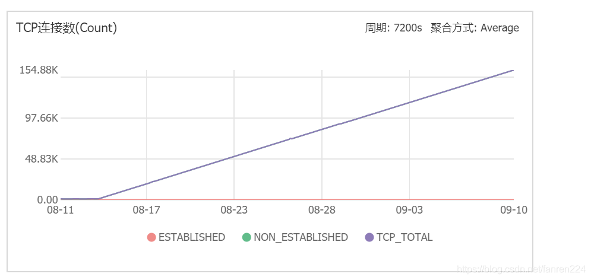
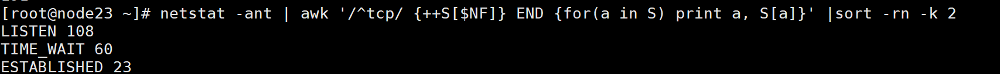
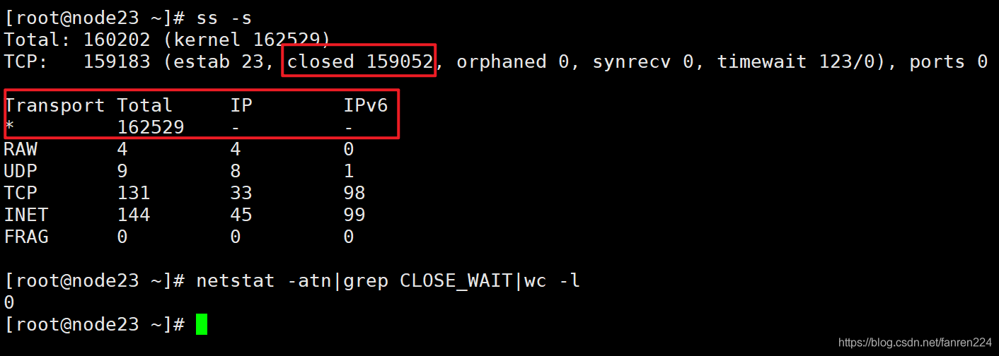
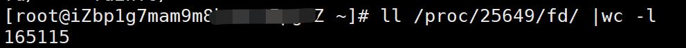
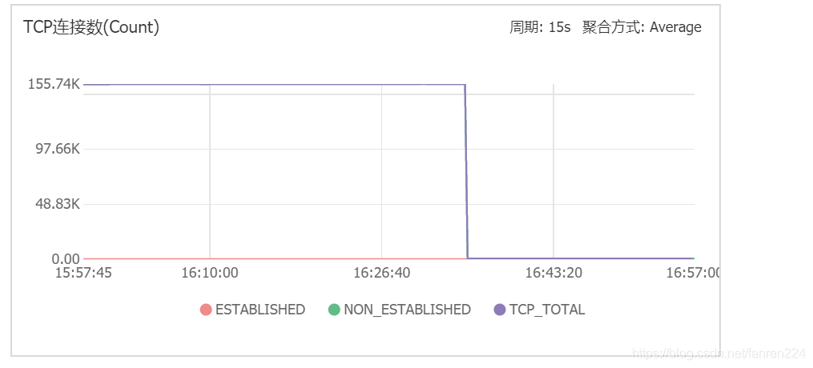

# k8s tcp closed socket很多，排查


[fanren224](https://blog.csdn.net/fanren224) 2017-03-26 15:59:17  1931  收藏

分类专栏： [linux](https://blog.csdn.net/fanren224/category_6289737.html)

版权

# 现象：

阿里云告警，tcp连接数很多，查看监控如下


# 排查

1、查看当前机器上各种tcp连接状态数量:`netstat -na | awk '/^tcp/ {++S[$NF]} END {for(a in S) print a, S[a]}'`

2、`ss -s`, --summary 显示套接字（socket）使用概况，或者`cat /proc/net/sockstat`


```bash
$ cat /proc/net/sockstat
sockets: used 105484
TCP: inuse 17 orphan 4 tw 273 alloc 102281 mem 203520
UDP: inuse 8 mem 1
UDPLITE: inuse 0
RAW: inuse 3
FRAG: inuse 0 memory 0
1234567
```

上面的图说明有很多处于closed状态的socket。

很多socket处于alloc状态，已经分配sk_buffer，没有被内核回收，这会占用很多内存。

3、查看top，用下面的命令将每个用户进程查一下（一般是java或python等提供服务的用户态进程）`lsof -p 12654 -nP |grep TCP|wc -l`


也可以用`ll /proc/25649/fd/ |wc -l`查看fd信息来排查是哪个进程异常

4、找到158731这个进程对应的服务

```bash
ps -ef |grep 12654
1
```

发现是xx-service

5、在命令行上查找到位于这个node上的pod名称，然后logs查看日志，是否有报错，解决这个报错。或者删除这个pod。

与此同时，内存使用率也下降了很多


# 原因

## 为什么某个进程会堆积这么多的closed状态的tcp连接？原因是什么？

## 这么多的tcp连接会对机器产生什么影响？

会占用内存，当超过`cat /proc/sys/net/ipv4/tcp_mem`时会报错： out of memory – consider tuning tcp_mem

## 如何避免这种情况的发生？