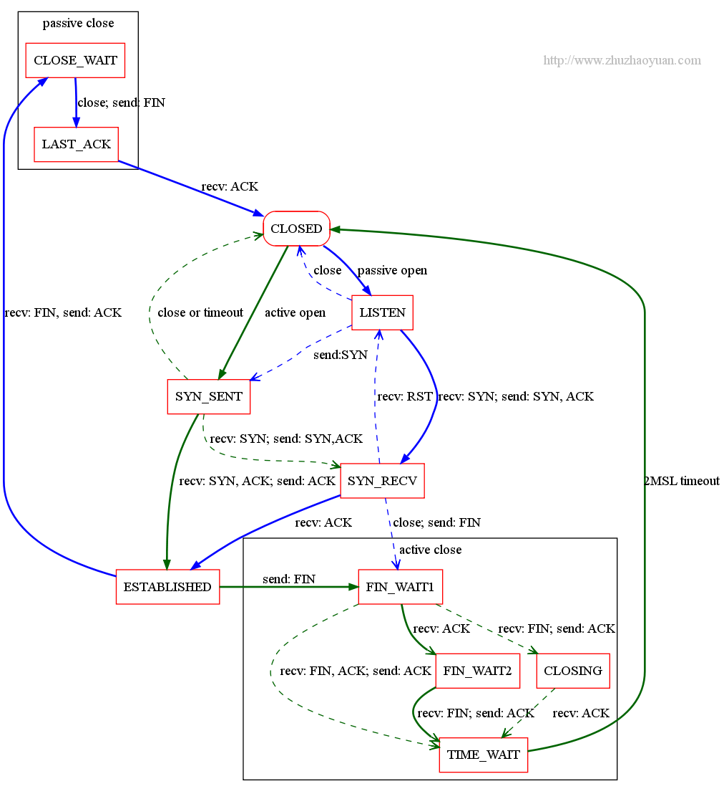

# [linux内核TCP/IP相关（收集）](https://www.cnblogs.com/kongzhongqijing/articles/4462828.html)

 

转：[优化linux下内核tcp参数](http://blog.sina.com.cn/s/blog_4a4d93ea0100ujaz.html)

http://blog.renhao.org/

[](javascript:void(0);)

```
提高服务器的负载能力，是一个永恒的话题。在一台服务器CPU和内存资源额定有限的情况下，最大的压榨服务器的性能，是最终的目的。要提高 Linux系统下的负载能力，可以先启用Apache的Worker模式，来提高单位时间内的并发量。但是即使这么做了，当网站发展起来之后，连接数过多 的问题就会日益明显。在节省成本的情况下，可以考虑修改Linux的内核TCP/IP参数，来最大的压榨服务器的性能。当然，如果通过修改内核参数也无法 解决的负载问题，也只能考虑升级服务器了，这是硬件所限，没有办法的事。

Linux系统下，TCP/IP连接断开后，会以TIME_WAIT状态保留一定的时间，然后才会释放端口。当并发请求过多的时候，就会产生大量的 TIME_WAIT状态的连接，无法及时断开的话，会占用大量的端口资源和服务器资源（因为关闭后进程才会退出）。这个时候我们可以考虑优化TCP/IP 的内核参数，来及时将TIME_WAIT状态的端口清理掉。
本文介绍的方法只对拥有大量TIME_WAIT状态的连接导致系统资源消耗有效，不是这个原因的情况下，效果可能不明显。那么，到哪儿去查 TIME_WAIT状态的连接呢？那就是使用netstat命令。我们可以输入一个复核命令，去查看当前TCP/IP连接的状态和对应的个数：

#netstat -n | awk ‘/^tcp/ {++S[$NF]} END {for(a in S) print a, S[a]}’

这个命令会显示出类似下面的结果：

LAST_ACK 14
SYN_RECV 348
ESTABLISHED 70
FIN_WAIT1 229
FIN_WAIT2 30
CLOSING 33
TIME_WAIT 18122

除了ESTABLISHED，可以看到连接数比较多的几个状态是：FIN_WAIT1, TIME_WAIT, CLOSE_WAIT, SYN_RECV和LAST_ACK；这里我们只用关心TIME_WAIT的个数，在这里可以看到，有18000多个TIME_WAIT，这样就占用了18000多个端口。要知道端口的数量 只有65535个，占用一个少一个，会严重的影响到后继的新连接。这种情况下，我们就有必要调整下Linux的TCP/IP内核参数，让系统更快的释放 TIME_WAIT连接。

我们用vim打开配置文件：

#vim /etc/sysctl.conf

然后，在这个文件中，加入下面的几行内容：

net.ipv4.tcp_syncookies = 1
net.ipv4.tcp_tw_reuse = 1
net.ipv4.tcp_tw_recycle = 1
net.ipv4.tcp_fin_timeout = 30

最后输入下面的命令，让内核参数生效：

#/sbin/sysctl -p

简单的说明下，上面的参数的含义：

net.ipv4.tcp_syncookies = 1 表示开启SYN Cookies。当出现SYN等待队列溢出时，启用cookies来处理，可防范少量SYN攻击，默认为0，表示关闭；
net.ipv4.tcp_tw_reuse = 1 表示开启重用。允许将TIME-WAIT sockets重新用于新的TCP连接，默认为0，表示关闭；
net.ipv4.tcp_tw_recycle = 1 表示开启TCP连接中TIME-WAIT sockets的快速回收，默认为0，表示关闭；
net.ipv4.tcp_fin_timeout 修改系統默认的 TIMEOUT 时间。

在经过这样的调整之后，除了会进一步提升服务器的负载能力之外，还能够防御一定程度的DDoS、CC和SYN攻击，是个一举两得的做法。

此外，如果你的连接数本身就很多，我们可以再优化一下TCP/IP的可使用端口范围，进一步提升服务器的并发能力。依然是往上面的参数文件中，加入下面这些配置：

net.ipv4.tcp_keepalive_time = 1200
net.ipv4.ip_local_port_range = 10000 65000
net.ipv4.tcp_max_syn_backlog = 8192
net.ipv4.tcp_max_tw_buckets = 5000

这几个参数，建议只在流量非常大的服务器上开启，会有显著的效果。一般的流量小的服务器上，没有必要去设置这几个参数。这几个参数的含义如下：

net.ipv4.tcp_keepalive_time = 1200 表示当keepalive起用的时候，TCP发送keepalive消息的频度。缺省是2小时，改为20分钟。
net.ipv4.ip_local_port_range = 10000 65000 表示用于向外连接的端口范围。缺省情况下很小：32768到61000，改为10000到65000。（注意：这里不要将最低值设的太低，否则可能会占用掉正常的端口！）
net.ipv4.tcp_max_syn_backlog = 8192 表示SYN队列的长度，默认为1024，加大队列长度为8192，可以容纳更多等待连接的网络连接数。
net.ipv4.tcp_max_tw_buckets = 5000 表示系统同时保持TIME_WAIT的最大数量，如果超过这个数字，TIME_WAIT将立刻被清除并打印警告信息。默 认为180000，改为5000。对于Apache、Nginx等服务器，上几行的参数可以很好地减少TIME_WAIT套接字数量，但是对于 Squid，效果却不大。此项参数可以控制TIME_WAIT的最大数量，避免Squid服务器被大量的TIME_WAIT拖死。

经过这样的配置之后，你的服务器的TCP/IP并发能力又会上一个新台阶。
```

[](javascript:void(0);)

 [linux内核TCP相关参数解释](http://blog.chinaunix.net/uid-20489809-id-1665908.html) 

 

http://storysky.blog.51cto.com/628458/774164

[](javascript:void(0);)

```
$ /proc/sys/net/core/wmem_max
最大socket写buffer,可参考的优化值:873200
$ /proc/sys/net/core/rmem_max
最大socket读buffer,可参考的优化值:873200
$ /proc/sys/net/ipv4/tcp_wmem
TCP写buffer,可参考的优化值: 8192 436600 873200
$ /proc/sys/net/ipv4/tcp_rmem
TCP读buffer,可参考的优化值: 32768 436600 873200
$ /proc/sys/net/ipv4/tcp_mem
同样有3个值,意思是:
net.ipv4.tcp_mem[0]:低于此值,TCP没有内存压力.
net.ipv4.tcp_mem[1]:在此值下,进入内存压力阶段.
net.ipv4.tcp_mem[2]:高于此值,TCP拒绝分配socket.
上述内存单位是页,而不是字节.可参考的优化值是:786432 1048576 1572864
$ /proc/sys/net/core/netdev_max_backlog
进入包的最大设备队列.默认是300,对重负载服务器而言,该值太低,可调整到1000.
$ /proc/sys/net/core/somaxconn
listen()的默认参数,挂起请求的最大数量.默认是128.对繁忙的服务器,增加该值有助于网络性能.可调整到256.
$ /proc/sys/net/core/optmem_max
socket buffer的最大初始化值,默认10K.
$ /proc/sys/net/ipv4/tcp_max_syn_backlog
进入SYN包的最大请求队列.默认1024.对重负载服务器,增加该值显然有好处.可调整到2048.
$ /proc/sys/net/ipv4/tcp_retries2
TCP失败重传次数,默认值15,意味着重传15次才彻底放弃.可减少到5,以尽早释放内核资源.
$ /proc/sys/net/ipv4/tcp_keepalive_time
$ /proc/sys/net/ipv4/tcp_keepalive_intvl
$ /proc/sys/net/ipv4/tcp_keepalive_probes
这3个参数与TCP KeepAlive有关.默认值是:
tcp_keepalive_time = 7200 seconds (2 hours)
tcp_keepalive_probes = 9
tcp_keepalive_intvl = 75 seconds
意思是如果某个TCP连接在idle 2个小时后,内核才发起probe.如果probe 9次(每次75秒)不成功,内核才彻底放弃,认为该连接已失效.对服务器而言,显然上述值太大. 可调整到:
/proc/sys/net/ipv4/tcp_keepalive_time 1800
/proc/sys/net/ipv4/tcp_keepalive_intvl 30
/proc/sys/net/ipv4/tcp_keepalive_probes 3
$ proc/sys/net/ipv4/ip_local_port_range
指定端口范围的一个配置,默认是32768 61000,已够大.
 
net.ipv4.tcp_syncookies = 1
表示开启SYN Cookies。当出现SYN等待队列溢出时，启用cookies来处理，可防范少量SYN攻击，默认为0，表示关闭；
net.ipv4.tcp_tw_reuse = 1
表示开启重用。允许将TIME-WAIT sockets重新用于新的TCP连接，默认为0，表示关闭；
net.ipv4.tcp_tw_recycle = 1
表示开启TCP连接中TIME-WAIT sockets的快速回收，默认为0，表示关闭。
net.ipv4.tcp_fin_timeout = 30
表示如果套接字由本端要求关闭，这个参数决定了它保持在FIN-WAIT-2状态的时间。
net.ipv4.tcp_keepalive_time = 1200
表示当keepalive起用的时候，TCP发送keepalive消息的频度。缺省是2小时，改为20分钟。
net.ipv4.ip_local_port_range = 1024 65000
表示用于向外连接的端口范围。缺省情况下很小：32768到61000，改为1024到65000。
net.ipv4.tcp_max_syn_backlog = 8192
表示SYN队列的长度，默认为1024，加大队列长度为8192，可以容纳更多等待连接的网络连接数。
net.ipv4.tcp_max_tw_buckets = 5000
表示系统同时保持TIME_WAIT套接字的最大数量，如果超过这个数字，TIME_WAIT套接字将立刻被清除并打印警告信息。默认为180000，改为 5000。对于Apache、Nginx等服务器，上几行的参数可以很好地减少TIME_WAIT套接字数量，但是对于Squid，效果却不大。此项参数可以控制TIME_WAIT套接字的最大数量，避免Squid服务器被大量的TIME_WAIT套接字拖死。

本文出自 “虚拟的现实” 博客，请务必保留此出处http://waringid.blog.51cto.com/65148/183496
kernel.hung_task_check_count
The number of tasks checked:
 */
unsigned long __read_mostly sysctl_hung_task_check_count = PID_MAX_LIMIT;
最大pid上限？
###############################################

net.ipv4.ip_forward = 0
net.ipv4.conf.default.rp_filter = 1
net.ipv4.conf.default.accept_source_route = 0
kernel.sysrq = 0
kernel.core_uses_pid = 1
net.ipv4.tcp_syncookies = 1
kernel.msgmnb = 65536
每个消息队列的最大字节限制
kernel.msgmax = 65536
每个消息的最大size.
kernel.shmmax = 68719476736
内核参数定义单个共享内存段的最大值
kernel.shmall = 4294967296
参数是控制共享内存页数

net.ipv4.tcp_max_syn_backlog = 65536 表示SYN队列的长度，默认为1024，加大队列长度为8192，可以容纳更多等待连接的网络连接数
net.core.netdev_max_backlog = 8192 每个网络接口接收数据包的速率比内核处理这些包的速率快时，允许送到队列的数据包的最大数目
net.ipv4.tcp_max_tw_buckets = 20000 表示系统同时保持TIME_WAIT套接字的最大数量，如果超过这个数字，TIME_WAIT套接字将立刻被清除并打印警告信息。默认为180000，改为5000。对于Apache、Nginx等服务器，上几行的参数可以很好地减少TIME_WAIT套接字数量，但是对于Squid，效果却不大。此项参数可以控制TIME_WAIT套接字的最大数量，避免Squid服务器被大量的TIME_WAIT套接字拖死
net.core.somaxconn = 32768 定义了系统中每一个端口最大的监听队列的长度,这是个全局的参数,默认值为1024
net.core.wmem_default = 8388608 该文件指定了发送套接字缓冲区大小的缺省值（以字节为单位）。 
net.core.rmem_default = 8388608 该文件指定了接收套接字缓冲区大小的默认值（以字节为单位）。
net.core.rmem_max = 16777216    指定了接收套接字缓冲区（接收窗口）大小的最大值（以字节为单位）          最大的TCP数据接收缓冲
net.core.wmem_max = 16777216      指定了发送套接字缓冲区（接收窗口）大小的最大值（以字节为单位）                    最大的TCP数据发送缓冲
net.ipv4.tcp_timestamps = 0                                                        以一种比重发超时更精确的方法（请参阅 RFC 1323）来启用对 RTT 的计算；为了实现更好的性能应该启用这个选项，时间戳在(请参考RFC 1323)TCP的包头增加12个字节
net.ipv4.tcp_synack_retries = 2                     # syn-ack握手状态重试次数，默认5，遭受syn-flood攻击时改为1或2 
net.ipv4.tcp_syn_retries = 2                          外向syn握手重试次数，默认4
net.ipv4.tcp_tw_recycle = 1                           # 默认0，tw快速回收
net.ipv4.tcp_tw_reuse = 1                                                       表示开启重用。允许将TIME-WAIT sockets重新用于新的TCP连接，默认为0，表示关闭；
net.ipv4.tcp_mem = 94500000 915000000 927000000  确定 TCP 栈应该如何反映内存使用；每个值的单位都是内存页（通常是 4KB）。第一个值是内存使用的下限。第二个值是内存压力模式开始对缓冲区使用应用压力的上限。第三个值是内存上限。在这个层次上可以将报文丢弃，从而减少对内存的使用。对于较大的 BDP 可以增大这些值（但是要记住，其单位是内存页，而不是字节）
net.ipv4.tcp_max_orphans = 3276800  系统中最多有多少个TCP套接字不被关联到任何一个用户文件句柄上。如果超过这个数字，孤儿连接将即刻被复位并打印出警告信息。这个限制仅仅是为了防止简单的DoS攻击，你绝对不能过分依靠它或者人为地减小这个值，更应该增加这个值(如果增加了内存之后)

net.ipv4.tcp_fin_timeout = 30                    表示如果套接字由本端要求关闭，这个参数决定了它保持在FIN-WAIT-2状态的时间。
net.ipv4.tcp_keepalive_time = 600                                 表示当keepalive起用的时候，TCP发送keepalive消息的频度。缺省是2小时，改为20分钟。
net.ipv4.tcp_keepalive_intvl = 30                当探测没有确认时，重新发送探测的频度。缺省是75秒
net.ipv4.tcp_keepalive_probes = 3                在认定连接失效之前，发送多少个TCP的keepalive探测包。缺省值是9。这个值乘以tcp_keepalive_intvl之后决定了，一个连接发送了keepalive之后可以有多少时间没有回应

net.ipv4.tcp_no_metrics_save = 1                 一个tcp连接关闭后,把这个连接曾经有的参数比如慢启动门限snd_sthresh,拥塞窗口snd_cwnd 还有srtt等信息保存到dst_entry中, 只要dst_entry 没有失效,下次新建立相同连接的时候就可以使用保存的参数来初始化这个连接.
                                                 tcp_no_metrics_save 设置为1就是不保持这些参数(经验值),每次建立连接后都重新摸索一次. 我觉得没什么好处. 所以系统默认把它设为0.

net.ipv4.ip_local_port_range = 1024  65535    指定端口范围的一个配置,默认是32768 61000
kernel.msgmni = 1024 这个参数决定了系统中同时运行的最大的message queue的个数
kernel.sem = 250 256000 32 2048
cat /proc/sys/kernel/sem
250 32000 100 128

4个数据分别对应
SEMMSL     250       表示每个信号集中的最大信号量数目
SEMMNS     32000  表示系统范围内的最大信号量总数目
SEMOPM     100      表示每个信号发生时的最大系统操作数目
SEMMNI       128      表示系统范围内的最大信号集总数目
 
```

[](javascript:void(0);)

 

### [部分 TCP 内核参数彻底了解](http://zhumeng8337797.blog.163.com/blog/static/100768914201262010163658/) 

[](javascript:void(0);)

```
tcp_max_syn_backlog
——————-
端口最大 backlog 内核限制。此参数限制 服务端应用程序 可以设置的端口最大 backlog 值 (对应于端口的 syn_backlog 和 backlog 队列长度)。动机是在内存有限的服务器上限制/避免应用程序配置超大 backlog 值而耗尽内核内存。如果应用程序设置 backlog 大于此值，操作系统将自动将之限制到此值。

tcp_abort_on_overflow
———————
当 tcp 建立连接的 3 路握手完成后，将连接置入 ESTABLISHED 状态并交付给应用程序的 backlog 队列时，会检查 backlog 队列是否已满。若已满，通常行为是将连接还原至 SYN_ACK 状态，以造成 3 路握手最后的 ACK 包意外丢失假象 —— 这样在客户端等待超时后可重发 ACK —— 以再次尝试进入 ESTABLISHED 状态 —— 作为一种修复/重试机制。如果启用 tcp_abort_on_overflow 则在检查到 backlog 队列已满时，直接发 RST 包给客户端终止此连接 —— 此时客户端程序会收到 104 Connection reset by peer 错误。

警告：启用此选项可能导致高峰期用户访问体验到 104: Connection reset by peer 或 白屏 错误(视浏览器而定)。在考虑启用此选项前应先设法优化提高 服务端应用程序 的性能，使之能更快 接管、处理 连接。

tcp_syncookies
————–
在 tcp 建立连接的 3 路握手过程中，当服务端收到最初的 SYN 请求时，会检查应用程序的 syn_backlog 队列是否已满。若已满，通常行为是丢弃此 SYN 包。若未满，会再检查应用程序的 backlog 队列是否已满。若已满并且系统根据历史记录判断该应用程序不会较快消耗连接时，则丢弃此 SYN 包。如果启用 tcp_syncookies 则在检查到 syn_backlog 队列已满时，不丢弃该 SYN 包，而改用 syncookie 技术进行 3 路握手。

警告：使用 syncookie 进行握手时，因为该技术挪用了 tcp_options 字段空间，会强制关闭 tcp 高级流控技术而退化成原始 tcp 模式。此模式会导致 封包 丢失时 对端 要等待 MSL 时间来发现丢包事件并重试，以及关闭连接时 TIME_WAIT 状态保持 2MSL 时间。该技术应该仅用于保护 syn_flood 攻击。如果在正常服务器环境中服务器负载较重导致 syn_backlog 和 backlog 队列满时，应优化 服务端应用程序 的 负载能力，加大应用程序 backlog 值。不过，所幸该参数是自动值，仅在 syn_backlog 队列满时才会触发 (在队列恢复可用时此行为关闭)。

NOTE 1:
服务端应用程序设置端口 backlog 值，内核理论上将允许该端口最大同时接收 2*backlog 个并发连接”请求”(不含已被应用程序接管的连接) —— 分别存放在 syn_backlog 和 backlog 队列 —— 每个队列的长度为 backlog 值。syn_backlog 队列存储 SYN_ACK 状态的连接，backlog 则存储 ESTABLISHED 状态但尚未被应用程序接管的连接。

NOTE 2:
syn_backlog 队列实际上是个 hash 表，并且 hash 表大小为 2 的次方。所以实际 syn_backlog 的队列长度要 略大于 应用程序设置的 backlog 值 —— 取对应 2 的次方值。

NOTE 3:
当 backlog 值较小，而高峰期并发连接请求超高时，tcp 建立连接的 三路握手 网络时延将成为瓶颈 —— 并发连接超高时，syn_backlog 队列将被充满而导致 `can’t connect` 错误。此时，再提高服务端应用程序的吞吐能力已不起作用，因为连接尚未建立，服务端应用程序并不能接管和处理这些连接 —— 而是需要加大 backlog 值 (syn_backlog 队列长度) 来缓解此问题。

NOTE 4:
启用 syncookie 虽然也可以解决超高并发时的 `can’t connect` 问题，但会导致 TIME_WAIT 状态 fallback 为保持 2MSL 时间，高峰期时会导致客户端无可复用连接而无法连接服务器 (tcp 连接复用是基于 <src_ip, src_port, dst_ip, dst_port> 四元组值必须不相同，就访问同一个目标服务器而言，<src_ip, dst_ip, dst_port> 三元组值不变，所以此时可用的连接数限制为仅 src_port 所允许数目，这里处于 TIME_WAIT 状态的相同 src_port 连接不可复用。Linux 系统甚至更严格，只使用了 <src_ip, src_port, dst_ip> 三元组…)。故不建议依赖 syncookie。


最近在开发一款多线程音乐下载播放器的服务端.
包括tcp应用服务器和服务容器的代码.
刚开始进行压力测试的时候频繁出现Connection reset by peer异常,
并且成功的连接数不超过50个.
google一下发现
出现Connection reset by peer比较常见的原因是：
服务器的并发连接数超过了其承载量，服务器会将其中一些连接Down掉；
.连接被防火樯或proxy中断，或防火墙和代理设置不当。
 
对于第一种原因,
回想起tcp/ip详解第一卷协议中提到过:
bsd的socket的tcp连接队列的默认长度是5,
 
backlog   用于在TCP层接收链接的缓冲池的最大个数，这个个数可在应用层中的listen函数里设置，当客户链接请求大于这个个数(缓冲池满），其它的未进入链接缓冲池的客户端在tcp层上tcp模块会自动重新链接，直到超时（大约57秒后）
 
我们的应用层的链接完成是要从tcp层的链接缓冲池中移出一个（accept函数实现）
 
因此我在本机测试的时候,连接数超过50就报Connection reset by peer.
是因为连接数限制,操作系统(当前系统为win2k.)把超出的连接丢弃的原因.
我兴冲冲地把serversocket的backlog设置为200,可以支持
200个线程每休息2s发送一次请求,请求的等待时间为5s.
也就是大约每7s进行一次请求应答.
计算下来,1s能进行30次请求应答.
 
另外记录一下SO_LINGER
3.2 How do I control the amount of time a socket will linger before resetting?
When a socket wishes to terminate a connection it can "linger", allowing unsent data to be transmitted, or it can "reset" which means that all unsent data will be lost. You can explicitly set a delay before a reset is sent, giving more time for data to be read, or you can specify a delay of zero, meaning a reset will be sent as the java.net.Socket.close() method is invoked.
The socket option SO_LINGER controls whether a connection will be aborted, and if so, the linger delay. Use the java.net.Socket.setSoLinger method, which accepts as parameters a boolean and an int. The boolean flag will activate/deactivate the SO_LINGER option, and the int will control the delay time.
摘自 http://www.davidreilly.com/java/java_network_programming/


[syswatch@xikang-dmz-app5 ~]$ /sbin/sysctl -a | grep _syn
error: permission denied on key 'kernel.cad_pid'
net.ipv4.tcp_max_syn_backlog = 1024
net.ipv4.tcp_syncookies = 1
net.ipv4.tcp_synack_retries = 5
net.ipv4.tcp_syn_retries = 5
error: permission denied on key 'kernel.cap-bound'


Linux中查看socket状态： cat /proc/net/sockstat…


Linux中查看socket状态：
cat /proc/net/sockstat #（这个是ipv4的）
sockets: used 137 TCP: inuse 49 orphan 0 tw 3272 alloc 52 mem 46 UDP: inuse 1 mem 0 RAW: inuse 0 FRAG: inuse 0 memory 0 
说明：
sockets: used：已使用的所有协议套接字总量
TCP: inuse：正在使用（正在侦听）的TCP套接字数量。其值≤ netstat –lnt | grep ^tcp | wc –l

TCP: orphan：无主（不属于任何进程）的TCP连接数（无用、待销毁的TCP socket数）

TCP: tw：等待关闭的TCP连接数。其值等于netstat –ant | grep TIME_WAIT | wc –l

TCP：alloc(allocated)：已分配（已建立、已申请到sk_buff）的TCP套接字数量。其值等于netstat –ant | grep ^tcp | wc –l

TCP：mem：套接字缓冲区使用量（单位不详。用scp实测，速度在4803.9kB/s时：其值=11，netstat –ant 中相应的22端口的Recv-Q＝0，Send-Q≈400）

UDP：inuse：正在使用的UDP套接字数量
RAW：
FRAG：使用的IP段数量
```

[](javascript:void(0);)

 

# [浅谈TCP优化](http://huoding.com/2013/11/21/299)

很多人常常对[TCP优化](http://www.psc.edu/index.php/networking/641-tcp-tune)有一种雾里看花的感觉，实际上只要理解了TCP的运行方式就能掀开它的神秘面纱。[Ilya Grigorik](http://www.igvita.com/) 在「[High Performance Browser Networking](http://chimera.labs.oreilly.com/books/1230000000545/index.html)」中做了很多细致的描述，让人读起来醍醐灌顶，我大概总结了一下，以期更加通俗易懂。

 

## 流量控制

传输数据的时候，如果发送方传输的数据量超过了接收方的处理能力，那么接收方会出现丢包。为了避免出现此类问题，流量控制要求数据传输双方在每次交互时声明各自的接收窗口「rwnd」大小，用来表示自己最大能保存多少数据，这主要是针对接收方而言的，通俗点儿说就是让发送方知道接收方能吃几碗饭，如果窗口衰减到零，那么就说明吃饱了，必须消化消化，如果硬撑的话说不定会大小便失禁，那就是丢包了。

[](http://huoding.com/wp-content/uploads/2013/11/flow_control.png)

Flow Control

接收方和发送方的称呼是相对的，如果站在用户的角度看：当浏览网页时，数据以下行为主，此时客户端是接收方，服务端是发送方；当上传文件时，数据以上行为主，此时客户端是发送方，服务端是接收方。

## 慢启动

虽然流量控制可以避免发送方过载接收方，但是却无法避免过载网络，这是因为接收窗口「rwnd」只反映了服务器个体的情况，却无法反映网络整体的情况。

为了避免过载网络的问题，慢启动引入了拥塞窗口「cwnd」的概念，用来表示发送方在得到接收方确认前，最大允许传输的未经确认的数据。「cwnd」同「rwnd」相比不同的是：它只是发送方的一个内部参数，无需通知给接收方，其初始值往往比较小，然后随着数据包被接收方确认，窗口成倍扩大，有点类似于拳击比赛，开始时不了解敌情，往往是次拳试探，慢慢心里有底了，开始逐渐加大重拳进攻的力度。

[](http://huoding.com/wp-content/uploads/2013/11/slow_start.png)

Slow Start

在慢启动的过程中，随着「cwnd」的增加，可能会出现网络过载，其外在表现就是丢包，一旦出现此类问题，「cwnd」的大小会迅速衰减，以便网络能够缓过来。

[](http://huoding.com/wp-content/uploads/2013/11/congestion_avoidance.png)

Congestion Avoidance

说明：网络中实际传输的未经确认的数据大小取决于「rwnd」和「cwnd」中的小值。

## 拥塞避免

从慢启动的介绍中，我们能看到，发送方通过对「cwnd」大小的控制，能够避免网络过载，在此过程中，丢包与其说是一个网络问题，倒不如说是一种反馈机制，通过它我们可以感知到发生了网络拥塞，进而调整数据传输策略，实际上，这里还有一个慢启动阈值「ssthresh」的概念，如果「cwnd」小于「ssthresh」，那么表示在慢启动阶段；如果「cwnd」大于「ssthresh」，那么表示在拥塞避免阶段，此时「cwnd」不再像慢启动阶段那样呈指数级整整，而是趋向于线性增长，以期避免网络拥塞，此阶段有多种算法实现，通常保持缺省即可，这里就不一一说明了，有兴趣的读者可以自行查阅。

…

## 如何调整「rwnd」到一个合理值

有很多人都遇到过网络传输速度过慢的[问题](http://www.onlamp.com/pub/a/onlamp/2005/11/17/tcp_tuning.html)，比如说明明是百兆网络，其最大传输数据的理论值怎么着也得有个十兆，但是实际情况却相距甚远，可能只有一兆。此类问题如果剔除奸商因素，多半是由于接收窗口「rwnd」设置不合理造成的。

实际上接收窗口「rwnd」的合理值取决于[BDP](http://en.wikipedia.org/wiki/Bandwidth-delay_product)的大小，也就是带宽和延迟的乘积。假设带宽是 100Mbps，延迟是 100ms，那么计算过程如下：

```
BDP = 100Mbps * 100ms = (100 / 8) * (100 / 1000) = 1.25MB
```

此问题下如果想最大限度提升吞度量，接收窗口「rwnd」的大小不应小于 1.25MB。说点引申的内容：TCP使用16位来记录窗口大小，也就是说最大值是64KB，如果超过它，就需要使用tcp_window_scaling机制。参考：[TCP Windows and Window Scaling](http://packetlife.net/blog/2010/aug/4/tcp-windows-and-window-scaling/)。

Linux中通过配置内核参数里接收缓冲的大小，进而可以控制接收窗口的大小：

```
shell> sysctl -a | grep mem
net.ipv4.tcp_rmem = <MIN> <DEFAULT> <MAX>
```

如果我们出于传输性能的考虑，设置了一个足够大的缓冲，那么当大量请求同时到达时，内存会不会爆掉？通常不会，因为Linux本身有一个缓冲大小自动调优的机制，窗口的实际大小会自动在最小值和最大值之间浮动，以期找到性能和资源的平衡点。

通过如下方式可以确认缓冲大小自动调优机制的状态（0：关闭、1：开启）：

```
shell> sysctl -a | grep tcp_moderate_rcvbuf
```

如果缓冲大小自动调优机制是关闭状态，那么就把缓冲的缺省值设置为BDP；如果缓冲大小自动调优机制是开启状态，那么就把缓冲的最大值设置为BDP。

实际上这里还有一个细节问题是：缓冲里除了保存着传输的数据本身，还要预留一部分空间用来保存TCP连接本身相关的信息，换句话说，并不是所有空间都会被用来保存数据，相应额外开销的具体计算方法如下：

> Buffer / 2^tcp_adv_win_scale

依照Linux内核版本的不同，net.ipv4.tcp_adv_win_scale 的值可能是 1 或者 2，如果为 1 的话，则表示二分之一的缓冲被用来做额外开销，如果为 2 的话，则表示四分之一的缓冲被用来做额外开销。按照这个逻辑，缓冲最终的合理值的具体计算方法如下：

> BDP / (1 – 1 / 2^tcp_adv_win_scale)

此外，提醒一下延迟的测试方法，BDP中的延迟指的就是RTT，通常使用ping命令很容易就能得到它，但是如果 ICMP 被屏蔽，ping也就没用了，此时可以试试 [synack](https://gist.github.com/anonymous/5926902)。

## 如何调整「cwnd」到一个合理值

一般来说「cwnd」的初始值取决于[MSS](http://en.wikipedia.org/wiki/Maximum_segment_size)的大小，计算方法如下：

> min(4 * MSS, max(2 * MSS, 4380))

以太网标准的MSS大小通常是1460，所以「cwnd」的初始值是3MSS。

当我们浏览视频或者下载软件的时候，「cwnd」初始值的影响并不明显，这是因为传输的数据量比较大，时间比较长，相比之下，即便慢启动阶段「cwnd」初始值比较小，也会在相对很短的时间内加速到满窗口，基本上可以忽略不计。

不过当我们浏览网页的时候，情况就不一样了，这是因为传输的数据量比较小，时间比较短，相比之下，如果慢启动阶段「cwnd」初始值比较小，那么很可能还没来得及加速到满窗口，通讯就结束了。这就好比博尔特参加百米比赛，如果起跑慢的话，即便他的加速很快，也可能拿不到好成绩，因为还没等他完全跑起来，终点线已经到了。

举例：假设网页20KB，MSS大小1460B，如此说来整个网页就是15MSS。

先让我们看一下「cwnd」初始值比较小（等于4MSS）的时候会发生什么：

[](http://huoding.com/wp-content/uploads/2013/11/small_window.png)

Small Window

再看一下「cwnd」初始值比较大（大于15MSS）的时候又会如何：

[](http://huoding.com/wp-content/uploads/2013/11/big_window.png)

Big Window

明显可见，除去TCP握手和服务端处理，原本需要三次RTT才能完成的数据传输，当我们加大「cwnd」初始值之后，仅用了一次RTT就完成了，效率提升非常大。

推荐：大拿 [mnot](http://www.mnot.net/) 写了一个名叫 [htracr](https://github.com/mnot/htracr) 的工具，可以用来[测试](http://www.mnot.net/blog/2010/11/27/htracr)相关的影响。

既然加大「cwnd」初始值这么好，那么到底应该设置多大为好呢？Google在这方面做了大量的[研究](https://developers.google.com/speed/protocols/tcpm-IW10)，权衡了效率和稳定性之后，最终给出的建议是10MSS。如果你的Linux版本不太旧的话，那么可以通过如下方法来调整「cwnd」初始值：

```
shell> ip route | while read p; do
           ip route change $p initcwnd 10;
       done
```

需要提醒的是片面的提升发送端「cwnd」的大小并不一定有效，这是因为前面我们说过网络中实际传输的未经确认的数据大小取决于「rwnd」和「cwnd」中的小值，所以一旦接收方的「rwnd」比较小的话，会阻碍「cwnd」的发挥。

推荐：相关详细的描述信息请参考：[Tuning initcwnd for optimum performance](http://www.cdnplanet.com/blog/tune-tcp-initcwnd-for-optimum-performance/)。

有时候我们可能想检查一下目标服务器的「cwnd」初始值设置，此时可以数包：

[](http://huoding.com/wp-content/uploads/2013/11/test_initcwnd.png)

Test Initcwnd

通过握手阶段确认RTT为168，开始传输后得到第一个数据包的时间是409，加上RTT后就是577，从409到577之间有两个数据包，所以「cwnd」初始值是2MSS。

需要额外说明的是，单纯数包可能并不准确，因为网卡可能会对包做点手脚，具体说明信息请参考：[Segmentation and Checksum Offloading: Turning Off with ethtool](http://sandilands.info/sgordon/segmentation-offloading-with-wireshark-and-ethtool)。

补充：有人写了一个名叫 [initcwnd_check](https://github.com/redhands/initcwnd_check) 的脚本，可以帮你检查「cwnd」初始值。

 

------

 

[通讯系统经验谈【一】TCP连接状态分析：SYNC_RECV，CLOSE_WAIT，TIME_WAIT](http://maoyidao.iteye.com/blog/1744277)

## TCP状态

TCP状态如下图所示：


可能有点眼花缭乱？再看看这个时序图


 

下面看下大家一般比较关心的三种TCP状态

**SYN_RECV** 

服务端收到建立连接的SYN没有收到ACK包的时候处在SYN_RECV状态。有两个相关系统配置：

 

**1，net.ipv4.tcp_synack_retries ：INTEGER**

默认值是5

对于远端的连接请求SYN，内核会发送SYN ＋ ACK数据报，以确认收到上一个 SYN连接请求包。这是所谓的三次握手( threeway handshake)机制的第二个步骤。这里决定内核在放弃连接之前所送出的 SYN+ACK 数目。不应该大于255，默认值是5，对应于180秒左右时间。通常我们不对这个值进行修改，因为我们希望TCP连接不要因为偶尔的丢包而无法建立。

**2，net.ipv4.tcp_syncookies**

一般服务器都会设置net.ipv4.tcp_syncookies=1来防止SYN Flood攻击。假设一个用户向服务器发送了SYN报文后突然死机或掉线，那么服务器在发出SYN+ACK应答报文后是无法收到客户端的ACK报文的（第三次握手无法完成），这种情况下服务器端一般会重试（再次发送SYN+ACK给客户端）并等待一段时间后丢弃这个未完成的连接，这段时间的长度我们称为SYN Timeout，一般来说这个时间是分钟的数量级（大约为30秒-2分钟）。

 

这些处在SYNC_RECV的TCP连接称为半连接，并存储在内核的半连接队列中，在内核收到对端发送的ack包时会查找半连接队列，并将符合的requst_sock信息存储到完成三次握手的连接的队列中，然后删除此半连接。大量SYNC_RECV的TCP连接会导致半连接队列溢出，这样后续的连接建立请求会被内核直接丢弃，这就是SYN Flood攻击。

 

能够有效防范SYN Flood攻击的手段之一，就是SYN Cookie。SYN Cookie原理由D. J. Bernstain和 Eric Schenk发明。SYN Cookie是对TCP服务器端的三次握手协议作一些修改，专门用来防范SYN Flood攻击的一种手段。它的原理是，在TCP服务器收到TCP SYN包并返回TCP SYN+ACK包时，不分配一个专门的数据区，而是根据这个SYN包计算出一个cookie值。在收到TCP ACK包时，TCP服务器在根据那个cookie值检查这个TCP ACK包的合法性。如果合法，再分配专门的数据区进行处理未来的TCP连接。

 

观测服务上SYN_RECV连接个数为：7314，对于一个高并发连接的通讯服务器，这个数字比较正常。


**CLOSE_WAIT**

发起TCP连接关闭的一方称为client，被动关闭的一方称为server。被动关闭的server收到FIN后，但未发出ACK的TCP状态是CLOSE_WAIT。出现这种状况一般都是由于server端代码的问题，如果你的服务器上出现大量CLOSE_WAIT，应该要考虑检查代码。

**TIME_WAIT**

根据TCP协议定义的3次握手断开连接规定,发起socket主动关闭的一方 socket将进入TIME_WAIT状态。TIME_WAIT状态将持续2个MSL(Max Segment Lifetime),在Windows下默认为4分钟，即240秒。TIME_WAIT状态下的socket不能被回收使用. 具体现象是对于一个处理大量短连接的服务器,如果是由服务器主动关闭客户端的连接，将导致服务器端存在大量的处于TIME_WAIT状态的socket， 甚至比处于Established状态下的socket多的多,严重影响服务器的处理能力，甚至耗尽可用的socket，停止服务。

 

为什么需要TIME_WAIT？

TIME_WAIT是TCP协议用以保证被重新分配的socket不会受到之前残留的延迟重发报文影响的机制,是必要的逻辑保证。

 

和TIME_WAIT状态有关的系统参数有一般由3个，本厂设置如下：

net.ipv4.tcp_tw_recycle = 1

net.ipv4.tcp_tw_reuse = 1

net.ipv4.tcp_fin_timeout = 30 

net.ipv4.tcp_fin_timeout，默认60s，减小fin_timeout，减少TIME_WAIT连接数量。 

net.ipv4.tcp_tw_reuse = 1表示开启重用。允许将TIME-WAIT sockets重新用于新的TCP连接，默认为0，表示关闭；

net.ipv4.tcp_tw_recycle = 1表示开启TCP连接中TIME-WAIT sockets的快速回收，默认为0，表示关闭。

 

**CLOSED**：没有任何连接状态；

**LISTENING**：侦听来自远方的TCP端口的连接请求；

 首先服务端需要打开一个socket进行监听，状态为LISTEN。

 有提供某种服务才会处于LISTENING状态，TCP状态变化就是某个端口的状态变化，提供一个服务就打开一个端口，例如：提供www服务默认开的是80端口，提供ftp服务默认的端口为21，当提供的服务没有被连接时就处于LISTENING状态。FTP服务启动后首先处于侦听（LISTENING）状态。处于侦听LISTENING状态时，该端口是开放的，等待连接，但还没有被连接。就像你房子的门已经敞开的，但还没有人进来。

  看LISTENING状态最主要的是看本机开了哪些端口，这些端口都是哪个程序开的，关闭不必要的端口是保证安全的一个非常重要的方面，服务端口都对应一个服务（应用程序），停止该服务就关闭了该端口，例如要关闭21端口只要停止IIS服务中的FTP服务即可。

  如果你不幸中了服务端口的木马，木马也开个端口处于LISTENING状态。

**SYN-SENT**：客户端SYN_SENT状态：

 再发送连接请求后等待匹配的连接请求:客户端通过应用程序调用connect进行active open.于是客户端tcp发送一个SYN以请求建立一个连接.之后状态置为SYN_SENT. 在发送连接请求后等待匹配的连接请求

 当请求连接时客户端首先要发送同步信号给要访问的机器，此时状态为SYN_SENT，如果连接成功了就变为ESTABLISHED，正常情况下SYN_SENT状态非常短暂。例如要访问网站http://www.baidu.com,如果是正常连接的话，用TCPView观察IE建立的连接会发现很快从SYN_SENT变为ESTABLISHED，表示连接成功。SYN_SENT状态快的也许看不到。

 如果发现有很多SYN_SENT出现，那一般有这么几种情况，一是你要访问的网站不存在或线路不好，二是用扫描软件扫描一个网段的机器，也会出出现很多SYN_SENT，另外就是可能中了病毒了，例如中了"冲击波"，病毒发作时会扫描其它机器，这样会有很多SYN_SENT出现。

**SYN-RECEIVED**：服务器端状态SYN_RCVD

​    再收到和发送一个连接请求后等待对方对连接请求的确认

 当服务器收到客户端发送的同步信号时，将标志位ACK和SYN置1发送给客户端，此时服务器端处于SYN_RCVD状态，如果连接成功了就变为ESTABLISHED，正常情况下SYN_RCVD状态非常短暂。

 如果发现有很多SYN_RCVD状态，那你的机器有可能被SYN Flood的DoS(拒绝服务攻击)攻击了。

 

**ESTABLISHED**：代表一个打开的连接。

 ESTABLISHED状态是表示两台机器正在传输数据，观察这个状态最主要的就是看哪个程序正在处于ESTABLISHED状态。

 服务器出现很多ESTABLISHED状态： netstat -nat |grep 9502或者使用lsof  -i:9502可以检测到。

 当客户端未主动close的时候就断开连接：即客户端发送的FIN丢失或未发送。

 这时候若客户端断开的时候发送了FIN包，则服务端将会处于CLOSE_WAIT状态；

 这时候若客户端断开的时候未发送FIN包，则服务端处还是显示ESTABLISHED状态；

 结果客户端重新连接服务器。

 而新连接上来的客户端（也就是刚才断掉的重新连上来了）在服务端肯定是ESTABLISHED; 如果客户端重复的上演这种情况，那么服务端将会出现大量的假的ESTABLISHED连接和CLOSE_WAIT连接。

 最终结果就是新的其他客户端无法连接上来，但是利用netstat还是能看到一条连接已经建立，并显示ESTABLISHED，但始终无法进入程序代码

**FIN-WAIT-1**：等待远程TCP连接中断请求，或先前的连接中断请求的确认

 主动关闭(active close)端应用程序调用close，于是其TCP发出FIN请求主动关闭连接，之后进入FIN_WAIT1状态./* The socket is closed, and the connection is shutting down. 等待远程TCP的连接中断请求，或先前的连接中断请求的确认 */

 如果服务器出现shutdown再重启，使用netstat -nat查看，就会看到很多FIN-WAIT-1的状态。就是因为服务器当前有很多客户端连接，直接关闭服务器后，无法接收到客户端的ACK。

**FIN-WAIT-2**：从远程TCP等待连接中断请求

 主动关闭端接到ACK后，就进入了FIN-WAIT-2，从远程TCP等待连接中断请求

 这就是著名的半关闭的状态了，这是在关闭连接时，客户端和服务器两次握手之后的状态。在这个状态下，应用程序还有接受数据的能力，但是已经无法发送数据，但是也有一种可能是，客户端一直处于FIN_WAIT_2状态，而服务器则一直处于WAIT_CLOSE状态，而直到应用层来决定关闭这个状态。

**CLOSE-WAIT**：等待从本地用户发来的连接中断请求

 被动关闭(passive close)端TCP接到FIN后，就发出ACK以回应FIN请求(它的接收也作为文件结束符传递给上层应用程序),并进入CLOSE_WAIT.等待从本地用户发来的连接中断请求   

**CLOSING**：等待远程TCP对连接中断的确认

等待远程TCP对连接中断的确认

**LAST-ACK**：等待原来的发向远程TCP的连接中断请求的确认

被动关闭端一段时间后，接收到文件结束符的应用程序将调用CLOSE关闭连接。这导致它的TCP也发送一个 FIN,等待对方的ACK.就进入了LAST-ACK 等待原来发向远程TCP的连接中断请求的确认

使用并发压力测试的时候，突然断开压力测试客户端，服务器会看到很多LAST-ACK。

**TIME-WAIT**：等待足够的时间以确保远程TCP接收到连接中断请求的确认

在主动关闭端接收到FIN后，TCP就发送ACK包，并进入TIME-WAIT状态，等待足够的时间以确保远程TCP接收到连接中断请求的确认 */

   TIME_WAIT等待状态，这个状态又叫做2MSL状态，说的是在TIME_WAIT2发送了最后一个ACK数据报以后，要进入TIME_WAIT状态，这个状态是防止最后一次握手的数据报没有传送到对方那里而准备的（注意这不是四次握手，这是第四次握手的保险状态）。这个状态在很大程度上保证了双方都可以正常结束，但是，问题也来了。由于插口的2MSL状态（插口是IP和端口对的意思，socket），使得应用程序在2MSL时间内是无法再次使用同一个插口的，对于客户程序还好一些，但是对于服务程序，例如httpd，它总是要使用同一个端口来进行服务，而在2MSL时间内，启动httpd就会出现错误（插口被使用）。为了避免这个错误，服务器给出了一个平静时间的概念，这是说在2MSL时间内，虽然可以重新启动服务器，但是这个服务器还是要平静的等待2MSL时间的过去才能进行下一次连接。

 

 

TCP的状态迁移图看似复杂，但是仔细观察，是有两条线路的：客户端应用程序的状态迁移图、服务器的状态迁移图

客户端的状态可以用如下的流程来表示：

​    CLOSED->SYN_SENT->ESTABLISHED->FIN_WAIT_1->FIN_WAIT_2->TIME_WAIT->CLOSED

以上流程是在程序正常的情况下应该有的流程，从书中的图中可以看到，在建立连接时，当客户端收到SYN报文的ACK以后，客户端就打开了数据交互地连接。而结束连接则通常是客户端主动结束的，客户端结束应用程序以后，需要经历FIN_WAIT_1，FIN_WAIT_2等状态，这些状态的迁移就是前面提到的结束连接的四次握手。

服务器的状态可以用如下的流程来表示：

​    CLOSED->LISTEN->SYN收到->ESTABLISHED->CLOSE_WAIT->LAST_ACK->CLOSED

在建立连接的时候，服务器端是在第三次握手之后才进入数据交互状态，而关闭连接则是在关闭连接的第二次握手以后（注意不是第四次）。而关闭以后还要等待客户端给出最后的ACK包才能进入初始的状态。

其他状态迁移

还有一些其他的状态迁移，这些状态迁移针对服务器和客户端两方面的总结如下

LISTEN->SYN_SENT，对于这个解释就很简单了，服务器有时候也要打开连接的嘛。

SYN_SENT->SYN收到，服务器和客户端在SYN_SENT状态下如果收到SYN数据报，则都需要发送SYN的ACK数据报并把自己的状态调整到SYN收到状态，准备进入ESTABLISHED

SYN_SENT->CLOSED，在发送超时的情况下，会返回到CLOSED状态。

SYN_收到->LISTEN，如果受到RST包，会返回到LISTEN状态。

SYN_收到->FIN_WAIT_1，这个迁移是说，可以不用到ESTABLISHED状态，而可以直接跳转到FIN_WAIT_1状态并等待关闭。

 

 

 

 

标签: [linux](https://www.cnblogs.com/kongzhongqijing/tag/linux/)