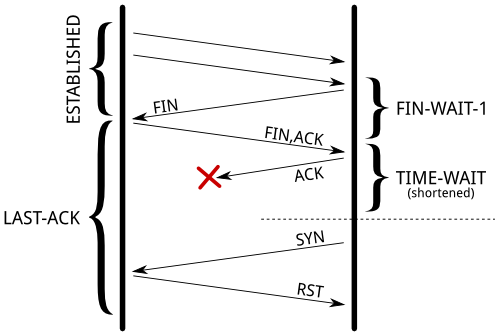

# 不要在linux上启用net.ipv4.tcp_tw_recycle参数

 [2015/07/27](https://www.cnxct.com/coping-with-the-tcp-time_wait-state-on-busy-linux-servers-in-chinese-and-dont-enable-tcp_tw_recycle/) [CFC4N](https://www.cnxct.com/author/admin/)

文章目录 [[显示](https://www.cnxct.com/coping-with-the-tcp-time_wait-state-on-busy-linux-servers-in-chinese-and-dont-enable-tcp_tw_recycle/#)]

本文为翻译英文BLOG《[Coping with the TCP TIME-WAIT state on busy Linux servers](http://vincent.bernat.im/en/blog/2014-tcp-time-wait-state-linux.html)》，但并非完整的翻译，译者CFC4N对原文理解后，进行了调整，增加了相关论点论据，跟原文稍有不同。翻译的目的，是为了加深自己知识点的记忆，以及分享给其他朋友，或许对他们也有帮助。文章比较长，没耐心请点关闭。

## 不要启用 net.ipv4.tcp_tw_recycle

linux 内核文档中，对net.ipv4.tcp_tw_recycle的描述并不是很明确。

> tcp_tw_recycle (Boolean; default: disabled; since Linux 2.4)[译者注：来自linux man tcp的描述]
> Enable fast recycling of TIME-WAIT sockets. Enabling this option is not recommended since this causes
> problems when working with NAT (Network Address Translation).
> 启用TIME-WAIT状态sockets的快速回收，这个选项不推荐启用。在NAT(Network Address Translation)网络下，会导致大量的TCP连接建立错误。

与其功能相似的参数net.ipv4.tcp_tw_reuse，手册里稍微有点描述，如下：

> tcp_tw_reuse (Boolean; default: disabled; since Linux 2.4.19/2.6)
> Allow to reuse TIME-WAIT sockets for new connections when it is safe from protocol viewpoint. It
> should not be changed without advice/request of technical experts.
> //从协议设计上来看，对于TIME-WAIT状态的sockets重用到新的TCP连接上来说，是安全的。（用于客户端时的配置）

这里的注释说明非常的少，我们发现，网上很多linux参数调整指南都建议把这些参数net.ipv4.tcp_tw_recycle 设置1「启用」，用于快速减少在TIME-WAIT状态TCP连接数。
但是，在[TCP（7）手册](http://linux.die.net/man/7/tcp)中，参数net.ipv4.tcp_tw_recycle 非常蛋疼，尤其是在普通用户家中，有多台设备，或者网吧、公司等多台设备，共用同一个NAT设备环境下，TW回收选项是很有问题的面向公共服务器作为它不会把手连接两台不同的计算机上，这问题很难发现，无从下手。

> Enable fast recycling of TIME-WAIT sockets. Enabling this option is not recommended since this causes problems when working with NAT (Network Address Translation).
> 启用TIME-WAIT状态sockets的快速回收，这个选项不推荐启用。在NAT(Network Address Translation)网络下，会导致大量的TCP连接建立错误。如果没有技术大神的指点的话，千万不要去改动他。

下文将给予更详细的解释，希望可以纠正互联网上错误的观点，尤其是转载比较多的内容，搜索时，往往排在前面，使用者往往接触到的都是不严谨的或者是错误的知识点。

正如此文，在 net.ipv4.tcp_tw_recycle 控制参数中，尽管很多地方写的是ipv4,但对ipv6同样实用。此外，我们这里聊的是Linux TCP协议栈，在linux上可能会受到[Netfilter](https://en.wikipedia.org/wiki/Netfilter)影响，稍微有差异。

### 关于TCP连接的TIME-WAIT状态，它是为何而生，存在的意义是什么？

让我们回忆一下，什么是TCP TIME-WAIT状态？如下图
[](https://image.cnxct.com/2015/07/tcp-state-diagram.png)

这图中的流程不是很好理解，再看一张流程更清晰的图

[](https://www.cnxct.com/tools/Tcp_state_diagram_fixed_new.svg)

TCP状态流程图


当TCP连接关闭之前，首先发起关闭的一方会进入TIME-WAIT状态，另一方可以快速回收连接。
可以用ss -tan来查看TCP 连接的当前状态

```
[cfc4n@localhost ~]``#$ ss -tan``State   Recv-Q Send-Q              Local Address:Port               Peer Address:Port``LISTEN   0   128                  127.0.0.1:9000                     *:*``TIME-WAIT 0   0                   127.0.0.1:9000                 127.0.0.1:60274``TIME-WAIT 0   0                   127.0.0.1:9000                 127.0.0.1:60273``CLOSE-WAIT 431  0                 115.29.188.27:60002              110.75.102.62:80``ESTAB   0   208                115.29.188.27:22               180.167.20.210:2455``CLOSE-WAIT 221  0                 115.29.188.27:42489              42.156.166.25:80``FIN-WAIT-2 0   0                 115.29.188.27:80               222.246.178.104:27335
```

### TIME-WAIT状态的作用

对于TIME-WAIT状态来说，有两个作用
一、人尽皆知的是，防止上一个TCP连接的延迟的数据包（发起关闭，但关闭没完成），被接收后，影响到新的TCP连接。（唯一连接确认方式为四元组：源IP地址、目的IP地址、源端口、目的端口），包的序列号也有一定作用，会减少问题发生的几率，但无法完全避免。尤其是较大接收windows size的快速（回收）连接。[RFC1137](http://www.rfc-editor.org/rfc/rfc1137.txt)解释了当TIME-WAIT状态不足时将会发生什么。如果TIME-WAIT状态连接没有被快速回收，会避免什么问题呢？请看下面的例子：
[](https://image.cnxct.com/2015/07/duplicate-segment.png)
缩短TIME-WAIT的时间后，延迟的TCP 包会被新建立的TCP连接接收。

二、另外一个作用是，当最后一个ACK丢失时，远程连接进入LAST-ACK状态，它可以确保远程已经关闭当前TCP连接。如果没有TIME-WAIT状态，当远程仍认为这个连接是有效的，则会继续与其通讯，导致这个连接会被重新打开。当远程收到一个SYN 时，会回复一个RST包，因为这SEQ不对，那么新的连接将无法建立成功，报错终止。
[](https://image.cnxct.com/2015/07/last-ack.png)
如果远程因为最后一个ACK包丢失，导致停留在LAST-ACK状态，将影响新建立具有相同四元组的TCP连接。

[RFC 793](http://tools.ietf.org/html/rfc793)中强调TIME-WAIT状态必须是两倍的MSL时间（max segment lifetime），在linux上，这个限制时间无法调整，写死为1分钟了，定义在include/net/tcp.h

```
#define TCP_TIMEWAIT_LEN (60*HZ) /* how long to wait to destroy TIME-WAIT``         ``* state, about 60 seconds */``#define TCP_FIN_TIMEOUT TCP_TIMEWAIT_LEN``                 ``/* BSD style FIN_WAIT2 deadlock breaker.``         ``* It used to be 3min, new value is 60sec,``         ``* to combine FIN-WAIT-2 timeout with``         ``* TIME-WAIT timer.``         ``*/
```

曾有人提议将[TCP TIME-WAIT时间改为一个可以自定义配置的参数](http://comments.gmane.org/gmane.linux.network/244411)，但被拒绝了，其实，这对TCP规范，对TIME-WAIT来说，是利大于弊的。

### 那么问题来了

我们来看下，为什么这个状态能影响到一个处理大量连接的服务器，从下面三个方面来说：

- 新老连接（相同四元组）在TCP连接表中的slot复用避免
- 内核中，socket结构体的内存占用
- 额外的CPU开销

而ss -tan state time-wait|wc -l的结果，并不能说明这些问题。

### Connection table slot连接表槽

处于TIME-WAIT状态的TCP连接，在链接表槽中存活1分钟，意味着另一个相同四元组（源地址，源端口，目标地址，目标端口）的连接不能出现，也就是说新的TCP（相同四元组）连接无法建立。

对于web服务器来说，目标地址、目标端口都是固定值。如果web服务器是在L7层的负载均衡后面，那么源地址更是固定值。在LINUX上，作为客户端时，客户端端口默认可分配的数量是3W个（可以在参数net.ipv4.up_local_port_range上调整）。
这意味着，在web服务器跟负载均衡服务器之间，每分钟只有3W个端口是处于established状态，也就大约500连接每秒。

如果TIME-WAIT状态的socket出现在客户端，那这个问题很容易被发现。调用connect()函数会返回EADDRNOTAVAIL,程序也会记录相关的错误到日志。
如果TIME-WATI状态的socket出现在服务端，问题会非常复杂，因为这里并没有日志记录，也没有计数器参考。不过，可以列出服务器上当前所有四元组连接的数量来确认

```
[root@localhost ~]``#$ ss -tan 'sport = :80' | awk '{print $(NF)" "$(NF-1)}' | sed 's/:[^ ]*//g' | sort | uniq -c``  ``696 10.24.2.30 10.33.1.64``  ``1881 10.24.2.30 10.33.1.65``  ``5314 10.24.2.30 10.33.1.66``  ``5293 10.24.2.30 10.33.1.67``  ``3387 10.24.2.30 10.33.1.68``  ``2663 10.24.2.30 10.33.1.69``  ``1129 10.24.2.30 10.33.1.70`` ``10536 10.24.2.30 10.33.1.73
```

解决办法是，增加四元组的范围，这有很多方法去实现。（以下建议的顺序，实施难度从小到大排列）

- 修改net.ipv4.ip_local_port_range参数，增加客户端端口可用范围。
- 增加服务端端口，多监听一些端口，比如81、82、83这些，web服务器前有负载均衡，对用户友好。
- 增加客户端IP，尤其是作为负载均衡服务器时，使用更多IP去跟后端的web服务器通讯。
- 增加服务端IP。

当然了，最后的办法是调整net.ipv4.tcp_tw_reuse和net.ipv4.tcp_tw_recycle。但不到万不得已，千万别这么做，稍后再讲。

### 内存

保持大量的连接时，当多为每一连接多保留1分钟，就会多消耗一些服务器的内存。举个栗子，如果服务器每秒处理了1W个新的TCP连接，那么服务器将会存货1W/s*60s = 60W个TIME-WAIT状态的TCP连接，那这将会占用多大的内存么？别担心，少年，没那么多。

首先，从应用的角度来看，一个TIME-WAIT状态的socket不会消耗任何内存：socket已经关了。在内核中，TIME-WAIT状态的socket，对于三种不同的作用，有三个不同的结构。
一、“TCP established hash table”的连接存储哈希表（包括其他非established状态的连接），当有新的数据包发来时，是用来定位查找存活状态的连接的。
该哈希表的bucket都包括在TIME-WAIT连接列表以及正在活跃的连接列表中（netstat -antp命令的结果中，没PID的TIME_WAIT状态连接，跟有PID的活跃连接两种）。
该哈希表的大小，取决于操作系统内存大小。在系统引导时，会打印出来，dmesg日志中可以看到。

```
dmesg | ``grep` `"TCP established hash table"``[  0.169348] TCP established ``hash` `table entries: 65536 (order: 8, 1048576 bytes)
```

这个数值，有可能被kernel启动参数thash_entries(设置TCP连接哈希表的最大数目)的改动而将其覆盖。

在TIME-WAIT状态连接列表中，每一个元素都是一个tcp_timewait_sock结构体，其他状态的连接都是tcp_sock结构体。

```
struct` `tcp_timewait_sock {``  ``struct` `inet_timewait_sock tw_sk;``  ``u32  tw_rcv_nxt;``  ``u32  tw_snd_nxt;``  ``u32  tw_rcv_wnd;``  ``u32  tw_ts_offset;``  ``u32  tw_ts_recent;``  ``long`  `tw_ts_recent_stamp;``};` `struct` `inet_timewait_sock {``  ``struct` `sock_common __tw_common;` `  ``int`           `tw_timeout;``  ``volatile` `unsigned ``char` `tw_substate;``  ``unsigned ``char`      `tw_rcv_wscale;``  ``__be16 tw_sport;``  ``unsigned ``int` `tw_ipv6only   : 1,``         ``tw_transparent : 1,``         ``tw_pad     : 6,``         ``tw_tos     : 8,``         ``tw_ipv6_offset : 16;``  ``unsigned ``long`      `tw_ttd;``  ``struct` `inet_bind_bucket *tw_tb;``  ``struct` `hlist_node    tw_death_node; #这个结构体叫做“death row”的connection hash``};
```

二、“death row”连接列表，是用来终止TIME-WAIT状态的连接的，这会在他们过期之前，开始申请。它占用的内存空间，跟在连接哈希表中的一样。这个结构体hlist_node tw_death_node是inet_timewait_sock的一个成员，如上代码的倒数第二行。

三、端口绑定的哈希表，用来存储绑定端口跟其他参数，用来确保当前端口没有被使用的，比如在listen监听时的指定端口，或者连接其他socket时，系统动态分配的端口。该哈希表的大小跟连接哈希表大小一样。

```
$ dmesg | ``grep` `"TCP bind hash table"``[  0.169962] TCP bind ``hash` `table entries: 65536 (order: 8, 1048576 bytes)
```

每个元素都是inet_bind_socket结构体。每个绑定的端口都会有一个元素。对于web服务器来说，它绑定的是80端口，其TIME-WAIT连接都是共享同一个entry的。另外，连接到远程服务器的本地连接，他们的端口都是随机分配的，并不共享其entry。
所以，我们只关心结构体tcp_timewait_sock跟结构体inet_bind_socket所占用的空间大小。每一个连到远程，或远程连到本地的一个TIME-WAIT状态的连接，都有一个tcp_timewait_sock结构体。还有个结构体inet_bind_socket，只会在连到远程的连接会存在，远程连过来的连接没这个结构体。

tcp_timewait_sock结构体的大小只有168 bytes，inet_bind_socket结构体为48bytes：

```
$ ``sudo` `apt-get ``install` `linux-image-$(``uname` `-r)-dbg``[...]``$ ``gdb` `/usr/lib/debug/boot/vmlinux-``$(``uname` `-r)``(``gdb``) print sizeof(struct tcp_timewait_sock)`` ``$1 = 168``(``gdb``) print sizeof(struct tcp_sock)`` ``$2 = 1776``(``gdb``) print sizeof(struct inet_bind_bucket)`` ``$3 = 48
```

所以，当服务器上有4W个连进来的连接进入TIME-WAIT状态时，才用了10MB不到的内存。如果服务器上有4W个连接到远程的连接进入TIME-WAIT状态时，才用了2.5MB的内存。再来看下slabtop的结果，这里测试数据是5W个TIME-WAIT状态的连接结果，其中4.5W是连接到远程的连接：

```
$ ``sudo` `slabtop -o | ``grep` `-E ``'(^ OBJS|tw_sock_TCP|tcp_bind_bucket)'`` ``OBJS ACTIVE USE OBJ SIZE SLABS OBJ``/SLAB` `CACHE SIZE NAME          `` ``50955 49725 97%  0.25K  3397    15   13588K tw_sock_TCP      `` ``44840 36556 81%  0.06K  760    59   3040K tcp_bind_bucket
```

命令执行结果原样输出，一个字符都没动。TIME-WAIT状态的连接占用内存非常的小。如果你的服务器上要处理每秒成千上万的新建TCP连接，你可能需要多一点的内存才能 正确无误的跟客户端做数据通信。但TIME-WAIT状态连接的内存占用，简直可以无视。

### CPU

在CPU这边，查找一个空闲端口的操作，还是蛮珍贵的。这由inet_csk_get_port() 函数，加锁，遍历整个空闲端口列表实现。这个哈希表里条目数量大通常不是问题，如果服务器上存在大量连接到远程TIME-WAIT状态的连接（比如FPM连redis、memcache之类），都会同享相同的profile，这个特性会非常快的按照顺序找到一个新的空闲端口。

### 其他解决办法

如果你读了上面的章节后，仍对TIME-WAIT状态的连接存有疑问，那么接着看吧：

- 禁用socket延迟关闭「译者注1：以ubuntu 12.04为例，linger结构体定义在：/usr/src/linux-headers-3.2.0-23/include/linux/socket.h」
- 禁用net.ipv4.tcp_tw_reuse
- 禁用net.ipv4.tcp_tw_recycle

```
struct` `linger {``    ``int`       `l_onoff;    ``/* Linger active        */``    ``int`       `l_linger;    ``/* How long to linger for    */``};
```

当close被调用时，SOCKET需要延迟关闭(lingering)，在内核buffers中的残留数据将会发送到远程地址，同时，socket会切换到TIME-WAIT状态。如果禁用此选项，则调用close之后，底层也会关闭，不会将Buffers中残留数据未发送的数据继续发送。

不过呢，应用程序可以选择禁用socket lingering延迟关闭行为。关于socket lingering 延迟关闭，下面两个行为简单描述一下：
第一种情况，close函数后，并不会直接终止该四元组连接序号，而是在buffers任何残留数据都会被丢弃。该TCP连接将会收到一个RST的关闭信号，之后，服务端将立刻销毁该（四元组）连接。 在这种做法中，不会再有TIME-WAIT状态的SOCKET出现。第二种情况，如果当调用close函数后，socket发送buffer中仍然有残留数据，此进程将会休眠，直到所有数据都发送完成并确认，或者所配置的linger计时器过期了。非阻塞socket可以设置不休眠。如上，这些过程都都在底层发生，这个机制确保残留数据在配置的超时时间内都发送出去。 如果数据正常发送出去，close包也正常发送，那么将会转换为TIME-WAIT状态。其他异常情况下，客户端将会收到RST的连接关闭信号，同时，服务端残留数据会被丢弃。

这里的两种情况，禁用socket linger延迟关闭不是万金油。但在HAproxy,Nginx（反代）场景中，在TCP协议上层的应用上（比如HTTP），比较合适。同样，也有很多无可厚非的理由不能禁用它。

### net.ipv4.tcp_tw_reuse

TIME-WAIT状态是为了防止不相关的延迟请求包被接受。但在某些特定条件下，很有可能出现，新建立的TCP连接请求包，被老连接（同样的四元组，暂时还是TIME-WAIT状态，回收中）的连接误处理。RFC 1323 实现了TCP拓展规范，以保证网络繁忙状态下的高可用。除此之外，另外，它定义了一个新的TCP选项–两个四字节的timestamp fields时间戳字段，第一个是TCP发送方的当前时钟时间戳，而第二个是从远程主机接收到的最新时间戳。
启用net.ipv4.tcp_tw_reuse后，如果新的时间戳，比以前存储的时间戳更大，那么linux将会从TIME-WAIT状态的存活连接中，选取一个，重新分配给新的连接出去的TCP连接。
连出的TIME-WAIT状态连接，仅仅1秒后就可以被重用了。

#### 如何确通讯安全性?

TIME-WAIT的第一个作用是避免新的连接（不相关的）接收到重复的数据包。由于使用了时间戳，重复的数据包会因为timestamp过期而丢弃。
第二个作用是确保远程端（远程的不一定是服务端，有可能，对于服务器来说，远程的是客户端，我这里就用远程端来代替）是不是在LAST-ACK状态。因为有可能丢ACK包丢。远程端会重发FIN包，直到

- 放弃（连接断开）
- 等到ACK包
- 收到RST包

如果 FIN包接及时收到，本地端依然是TIME-WAIT状态，同时，ACK包也会发送出去。

一旦新的连接替换了TIME-WAIT的entry，新连接的SYN包会被忽略掉（这得感谢timestramps），也不会应答RST包，但会重传FIN包。 FIN包将会收到一个RST包的应答（因为本地连接是SYN-SENT状态），这会让远程端跳过LAST-ACK状态。 最初的SYN包将会在1秒后重新发送，然后完成连接的建立。看起来没有啥错误发生，只是延迟了一下。
[](https://image.cnxct.com/2015/07/last-ack-reuse1.png)
另外，当连接被重用时，TWrecycled计数器会增加的。「译者注：见/proc/net/netstat 中TWrecycled的值」

### net.ipv4.tcp_tw_recycle

这种机制也依赖时间戳选项，这也会影响到所有连接进来和连接出去的连接。「译者注：linux上tcp_timestamps默认开启」
TIME-WAIT状态计划更早的过期：它将会在超时重发（RTO）间隔后移除（底层会根据当前连接的延迟状况根据RTT来计算RTO值，上篇《[PHP-FPM中backlog参数变更的一些思考](http://www.cnxct.com/something-about-phpfpm-s-backlog/)》也有提到过，比较复杂的算法）。可以执行ss指令，获取当前存活的TCP连接状态，查看这些数据。「译者注：linux指令ss的结果中rto,rtt值单位均为ms」

```
$ ss --info sport = :2112 dport = :4057``State   Recv-Q Send-Q  Local Address:Port    Peer Address:Port  ``ESTAB   0   1831936  10.47.0.113:2112     10.65.1.42:4057  ``     ``cubic wscale:7,7 rto:564 rtt:352.5``/4` `ato:40 cwnd:386 ssthresh:200 send 4.5Mbps rcv_space:5792
```

Linux将会放弃所有来自远程端的timestramp时间戳小于上次记录的时间戳（也是远程端发来的）的任何数据包。除非TIME-WAIT状态已经过期。

```
if` `(tmp_opt.saw_tstamp &&``  ``tcp_death_row.sysctl_tw_recycle &&``  ``(dst = inet_csk_route_req(sk, &fl4, req, want_cookie)) != NULL &&``  ``fl4.daddr == saddr &&``  ``(peer = rt_get_peer((``struct` `rtable *)dst, fl4.daddr)) != NULL) {``    ``inet_peer_refcheck(peer);``    ``if` `((u32)get_seconds() - peer->tcp_ts_stamp < TCP_PAWS_MSL &&``      ``(s32)(peer->tcp_ts - req->ts_recent) >``                    ``TCP_PAWS_WINDOW) {``        ``NET_INC_STATS_BH(sock_net(sk), LINUX_MIB_PAWSPASSIVEREJECTED);``        ``goto` `drop_and_release;``    ``}``}
```

当远程端主机HOST处于NAT网络中时，时间戳在一分钟之内（MSL时间间隔）将禁止了NAT网络后面，除了这台主机以外的其他任何主机连接，因为他们都有各自CPU CLOCK，各自的时间戳。这会导致很多疑难杂症，很难去排查，建议你禁用这个选项。另外，对方上TCP的LAST-ACK状态是体现本机net.ipv4.tcp_tw_recycle的最好数据。

### 总结

最合适的解决方案是增加更多的四元组数目，比如，服务器可用端口，或服务器IP，让服务器能容纳足够多的TIME-WAIT状态连接。在我们常见的互联网架构中（NGINX反代跟NGINX，NGINX跟FPM，FPM跟redis、mysql、memcache等），减少TIME-WAIT状态的TCP连接，最有效的是使用长连接，不要用短连接，尤其是负载均衡跟web服务器之间。尤其是[链家事件中的PHP连不上redis](http://zhi.hu/oRZK)。

在服务端，不要启用net.ipv4.tcp_tw_recycle，除非你能确保你的服务器网络环境不是NAT。在服务端上启用net.ipv4.tw_reuse对于连接进来的TCP连接来说，并没有任何卵用。
在客户端（尤其是服务器上，某服务以客户端形式运行时，比如上面提到的nginx反代，连接着redis、mysql的FPM等等）上启用net.ipv4.tcp_tw_reuse，还算稍微安全的解决TIME-WAIT的方案。再开启net.ipv4.tcp_tw_recycle的话，对客户端（或以客户端形式）的回收，也没有什么卵用，反而会发生很多诡异的事情（尤其是FPM这种服务器上，相对nginx是服务端，相对redis是客户端）。

最后引用一下W. Richard Stevens在《[UNIX网络编程](http://book.douban.com/subject/1500149/)》的一句话

> The TIME_WAIT state is our friend and is there to help us (i.e., to let old duplicate segments expire in the network). Instead of trying to avoid the state, we should understand it.
> 译者：存在即合理，勇敢面对，而不是逃避。

### 译者注：

- 译者根据原文做了翻译，并增加了相关论点论据，跟原文稍有不同。
- linux的netstat命令ss命令的结果中，前者是TIME_WAIT之类，分个字符是下划线，而后者是TIME-WAIT的中划线。

### 残酷的案例：

- Clients behind NAT/Stateful FW will get dropped, 99.99999999% of time should never be enabled[Tuning TCP and nginx on ec2](http://www.cnxct.com/tools/Tuning-TCP-and-nginx-on-ec2.pdf)中30页内容

### 参考资料：

- [Tuning TCP and nginx on ec2 -p30](http://www.cnxct.com/tools/Tuning-TCP-and-nginx-on-ec2.pdf)
- [TIME_WAIT and its design implications for protocols and scalable client server systems](http://www.serverframework.com/asynchronousevents/2011/01/time-wait-and-its-design-implications-for-protocols-and-scalable-servers.html)
- [tcp_tw_recycle和tcp_timestamps导致connect失败问题](http://blog.sina.com.cn/s/blog_781b0c850100znjd.html)
- [记一次TIME_WAIT网络故障](http://huoding.com/2012/01/19/142)
- [打开tcp_tw_recycle引起的一个问题](http://www.pagefault.info/2012/07/04/open-a-problem-caused-by-tcptwrecycle.html)
- [Transmission Control Protocol](https://en.wikipedia.org/wiki/Transmission_Control_Protocol)

### 2017年10月更新

在linux 4.1内核中，net.ipv4.tcp_tw_recycle参数将被移除。[net.ipv4.tcp_tw_recycle has been removed from Linux 4.12.](https://git.kernel.org/pub/scm/linux/kernel/git/torvalds/linux.git/commit/?id=4396e46187ca5070219b81773c4e65088dac50cc)

> The tcp_tw_recycle was already broken for connections
> behind NAT, since the per-destination timestamp is not
> monotonically increasing for multiple machines behind
> a single destination address.
>
> After the randomization of TCP timestamp offsets
> in commit 8a5bd45f6616 (tcp: randomize tcp timestamp offsets
> for each connection), the tcp_tw_recycle is broken for all
> types of connections for the same reason: the timestamps
> received from a single machine is not monotonically increasing,
> anymore.
>
> Remove tcp_tw_recycle, since it is not functional. Also, remove
> the PAWSPassive SNMP counter since it is only used for
> tcp_tw_recycle, and simplify tcp_v4_route_req and tcp_v6_route_req
> since the strict argument is only set when tcp_tw_recycle is
> enabled.

[](http://creativecommons.org/licenses/by-nc-sa/3.0/deed.zh)莿鸟栖草堂 由 [CFC4N](http://www.cnxct.com/) 创作，采用 [知识共享 署名-非商业性使用-相同方式共享（3.0未本地化版本）许可协议](http://creativecommons.org/licenses/by-nc-sa/3.0/deed.zh)进行许可。基于[http://www.cnxct.com](http://www.cnxct.com/)上的作品创作。转载请注明转自：[不要在linux上启用net.ipv4.tcp_tw_recycle参数](https://www.cnxct.com/coping-with-the-tcp-time_wait-state-on-busy-linux-servers-in-chinese-and-dont-enable-tcp_tw_recycle/)

No related posts.

 [所谓技术](https://www.cnxct.com/category/所谓技术/) [Linux](https://www.cnxct.com/tag/linux/), [net.ipv4.tcp_tw_recycle](https://www.cnxct.com/tag/net-ipv4-tcp_tw_recycle/), [net.ipv4.tcp_tw_reuse](https://www.cnxct.com/tag/net-ipv4-tcp_tw_reuse/), [netstat](https://www.cnxct.com/tag/netstat/), [ss](https://www.cnxct.com/tag/ss/), [sysctl](https://www.cnxct.com/tag/sysctl/), [tcp](https://www.cnxct.com/tag/tcp/), [TIME-WAIT](https://www.cnxct.com/tag/time-wait/), [time_wait](https://www.cnxct.com/tag/time_wait/), [协议](https://www.cnxct.com/tag/协议/). [permalink](https://www.cnxct.com/coping-with-the-tcp-time_wait-state-on-busy-linux-servers-in-chinese-and-dont-enable-tcp_tw_recycle/).