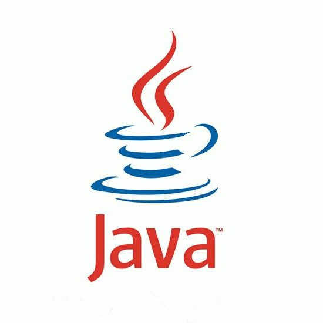

# 如果jvm加载的类比较多，内存会不会爆掉？

假设有无穷个类，每个类只用一次，但是是通过ClassLoader逐步加载的，那么jvm从第一个类开始加载，内存就会一直上升，jvm有没有清理这些用过的类的机制，比如说像虚拟内存一样的机制，或者只能用操作系统的虚拟内存解决问题。

虽说放在硬盘里也总有一天会爆掉，但是已经是可以接受的解决方案了。
如果能释放已经加载的类的资源就更好了，可是百度到的答案，都是类只能加载一次。

关注者**127**

被浏览

**5,700**

关注问题写回答

邀请回答

好问题

3 条评论

分享

收起 

#### 10 个回答

默认排序

[chainho](https://www.zhihu.com/people/chainho)

公众号「Tomcat那些事儿」

题主的内存爆了，是机器死机？还是OOM?如果是指OOM那是必然。如果是死机应该不会吧。有JVM的Xmx和maxPermSize限制，最大可用内存是固定的。
如果为了回收，可以设置自定义的ClassLoader,在一定的时间执行回收。创建新的classLoader，达到回收内存的目的。

[发布于 2015-06-01](https://www.zhihu.com/question/30835448/answer/49664058)

赞同添加评论

分享

收藏喜欢

继续浏览内容

知乎

发现更大的世界

打开

Chrome

继续

[王鸿飞](https://www.zhihu.com/people/wanghongfei8)

现阶段还只能靠代码糊口。

3 人赞同了该回答

当一个类满足卸载条件时（这个类没有任何对象，并且class对象和加载该类的classloader已经被回收），也是可以被卸载从而释放这部分内存的。JAVA8移除了永久带增加了元数据区（加载的类就放在这里），这部分是直接内存，因此理论上只受操作系统物理内存大小的限制。如果通过jvisualvm观察，会发现已经加载的类的数量也是会减少的，说明被回收

[编辑于 2015-08-14](https://www.zhihu.com/question/30835448/answer/59121391)

赞同 3添加评论

分享

收藏喜欢

继续浏览内容

知乎

发现更大的世界

打开

Chrome

继续

[小猪](https://www.zhihu.com/people/xzer)

写程序很好玩

1 人赞同了该回答

java8之后可以回收了，之前的不行，手机打字懒得多说，自己去看java8的相关介绍

[发布于 2015-05-31](https://www.zhihu.com/question/30835448/answer/49614127)

赞同 11 条评论

分享

收藏喜欢

继续浏览内容

知乎

发现更大的世界

打开

Chrome

继续

[书华](https://www.zhihu.com/people/zhanwuzha)

京东 Java工程师

1 人赞同了该回答

涉及两方面的内容，类卸载及类描述在jvm中的存放**首先关于类卸载**在类使用完之后，如果满足下面的情况，类就会被卸载：该类所有的实例都已经被回收，也就是java堆中不存在该类的任何实例。加载该类的ClassLoader已经被回收，JVM自带的ClassLoader不会被回收。该类对应的java.lang.Class对象没有任何地方被引用，无法在任何地方通过反射访问该类的方法。如果以上三个条件全部满足，jvm就会在垃圾回收的时候对类进行卸载，类卸载后，java类的整个生命周期就结束了。**类描述在JVM中的存放**1.7类描述存放于堆中，大小通过JVM参数可以知道，在1.8中类描述被移到了堆空间。堆空间理论上拥有的大小等同于系统的内存大小。综上所述，如果内存被无限的类加载搞爆掉有两种情况：类加载不是由自定义类加载器进行加载，此时因为ClassLoader不会被回收，所以加载的类不会被卸载。当达到元空间最大限制后会内存溢出。机器内存空间有限，或者jdk小于1.8且元空间设置大小过小，此时也会导致类描述存储不下产生内存溢出

[发布于 07-05](https://www.zhihu.com/question/30835448/answer/1320831810)

赞同 1添加评论

分享

收藏喜欢

继续浏览内容

知乎

发现更大的世界

打开

Chrome

继续

[Shisoft](https://www.zhihu.com/people/shisoft)

Architect

4 人赞同了该回答

会，以前用 Clojure 的时候因为一直在 eval，动态生成并加载类导致 JVM 崩溃。这个并不能通过调整 maxPermSize 解决问题，因为加载的类不在这个空间里。
不过一般增长过程非常缓慢。不清楚你是什么原因造成这样的问题，我们最后通过缓存解决了问题。
如果需要回收已经加载的类，可以通过自定义 ClassLoader 实现，但是这样又会有新的问题，比如 ClassLoader 非同父级的类之间是不能共享的，同时 GC 并不能完全保证回收并销毁先前加载的类 [classloader - Unloading classes in java?](https://link.zhihu.com/?target=http%3A//stackoverflow.com/questions/148681/unloading-classes-in-java)

[编辑于 2015-06-02](https://www.zhihu.com/question/30835448/answer/49754229)

赞同 411 条评论

分享

收藏喜欢

继续浏览内容

知乎

发现更大的世界

打开

Chrome

继续

[java](https://www.zhihu.com/people/17872083537)

7年多java开发经验，分享一些经验干货 和遇到的问题

**一、内存溢出类型**1、java.lang.OutOfMemoryError: PermGen spaceJVM管理两种类型的内存，堆和非堆。堆是给开发人员用的上面说的就是，是在JVM启动时创建；非堆是留给JVM自己用的，用来存放类的信息的。它和堆不同，运行期内GC不会释放空间。如果web app用了大量的第三方jar或者应用有太多的class文件而恰好MaxPermSize设置较小，超出了也会导致这块内存的占用过多造成溢出，或者tomcat热部署时侯不会清理前面加载的环境，只会将context更改为新部署的，非堆存的内容就会越来越多。PermGen space的全称是Permanent Generation space,是指内存的永久保存区域，这块内存主要是被JVM存放Class和Meta信息的,Class在被Loader时就会被放到PermGen space中，它和存放类实例(Instance)的Heap区域不同,GC(Garbage Collection)不会在主程序运行期对PermGen space进行清理，所以如果你的应用中有很CLASS的话,就很可能出现PermGen space错误，这种错误常见在web服务器对JSP进行pre compile的时候。如果你的WEB APP下都用了大量的第三方jar, 其大小超过了jvm默认的大小(4M)那么就会产生此错误信息了。
一个最佳的配置例子：(经过本人验证，自从用此配置之后，再未出现过tomcat死掉的情况)set JAVA_OPTS=-Xms800m -Xmx800m -XX:PermSize=128M -XX:MaxNewSize=256m -XX:MaxPermSize=256m2、java.lang.OutOfMemoryError: Java heap space第一种情况是个补充，主要存在问题就是出现在这个情况中。其默认空间(即-Xms)是物理内存的1/64，最大空间(-Xmx)是物理内存的1/4。如果内存剩余不到40％，JVM就会增大堆到Xmx设置的值，内存剩余超过70％，JVM就会减小堆到Xms设置的值。所以服务器的Xmx和Xms设置一般应该设置相同避免每次GC后都要调整虚拟机堆的大小。假设物理内存无限大，那么JVM内存的最大值跟操作系统有关，一般32位机是1.5g到3g之间，而64位的就不会有限制了。注意：如果Xms超过了Xmx值，或者堆最大值和非堆最大值的总和超过了物理内存或者操作系统的最大限制都会引起服务器启动不起来。**垃圾回收GC的角色**JVM调用GC的频度还是很高的，主要两种情况下进行垃圾回收：当应用程序线程空闲；另一个是java内存堆不足时，会不断调用GC，若连续回收都解决不了内存堆不足的问题时，就会报out of memory错误。因为这个异常根据系统运行环境决定，所以无法预期它何时出现。根据GC的机制，程序的运行会引起系统运行环境的变化，增加GC的触发机会。为了避免这些问题，程序的设计和编写就应避免垃圾对象的内存占用和GC的开销。显示调用System.GC()只能建议JVM需要在内存中对垃圾对象进行回收，但不是必须马上回收，一个是并不能解决内存资源耗空的局面，另外也会增加GC的消耗。**二、JVM内存区域组成**简单的说java中的堆和栈java把内存分两种：一种是栈内存，另一种是堆内存1。在函数中定义的基本类型变量和对象的引用变量都在函数的栈内存中分配；2。堆内存用来存放由new创建的对象和数组在函数（代码块）中定义一个变量时，java就在栈中为这个变量分配内存空间，当超过变量的作用域后，java会自动释放掉为该变量所分配的内存空间；在堆中分配的内存由java虚拟机的自动垃圾回收器来管理堆的优势是可以动态分配内存大小，生存期也不必事先告诉编译器，因为它是在运行时动态分配内存的。缺点就是要在运行时动态分配内存，存取速度较慢；栈的优势是存取速度比堆要快，缺点是存在栈中的数据大小与生存期必须是确定的无灵活性。java堆分为三个区：New、Old和PermanentGC有两个线程：新创建的对象被分配到New区，当该区被填满时会被GC辅助线程移到Old区，当Old区也填满了会触发GC主线程遍历堆内存里的所有对象。Old区的大小等于Xmx减去-Xmn**java栈存放**栈调整：参数有+UseDefaultStackSize -Xss256K，表示每个线程可申请256k的栈空间每个线程都有他自己的Stack**三、JVM如何设置虚拟内存**提示：在JVM中如果98％的时间是用于GC且可用的Heap size 不足2％的时候将抛出此异常信息。提示：Heap Size 最大不要超过可用物理内存的80％，一般的要将-Xms和-Xmx选项设置为相同，而-Xmn为1/4的-Xmx值。提示：JVM初始分配的内存由-Xms指定，默认是物理内存的1/64；JVM最大分配的内存由-Xmx指定，默认是物理内存的1/4。默认空余堆内存小于40%时，JVM就会增大堆直到-Xmx的最大限制；空余堆内存大于70%时，JVM会减少堆直到-Xms的最小限制。因此服务器一般设置-Xms、-Xmx相等以避免在每次GC 后调整堆的大小。提示：假设物理内存无限大的话，JVM内存的最大值跟操作系统有很大的关系。简单的说就32位处理器虽然可控内存空间有4GB,但是具体的操作系统会给一个限制，这个限制一般是2GB-3GB（一般来说Windows系统下为1.5G-2G，Linux系统下为2G-3G），而64bit以上的处理器就不会有限制了提示：注意：如果Xms超过了Xmx值，或者堆最大值和非堆最大值的总和超过了物理内存或者操作系统的最大限制都会引起服务器启动不起来。提示：设置NewSize、MaxNewSize相等，"new"的大小最好不要大于"old"的一半，原因是old区如果不够大会频繁的触发"主" GC ，大大降低了性能JVM使用-XX:PermSize设置非堆内存初始值，默认是物理内存的1/64；由XX:MaxPermSize设置最大非堆内存的大小，默认是物理内存的1/4。解决方法：手动设置Heap size修改TOMCAT_HOME/bin/catalina.bat在“echo "Using CATALINA_BASE: $CATALINA_BASE"”上面加入以下行：JAVA_OPTS="-server -Xms800m -Xmx800m -XX:MaxNewSize=256m"**四、性能检查工具使用**定位内存泄漏：JProfiler工具主要用于检查和跟踪系统（限于Java开发的）的性能。JProfiler可以通过时时的监控系统的内存使用情况，随时监视垃圾回收，线程运行状况等手段，从而很好的监视JVM运行情况及其性能。1. 应用服务器内存长期不合理占用，内存经常处于高位占用，很难回收到低位；2. 应用服务器极为不稳定，几乎每两天重新启动一次，有时甚至每天重新启动一次；3. 应用服务器经常做Full GC(Garbage Collection)，而且时间很长，大约需要30-40秒，应用服务器在做Full GC的时候是不响应客户的交易请求的，非常影响系统性能。因为开发环境和产品环境会有不同，导致该问题发生有时会在产品环境中发生，通常可以使用工具跟踪系统的内存使用情况，在有些个别情况下或许某个时刻确实是使用了大量内存导致out of memory，这时应继续跟踪看接下来是否会有下降，如果一直居高不下这肯定就因为程序的原因导致内存泄漏。**五、不健壮代码的特征及解决办法**1、尽早释放无用对象的引用。好的办法是使用临时变量的时候，让引用变量在退出活动域后，自动设置为null，暗示垃圾收集器来收集该对象，防止发生内存泄露。对于仍然有指针指向的实例，jvm就不会回收该资源,因为垃圾回收会将值为null的对象作为垃圾，提高GC回收机制效率；2、我们的程序里不可避免大量使用字符串处理，避免使用String，应大量使用StringBuffer，每一个String对象都得独立占用内存一块区域；String str = "aaa";String str2 = "bbb";String str3 = str + str2;//假如执行此次之后str ,str2以后再不被调用,那它就会被放在内存中等待Java的gc去回收,程序内过多的出现这样的情况就会报上面的那个错误,建议在使用字符串时能使用StringBuffer就不要用String,这样可以省不少开销；3、尽量少用静态变量，因为静态变量是全局的，GC不会回收的；4、避免集中创建对象尤其是大对象，JVM会突然需要大量内存，这时必然会触发GC优化系统内存环境；显示的声明数组空间，而且申请数量还极大。这是一个案例想定供大家警戒使用jspsmartUpload作文件上传,运行过程中经常出现java.outofMemoryError的错误，检查之后发现问题：组件里的代码m_totalBytes = m_request.getContentLength();m_binArray = new byte[m_totalBytes];问题原因是totalBytes这个变量得到的数极大，导致该数组分配了很多内存空间，而且该数组不能及时释放。解决办法只能换一种更合适的办法，至少是不会引发outofMemoryError的方式解决。参考：[http://bbs.xml.org.cn/blog/more.asp?name=hongrui&id=3747](https://link.zhihu.com/?target=http%3A//bbs.xml.org.cn/blog/more.asp%3Fname%3Dhongrui%26id%3D3747)5、尽量运用对象池技术以提高系统性能；生命周期长的对象拥有生命周期短的对象时容易引发内存泄漏，例如大集合对象拥有大数据量的业务对象的时候，可以考虑分块进行处理，然后解决一块释放一块的策略。6、不要在经常调用的方法中创建对象，尤其是忌讳在循环中创建对象。可以适当的使用hashtable，vector 创建一组对象容器，然后从容器中去取那些对象，而不用每次new之后又丢弃7、一般都是发生在开启大型文件或跟数据库一次拿了太多的数据，造成 Out Of Memory Error 的状况，这时就大概要计算一下数据量的最大值是多少，并且设定所需最小及最大的内存空间值。

[发布于 04-30](https://www.zhihu.com/question/30835448/answer/1190894727)

赞同添加评论

分享

收藏喜欢

收起

继续浏览内容

知乎

发现更大的世界

打开

Chrome

继续

[云洲](https://www.zhihu.com/people/qin-chuan-58)

软件工程师

1 人赞同了该回答

类加载后，类信息放在方法区，也就是所谓的PermGen的，如果真像题主说的无限类，必然出现OOM

[编辑于 2015-06-03](https://www.zhihu.com/question/30835448/answer/49889628)

赞同 11 条评论

分享

收藏喜欢

继续浏览内容

知乎

发现更大的世界

打开

Chrome

继续

匿名用户

貌似可以用不同的类加载器加载，不用了把类加载器释放掉

[发布于 2015-10-09](https://www.zhihu.com/question/30835448/answer/66981264)

赞同添加评论

分享

收藏喜欢

继续浏览内容

知乎

发现更大的世界

打开

Chrome

继续

[慢慢变强](https://www.zhihu.com/people/fengzhihao111)

软件开发工程师

我觉得 [王鸿飞](https://www.zhihu.com/people/wanghongfei8) 回答的挺好的 ，现在元空间linux 通过mmap 映射匿名内存 ，是在虚拟内存基础之上的 ，通过jvm 参数可以设置元空间大小，以防过度使用 。 而且你说的 类只能加载一次 ，是在同一个classloader 只能加载一次 这个要清楚，如果不同的平级classloader 即使加载同一个类 也是能加载两次的。我记得这个对应到jvm 好像有一个hashmap key 是classloader 的信息加上类的信息，可见classloader 不同 导致key不同 是可以多次加载的 。