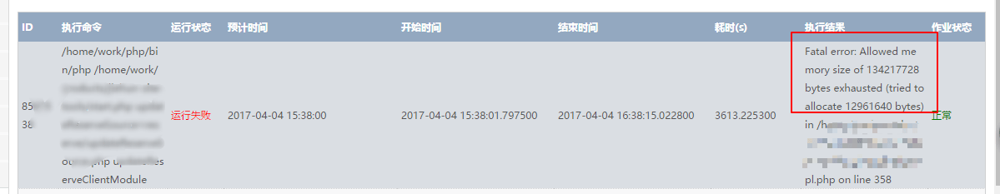
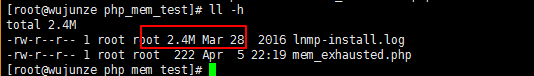
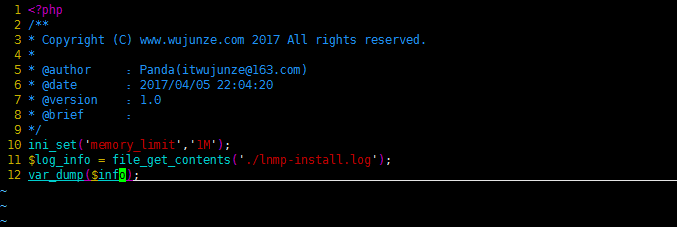
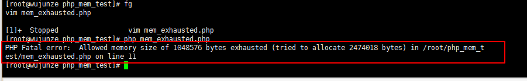
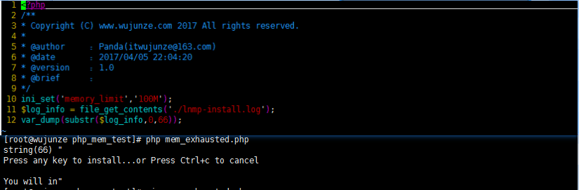
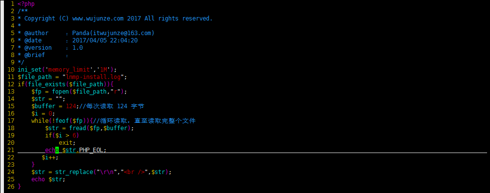
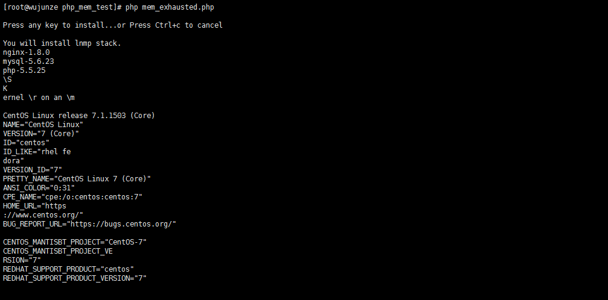

# 谁动了我的内存之 PHP 内存溢出

[18](javascript:;)[5](javascript:;)[8](https://learnku.com/articles/4356/who-moved-my-memory-php-memory-overflow#replies)

[ Laravel ](https://learnku.com/laravel)/ 6224 / 8 / 发布于 3年前 / 更新于 1年前 / [ 1 个改进](https://learnku.com/laravel/t/4356/patches)

今天上午刚到公司，就有同事在公司群里反映某个计划任务出现问题了。我就怀着刨根问底的心，去查看了 log。发现挺有意思的一个问题，PHP 内存溢出导致脚本执行失败。那就一起来看个究竟吧！

1. 首先查看了计划任务的 Log

从报错信息字面意思可以看出，允许的 `134217728 bytes` 的内存已经用尽，还要试图分配 `12961640 bytes` 内存。
给你（当前脚本）分配的内存你已经用完了，你还想问系统要内存。系统这时想对你说：

> 地主家也没有余粮啊 (借用葛优大爷的一句话)

1. 模拟一下 "案发现场"
   - 新建一个 mem_exhausted.php 文件 copy 过来一个 2.4M 的 log 文件做测试用

- 写个简单的脚本重现 "案发现场" 故意分配 1M 的内存 来读取 2.4M 的 log

- 执行脚本，"案发现场" 重现

1. 分析 "事故" 原因
   脚本一次性读取了大量的数据 (可能是读的文件，可能是读取的数据库)
   如下图：往杯子 (**分配给当前脚本的内存**) 里面倒数水 (**log 文件的数据**), 杯子容量 (**内存**) 不够用

1. 解决方案
   a. 既然杯子小 就换个大杯子 (增大给脚本分配的内存) *治标不治本*: `ini_set('memory_limit','100M');`

b. 把水分批次倒入杯子中 (循环，分段读取数据，读数据库的话可以用 limit)

看看结果

**分段读取也是可以解决问题滴**

1. 其他优化方案
   - 应当尽可能减少静态变量的使用，在需要数据重用时，可以考虑使用引用 (&)。
   - 数据库操作完成后，要马上关闭连接；
   - 一个对象使用完，要及时调用析构函数（__destruct ()）
   - 用过的变量及时销毁 (unset ()) 掉
   - 可以使用 memory_get_usage () 函数，获取当前占用内存 根据当前使用的内存来调整程序
   - **unset () 函数只能在变量值占用内存空间超过 256 字节时才会释放内存空间。(PHP 内核的 gc 垃圾回收机制决定)**
   - **有当指向该变量的所有变量（如引用变量）都被销毁后，才会释放内存**
     (PHP 变量底层实现是一个_zval_struct 结构体，refcount_gc 表示引用计数 is_ref__gc 表示是否为引用)