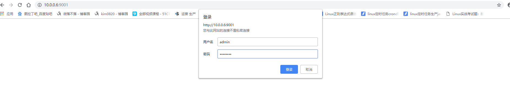
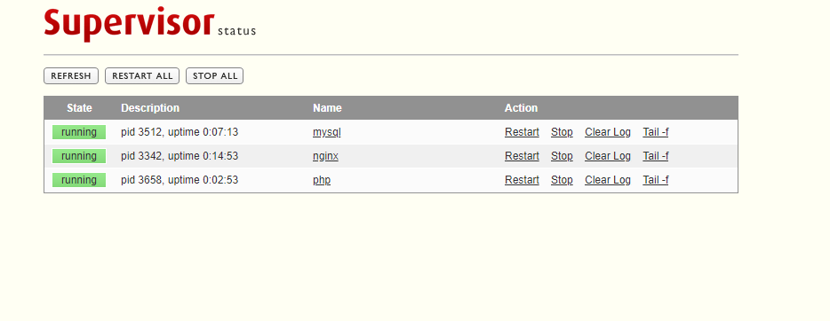
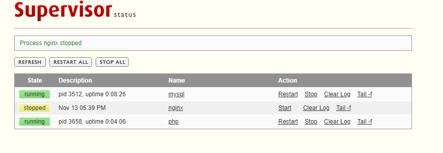
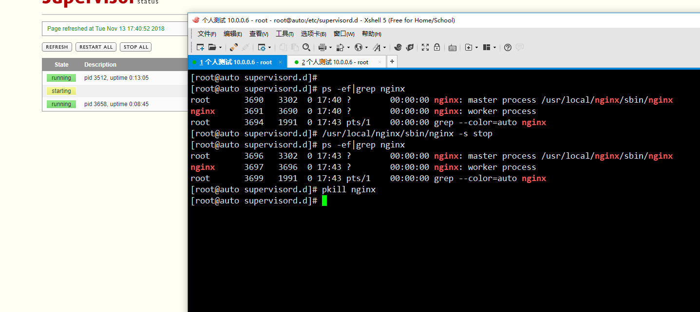

# [Supervisor入门使用](https://www.cnblogs.com/wlbl/p/9953587.html)


目录

- 一、简介
  - [1、Supervisor与系统自带init 进程管理比较](https://www.cnblogs.com/wlbl/p/9953587.html#1、supervisor与系统自带init-进程管理比较)
  - [2、Supervisor的特点](https://www.cnblogs.com/wlbl/p/9953587.html#2、supervisor的特点)
  - [3、Supervisor的组建构成](https://www.cnblogs.com/wlbl/p/9953587.html#3、supervisor的组建构成)
- 二、安装和配置
  - [1、安装](https://www.cnblogs.com/wlbl/p/9953587.html#1、安装)
  - 2、管理supervisor
    - [1）supervisord -c /etc/supervisor.conf 服务端启动](https://www.cnblogs.com/wlbl/p/9953587.html#1）supervisord--c-etcsupervisorconf-服务端启动)
    - [2）supervisorctl -c /etc/supervisor.conf 客户端启动](https://www.cnblogs.com/wlbl/p/9953587.html#2）supervisorctl--c-etcsupervisorconf--客户端启动)
    - [3）web界面](https://www.cnblogs.com/wlbl/p/9953587.html#3）web界面)
  - [2、配置supervisor管理nginx进程](https://www.cnblogs.com/wlbl/p/9953587.html#2、配置supervisor管理nginx进程)
  - [3、配置supervisor管理mysql进程](https://www.cnblogs.com/wlbl/p/9953587.html#3、配置supervisor管理mysql进程)
  - [4、配置supervisor管理php进程](https://www.cnblogs.com/wlbl/p/9953587.html#4、配置supervisor管理php进程)
  - [5、web界面管理supervisor进程](https://www.cnblogs.com/wlbl/p/9953587.html#5、web界面管理supervisor进程)
  - 6、测试
    - [1）测试1](https://www.cnblogs.com/wlbl/p/9953587.html#1）测试1)
    - [2）测试2](https://www.cnblogs.com/wlbl/p/9953587.html#2）测试2)
- [三、总结](https://www.cnblogs.com/wlbl/p/9953587.html#三、总结)


## 一、简介

简介部分参考博文

https://www.cnblogs.com/hanyifeng/p/6728151.html

supervisor与[launchd](https://en.wikipedia.org/wiki/Launchd)，[daemontools](http://cr.yp.to/daemontools.html)，[runit](http://smarden.org/runit/)等程序有着相同的功能，与某些程序不同的是，它并不作为“id 为 1的进程”而替代init。相反，它用于控制应用程序，像启动其它程序一样，通俗理解就是，把Supervisor服务管理的进程程序，它们作为supervisor的子进程来运行，而supervisor是父进程。supervisor来监控管理子进程的启动关闭和异常退出后的自动启动。

### 1、Supervisor与系统自带init 进程管理比较

方便：有些编译运行的程序，在安装完成后，需要为他们编写启动停止管理脚本，写入和维护可能很痛苦，而且进程在异常崩溃结束时，许多程序都不会正确重新启动的。Supervisord启动管理的程序进程是作为其子进程来运行的，并且可以配置为在进程崩溃停止时自动重新启动它们。

准确：在Unix上的进程通常很难获得准确的up/down状态。Pidfiles经常说谎。Supervisord将进程作为子进程启动，所以它总是知道其子进程的正确的up/down状态，可以方便的对这些数据进行查询

进程分组：进程支持分组启动和停止，也支持启动顺序，即‘优先级’，supervisor允许为进程分配优先级，并允许用户通过supervisorctl客户端发出命令，如“全部启动”和”重新启动所有“，它们以预先分配的优先级顺序启动。还可以将进程分为”进程组“，一组逻辑关联的进程可以作为一个单元停止或启动。

### 2、Supervisor的特点

简单：supervisor通过简单的INI风格的配置文件进行配置管理，易于学习，并提供了许多每个进程选项，如重新启动失败的进程和日志的自动切割。

集中：supervisor提供一个start、stop和监控进程的地方，进程可以单独或分组进行控制。可以通过supervisor的本地或远程命令行管理和web管理（一般为了安全，web通常需要禁用）

高效：supervisor通过fork/exec启动子进程，**子进程需要前台运行**，操作系统进程终止时去通知supervisor，而不像一些我们需要写脚本去定期轮询PID文件来重新启动失败的进程。

可扩展：supervisor有一个简单的事件（event）通知协议，还有一个用于控制的XML-RPC接口，可以用Python开发人员来扩展构建。

兼容：supervisor由Python编写，在除Windows操作系统以外基本都支持，如linux，Mac OS x,solaris,FreeBSD系统

### 3、Supervisor的组建构成

Supervisord：supervisor服务器的进程名是supervisord。它主要负责在自己的调用中启动子程序，响应客户端的命令，重新启动崩溃或退出的进程，记录其子进程stdout和stderr的输出，以及生成和处理对应于子进程生命周期中的”event“

服务器进程使用的配置文件，通常路径存放在/etc/supervisord.confa中。此配置文件是INI格式的配置文件。

supervisorctl：supervisor命令行的客户端名称是supervisorctl。它为supervisord提供了一个类似于shell的交互界面。使用supervisorctl，用户可以查看不同的supervisord进程列表，获取控制子进程的状态，如停止和启动子进程

web服务器：一个可以通过Web界面来查看和控制进程的状态，默认监听在9001上。

## 二、安装和配置

本次测试环境

| 主机名 | ip          | 系统       |
| ------ | ----------- | ---------- |
| auto   | 10.0.0.6/24 | Centos 7.5 |

### 1、安装

```
[root@auto ~]# yum install supervisor -y
Loaded plugins: fastestmirror
Loading mirror speeds from cached hostfile
epel/x86_64/metalink                                                                                                                                                  | 8.4 kB  00:00:00     
 * base: mirrors.aliyun.com
 * epel: mirrors.aliyun.com
 * extras: mirrors.aliyun.com
 * updates: mirrors.aliyun.com
base                                                                                                                                                                  | 3.6 kB  00:00:00     
docker-ce-edge                                                                                                                                                        | 3.5 kB  00:00:00     
docker-ce-stable                                                                                                                                                      | 3.5 kB  00:00:00     
epel                                                                                                                                                                  | 3.2 kB  00:00:00     
extras                                                                                                                                                                | 3.4 kB  00:00:00     
nginx                                                                                                                                                                 | 2.9 kB  00:00:00     
updates                                                                                                                                                               | 3.4 kB  00:00:00     
Resolving Dependencies
--> Running transaction check
---> Package supervisor.noarch 0:3.1.4-1.el7 will be installed
--> Finished Dependency Resolution

Dependencies Resolved

=============================================================================================================================================================================================
 Package                                        Arch                                       Version                                            Repository                                Size
=============================================================================================================================================================================================
Installing:
 supervisor                                     noarch                                     3.1.4-1.el7                                        epel                                     446 k

Transaction Summary
=============================================================================================================================================================================================
Install  1 Package

Total download size: 446 k
Installed size: 2.2 M
Downloading packages:
supervisor-3.1.4-1.el7.noarch.rpm                                                                                                                                     | 446 kB  00:00:01     
Running transaction check
Running transaction test
Transaction test succeeded
Running transaction
  Installing : supervisor-3.1.4-1.el7.noarch                                                                                                                                             1/1 
  Verifying  : supervisor-3.1.4-1.el7.noarch                                                                                                                                             1/1 

Installed:
  supervisor.noarch 0:3.1.4-1.el7                                                                                       
Complete!
#生成配置文件
[root@auto ~]# echo_supervisord_conf>/etc/supervisord.conf
[root@auto ~]# cat /etc/supervisord.conf
; Sample supervisor config file.
;
; For more information on the config file, please see:
; http://supervisord.org/configuration.html
;
; Notes:
;  - Shell expansion ("~" or "$HOME") is not supported.  Environment
;    variables can be expanded using this syntax: "%(ENV_HOME)s".
;  - Comments must have a leading space: "a=b ;comment" not "a=b;comment".

[unix_http_server]
file=/tmp/supervisor.sock   ; (socket 文件的路径)
;chmod=0700                 ; socket 文件权限 (default 0700)
;chown=nobody:nogroup       ; socket 文件属主:属组
;username=user              ; (启动http的用户 (open server))
;password=123               ; (默认的密码 (open server))

;[inet_http_server]         ; 默认禁用tcp监听的http 服务
;port=127.0.0.1:9001        ; (指定监听在本机ip地址和端口)
;username=user              ; (默认启动http服务的用户)
;password=123               ; (默认的密码)

[supervisord]
logfile=/tmp/supervisord.log ; (主日志文件的存放位置，默认在程序的工作启动目录)
logfile_maxbytes=50MB        ; (主日志文件的最大值，之后进行切割;默认 50MB)
logfile_backups=10           ; (主日志文件备份的数目;默认 10)
loglevel=info                ; (日志级别;默认是info; 其它: debug,warn,trace)
pidfile=/tmp/supervisord.pid ; (supervisord 运行时的pidfile路径;默认 supervisord.pid)
nodaemon=false               ; (如果为true，程序就以前台运行;默认是 false)
minfds=1024                  ; (min. 启动有效的文件描述符数目;默认 1024)
minprocs=200                 ; (min. 有效进程描述符;默认 200)
;umask=022                   ; (进程文件创建的默认权限;默认 022)
;user=chrism                 ; (默认是当前启动的用户)
;identifier=supervisor       ; (supervisord 标识符, 默认是'supervisor')
;directory=/tmp              ; (默认启动时间不会切换)
;nocleanup=true              ; (在启动时不清理临时文件；默认值为false)
;childlogdir=/tmp            ; ('AUTO' 子进程日志目录, 默认 $TEMP)
;environment=KEY="value"     ; (增加一个环境变量键值对：key=”value“)
;strip_ansi=false            ; (在log日志里去掉ansi转义编码; 默认是 false)

; 下面的部分选项必须保留在RPC的配置文件中
; (supervisorctl/web 接口) 使用以下配置来管理
; added by defining them in separate rpcinterface: sections
[rpcinterface:supervisor]
supervisor.rpcinterface_factory = supervisor.rpcinterface:make_main_rpcinterface

[supervisorctl]
serverurl=unix:///tmp/supervisor.sock ; use a unix:// URL  for a unix socket
;serverurl=http://127.0.0.1:9001 ; use an http:// url to specify an inet socket
;username=chris              ; should be same as http_username if set
;password=123                ; should be same as http_password if set
;prompt=mysupervisor         ; cmd line prompt (default "supervisor")
;history_file=~/.sc_history  ; use readline history if available

; 以下是被管理的示例程序显示所有可能用到的配置。
; 创建一个或“多个”程序: 要遵循以下的键值对规则。
; supervisor.

;[program:theprogramname]
;command=/bin/cat              ; 程序的启动命令 (使用绝对路径)
;process_name=%(program_name)s ; process_name 表示 (默认是 %(program_name)s)
;numprocs=1                    ; 启动时的进程数 (默认 1)
;directory=/tmp                ; 执行时切换到的目录 (def no cwd)
;umask=022                     ; umask for process (default None)
;priority=999                  ; 相对启动优先级(default 999)
;autostart=true                ; 是否跟随supervisord程序启动该监控程序 (default: true)
;startsecs=1                   ; # 在设定时间内，程序必须保持运行 (def. 1)
;startretries=3                ; 当启动失败时尝试的最大次数(default 3)
;autorestart=unexpected        ; 如果退出后，什么状态退出的去重启，默认非意外的(def: unexpected)
;exitcodes=0,2                 ; 'expected' 符合退出代码之后去重启 (default 0,2)
;stopsignal=QUIT               ; 用于杀死进程的信号 (default TERM)
;stopwaitsecs=10               ; 最大等待秒数 SIGKILL (default 10)
;stopasgroup=false             ; 发送停止信号到Unix进程组 (default false)
;killasgroup=false             ; SIGKILL UNIX进程组 (def false)
;user=chrism                   ; setuid to this UNIX account to run the program
;redirect_stderr=true          ; 是否开启程序标准错误输出的重定向 (default false)
;stdout_logfile=/a/path        ; 标准输出路径; default AUTO
;stdout_logfile_maxbytes=1MB   ; 文件最大大小 # 日志文件进行切割 (default 50MB)
;stdout_logfile_backups=10     ; # 日志文件备份数目 (default 10)
;stdout_capture_maxbytes=1MB   ; ‘捕获模式’中的字节数 (default 0)
;stdout_events_enabled=false   ; 在标准输出写入文件时发出事件 (default false)
;stderr_logfile=/a/path        ; 标准错误输出, NONE for none; default AUTO
;stderr_logfile_maxbytes=1MB   ; 文件最大大小 # logfile bytes b4 rotation (default 50MB)
;stderr_logfile_backups=10     ; # of stderr logfile backups (default 10)
;stderr_capture_maxbytes=1MB   ; number of bytes in 'capturemode' (default 0)
;stderr_events_enabled=false   ; emit events on stderr writes (default false)
;environment=A="1",B="2"       ; 添加进程环境变量 (def no adds)
;serverurl=AUTO                ; 覆盖serverurl计算 (childutils)

;下面是event事件部分所有可能设置的值，大部分同上面一样。
; eventlistener subsection values, create one or more 'real'
; eventlistener: sections to be able to handle event notifications
; sent by supervisor.

;[eventlistener:theeventlistenername]
;command=/bin/eventlistener    ; the program (relative uses PATH, can take args)
;process_name=%(program_name)s ; process_name expr (default %(program_name)s)
;numprocs=1                    ; number of processes copies to start (def 1)
;events=EVENT                  ; event notif. types to subscribe to (req'd)
;buffer_size=10                ; event buffer queue size (default 10)
;directory=/tmp                ; directory to cwd to before exec (def no cwd)
;umask=022                     ; umask for process (default None)
;priority=-1                   ; the relative start priority (default -1)
;autostart=true                ; start at supervisord start (default: true)
;startsecs=1                   ; # of secs prog must stay up to be running (def. 1)
;startretries=3                ; max # of serial start failures when starting (default 3)
;autorestart=unexpected        ; autorestart if exited after running (def: unexpected)
;exitcodes=0,2                 ; 'expected' exit codes used with autorestart (default 0,2)
;stopsignal=QUIT               ; signal used to kill process (default TERM)
;stopwaitsecs=10               ; max num secs to wait b4 SIGKILL (default 10)
;stopasgroup=false             ; send stop signal to the UNIX process group (default false)
;killasgroup=false             ; SIGKILL the UNIX process group (def false)
;user=chrism                   ; setuid to this UNIX account to run the program
;redirect_stderr=false         ; redirect_stderr=true is not allowed for eventlisteners
;stdout_logfile=/a/path        ; stdout log path, NONE for none; default AUTO
;stdout_logfile_maxbytes=1MB   ; max # logfile bytes b4 rotation (default 50MB)
;stdout_logfile_backups=10     ; # of stdout logfile backups (default 10)
;stdout_events_enabled=false   ; emit events on stdout writes (default false)
;stderr_logfile=/a/path        ; stderr log path, NONE for none; default AUTO
;stderr_logfile_maxbytes=1MB   ; max # logfile bytes b4 rotation (default 50MB)
;stderr_logfile_backups=10     ; # of stderr logfile backups (default 10)
;stderr_events_enabled=false   ; emit events on stderr writes (default false)
;environment=A="1",B="2"       ; process environment additions
;serverurl=AUTO                ; override serverurl computation (childutils)

; The below sample group section shows all possible group values,
; create one or more 'real' group: sections to create "heterogeneous"
; process groups.

;[group:thegroupname]
;programs=progname1,progname2  ; 这里的progname1，progname2就是定义的监控管理程序的名字，如[program:x]这里就是x
;priority=999                  ; the relative start priority (default 999)

;  下面的 [include] 选项只能包含一个files 设置，功能是定义supervisor管理程序的配置文件，可以单独的移除去，和主配置文件分开，方便。
; setting can list multiple files (separated by whitespace or
; newlines).  It can also contain wildcards.  The filenames are
; interpreted as relative to this file.  Included files *cannot*
; include files themselves.

;[include]
;files = relative/directory/*.ini         ；定义管理监控程序的配置文件的路径
```

### 2、管理supervisor

#### 1）supervisord -c /etc/supervisor.conf 服务端启动

上面命令会让supervisor在后台运行，后续管理命令直接在bash界面执行

```bash
supervisorctl status    #查看状态
supervisorctl stop usercenter    #停止子进程
supervisorctl start usercenter    #开启子进程
supervisorctl restart usercenter    #重启子进程
supervisorctl reread     #读取有更新（增加）的配置文件，不会启动新添加的程序
supervisorctl update #重启配置文件修改过的程序
```

#### 2）supervisorctl -c /etc/supervisor.conf 客户端启动

这个命令会进入 supervisorctl 的 shell 界面，然后可以执行不同的命令了：

```
> status    # 查看程序状态    
> stop tomcat   # 关闭 tomcat 程序    
> start tomcat  # 启动 tomcat 程序    
> restart tomcat    # 重启 tomcat 程序    
> reread    ＃ 读取有更新（增加）的配置文件，不会启动新添加的程序    
> update    ＃ 重启配置文件修改过的程序
> exit   # 退出
```

#### 3）web界面

后续演示

### 2、配置supervisor管理nginx进程

```
#修改配置文件 
[root@auto supervisord.d]# vim supervisor.conf 

[include]
files = /etc/supervisord.d/*.conf
#（此处类似nginx的include conf.d/*.conf）
```

注意！！！supervisor不能管理daemon进程，nginx 是daemon进程，如果要管理，需要在nginx.conf配置文件的http标签外增加 daemon off; 此处只是测试适用。

```
# 修改nginx配置
[root@auto super]# vim /usr/local/nginx/conf/nginx.conf


user  nginx;
worker_processes  1;
daemon off;
events {
    worker_connections  1024;
}
http {
.......
```

配置supervisor管理nginx的配置文件

```
[root@auto supervisord.d]# pwd
/etc/supervisord.d
[root@auto supervisord.d]# cat nginx_test.conf 

[program:nginx]
command=/usr/local/nginx/sbin/nginx
stdout_logfile=/tmp/nginx.log
stderr_logfile=/tmp/nginx_err.log
autostart=true
autorestart=true
startsecs=10
stopwaitsecs=50     #这里最好配置 
priority=1    
```

运行supervisor并查看状态

```
#运行前查看nginx进程
[root@auto etc]# ps -ef|grep nginx
root       3311   1991  0 17:21 pts/1    00:00:00 grep --color=auto nginx

#运行supervisor
[root@auto supervisord.d]# supervisord -c /etc/supervisord.conf
[root@auto supervisord.d]# supervisorctl status 
nginx                            STARTING  
[root@auto supervisord.d]# supervisorctl status 
nginx                            RUNNING   pid 3342, uptime 0:01:36

#验证nginx进程
[root@auto supervisord.d]# !ps
ps -ef|grep nginx
root       3342   3302  0 17:23 ?        00:00:00 nginx: master process /usr/local/nginx/sbin/nginx
nginx      3343   3342  0 17:23 ?        00:00:00 nginx: worker process
root       3360   1991  0 17:25 pts/1    00:00:00 grep --color=auto nginx
#nginx开启成功
```

### 3、配置supervisor管理mysql进程

配置文件无需修改 只需要在/etc/supervisord.d/内增加管理mysq的配置文件。与nginx的类似

```
[root@auto supervisord.d]# vim mysql.conf 

[program:mysql]
command=/usr/local/mysql/bin/mysqld --basedir=/usr/local/mysql --datadir=/usr/local/mysql/data --plugin-dir=/usr/local/mysql/lib/plugin --user=mysql --log-error=/usr/local/mysql/data/auto.err --pid-file=/usr/local/mysql/data/auto.pid --port=3306
stdout_logfile=/tmp/mysql.log
stderr_logfile=/tmp/mysql_err.log
autostart=true
autorestart=true
startsecs=10
stopwaitsecs=50
priority=3
```

适用supervisorctl客户端命令平滑增加mysql管理

```
[root@auto supervisord.d]# supervisorctl reread
mysql: available
[root@auto supervisord.d]# supervisorctl update
mysql: added process group
#验证
[root@auto supervisord.d]# supervisorctl status
mysql                            RUNNING   pid 3512, uptime 0:00:15
nginx                            RUNNING   pid 3342, uptime 0:07:55
```

### 4、配置supervisor管理php进程

配置文件无需修改 只需要在/etc/supervisord.d/内增加管理php的配置文件。与nginx的类似，由于php的daemon进程，需要在配置文件php-fpm.conf内进行修改

```
[root@auto super]# vim /usr/local/nginx/conf/nginx.conf
;daemonize = yes   ;默认配置
daemonize = no
#配置supervisor管理php配置文件
[root@auto supervisord.d]# vim php.conf 

[program:php]
command=/usr/local/php/sbin/php-fpm
stdout_logfile=/tmp/php.log
stderr_logfile=/tmp/php_err.log
autostart=true
autorestart=true
startsecs=20
stopwaitsecs=30
priority=2          
```

适用supervisorctl客户端命令平滑增加php管理

```
[root@auto supervisord.d]# supervisorctl reread
php: available
[root@auto supervisord.d]# supervisorctl update
php: added process group
#验证
[root@auto supervisord.d]# supervisorctl status
mysql                            RUNNING   pid 3512, uptime 0:04:41
nginx                            RUNNING   pid 3342, uptime 0:12:21
php                              RUNNING   pid 3658, uptime 0:00:21
```

### 5、web界面管理supervisor进程

修改配置文件

```
[root@auto supervisord.d]# vim /etc/supervisor.conf 
#下面是修改部分  

[inet_http_server]         ; inet (TCP) server disabled by default
port=10.0.0.6:9001        ; (ip_address:port specifier, *:port for all iface)
username=admin             ; (default is no username (open server))
password=admin123               ; (default is no password (open server))
```

保存后平滑启动

```
[root@auto supervisord.d]# supervisorctl update
```

打开浏览器 登陆http://10.0.0.6:9001，根据配置文件内的username和password登陆管理





该界面可以对supervisor管理的所有进程进行管理 关闭 重启 等 ，也能查看相应的运行时间和启动失败日志等信息。

### 6、测试

#### 1）测试1

尝试web关闭nginx 返回auto主机进行查看



```
[root@auto supervisord.d]# ps -ef|grep nginx
root       3679   1991  0 17:39 pts/1    00:00:00 grep --color=auto nginx
```

\#发现nginx已经关闭

#### 2）测试2

尝试手动停止nginx进程，观察supervisor是否会对nginx进程重启



测试结果可知，无论是正常关闭nginx还是pkill强制关闭nginx，supervisor都会重新启动，验证成功

## 三、总结

supervisor在生产中还是比较实用的，可以管理很大一部分服务，对于本身就是daemon运行的程序，实际意义不是很大（个人理解），对于服务启动速度，测试结果是和配置文件内的startsecs有关，从手动执行 supervisorctl start nginx命令开始，大约过了startsecs配置的时间，才会真正的更新是否开启状态，其实真正的服务启动情况和具体服务有关，这个时间可以根据实际情况处理。至于stopwaitsecs的适用我还没真正掌握，测试时候如果不配置该时间，服务会无法启动，个人暂时理解为执行start的时候会在stopwaitsecs时间内对服务进行检测，如果在该时间内还没启动，则视为失败，后续继续测试验证。