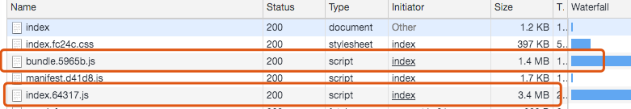
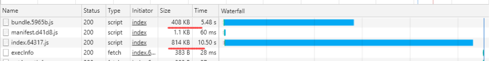

# 记一次nginx和前端项目优化


[爱笑的k11](https://blog.csdn.net/max1231ff) 2019-12-28 11:33:53  187  收藏

分类专栏： [工作](https://blog.csdn.net/max1231ff/category_9626884.html)

版权

**需求**： 一个前端项目页面下载速度很慢，该项目的ip的带宽只有2M,cpu1核，这种情况下，只能通过缩小react打包的体积，以便用2M带宽下载容量更小的数据量来提高加载速度。
优化前：

优化后：


## 一：webpack4 插件减小包的体积

**uglifyjs-webpack-plugin**：减少空格可以减少无用字符占用的文件体积，缩小文件体积
**compression-webpack-plugin**: 将文件压缩为 zip 包,需要nginx配置 nginx_http_gzip_static_module
**extract-text-webpack-plugin**:把css抽离出来，可进一步减小文件体积
最终，wenpack.config.js配置

```
const { resolve } = require('path');
const HtmlwebpackPlugin = require('html-webpack-plugin');
const webpack = require('webpack');
const ExtractTextPlugin = require('extract-text-webpack-plugin');
const CleanPlugin = require('clean-webpack-plugin');
const autoprefixer = require('autoprefixer');
const WebpackMd5Hash = require('webpack-md5-hash');
const path = require('path');
const fs = require('fs');
const ip = require('ip').address();
const UglifyJsPlugin = require('uglifyjs-webpack-plugin');
const CompressionPlugin = require("compression-webpack-plugin");
const getBundleName = function () {
    let dirUrl = path.resolve(__dirname, 'bundle');
    let files = fs.readdirSync(dirUrl);
    for (fileName of files) {
        if (/.js$/.test(fileName)) {
            return fileName;
        }
    }
    return '';
};

const bundleName = getBundleName();
const bundlePath = '/js/';

module.exports = {
    context: resolve(__dirname, 'app'),

    entry: {
        index: ['./index.js'],
        // 我们 app 的入口文件
    },
    output: {
        filename: 'js/[name].[chunkhash:5].js',
        chunkFilename: '[name].[chunkhash:5].js',
        // 输出的打包文件
        path: resolve(__dirname, 'build'),
        publicPath: '/',
        // 对于热替换(HMR)是必须的，让 webpack 知道在哪里载入热更新的模块(chunk)
    },
    resolve: {
        // 用于查找模块的目录
        extensions: ['.js', '.json', '.jsx', '.css'],
        // 使用的扩展名
        alias: {
            Util: path.resolve(__dirname, './app/utils/'),
            Urls: path.resolve(__dirname, './config/'),
        },
    },

    devtool: 'source-map',

    module: {
        rules: [
            {
                test: /\.jsx?$/,
                use: ['babel-loader'],
                exclude: /node_modules/,
            }, {
                test: /\.(scss|sass|css)$/,
                use: ExtractTextPlugin.extract({
                    fallback: 'style-loader',
                    use: [
                        'css-loader',
                        {
                            loader: 'postcss-loader',
                            options: {
                                plugins: function () {
                                    return [
                                        autoprefixer({
                                            browsers: ['> 0%'],
                                        }),
                                    ];
                                },
                            },
                        },
                        'sass-loader?outputStyle=expanded',
                    ],
                }),
            }, {
                test: /\.(eot|woff|woff2|ttf|svg|png|jpg|gif)$/,
                use: [
                    {
                        loader: 'url-loader',
                        options: {
                            limit: 100,
                            name: 'imgs/[name].[hash:5].[ext]',
                        },
                    },
                ],
            },
        ],
    },
    plugins: [
        new webpack.HashedModuleIdsPlugin(),
        new UglifyJsPlugin({
            uglifyOptions: {
                ie8: false,
                mangle: true,
                output: { comments: false },
                compress: {
                    warnings: false,
                    drop_console: true,
                    drop_debugger: true,
                    unused: false,
                },
            },
            sourceMap: true,
            cache: true,
        }),
        new WebpackMd5Hash(),
        new webpack.DefinePlugin({
            'process.env.NODE_ENV': JSON.stringify('production'),
            'LOCATIONIP': JSON.stringify(ip),
        }),
        new webpack.optimize.CommonsChunkPlugin({
            name: ['vendor', 'manifest'],
            minChunks: 2,
        }),
        new HtmlwebpackPlugin({
            template: './index.html',
            filename: 'task.html', // 生成的html存放路径,相对于path
            inject: true,
            path: '/',
            bundleUrl: bundlePath + bundleName,
            chunks: ['index', 'vendor', 'manifest'],
        }),
        new webpack.DllReferencePlugin({
            context: '.',
            manifest: require('./bundle/bundle.manifest.json'),
        }),
        new ExtractTextPlugin('css/[name].[contenthash:5].css'),
        new CompressionPlugin(),
        new CleanPlugin(['build']),
    ],
};

123456789101112131415161718192021222324252627282930313233343536373839404142434445464748495051525354555657585960616263646566676869707172737475767778798081828384858687888990919293949596979899100101102103104105106107108109110111112113114115116117118119120121122123124125126127128129130131132133134135136137138
```

## 二，nginx配置 nginx_http_gzip_static_module

```
http {
    include       mime.types;
    default_type  application/octet-stream;
    sendfile        on;
    keepalive_timeout  65;
	# 开启gzip
    gzip on;
    # 启用gzip压缩的最小文件，小于设置值的文件将不会压缩
    gzip_min_length 1k;
    # gzip 压缩级别，1-9，数字越大压缩的越好，也越占用CPU时间，后面会有详细说明
    gzip_comp_level 4;
    # 进行压缩的文件类型。javascript有多种形式。其中的值可以在 mime.types 文件中找到。
    gzip_types text/plain application/javascript application/x-javascript text/css application/xml text/javascript application/x-httpd-php image/jpeg image/gif image/png application/vnd.ms-fontobject font/ttf font/opentype font/x-woff image/svg+xml;
    # 是否在http header中添加Vary: Accept-Encoding，建议开启
    gzip_vary on;
    # 禁用IE 6 gzip
    gzip_disable "MSIE [1-6]\.";
    # 设置压缩所需要的缓冲区大小     
    gzip_buffers 32 4k;
    # 设置gzip压缩针对的HTTP协议版本
    gzip_http_version 1.0;
    server {
        listen       80;
        listen 443 ssl;
        ssl on;
        ssl_certificate  ###;
        ssl_certificate_key ###;
        ssl_session_timeout 5m;
        ssl_ciphers ECDHE-RSA-AES128-GCM-SHA256:ECDHE:ECDH:AES:HIGH:!NULL:!aNULL:!MD5:!ADH:!RC4;
        ssl_protocols TLSv1 TLSv1.1 TLSv1.2;
        ssl_prefer_server_ciphers on;
        server_name  www.########;
	root	/data/program/build/;
	index	task.html;
	  location ^~ /download {
            autoindex on;
    	    autoindex_exact_size on;
    	    autoindex_localtime on;
	        alias /tmp/upload_tmp; 
        }
        #只要匹配到文件上传路径就直接不在进行其他匹配
	 location ^~ /upload/ {
	        upload_pass /res_upload;
            upload_store /tmp/upload_tmp;
            upload_store_access user:rw;
            upload_limit_rate 0;
			upload_set_form_field "${upload_field_name}_name" $upload_file_name;
            upload_set_form_field "content_type" $upload_content_type;
            upload_set_form_field "tmp_path" $upload_tmp_path;
            upload_aggregate_form_field "md5" $upload_file_md5;
            upload_aggregate_form_field "size" $upload_file_size;
            upload_pass_form_field "^.*$";
            
	    }	
	location / {
        try_files $uri @fallback;
    }

    location @fallback {
        rewrite .* /task.html break;
    }
    error_page 404 /404.html;
        location = /40x.html {
    }
    error_page 500 502 503 504 /50x.html;
        location = /50x.html {
    }
	
	}
	
}
```