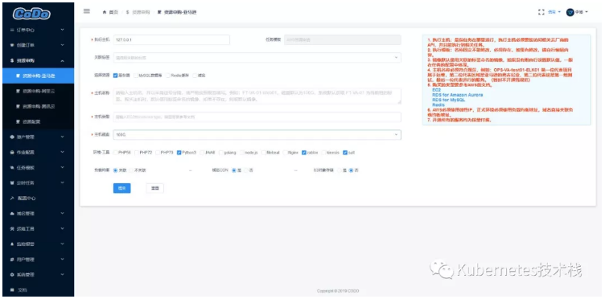
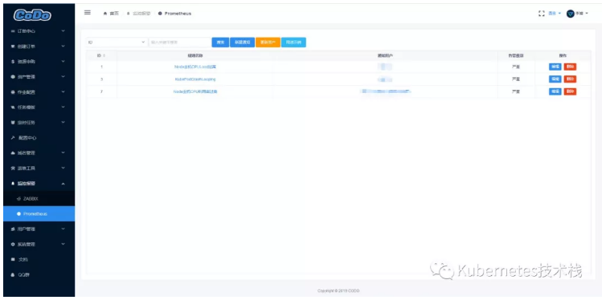

## GitHub关注1000+，这个开源云管平台你可能还不知道

青牛踏雪御苍穹 2019-11-10 15:48:00

项目组核心成员介绍

 

 

**徐继军**

新炬网络高级专家，CoDo项目发起人

 

- 现任职新炬网络高级专家、高级项目总监；
- 8年互联网、电商、游戏运维IT总监。

 

**沈硕** - CoDo架构师、核心代码及文档贡献者

- 现任职某知名游戏公司；
- 多年一线运维经验，全栈开发，善于各种场景的运维自动化落地。

 

**杨红飞** - CoDo产品经理、核心代码贡献者

- 现任职某知名游戏公司；
- 多年一线运维经验，运维在线百万DAU+游戏项目。

 

**咖啡君** - CoDo技术支持，核心代码贡献者

- 现任职某一线大厂；
- 丰富的自动化、容器落地经验。

 

**青牛踏雪** - 核心代码及文档贡献者

- 现任职某互联网公司运维负责人；
- 多年一线运维经验，专注于立体化监控技术，实施过大型K8S运维自动化管理项目落地。

 

如今，随着互联网的飞速发展，云计算厂家也越来越多，很多企业已经开始上云，然而很多企业维护得并没有那么顺利，本文旨在让用户快速了解**开源一站式混合云云管平台-CoDo**。在了解前，先谈谈云时代下运维面临的问题和挑战。

 

1、太过复杂的混合云

 

 

 

如果让维护过多云、混合云的运维同学来回答，那无疑是太复杂了。

 

- 多账户管理；
- 配置繁琐；
- 网络设计复杂；
- 多实例类型。

 

2、说说运维的痛处

 

 

 

谈到云平台管理、运维、一站式DevOps、这些关键词无一例外都是和运维相关的，作为一位长期在一线奋斗的运维，相信大部分运维同学都经历过以下痛处：

 

- 你是否因为没有一个具有规范化、标准化、流程化的系统来支撑各部门的协作，出现问题后，相互推诿，无法定责而苦恼；
- 你是否因为没有安全审计，在某个人的不当操作而导致系统宕机、业务停止而背锅；
- 你是否因为生产环境中的服务器过多，对资源调度、主机登录而费尽心机；
- 你是否会因需要而配置了多个监控系统与警报规则，警报无法汇总而忧愁；
- 你是否因为公司业务因合规性问题和场景被强制使用某某云，多云的维护成本增加，各种资源不能得到统一管理而烦躁；
- 你是否因为多云的情况，需要各种配置的机器、DB实例类型，致使多数时间浪费在初始化服务器等工作上无计可施；
- 你是否因为对配置文件不能统一管理、维护，什么时间需要新增，修改？修改了哪些内容？因为没有配置中心功能，上线后导致故障后，无法回滚等问题而头疼；
- 你一定因为想要实施运维自动化，奈何因公司环境工作与时间因素，需要经常编写各种脚本，应付各式各样的需求而不能解脱；
- 你一定也有某台Manger机器跑了很多Crontab脚本，导致脚本新增，修改，维护起来超级复杂的情景；
- 你一定也纠结过多项目、多种编程语言环境之间的CICD具体要怎么做；
- 你一定因公司可能是一个中小型企业，资源限制等问题，不能组建完整的运维开发团队；
- 你一定也向领导抱怨过，每天都在做机械化重复性的工作，而且忙得焦头烂额，领导还总觉得工作不够饱和，无事可做。

 

3、再谈一下运维的价值

 

 

 

上面痛处是每个一线运维工作者必然要经历的，只是对于一个完整的自动化运维技术架构方案，需要付出的精力与时间是大部分人都不具备的，同时时间、自身能力的局限性而一直处于机械化的运维工作而烦恼，技术、薪资、能力无法得到提升而忧愁。

 

**1）怎么幸福**

 

工作中的幸福感可能来自于两点：

 

- 有成就感；
- 薪水到位。

 

这两项是所有工作者一直的追求，比如，你可能因业务需求写了某个功能，领导极其满意，从而得到了认可与赞赏，你肯定会很有喜悦跟成就感，如果换个场景，你每天都在救火而忙于奔波，每天都在处理线上问题，各种繁琐的事故致使你心力憔悴，怎么可能还有时间与精力去学习新的技术，实现自我价值呢？反之，如果你每天都在学习新的技术，能力得到了提升，你得到你应有的薪水和实现自我价值只是时间的问题而已。

 

**2）运维的价值**

 

- 你所处的工作环境、企业文化可能让你无法得到提升；
- 你可能每天都被研发绑架着，协助做各种线上调试；
- 可能会因一些疏忽大意而导致低级问题的发生，因为没有规范、标准化导致配置出错；
- 缺少自动化工具支持你的工作，导致频繁上线，出了问题线上排查时间很久；
- 作为领导的你，每天看到运维都在忙于救火，看不到有效果的产出，你会觉得他的价值在哪里呢？

 

**3）怎么样才能提升运维的价值？**

 

- 比如某个产品的更新可以快速的根据流程化实现，同时还释放了研发人员；
- 比如资源申购实行标准化，实现自动化，避免因手动执行脚本初始化时而犯的低级错误；
- 比如线上问题可以通过堡垒机登陆快速排查，问题定位，减少故障时间；
- 比如一些公有云的底层维护事件可以被提前告警，提前处理，降低故障率；
- 例如任何操作都可被记录，做审计，追溯，总结一些过往的教训；
- 创建、执行过的所有任务都可以被记录，审计，同时，以统计方式展现成分析报表；
- 控制成本，节约时间，让产品、工作更加稳定、效率，从而体现出来运维的价值

 

4、如何提升运维的价值

 

 

 

综上所述，可能说了很多，有一些啰嗦，但这是运维一直面临的，不可逃避的问题，也是大家苦于因个人时间、自身能力问题，导致无法将当前所遇到的问题形成一个完整的架构解决方案。

 

同时，作为一位一线运维，对于自我能力、自我价值的提升，一直都是大家关注的，迫切希望实现的。

 

所以，有这么一群IT人，和大家有一样的苦恼与愿望，因此，他们一起开发并开源了一站式DevOps运维平台（CloudOpenDevOps）

 

他们各自都是来自大厂、小厂的一线运维，他们更能了解运维的痛苦与难处，不但可以省去了大家对产品与架构的设计开发问题，也可以让大家借此项目中的各种功能，帮你解决上述的苦恼与痛处，

 

同时，也可以通过了解CoDo系统，对其做二次开发，实现自我能力的提升与价值。

 

**什么是CoDo**

 

CoDo是CloudOpenDevOps的缩写，意为云开源DevOps。

 

2016年前后随着混合云在国内企业的遍地应用，很多企业运维、开发、产品、业务部门衔接混乱，混合云云管理效率低下，无法为业务提供更高效的生产力。

 

CoDo应运而生，CoDo旨在解决混合云下**资源管理、作业中心、安全审计、配置中心、定时任务、监控告警**等一体化的运维管理。

 

CoDo是2016年8月发布0.1.0版本，到现在历时三年，已经迭代开发到0.3.0版本，即将发布0.4.0版本，已经可以完美与**Aliyun、AWS、GCP、Azure、QCloud、UCloud、 Ksyun、Huawei等公有云**的API对接，完成一站式资源调度、发布、配置中心、日志审计、SQL审计、监控警报等管理，其他云的API对接与相关SDK模块也在持续的开发中，GitHub开源项目关注STAR人数已经超过1000+

 

1、技术架构体系

 

 

 

 

技术选型：

 

- **前端：**Vue.js、iView；
- **后端：**Python3、Tornado、Django、OpenResty、Lua；
- **文档：**Markdown、reStructuredText。

 

技术优势：

 

- 微服务，模块化；
- 模块之间解耦合，互不影响；
- Dockerfile方式部署，同时支持K8S部署；
- 前端Vue-iview后端Python-Tornado分离；
- 一站式DevOps平台，ResultAPI风格，自由开发新模板API网关快速注册；
- 支持二次开发，不限语言，不限框架。

 

2、功能模块

 

 

 

 

**1）权限系统**

 

用户权限基于RBAC角色管理访问控制，用户登陆鉴权，支持开启用户MFA认证。

 

 

**2）跳板审计**

 

授权用户对具体资源的使用权限，会话及命令记录。支持操作回放。

 

 

**3）作业平台**

 

强大的作业调度系统支持自定义模板、脚本、自由编排，且任务可干预，可定时、可重做。

 

 

**4）任务系统**

 

强大的任务系统：基础发布，K8S发布、代码检查、SQL审核、SQL优化等。

 

 

**5）资源申请**

 

支持AWS、阿里云、腾讯云等多家云厂商一键购买资源(EC2、RDS、S3等)。

 

 

**6）资产管理**

 

资产的自动发现、录入、分类、标签、管理。事件的提醒、记录。

 

 

**7）监控系统**

 

自定义脚本，自动发现录入报警。支持邮件短信报警，可自定义接入自愈流程。

 

 

 

**CoDo解决什么痛点**

 

**为什么要使用配置中心？**

 

- 不知道配置文件上次什么时候修改的？
- 修改了什么内容？
- 改了配置文件还要重新发布项目或者手动触发重启服务？
- 无缘无故发现配置文件错了影响到线上正常部署？
- 50+线上项目，数百+配置文件, 杂乱文章。

 

**为什么要使用作业中心?**

 

- 为了需求，我写了N个脚本，不能统一管理。
- 各种编程语言环境的打包、发布问题。
- 我希望能按照我思路自由的去编排我的任务，脱离登陆服务器执行脚本操作。
- 我希望我常用的任务保存下来，方便下次点即触发，方便。
- 流程不强制依赖平台，运维逻辑自行根据思路编写，尽管平台宕机，作业可选择手动触发，照常运作。

 

**为什么推荐使用CoDo?**

 

- 因为我们的优势是前后端分离，APi 网关，遵循ResultAPI可快速对接。
- 我们统称为一站式DevelopOps，为什么叫做一站式。就是运维工作中可能因某个需求，为了解决维护问题，但是最终发现，你部署了多个系统，而这些系统互不依赖，会出现账户、权限管理混乱，监控、警报不能汇总、任务、配置不能统一管理等问题。
- 微服务，模块化，模块之间解耦合，互不影响。
- 我们支持各种编程语言，对二次开发友好。

 

推荐理由

 

 

 

- **团队出品：**github上有很多开源的devops工具，几乎全部都由个人发布维护，代码质量、版本进度以及可持续性都无法保障，陷入不能用或不敢用的尴尬境地，CoDo非个人项目，由一个团队负责开发维护，有幸我也是团队中一员，参与贡献了部分代码，所以在稳定性和持续性方面更有保证。
- **生产实践：**CoDo核心代码贡献者全部来自于一线运维团队，团队成员从运维需求出发，致力于解决运维痛点，更了解运维的需求，且核心代码经过了多年生产实践，并非实验产品，运行稳定。
- **功能齐全：**CoDo采用微服务的理念构建，模块化开发，目前已有资产管理、定时任务、任务调度、配置中心、域名管理、运维工具几大模块，支持持续集成、持续部署、代码审查、数据库审核与优化建议等众多功能，覆盖大部分的运维场景，让你不再费心劳神在多个系统间奔波，一个平台全搞定。
- **完善支持：**CoDo除了提供专业的文档支持外，还同时开始录制一些基础的部署使用视频帮助初学者快速上手，如果你觉得这些还不够，我们也提供QQ或微信远程支持，助你顺利部署使用。
- **开源免费：**这是一个开源项目，所有功能均可免费使用，源码托管在GitHub。

 

**关于CoDo**

 

 

1、愿景

 

 

 

希望通过CoDo结合各大云计算平台和开源技术帮助企业与IT运维从业者加速云管理的整合与效率，改善运维自动化对企业的业务交付能力和服务支撑能力。

 

2、立项初衷

 

 

 

- 一站式、开放、开源、通用、模块、易用；
- 帮助中小企业提升对运维自动化的认知与管理水平；
- 为实现AI智能化的一站式运维平台而奋斗不止；
- 项目组核心成员。

 

3、核心理念

 

 

 

当下企业很多都热衷于建设运维自动化、智能化，通过技术革新代替繁杂的手工人肉运维，提高生产效率的同时最大程度的减少人为失误。因此，我们认为企业自动化运维的核心理念就是：标准化、流程化、自动化、自助化、服务化。

 

4、优势

 

 

 

**1）权限控制功能：**后端可以控制到每一个用户的任何一个请求，前端可以控制菜单，细化到每一个按钮，每一个表单。

 

**2）审计追溯功能：**用户的所有操作与行为都会被记录下来，用户所有的任务工单流程都会记录，方便查看与审计追溯。

 

**3）资产数据管理：**可以自动获取到常用的云服务商的相关服务信息，并且可以对资产和权限细化，并且提供了强大的多对多的自动标记功能和堡垒机功能。

 

**4）配置管理功能：**不但可以用来管理项目的配置信息，可以管理运维管理的配置，并且可以用来项目服务与资产配置的关联，作为对资产管理的补充。

 

**5）编排调度系统：**支持分布式扩展、公平调度，审批干预，所有行为可以审计可追溯，对运维友好度高，学习使用成本低，系统不负责逻辑只负责调用，所有逻辑在运维脚本下完成。

 

**后记**

 

因为CoDo功能比较多，不让读者感觉到啰嗦，很多功能并没有插入截图，为了方便大家了解CoDo的全部功能，我们提供了Demo供使用者体验。

 

Demo地址：http://demo.opendevops.cn/login

用户：demo

密码：2ZbFYNv9WibWcR7GB6kcEY

 

对于现在的CoDo，文档与社区正在努力完善和改进，对于当前已有的功能来说，基本上可以满足DevOps理念下契合自动化运维的大部分需求，不过，为了精益求精，我们一直在不懈努力的壮大自己，同时也期待有更多的开源爱好者加入与支持。

 

为了方便我们对相关BUG、功能需求的改进和添加，如果你有什么好的意见，可以登录到官方论坛，在需求&BUG版块中发布相关BUG与功能需求，我们会第一时间查看、评审后处理，谢谢。

 

官方论坛：https://bbs.opendevops.cn

 

**>>>>**

 

**官方相关资料**

 

- 官方网站

  https://www.opendevops.cn

- 官方论坛

  https://bbs.opendevops.cn

- GitHub

  https://github.com/opendevops-cn

- 文档

  http://docs.opendevops.cn/zh/latest/

- CoDo QQ群

  18252156

- CoDo微信群

  请搜索rootman007，邀请加入微信群

- Prometheus QQ群

  573551376

- 本文来源：Kubernetes技术栈订阅号