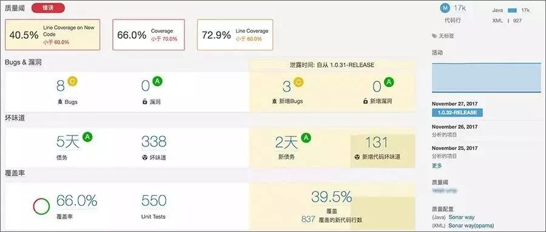
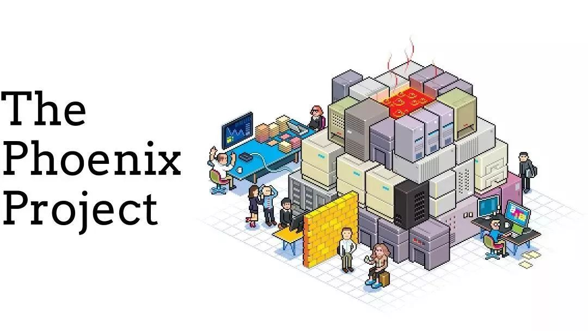
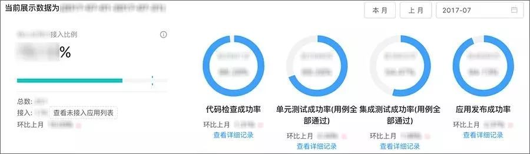
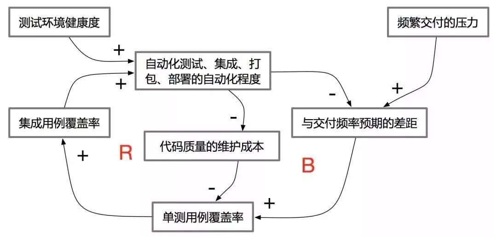
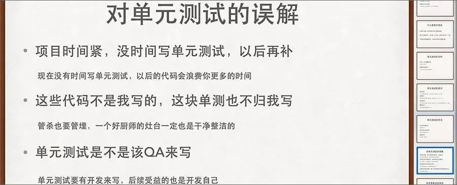
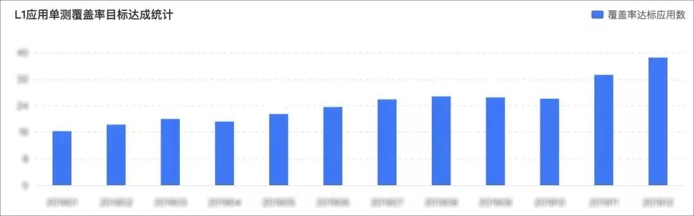
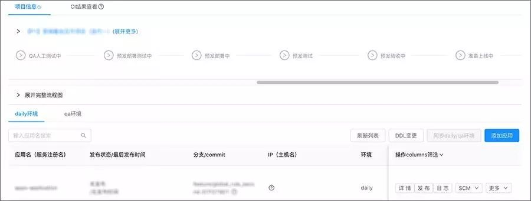
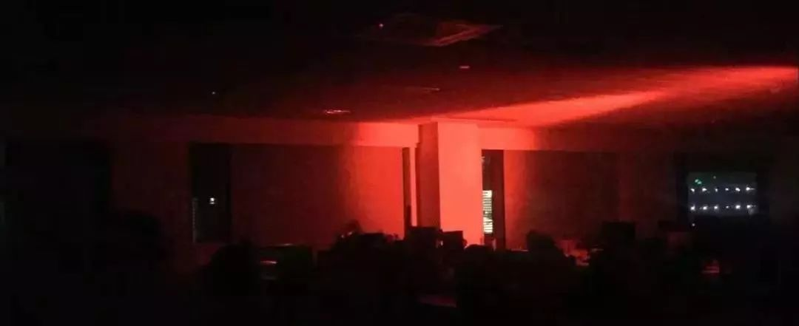
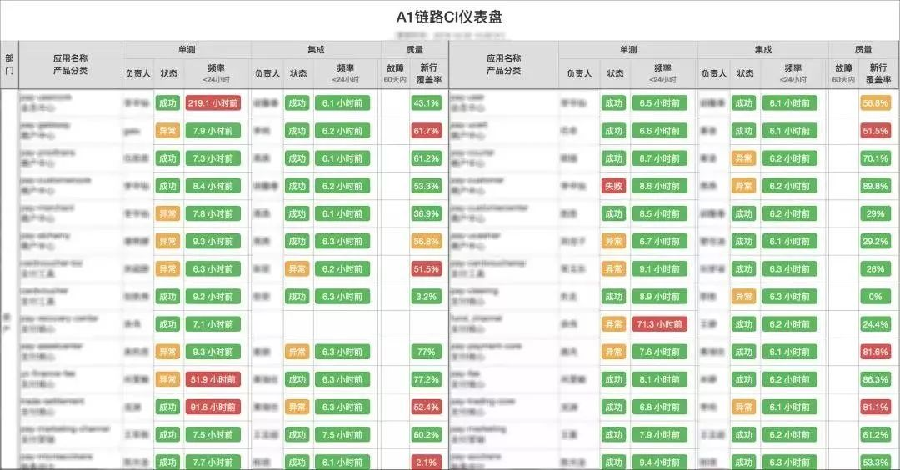

## 为了落地DevOps，我们都做了哪些神助攻

费解 2020-03-28 12:53:00

**背景**

众所周知，在丰田精益生产中，核心观念包含对人的尊重、消除浪费、持续改善，只有这样，企业才能保持良性运转，竞争力才会提升。而具体的浪费场景，被总结为「制造过剩、等待、搬运、库存、加工、额外动作、次品」七种，后来又增加了「管理」的浪费。

 

笔者所在效能改进团队，一直致力于精益的实践，从降本增效的角度，来提升有赞软件研发的效能，以应对这个充满不确定性时代的变化的冲击。而彼时的软件研发，从过程管理的角度，已将「项目制」普及到团队之中并持续发挥作用，但从工程实践的角度，虽然各部门都有一些基础设施，但仅为本部门服务，整体处于萌芽阶段，需要有一条主线将各独立的孤岛串接起来，发挥协同的价值。

 

**工程实践的现状**

 

1、技术债

 

 

 

有赞作为一家初创公司，首要任务是在市场竞争中活下来，所以在技术沉淀方面，于某段时期内处于被动局面，由业务裹挟着往前狂奔，是可以理解的，而且是必须经历的。但可以预见的是，长此以往，就会积累大量的技术债，而且会随着系统复杂度的上升，技术债所带来的研发成本会快速增加，直到它变成一堆无人敢碰的遗留功能。

 

从精益浪费的视角看，处理技术债就是一种「额外动作」，它是每次研发中一项绕不开的工作，但除了耗费大量人力物力和时间之外，并不产生任何价值。我们亟需掌握目前有多少技术债、风险如何、处理成本如何、在多少量级的范围里是合理和可控的。下图是有赞在 DevOps 建设过程中，某个应用通过 SonarQube 静态扫描得到的代码质量情况：

 

 

2、代码改动的影响

 

 

 

我们常说：输入的是垃圾，输出的也一定是垃圾（ garbage in, garbage out ）。在充满技术债和没有任何保护措施的代码上做增量开发，就好比行走在沼泽中，随时会出现意外。也许有代码注释来帮助你理解历史遗留业务，但经过多人之手增补过的代码文件，注释可能比代码更冗长。

 

在这样的技术环境中工作，很容易产生「次品」，也许大部分问题都能在上线前被扑灭，但流到线上就很可能成为故障，甚至成为未来新代码的故障源。下图是 DevOps 的布道之作《凤凰项目》的封面，就呈现了这样一番触目惊心的景象：

 

 

3、集成周期

 

 

 

由于研发是一项需要多方协同的工作，而各方的产出成果非常明确：符合产品功能和质量预期的代码。关于这个结果，在研发前期筹备时，各方按产品功能点目标进行任务分解时，就已经注定了的。既然是为了共同的产品目标，大家齐头并进，分别进行研发生产后，就必然要将成果汇合到一起，以产生协同创新的价值。我们通常诟病瀑布项目模式最致命的缺陷之一，就是每个人开发质量都很高，但大规模集成时就一塌糊涂。

 

所以，研发人员需要不断尝试与上下游进行集成，而集成又涉及到代码的编译运行，每次集成都是一场等待，对项目来说也是一次煎熬，时间进度难以控制，故精益认为这是一种「等待」的浪费。尽管我们在项目流程中定义了「接口先行」的管理动作，但在实际编码过程中，还是会随着对需求产生进一步理解和澄清后，研发人员随手变动接口（但没有及时通知上下游）的情况。下图是有赞 DevOps 平台关于某一应用的时效情况：

 

 

**效能改进的切入点**

 

1、理念导入

 

 

 

万事开头难。虽然研发团队对在业界如日中天的「开发运维」已有一定的认知，但重点关注放在工具的运用上，目的是提升本团队的工作效率。而经过一系列尝试后，大家已经隐约意识到，「持续集成」才是在频繁交付的压力下提升研发效率的高杠杆点，而「规范单测」和「环境治理」是保障持续集成的前提，于是效能改进团队携手研发团队、质量保障团队和运维团队共同商议决定，将这两项工作进行深入宣贯。思考路径如下：

 

1）如果有足够覆盖率的高质量单测用例，就能保护业务代码的逻辑，在不增加额外测试成本的情况下，经得起任何变更和调整；

 

2）如果有健康稳定的测试环境，代码就能在被提交到代码仓库后，自动触发执行静态代码检查和单测用例，快速验证新增代码的正确性和健康度，经得起频繁交付下质量保证的考验；

 

3）基于单测用例，可以根据业务场景组合形成集成用例，在健康稳定的测试环境下，无人值守地持续进行集成，自动触发打包和部署，并验证业务逻辑，甚至发布上线（一般实践是发布到预发环境），降低发布周期，提高发布频率。

 

 

2、志愿试点

 

 

 

如果能找到一支愿意参与试点的小组，再让受益者向其他同行们分享改进成果，是一种不错的实践，这比我们仅仅通过理论说教更能让人信服。彼时，有赞效能改进团队在调研过程中，与 U 小组沟通比较通畅，其技术组长也非常认同基于频繁交付的敏捷开发方法，这为我们推广单测实践找到了突破口。

 

此外， S 小组的 G 君和 Z 小组的 C 君是研发人员中的极客用户，积极参与并沉淀了关于如何写好单测的最佳实践，非常乐于向同事们进行分享。于是，我们把握住机会，在推广单测必要性和期望达成目标的基础上，连续组织了好几场技术分享，使其余技术人员快速掌握了单测编写的方法，将单测改进工作迅速得以推广和落实。下图是分享材料的截取内容：

 

 

3、侧翼助攻

 

 

 

从开发到上线的整个过程中，存在着三类角色：研发、质量保障、运维。随着业界在自动化测试和自动化运维领域的不断成熟，有赞的质量保障和运维团队深知其价值，故在 DevOps 领域的研究和实践中一直走在行业前沿，并在落地推广过程中长期保持积极状态，充当了急先锋的作用。

 

一方面，质量保障团队与开发约定，提测时必须保证单测覆盖率，否则就退回拒测；另一方面，运维加强环境治理，规范了「Dev 环境」「QA 环境」「Pre 环境」的使用姿势和工作台能力。多点共同发力，提高了技术团队提升单测能力的主动性。下图是某业务线单测覆盖率达标应用的增长情况：

 

 

4、工具支持

 

 

 

除了规范行为之外，在管理工具上也提供了不少配套功能。有赞的研发过程用自研的「起码效能平台」进行管理，为方便开发人员的使用，故增加了与 DevOps 平台联动的快捷通道，可一键生成配套的环境、支持两边系统状态同步、自动化执行结果如未达到阈值就限制进入下一环节、等等。下图是有赞 DevOps 平台的持续交付流水线功能局部：

 

 

5、氛围打造

 

 

 

为帮助技术团队提升对工程实践的感知度，效能改进团队也做了很多有趣好玩的周边：

 

1）CI （ Continue Intergrate ，持续集成）指示灯。我们用树莓派和 LED 灯搭建了一套告警装置，树莓派通过网络连接了 DevOps 平台，当订阅的应用在 DevOps 平台上运行失败（一般是单元测试执行失败、集成测试执行失败、覆盖率未达标等场景下）时，对应的树莓派就收到信息，并触发红灯闪烁，提醒应用的管理员及时关注，敦促本团队中的代码提交者尽快修复。效果如下图：

 

 

插曲：偶尔也会有开发同事晚上回家后连入公司 VPN 进行远程办公，此时办公室现场早已熄灯关门，如果该同事的代码提交到仓库，触发 DevOps 单测用例执行失败时，就会看到如下图的诡异画面（有一次差点吓坏了我们的 HR 妹子）：

 

 

2）CI 大屏。公司有几套闲置不用的触摸屏，原来是地推时放在商场里用作广告宣传的，被我们搬出来旧物利用，连上公司网络，安置在办公区域，用来展示各大应用在 DevOps 平台上的状态。一方面，对已经接入 DevOps 平台应用的开发人员来说，是一种提醒和相互竞争；另一方面，对尚未接触 DevOps 的开发人员来说，也起到了一种广告示范的效果。下图是大屏的数据展示：

 

 

插曲：由于经常会有客户来公司访问，所以走过路过的，也偶尔会被驻足观看，行政部后来也索性就把它定位成带领客户游览的必经「景点」之一了。下图是有赞工作人员在向客户介绍大屏展示的内容：

 

 

**小结**

 

正如前文提及的，有赞效能改进团队并不是一个人在战斗，质量保障团队和运维团队也在其擅长的领域，为推动工程实践的落地发挥着积极的作用，与此同时，开发团队自己也在努力突破舒适区。正所谓：

 

- 开发运维心所系，单测保障护我体。
- 三套环境在治理，红灯照亮赢契机。

 

从精益的角度看，强化工程实践的能力，能减少浪费并大幅度提升研发效率，是值得投入和加以改善的。而回顾有赞的落地过程，一方面要做宣传和理念导入（最好能借助志愿者和试点团队的力量和标杆示范作用），另一方面在工具层面加以强化，使之成为一项无法回避的功能，进而强化肌肉记忆，再配合 CI 指示灯、大屏等实践，让理念植入研发人员的内心，有了一种更有仪式感的传播。

 

作者丨费解

来源丨有赞coder（ID：youzan_coder）

dbaplus社群欢迎广大技术人员投稿，投稿邮箱：editor@dbaplus.cn