## 为什么我的DevOps落地过程跟别人不一样？

岑崟 2020-02-14 10:05:03

 

**本文根据岑崟老师在〖dbaplus社群Fintech上海沙龙〗现场演讲内容整理而成。\**（点击文末“阅读原文”可获取完整PPT）\****

 

**作者介绍**

**岑崟，**某Fintech公司运维主管，负责应用运维，对DevOps抱有极大热情。曾任好买财富系统运维部副总监，负责应用运维及DevOps运维平台研发和运营，任职期间推动运维团队从传统的运维向DevOps转变，带领运维从只关注产线到服务“全环境”，深刻体会DevOps落地实践中给运维带来的笑与泪，品尝行为转变到思想转变的酸甜苦辣。

 

大家好，今天主题是关于DevOps落地实践，一看分享的题目就知道这次的分享比较虚，所以我打算以故事为起头来阐述我对DevOps的一些认知。

 

故事从2009年开始讲起，那时的我刚接触系统运维这个岗位，每天的工作比较也初级和单一：每天重复手敲2-3个小时命令的发版，因为实在太枯燥和乏味，所以我立志说：以后不能天天做这种重复工作。于是开始学习python，做自动化的发布，就这样三四年过去了，而我却一直兜兜转转停留在工具化层面。

 

直到有一天，我看到了类似的一张图，让我印象深刻，它把一个运维所能想到东西都有序的管理起来，而且这张图中最让我印象深刻的地方就是基础设施即代码。

 

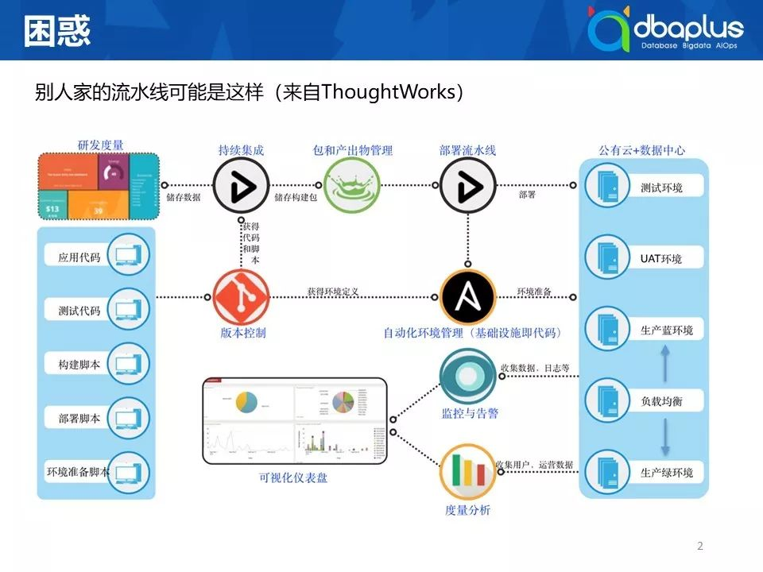

为什么呢？当时虚拟化概念已经开始普及，当你初始化一台服务器时，基本的步骤就是：安装系统，安装基础软件，调整系统配置，就像蛋糕一样，层层叠叠。

 

而用基础设施即代码的方式来做这件事情时，它能帮你摒弃手工操作带来的不确定性，将环境准备自动化和标准化，同时也带来了另外一个好处，能将全环境统一管理，无论是测试环境，还是UAT环境，而传统管理方式中，这些环境的统一往往是很难做到。所以我的标题叫“别人家的流水线可能是长这样”。

 

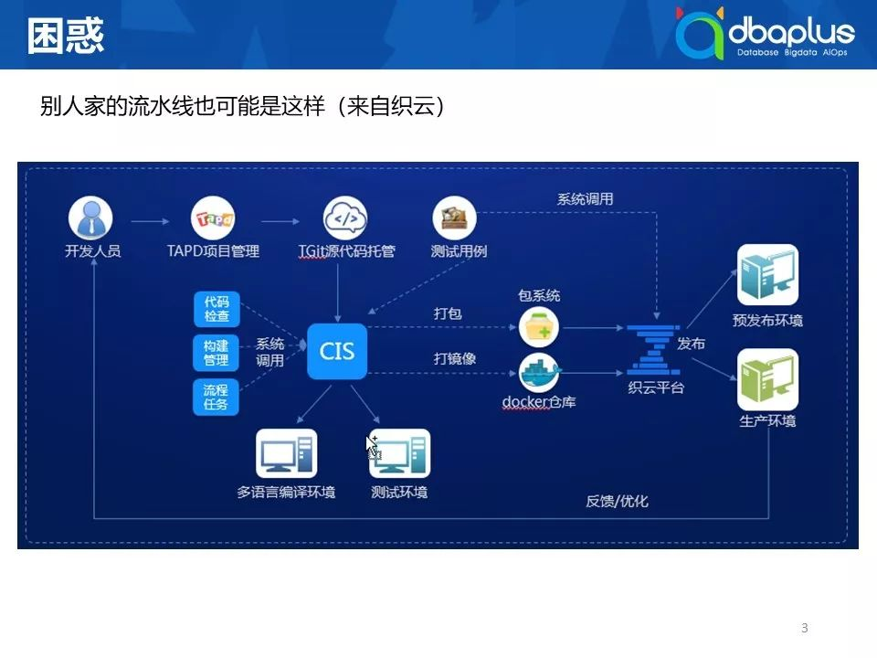

现在看第二张图，如果说第一张图还是停留在研发管理层面，关注开发提交代码后的管理。那么这张图将项目管理也包了进来，覆盖从需求到交付的整个过程

 

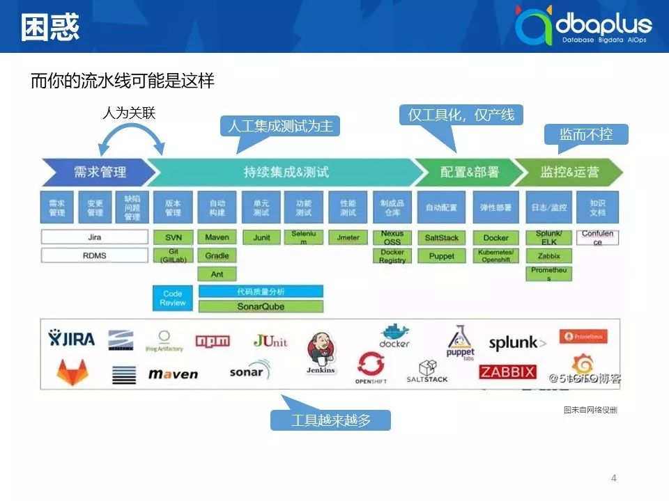

接下去的第三张图，这张图在各大分享会、沙龙多次出现，特别特别的流行。从需求管理、持续集成，配置部署、监管和运营全流程打通，底下使用各种开源工具来实现。但是为什么我会说“你的流水线可能是这个样子”，让我们一个个来看：

 

1）从需求管理到持续集成阶段往往是人为关联；

 

2）测试还是以手工测试为主，没有或者只有少量的单元测试；

 

3）无论是配置，还是部署，仅做到工具化，同时覆盖范围仅产线。而其他环境根本就下不去手；

 

4）监而不控，刚才有一位老师提到的Prometheus，它只是监控工具中的一员，如果你把监控数据收集上来之后，仅仅是生产图表，而没有让这些数据产生更大价值，更没有为后面技术运营做任何支撑，那么只发挥监控中一小部分价值而已；

 

5）最后给还有一个更大的问题，随着工具越来越多，造成你每上线一个新工具，就会有一个学习成本，这不像学习平台的使用，工具的学习特别是开源工具的学习，比较离散，之前的经验难以复用。还是拿Prometheus来说，你需要学习它的语法规则，对于运维来说，这是再正常不过的事情，但是如果是由业务研发自己去添加监控项和告警项，那他十有八九撒手不干，因为也交付都来不及，哪里还有时间去学习复杂的语法。这会让你推广起来就会变得异常困难。所以我开始思考，大家的DevOps落地差别到底有多大。

 

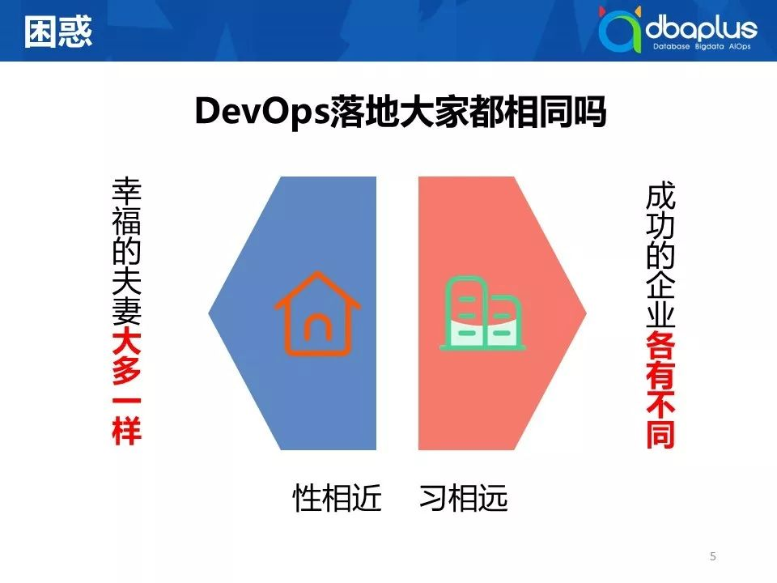

幸福的夫妻大多一样，这是一种说法，另外一种马云说的：成功的企业各有不同。大家认为DevOps落地是第一种说法还是第二种说法？我的看法用三字经中的一段话来总结：性相近，习相远。为什么我认为是这个，首先DevOps是最佳实践加理论的合集，听过各种各样的会议后，你发现讲的理论部分基本一致，但实际落地过程中，特别是对于中型企业或者传统企业、金融企业做转型的过程中，每一家都不尽相同。

 

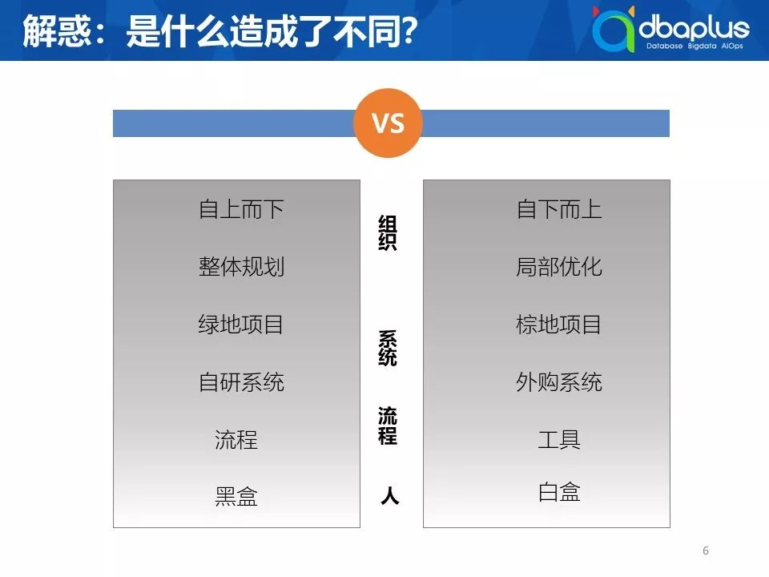

你做成这个样子，别人做成另外一个样子，为什么？当我在思考这个问题时，从组织、系统、流程、人四个方面做了一个简单的比较：

 

1）你的整个DevOps落地过程中是自上而下的还是一个自下而上的过程？你是做整体规划，还是仅仅从运维开始做一些具备优化。DevOps对运维而言有一个天然的驱动力：解放自己。比如咖啡党说他做蓝鲸的出发点很简单，就是为了提高运维人员夜生活质量，慢慢地蓝鲸就成长为完备的自动化运维平台，涵盖运维的方方面面方面。而当下的很多公司因为有一些先例可循，就更有可能从一个整体规划去做DevOps；

 

2）你面对是一个绿地项目还是宗地项目？你是从一个全新的项目做起，还是你面对的项目有历史包袱，特别对于金融企业，往往研发运维方面的历史债非常沉重，因为它已经存活了很久。可能某个系统比你的从业时长，甚至你的年龄还要大，对于这种系统你会通过何种方式进行改造；

 

3）互联网企业往往会自研各种系统来支撑业务。但是金融企业因为业务的复杂性，会有不少外购系统，这些系统的供应商因为技术水平参差不齐，对他们的规范和标准非常难制定；

 

4）重流程还是重工具，这两个本不分前后，需要两手都要抓。但不少企业往往强流程轻工具，当出现问题时，就用强流程来保障，比方说这个流程不行，我再给你加个流程或者流程上再加个节点，不断叠加，长此以往就会发现这个流程越来越沉重。工具的开发也需要流程来“指导”，否则就只是无脑叠加而已；

 

5）最后讲的是黑盒和黑盒，对于测试来说有黑盒测试和白盒测试，同样对运维来说也有黑盒运维和白盒运维，能否用研发的思想来解决运维的问题，而不是只关心输入和输出是否符合要求。

 

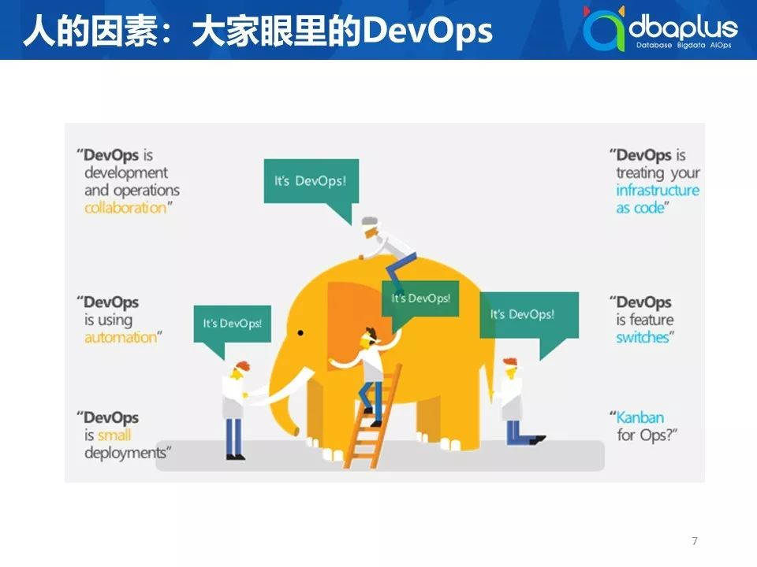

这张盲人摸象图很好诠释了大家怎么来看待DevOps？首先DevOps成长的土壤决定其最终的模样。在图中的每个人受限于所触摸的部位，描述了同一个物体的不同的特征，比方说有人把看板技术在运维中运用就是DevOps，再比如说有人认为基础架构即代码就是DevOps。当组织中负责DevOps的人，之前所处职位不同，经验和经历不同，在落地过程中就会千差万别。

 

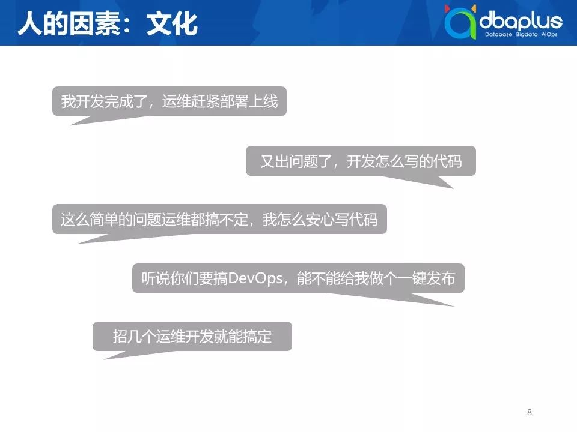

接下去是文化因素，比如：

 

1）对于开发来说，就希望当他提交完代码那一刻起，接下来就是运维或者测试的事情。

 

2）对运维来说，出问题时，运维往往是两眼一摸黑的，完全不知道发生了什么，这时候就会抱怨研发代码怎么写，这就是造成两边一个对立的问题。

 

3）处理问题过程中，开发说这么简单的问题，你运维怎么都处理不了呢？

 

4）当你开始搞DevOps，研发说帮我做个一键发布吧。这可以是最终目标，单对于刚开始做DevOps的同学而言，这个挑战实在太大，容易打击信心。

 

5）对于刚开始探索DevOps的负责人来说，容易陷入一个困境，找几个开发就能搞定运维开发的事情。

 

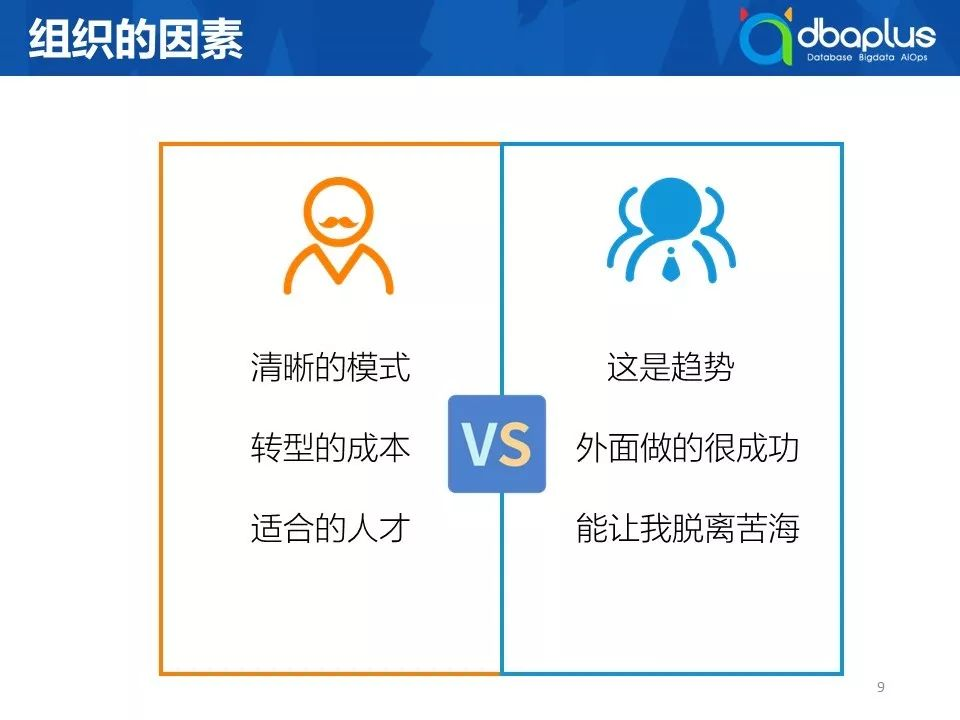

在组织的因素层面上也分成两块：

 

1）从运维人员角度来说，第一，他认为DevOps是趋势，为什么？利益驱动，别的公司做DevOps，我不做的话可能连跳槽的机会都没有；第二，他认为外面有很多成功案例，我们也能成功，那我们一起看看成功案例往往是什么？大公司的案例，对于中小公司而已，全部运维人员有多少个，甚至你整个研发团队加起都没大公司一个运维开发团队的人数多；第三，用了这套东西我就能脱离苦海，但没有想到你只是从一个苦海翻到另外一个苦海。

 

2）对于老板而言，则会有的完全不一样思考角度。第一，要自上而下去考虑的问题，要有一个清晰的模式，这个模式不是说外面的成功案例，而是成功背后的原因，成功背后做事情的逻辑是什么；第二，转型的成本，特别是宗地项目，要进行很多标准化的改造，比方说定了一个标准，你要把它改掉，需要付出的成本是多少，有没有计算公式去衡量要用多少工时，甚至老板还会考虑风险问题，原来系统运行的好好的，改用新方式后，一上线出现故障，怎么快速处理；第三，能不能在市场上比较容易地找到合适的人才，我当时为了招四个运维开发，花费整整一年的时间，没有适合的人来做事，进度会特别的慢。

 

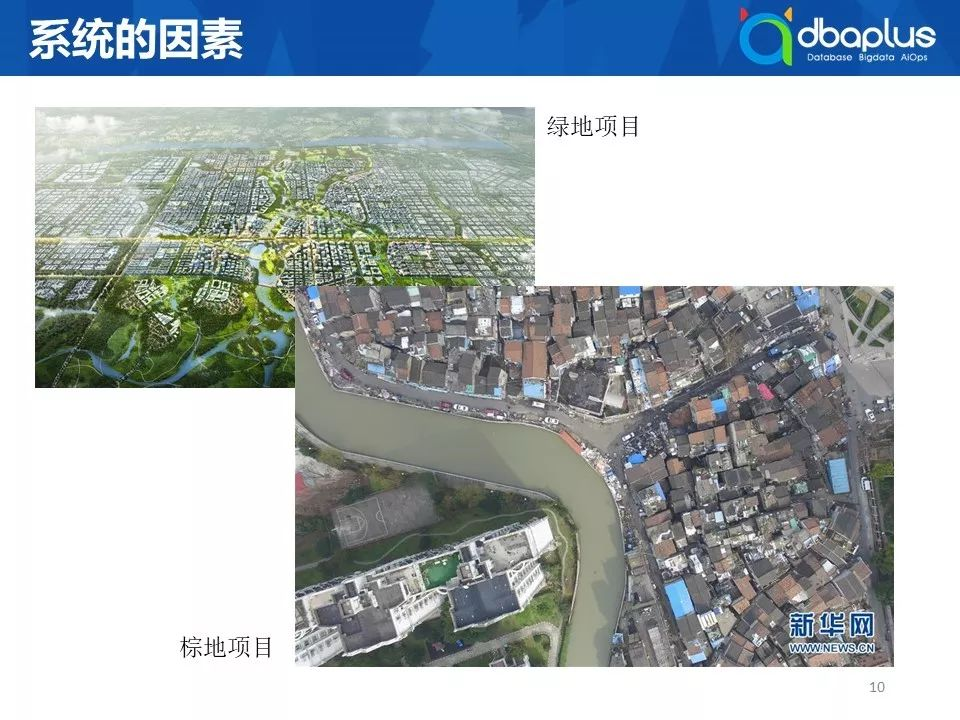

接下去是系统因素，这个很好理解，想象一下你是去参与建设雄安新区，还是参与一线城市市区的旧城改造，你所面临的挑战是完全不同的，所以最终落地呈现出来的效果也大不相同，这里就不在赘述。

 

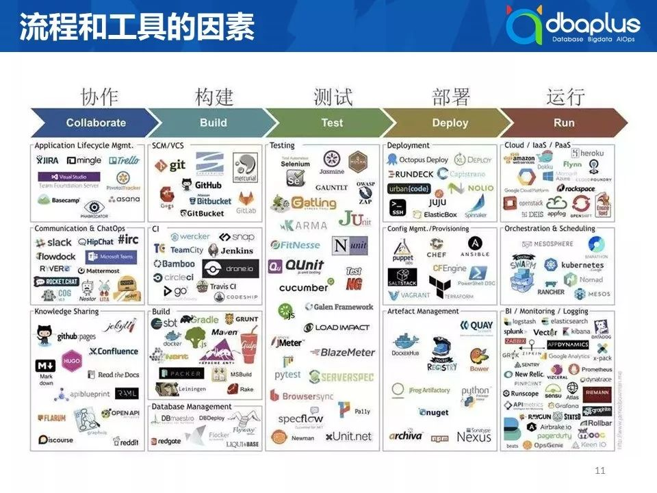

接下去是流程和工具，这张图中的每一小块都够大家讨论一阵子：你看别人都用主干上线，用的是gitlab，我们是不是要考虑做SVN往GIT迁移，等等。不同工具组合出不同的落地方式。组织、系统、流程、人，这四个方面会决定每家企业落地的不同。但是我想说即便是不同的，只要能解决当下的问题，只要能给公司带来价值，带来利益，都是好的。虽然大家最终走的路有所不同，但都是在给业务带来价值，殊途同归。

 

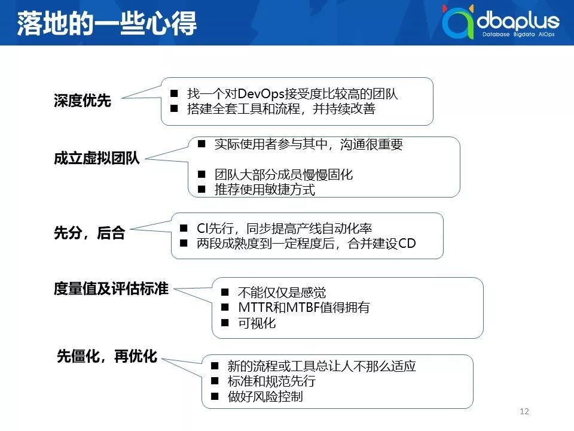

最后是我的一点心得，是我在落地过程中总结出来的一些经验：

 

1）第一个深度优先，为什么深度优先？我们先尝试使用了广度优先，我们先了开源工具做应用发布工作，所有的研发团队花了大概三个季度左右的时间去适应这个工具，后来我们计划用自研的发布工具时，有些团队就不接受，他说第一个用的挺好的。我建议大家，如果研发团队对于DevOps接受度都比较高，广度优先没有问题，否则先在团队中找一个接受度比较高的组，给大家说清楚风险和收益，然后开始实施，并且在这个组里面把能用的工具和流程全部实施一遍，等完成熟之后，再往外面推，这时候你有了一个样板，通过这个样板，其他的团队接受度就会高一些，同时老板看到你成功案例，给予的支持就会更多一些。

 

2）成立产品虚拟团队，由组织结构的变动，造成公司的动荡，这是很多老板不愿意触碰的底线。如果仅仅是一个DevOps团队或运维开发团队在推动，那往往是做不好，这时你需要以成立虚拟团队的方式去推动，在这里有个小的tips，第一一定要让最终的实际使用者一定要参与其中，并且做深入其中。接下去让这个虚拟团队中的成员，特别是核心成员固化下来，这样使得经验和技能得到延续；最后在实施过程中推荐用敏捷思想来做，因为面对落地过程中的不确定性，敏捷会使成功率提高一些，也使团队参与度更高一些。

 

3）先分后合，这个对应上面提到的虚拟团队，为什么会有这样的心得体会？一上来就先做整体规划，然后开始大张旗鼓地开始实施，再然后就没有然后了，为什么？因为你的很多基建没有到位，无论测试也、基础架构，还是人员技能和意识。在团队成熟度到达一定程度，彼此间的磨合也到一定程度，之后配合起来做DevOps，你会发现很多东西水到渠成，会让你做落地的速度越来越快。

 

4）度量及评估标准一定要有，你做所有东西，不能凭感觉说好坏，没有度量的时候，没有数据来支撑，往往是自欺欺人；在传统运维中MTTR或者MTBF这两个值其实还是很有必要的，为什么？你怎么证明DevOps能产生价值？故障发生频率是不是更低了，每一次故障发生的时候处理速度更快，你怎么证明？；可视化上面提到的数据，更快地接收到反馈。

 

5）先僵化再优化的方法，套用到整个DevOps落地过程中非常好用，新流程和工具总会让人不那么适应，比如原来很多节点是通过人供来驱动流程进展，而人能很灵活地处理流程中遇到的问题，在落地DevOps平台时，可以先将流程定下来，并在平台上实现，后续研发使用过程中遇到问题，此时再针对有问题的流程节点去优化，也好过在流程讨论上浪费时间.

 

再一个就是标准规范先行很重要，否则平台做到一定程度之后你会发现出了问题：研发给你提一个需求，你根本做不了，或者发现系统间无法串联起来，或者又发现串联的成本很高，这时候才发觉标准和规范没做好，代价相当的大。

 

最后一定要做好风险控制，否则DevOps在这家公司就“死亡”，或者“销声匿迹”一段时间，不仅你的领导对你信心不足，所有的研发、业务方，会在很长一段时间内，不断地质疑你接下去要做的事情正确性和能力。以上这些是我实施DevOps的心得，谢谢大家。