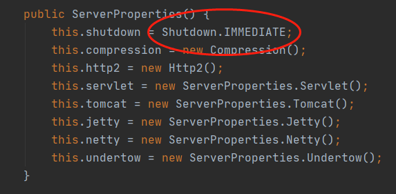
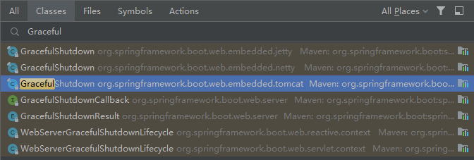

最新的 Spring Boot 2.3 发布快半个月了：

> https://spring.io/blog/2020/05/15/spring-boot-2-3-0-available-now

其中有个新特性叫：**Graceful shutdown（优雅关闭）**

之前也分享过这样的文章，现在竟然出品官方姿势了，新功能嘛，肯定得去官方看下，下面是官方的说明：

> Graceful shutdown is supported with all four embedded web servers (Jetty, Reactor Netty, Tomcat, and Undertow) and with both reactive and Servlet-based web applications. When a grace period is configured, upon shutdown, the web server will no longer permit new requests and will wait for up to the grace period for active requests to complete.

下面，栈长给大家总结下：

优雅关闭支持所有 4 个嵌入式 Web 服务器：Jetty, Reactor Netty, Tomcat, Undertow，以及响应式的和基于 Servlet 的 Web 应用程序。

当配置了一个优雅关闭的缓冲时间，直到应用程序关闭时，Web 服务器都不再允许接收新的请求，缓冲时间是为了等待目前所有进行中的活动请求处理完成。

需要说明的是，Tomcat、Jetty 在网络层会立即停止接收请求，而 Undertow 可以继续接收请求，但会立即返回 503 服务不可用错误。

> 注意：Tomcat 生效版本需要：9.0.33+

## 怎么开启优雅关闭？

下面是 Yaml 文件的配置示例：

```
# 开启优雅关闭
server: 
  shutdown: graceful

# 关闭的缓冲时间  
spring: 
  lifecycle: 
    timeout-per-shutdown-phase: 10s
```

## 源码分析

上面介绍了优雅关闭参数的配置方式，下面我们通过源码来看下默认的配置是什么。

**先看第一个参数配置接收类：**

> org.springframework.boot.autoconfigure.web.ServerProperties



```
public enum Shutdown {
    GRACEFUL,
    IMMEDIATE;

    private Shutdown() {
    }
}
```

如源码所示，默认为：`IMMEDIATE`，所以优雅关闭是大家根据业务需要手动开启的。

**再来看第二个参数配置接收类：**

> org.springframework.boot.autoconfigure.context.LifecycleProperties


如源码所示，默认缓冲时间为：**30** 秒。

**再看下优雅关闭的源码：**



根据 `Graceful` 可以找到几个相关的类，我们进入 Tomcat 的：

> org.springframework.boot.web.embedded.tomcat.GracefulShutdown


```
public enum GracefulShutdownResult {

	/**
	 * Requests remained active at the end of the grace period.
	 */
	REQUESTS_ACTIVE,

	/**
	 * The server was idle with no active requests at the end of the grace period.
	 */
	IDLE,

	/**
	 * The server was shutdown immediately, ignoring any active requests.
	 */
	IMMEDIATE;

}
```

`REQUESTS_ACTIVE` 说的是在缓冲期结束前连接保持活动状态，也就是虽然官方默认给你 30 秒的缓存时间来处理囤积请求，如果 30 秒之后还没处理完成，最后 Spring Boot 也会强制关闭应用。

所以需要注意的是，优雅关闭时一定要考虑当时的业务处理量，所设置的缓冲时间是否能处理完正在处理中的业务。

另外，Spring Boot 优雅关闭需要配合 Actuator 的 `/shutdown` 端点来进行触发，具体参考这篇文章：[Spring Boot 优雅停止服务的几种方法](https://mp.weixin.qq.com/s/UVSnl_wuS-31hn0qaPaqlg)。