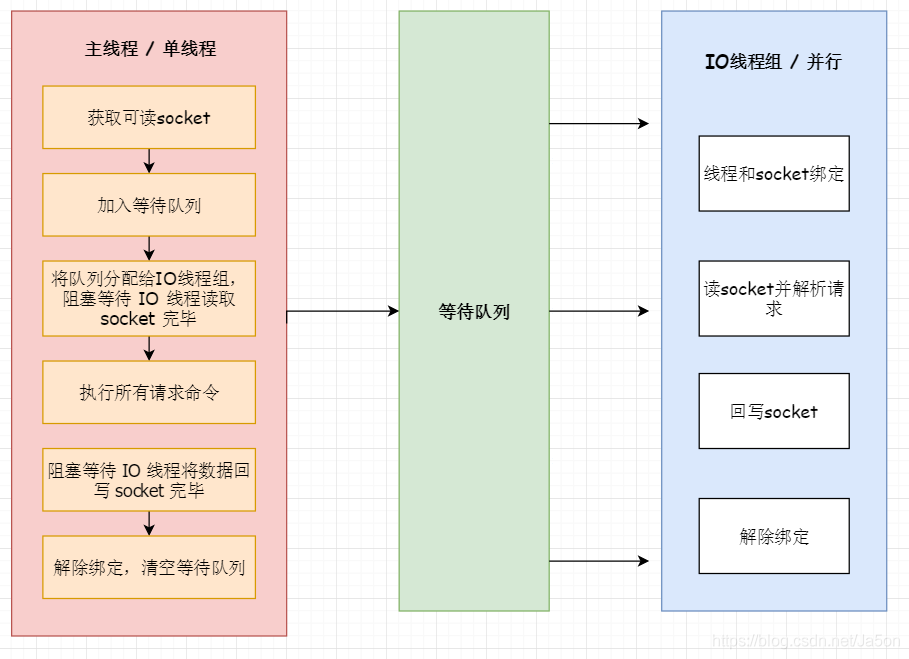
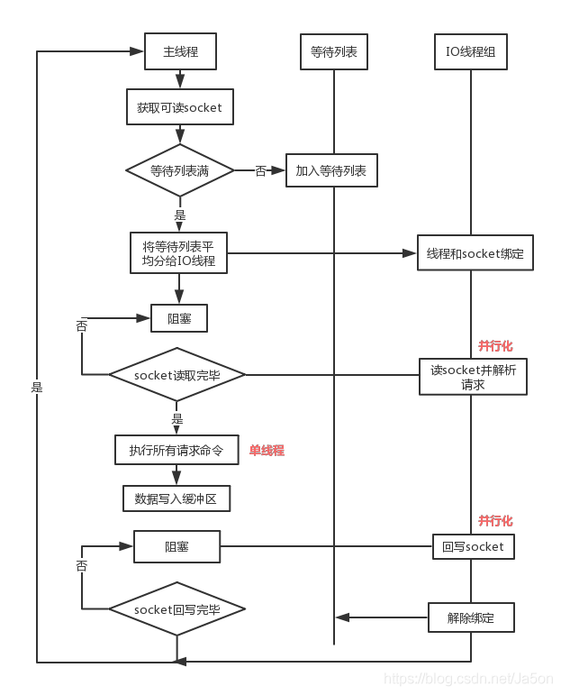
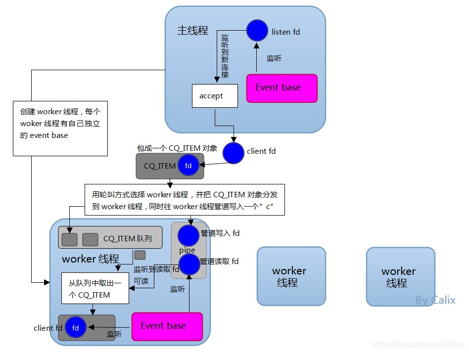

**Redis 6.0 来了**

在全国一片祥和IT民工欢度五一节假日的时候，Redis 6.0不声不响地于5 月 2 日正式发布了，吓得我赶紧从床上爬起来，学无止境！学无止境！
对于6.0版本，Redis之父Antirez在RC1版本发布时（2019-12-19）在他的博客上连续用了几个“EST”词语来评价：

> the most “enterprise” Redis version to date // 最”企业级”的
> the largest release of Redis ever as far as I can tell // 最大的
> the one where the biggest amount of people participated // 参与人数最多的

这个版本提供了诸多令人心动的新特性及功能改进，比如新网络协议RESP3，新的集群代理，ACL等，其中关注度最高的应该是“多线程”了，笔者也第一时间体验了一下，带着众多疑问，我们来一起开始“Redis 6.0 新特性-多线程连环13问”。

------

**Redis 6.0 多线程连环13问**

**1. Redis6.0之前的版本真的是单线程吗？**

Redis在处理客户端的请求时，包括获取 (socket 读)、解析、执行、内容返回 (socket 写) 等都由一个顺序串行的主线程处理，这就是所谓的“单线程”。但如果严格来讲从Redis4.0之后并不是单线程，除了主线程外，它也有后台线程在处理一些较为缓慢的操作，例如清理脏数据、无用连接的释放、大 key 的删除等等。

**2. Redis6.0之前为什么一直不使用多线程？**

官方曾做过类似问题的回复：使用Redis时，几乎不存在CPU成为瓶颈的情况， Redis主要受限于内存和网络。例如在一个普通的Linux系统上，Redis通过使用pipelining每秒可以处理100万个请求，所以如果应用程序主要使用O(N)或O(log(N))的命令，它几乎不会占用太多CPU。

使用了单线程后，可维护性高。多线程模型虽然在某些方面表现优异，但是它却引入了程序执行顺序的不确定性，带来了并发读写的一系列问题，增加了系统复杂度、同时可能存在线程切换、甚至加锁解锁、死锁造成的性能损耗。Redis通过AE事件模型以及IO多路复用等技术，处理性能非常高，因此没有必要使用多线程。单线程机制使得 Redis 内部实现的复杂度大大降低，Hash 的惰性 Rehash、Lpush 等等 “线程不安全” 的命令都可以无锁进行。

**3.Redis6.0为什么要引入多线程呢？**

Redis将所有数据放在内存中，内存的响应时长大约为100纳秒，对于小数据包，Redis服务器可以处理80,000到100,000 QPS，这也是Redis处理的极限了，对于80%的公司来说，单线程的Redis已经足够使用了。

但随着越来越复杂的业务场景，有些公司动不动就上亿的交易量，因此需要更大的QPS。常见的解决方案是在分布式架构中对数据进行分区并采用多个服务器，但该方案有非常大的缺点，例如要管理的Redis服务器太多，维护代价大；某些适用于单个Redis服务器的命令不适用于数据分区；数据分区无法解决热点读/写问题；数据偏斜，重新分配和放大/缩小变得更加复杂等等。

从Redis自身角度来说，因为读写网络的read/write系统调用占用了Redis执行期间大部分CPU时间，瓶颈主要在于网络的 IO 消耗, 优化主要有两个方向:

• 提高网络 IO 性能，典型的实现比如使用 DPDK 来替代内核网络栈的方式
• 使用多线程充分利用多核，典型的实现比如 Memcached。

协议栈优化的这种方式跟 Redis 关系不大，支持多线程是一种最有效最便捷的操作方式。所以总结起来，redis支持多线程主要就是两个原因：

• 可以充分利用服务器 CPU 资源，目前主线程只能利用一个核
• 多线程任务可以分摊 Redis 同步 IO 读写负荷

**4.Redis6.0默认是否开启了多线程？**

Redis6.0的多线程默认是禁用的，只使用主线程。如需开启需要修改redis.conf配置文件：io-threads-do-reads yes


**5.Redis6.0多线程开启时，线程数如何设置？**

开启多线程后，还需要设置线程数，否则是不生效的。同样修改redis.conf配置文件

关于线程数的设置，官方有一个建议：4核的机器建议设置为2或3个线程，8核的建议设置为6个线程，线程数一定要小于机器核数。还需要注意的是，线程数并不是越大越好，官方认为超过了8个基本就没什么意义了。

**6.Redis6.0采用多线程后，性能的提升效果如何？**

Redis 作者 antirez 在 RedisConf 2019分享时曾提到：Redis 6 引入的多线程 IO 特性对性能提升至少是一倍以上。国内也有大牛曾使用unstable版本在阿里云esc进行过测试，GET/SET 命令在4线程 IO时性能相比单线程是几乎是翻倍了。

**测试环境**：

> Redis Server: 阿里云 Ubuntu 18.04，8 CPU 2.5 GHZ, 8G 内存，主机型号 ecs.ic5.2xlarge
> Redis Benchmark Client: 阿里云 Ubuntu 18.04，8 2.5 GHZ CPU, 8G 内存，主机型号 ecs.ic5.2xlarge

**测试结果**：


详见：https://zhuanlan.zhihu.com/p/76788470

说明1：这些性能验证的测试并没有针对严谨的延时控制和不同并发的场景进行压测。数据仅供验证参考而不能作为线上指标。

说明2：如果开启多线程，至少要4核的机器，且Redis实例已经占用相当大的CPU耗时的时候才建议采用，否则使用多线程没有意义。所以估计80%的公司开发人员看看就好。

**7.Redis6.0多线程的实现机制？**



**流程简述如下**：

1、主线程负责接收建立连接请求，获取 socket 放入全局等待读处理队列
2、主线程处理完读事件之后，通过 RR(Round Robin) 将这些连接分配给这些 IO 线程
3、主线程阻塞等待 IO 线程读取 socket 完毕
4、主线程通过单线程的方式执行请求命令，请求数据读取并解析完成，但并不执行
5、主线程阻塞等待 IO 线程将数据回写 socket 完毕
6、解除绑定，清空等待队列

（图片来源：https://ruby-china.org/topics/38957）

该设计有如下特点：
1、IO 线程要么同时在读 socket，要么同时在写，不会同时读或写
2、IO 线程只负责读写 socket 解析命令，不负责命令处理

**8.开启多线程后，是否会存在线程并发安全问题？**

从上面的实现机制可以看出，Redis的多线程部分只是用来处理网络数据的读写和协议解析，执行命令仍然是单线程顺序执行。所以我们不需要去考虑控制 key、lua、事务，LPUSH/LPOP 等等的并发及线程安全问题。

**9.Linux环境上如何安装Redis6.0.1（6.0的正式版是6.0.1）？**

这个和安装其他版本的redis没有任何区别，整个流程跑下来也没有任何的坑，所以这里就不做描述了。唯一要注意的就是配置多线程数一定要小于cpu的核心数，查看核心数量命令：

```bash
[root@centos7.5 ~]# lscpu
Architecture: x86_64
CPU op-mode(s): 32-bit, 64-bit
Byte Order: Little Endian
CPU(s): 4
On-line CPU(s) list: 0-3
```

**10.Redis6.0的多线程和Memcached多线程模型进行对比**

前些年memcached 是各大互联网公司常用的缓存方案，因此redis 和 memcached 的区别基本成了面试官缓存方面必问的面试题，最近几年memcached用的少了，基本都是 redis。不过随着Redis6.0加入了多线程特性，类似的问题可能还会出现，接下来我们只针对多线程模型来简单比较一下。



如上图所示：Memcached 服务器采用 master-woker 模式进行工作，服务端采用 socket 与客户端通讯。主线程、工作线程 采用 pipe管道进行通讯。主线程采用 libevent 监听 listen、accept 的读事件，事件响应后将连接信息的数据结构封装起来，根据算法选择合适的工作线程，将连接任务携带连接信息分发出去，相应的线程利用连接描述符建立与客户端的socket连接 并进行后续的存取数据操作。

Redis6.0与Memcached多线程模型对比：
相同点：都采用了 master线程-worker 线程的模型
不同点：Memcached 执行主逻辑也是在 worker 线程里，模型更加简单，实现了真正的线程隔离，符合我们对线程隔离的常规理解。而 Redis 把处理逻辑交还给 master 线程，虽然一定程度上增加了模型复杂度，但也解决了线程并发安全等问题。

**11.Redis作者是如何点评 “多线程”这个新特性的？**

关于多线程这个特性，在6.0 RC1时，Antirez曾做过说明：

Redis支持多线程有2种可行的方式：第一种就是像“memcached”那样，一个Redis实例开启多个线程，从而提升GET/SET等简单命令中每秒可以执行的操作。这涉及到I/O、命令解析等多线程处理，因此，我们将其称之为“I/O threading”。另一种就是允许在不同的线程中执行较耗时较慢的命令，以确保其它客户端不被阻塞，我们将这种线程模型称为“Slow commands threading”。

经过深思熟虑，Redis不会采用“I/O threading”，redis在运行时主要受制于网络和内存，所以提升redis性能主要是通过在多个redis实例，特别是redis集群。接下来我们主要会考虑改进两个方面：
1.Redis集群的多个实例通过编排能够合理地使用本地实例的磁盘，避免同时重写AOF。
2.提供一个Redis集群代理，便于用户在没有较好的集群协议客户端时抽象出一个集群。

补充说明一下，Redis和memcached一样是一个内存系统，但不同于Memcached。多线程是复杂的，必须考虑使用简单的数据模型，执行LPUSH的线程需要服务其他执行LPOP的线程。

我真正期望的实际是“slow operations threading”，在redis6或redis7中，将提供“key-level locking”，使得线程可以完全获得对键的控制以处理缓慢的操作。

详见：http://antirez.com/news/126

**12.Redis线程中经常提到IO多路复用，如何理解？**

这是IO模型的一种，即经典的Reactor设计模式，有时也称为异步阻塞IO。


多路指的是多个socket连接，复用指的是复用一个线程。多路复用主要有三种技术：select，poll，epoll。epoll是最新的也是目前最好的多路复用技术。采用多路 I/O 复用技术可以让单个线程高效的处理多个连接请求（尽量减少网络IO的时间消耗），且Redis在内存中操作数据的速度非常快（内存内的操作不会成为这里的性能瓶颈），主要以上两点造就了Redis具有很高的吞吐量。