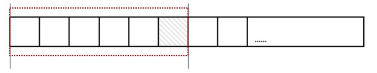
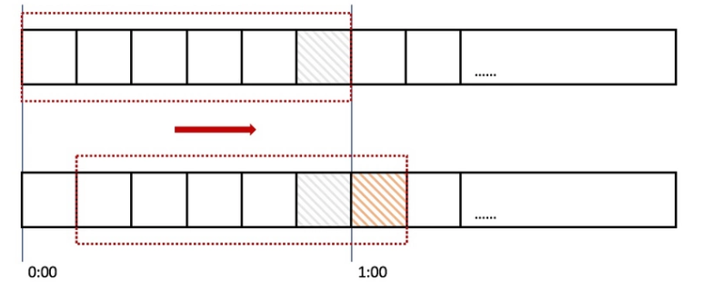
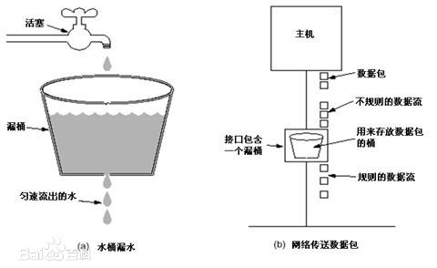
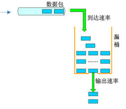
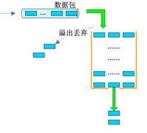

# [php如何对Api接口限流](https://my.oschina.net/abensky/blog/4319510)

原创

[abensky](https://my.oschina.net/abensky)

[工作日志](https://my.oschina.net/abensky?tab=newest&catalogId=6332203)

06/22 17:07

阅读数 906

[干货限时下载丨想get最新最全的数据库知识？看这里就够了！>>>](https://e.cn.miaozhen.com/r/k=2210727&p=7jCTZ&dx=__IPDX__&rt=2&pro=s&ns=__IP__&ni=__IESID__&v=__LOC__&xa=__ADPLATFORM__&tr=__REQUESTID__&o=https://bbs.huaweicloud.com/blogs/221533?utm_source=oschina&utm_medium=banner&utm_campaign=Blog-pdev&utm_content=blog-details-text)

在开发高并发系统时有三把利器用来保护系统：缓存、降级和限流

- 缓存: 缓存的目的是提升系统访问速度和增大系统吞吐量。
- 降级: 降级是当服务出现问题或者影响到核心流程时，需要暂时屏蔽掉，待高峰或者问题解决后再打开。
- 限流: 限流的目的是通过对并发访问/请求进行限速，或者对一个时间窗口内的请求进行限速来保护系统，一旦达到限制速率则可以拒绝服务、排队或等待、降级等处理。

接口限流的常用算法:

# 0x00 计数器法

计数器法是限流算法里最简单也是最容易实现的一种算法。比如我们规定，A接口1分钟内的访问次数不能超过100个。那么可以这么做：在一开始的时候，设置一个计数器counter，每当一个请求过来的时候，counter就加1，如果counter的值大于100并且该请求与第一个请求的间隔时间还在1分钟之内，那么说明请求数过多；如果该请求与第一个请求的间隔时间大于1分钟，且counter的值还在限流范围内，那么就重置counter，具体算法如下：

```php
class CounterDemo{
    private $first_request_time;
    private $request_count = 0; //已请求的次数
    public $limit = 100; //时间窗口内的最大请求数
    public $interval = 60; //时间窗口 s
    public function __construct() {
        $this->first_request_time = time();
    }
    public function grant(){
        $now = time();
        if($now < $this->first_request_time + $this->interval){
            //时间窗口内
            if($this->request_count < $this->limit) {
                $this->request_count++;
                return true;
            }else{
                return false;
            }
        }else{
            //超出前一个时间窗口后, 重置第一次请求时间和请求总次数
            $this->first_request_time = $now;
            $this->request_count = 1;
            return true;
        }
    }
}
$m = new CounterDemo();
$n_success = 0;
for($i=0; $i < 200; $i++){
    $rt = $m->grant();
    if($rt){
        $n_success ++;
    }
}
echo '成功请求 '.$n_success.' 次';
```

计数器算法很简单，但是有个严重的bug：



一个恶意用户在0:59时瞬间发送了100个请求，然后再1:00时又瞬间发送了100个请求，那么这个用户在2秒内发送了200个请求。上面我们规定1分钟最多处理100个请求， 也就是每秒1.7个请求。用户通过在时间窗口的重置节点处突发请求， 可以瞬间超过系统的承载能力，导致系统挂起或宕机。

上面的问题，其实是因为我们统计的精度太低造成的。那么如何很好地处理这个问题呢？或者说，如何将临界问题的影响降低呢？我们可以看下面的滑动窗口算法。



上图中，我们把一个时间窗口（一分钟）分成6份，每份（小格）代表10秒。每过10秒钟我们就把时间窗口往右滑动一格， 每一个格子都有自己独立的计数器。 比如一个请求在0:35秒到达的时候，就会落在0:30-0:39这个区间，并将此区间的计数器加1。

从上图可以看出, 0:59到达的100个请求会落在0:50-0:59这个灰色的格子中, 而1:00到达的100个请求会落在黄色的格子中。而在1:00时间统计时， 窗口会往右移动一格，那么此时的时间窗口内的请求数量一共是200个，超出了限制的100个，触发了限流，后面的100个请求被抛弃或者等待。

如果我们把窗口时间划分越多， 比如60格，每格1s， 那么限流统计会更精确。

# 0x01 漏桶算法 (Leaky Bucket)

漏桶算法(Leaky Bucket): 平滑网络上的突发流量。使其整流为一个稳定的流量。

  

有一个固定容量的桶，有水流进来，也有水流出 去。对于流进来的水来说，我们无法预计一共有多少水会流进来，也无法预计水流的速度。但是对于流出去的水来说，这个桶可以固定水流出的速率。当桶满了之后，多余的水将会溢出(多余的请求会被丢弃)。

简单的算法实现:

```php
class LeakyBucketDemo{
    private $last_req_time; //上一次请求的时间
    public $capacity; //桶的容量
    public $rate; //水漏出的速度(个/秒)
    public $water; //当前水量(当前累积请求数)
    public function __construct(){
        $this->last_req_time = time();
        $this->capacity = 100;
        $this->rate = 20;
        $this->water = 0;
    }
    public function grant(){
        $now = time();
        $water = max(0,$this->water - ($now - $this->last_req_time) * $this->rate);// 先执行漏水，计算剩余水量
        $this->water = $water;
        $this->last_req_time = $now;
        if($water < $this->capacity){
            // 尝试加水,并且水还未满
            $this->water += 1;
            return true;
        }else{
            // 水满，拒绝加水
            return false;
        }
    }
}
$m = new LeakyBucketDemo();
$n_success = 0;
for($i=0; $i < 500; $i++){
    $rt = $m->grant();
    if($rt){
        $n_success ++;
    }
    if($i > 0 && $i % 100 == 0){//每发起100次后暂停1s
        echo '已发送',$i,', 成功 ', $n_success,', sleep'.PHP_EOL;
        sleep(1);
    }
}
echo '成功请求 '.$n_success.' 次';
```

# 0x02 令牌桶算法 (Token Bucket)

令牌桶算法比漏桶算法稍显复杂。首先，我们有一个固定容量的桶，桶里存放着令牌（token）。桶一开始是空的(可用token数为0)，token以一个固定的速率r往桶里填充，直到达到桶的容量，多余的令牌将会被丢弃。每当一个请求过来时，就会尝试从桶里移除一个令牌，如果没有令牌的话，请求无法通过。

代码实现如下:

```php
class TokenBucketDemo{
    private $last_req_time; //上次请求时间
    public $capacity; //桶的容量
    public $rate; //令牌放入的速度(个/秒)
    public $tokens; //当前可用令牌的数量
    public function __construct(){
        $this->last_req_time = time();
        $this->capacity = 100;
        $this->rate = 20;
        $this->tokens = 100; //开始给100个令牌
    }
    public function grant(){
        $now = time();
        $tokens = min($this->capacity,$this->tokens + ($now - $this->last_req_time) * $this->rate);// 计算桶里可用的令牌数
        $this->tokens = $tokens;
        $this->last_req_time = $now;
        if($this->tokens < 1){
            // 若剩余不到1个令牌,则拒绝
            return false;
        }else{
            // 还有令牌，领取1个令牌
            $this->tokens -= 1;
            return true;
        }
    }
}
$m = new TokenBucketDemo();
$n_success = 0;
for($i=0; $i < 500; $i++){
    $rt = $m->grant();
    if($rt){
        $n_success ++;
    }
    if($i > 0 && $i % 100 == 0){//每发起100次后暂停1s
        echo '已发送',$i,', 成功 ', $n_success,', sleep'.PHP_EOL;
        sleep(1);
    }
}
echo '成功请求 '.$n_success.' 次';
```

# 0x03 漏桶算法 VS 令牌桶算法

漏桶算法与令牌桶算法在表面看起来类似，很容易将两者混淆。但事实上，这两者具有截然不同的特性，且为不同的目的而使用。漏桶算法与令牌桶算法的区别在于：

- 漏桶算法能够强行限制数据的传输速率。
- 令牌桶算法能够在限制数据的平均传输速率的同时还允许某种程度的突发传输。

漏桶算法和令牌桶算法最明显的区别是：**令牌桶算法允许流量一定程度的突发**。因为默认的令牌桶算法，取走token是不需要耗费时间的，也就是说，假设桶内有100个token时，那么可以瞬间允许100个请求通过。

令牌桶算法由于实现简单，且允许某些流量的突发，对用户友好。

漏桶算法与令牌桶算法结合起来往往可以提供更高效的控制。比如，某一个api最大负载2000次/s, 分配给每个end_user最多10次/s。

参考资料: https://www.php.cn/php-ask-431047.html

[php](https://www.oschina.net/p/php)[c3d](https://www.oschina.net/p/c3d)

© 著作权归作者所有