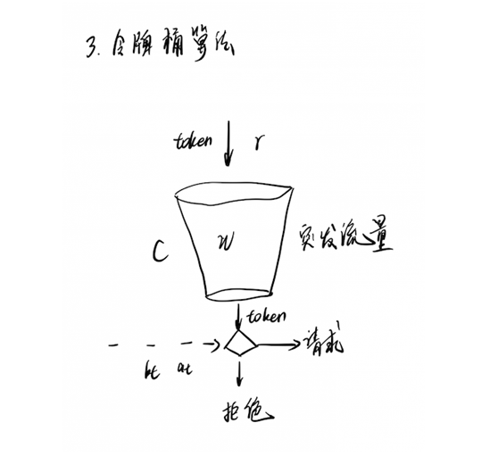
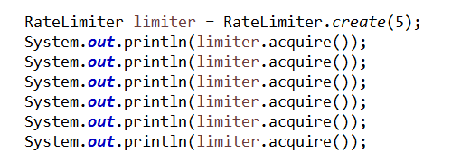
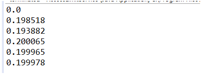
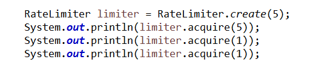
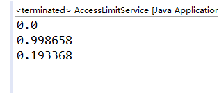
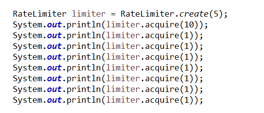
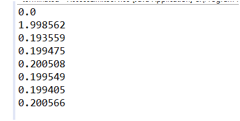
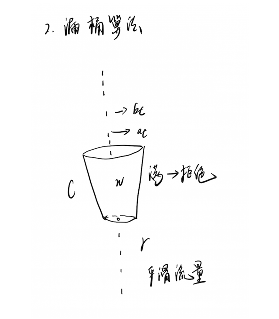
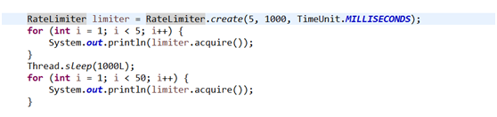
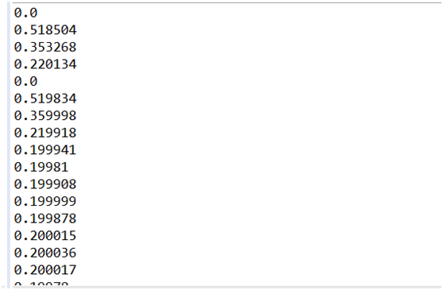

 [Leave a Comment](http://www.dczou.com/viemall/852.html#comments)

 Updated on 八月 2, 2018

# 聊聊互联网限流方案

by [Tony](http://www.dczou.com/viemall/author/admin)

  首先要知道为什么要进行限流,限流的方式有那些,那些应用需要限流。

  在业务场景中,我们会遇到有百万甚至更加大的用户请求流量来访问接口,或者在业务对接过程中,业务提供方的访问频率控制,等等我们的业务都需要做限流处理,

这个时候如果不做任何保护措施，服务器就会承受很大的处理压力，请求量很高，服务器负载也很高，并且当请求超过服务器承载极限的时候，系统就会崩溃，导致所有人都不能访问。为了应用服务的高可用，

一个常用的办法是对大流量的请求（秒杀/抢购）进行限流，拦截掉大部分请求，只允许一部分请求真正进入后端服务器，这样就可以防止大量请求造成系统压力过大导致的系统崩溃，从而保护服务正常可用。这里限流的常用算法有漏桶算法和令牌桶算法。

 额外插一句：处理高并发的三板斧: 缓存、降级和限流！

## 常见限流方案

 令牌桶(Token Bucket)、漏桶(leaky bucket)和计数器算法是最常用的三种限流的算法。

### 计数器方式:

  计数器限流算法也是比较常用的，主要用来限制总并发数，比如数据库连接池大小、线程池大小、程序访问并发数等都是使用计数器算法。也是最简单粗暴的算法。

 采用AtomicInteger:

   使用AomicInteger来进行统计当前正在并发执行的次数，如果超过域值就简单粗暴的直接响应给用户，说明系统繁忙，请稍后再试或其它跟业务相关的信息。

  弊端：使用 AomicInteger 简单粗暴超过域值就拒绝请求，可能只是瞬时的请求量高，也会拒绝请求。

 采用令牌Semaphore:

   使用Semaphore信号量来控制并发执行的次数，如果超过域值信号量，则进入阻塞队列中排队等待获取信号量进行执行。如果阻塞队列中排队的请求过多超出系统处理能力，则可以在拒绝请求。

  相对Atomic优点：如果是瞬时的高并发，可以使请求在阻塞队列中排队，而不是马上拒绝请求，从而达到一个流量削峰的目的。

 采用ThreadPoolExecutor java线程池:

  固定线程池大小,超出固定先线程池和最大的线程数,拒绝线程请求;

  [ https://www.cnblogs.com/clds/p/5850070.html](https://www.cnblogs.com/clds/p/5850070.html)

### 令牌桶方式:

  

  令牌桶算法是网络流量整形（Traffic Shaping）和速率限制（Rate Limiting）中最常使用的一种算法。先有一个木桶，系统按照固定速度，往桶里加入Token，如果桶已经满了就不再添加。当有请求到来时，会各自拿走一个Token，取到Token 才能继续进行请求处理，没有Token 就拒绝服务。

 这里如果一段时间没有请求时，桶内就会积累一些Token，下次一旦有突发流量，只要Token 足够，也能一次处理，所以令牌桶算法的特点是允许突发流量。

  我们看一个例子，看看令牌桶如何允许突发流量，假如令牌则按照每秒5 个的速度放入令牌桶，桶中最多存放20 个令牌，那系统可以支持两种类型的请求流量，一种是允许持续的每秒处理5 个请求，第二种是每隔4 秒，等桶中20 个令牌攒满后，就可以处理一次有20 个请求的突发情况。

令牌桶的方案设计:

 使用guava提供工具库里的RateLimiter类(内部采用令牌捅算法实现)进行限流

  平滑突发限流(SmoothBursty)：

  

   

 

解析:

 RateLimiter.create(5) 表示桶容量为5且每秒新增5个令牌，即每隔200毫秒新增一个令牌；

 limiter.acquire()表示消费一个令牌，如果当前桶中有足够令牌则成功（返回值为0），如果桶中没有令牌则暂停一段时间，比如发令牌间隔是200毫秒，则等待200毫秒后再去消费令牌（如上测试用例返回的为0.198239，差不多等待了200毫秒桶中才有令牌可用），这种实现将突发请求速率平均为了固定请求速率。如果结构不想等待可以采用tryAcquire立刻返回！

RateLimiter的突发情况处理:

 

    

limiter.acquire(5)表示桶的容量为5且每秒新增5个令牌，令牌桶算法允许一定程度的突发，所以可以一次性消费5个令牌，但接下来的limiter.acquire(1)将等待差不多1秒桶中才能有令牌，且接下来的请求也整形为固定速率了。

 

同上边的例子类似，第一秒突发了10个请求，令牌桶算法也允许了这种突发（允许消费未来的令牌），但接下来的limiter.acquire(1)将等待差不多2秒桶中才能有令牌，且接下来的请求也整形为固定速率了。

  因为SmoothBursty允许一定程度的突发，会有人担心如果允许这种突发，假设突然间来了很大的流量，那么系统很可能扛不住这种突发。因此需要一种平滑速率的限流工具，从而系统冷启动后慢慢的趋于平均固定速率（即刚开始速率小一些，然后慢慢趋于我们设置的固定速率）。Guava也提供了SmoothWarmingUp来实现这种需求类似漏桶算法;

 

### 漏桶算法:

​    一个固定容量的漏桶，按照常量固定速率流出水滴;

   先想象有一个木桶，新请求就像水滴一样，不断地滴进来，水滴进来的速度是不确定的，有时会快一点，有时会慢一点，同时桶底下有个洞，可以按照固定的速度把水漏走，如果水进来的速度比漏走的快，桶就会满了，桶满了水就会漫出来，对应的就是拒绝请求。

 漏桶算法的主要特点是可以平滑网络上的突发流量，请求可以被整形成稳定的流量。
 

C        // 水桶总容量

r        // 漏水速度

at        // 上一个请求时间

w        // 当前桶里面的水量
漏桶的方案设计:

   SmoothWarmingUp创建方式：RateLimiter.create(doublepermitsPerSecond, long warmupPeriod, TimeUnit unit)

permitsPerSecond表示每秒新增的令牌数，warmupPeriod表示在从冷启动速率过渡到平均速率的时间间隔。

  速率是梯形上升速率的，也就是说冷启动时会以一个比较大的速率慢慢到平均速率；然后趋于平均速率（梯形下降到平均速率）。可以通过调节warmupPeriod参数实现一开始就是平滑固定速率。

以上的方式都是单应用上的请求限流,那么在分布式上，就不能这样全局的方式来实现了, 因此我们需要分布式限流和接入层限流来解决这个问题。

 

### 常用的分布方式的解决方式有：

 1.纯采用nginx 的IP方式限流,在一些大型的应用流量可以这样控制;

 [ https://www.cnblogs.com/biglittleant/p/8979915.html](https://www.cnblogs.com/biglittleant/p/8979915.html)

 2.采用redis 的计时和计数方式,在规定的时间窗口期,允许通过的最大请求数量;

 3.采用redis lua或者 nginx lua方式实现限流处理;

  https://blog.csdn.net/fenglvming/article/details/51996406

一般都是采用应用层的限流,用户接入层都是采用负载均衡去分发流量;

 

额外资料参考:

http://m635674608.iteye.com/blog/2339587

http://rayleung.xyz/2016/06/23/rate-limit/

https://blog.52itstyle.com/archives/2982/?hmsr=toutiao.io&utm_medium=toutiao.io&utm_source=toutiao.io

 

 Category: [分布式架构](http://www.dczou.com/viemall/category/分布式架构), [架构文摘](http://www.dczou.com/viemall/category/架构文摘) Tags: [限流](http://www.dczou.com/viemall/tag/限流)