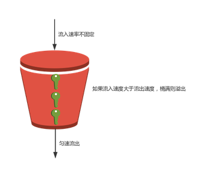
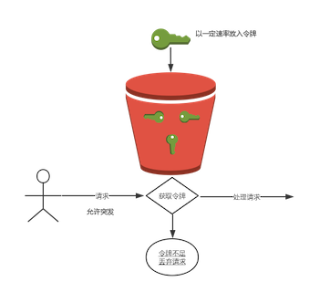
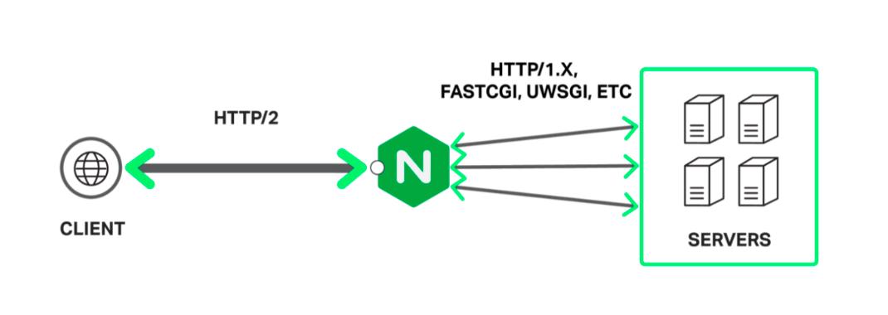
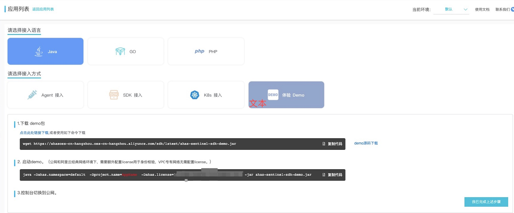
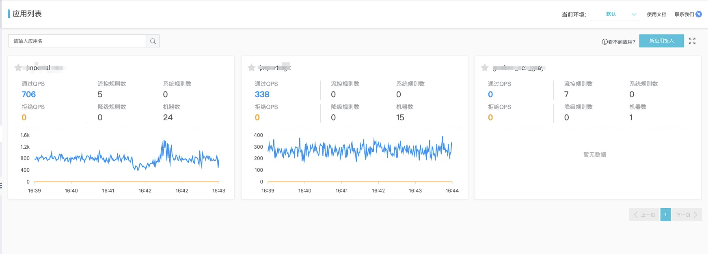
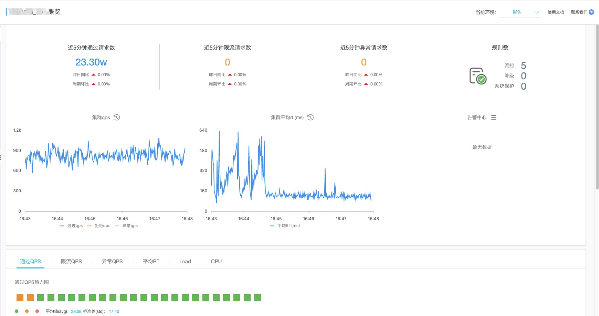
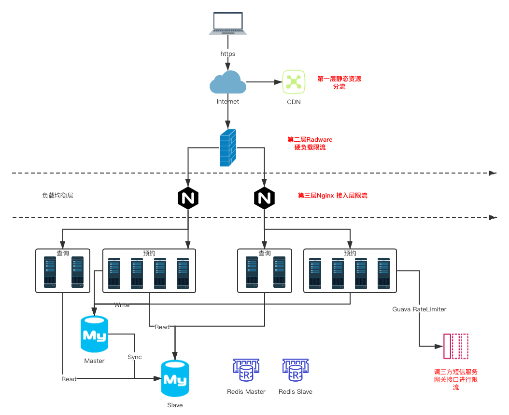

# 行业场景限流方案

[慢慢来2010](https://developer.aliyun.com/profile/maztxuldddpjs)  2020-03-30 886浏览量

**简介：** 前言   行业中许多三方服务上线支付宝后，ISV对自身的业务系统没有任何的流量保护，往往会被瞬间的流量，高并发导致系统承载力出现瓶颈，甚至被打垮的挑战。面对行业场景业务的稳定性痛点，我们往往采取限流熔断的机制来保障ISV自身系统在承诺容量下的稳定运行。


## 前言

  行业中许多三方服务上线支付宝后，ISV对自身的业务系统没有任何的流量保护，往往会被瞬间的流量，高并发导致系统承载力出现瓶颈，甚至被打垮的挑战。面对行业场景业务的稳定性痛点，我们往往采取限流熔断的机制来保障ISV自身系统在承诺容量下的稳定运行。

  这里我们聊聊针对行业场景中合作伙伴该采取哪种限流方案的选择？


## 常见的限流算法策略

  在了解具体限流方案之前，先来熟悉下常见 "两窗两桶" 的限流算法。


### 计数器固定窗口算法:

  固定窗口算法简单粗暴。大致原理是: 维护一个单位时间内的计数值，每个请求通过后，计数值加1，当计数值超过限流阈值时，单位时间内的其他请求就会被限流。一个周期的单位时间结束，计数器会清零，流量恢复正常，进入下一个周期。
  缺点: 无法限制突发尖刺流量! 因为两个时间窗口之间没有联系,调用者可以在一个时间窗口的结束到下一个时间窗口的开始这个间隙内发超过限流阈值的请求。


### 计数器滑动窗口算法:

  滑动窗口其实就是细分后的计数器，相比固定窗口，将时间窗口细化分割，每过一个时间窗口，整个时间窗口就会往右移动一格。


### 漏桶算法:

  漏桶算法类似一个限制出水速度的水桶，固定出口的速率。无论你流入速率多大，都按照既定的速率去处理，如果桶满则拒绝服务(触发限流机制)。

> 注: 图为转发
> 


### 令牌桶算法:

  对于很多场景来说，除了要求能够限制平均传输速率外，还要求允许某种程度的突发请求，比如 秒杀，这时候漏桶算法就不合适了。令牌桶算法是Traffic Shaping和Rate Limiting最常使用的一种算法。

  令牌桶原理: 以一个恒定的速度往桶里放令牌，有请求需要被处理，就从桶里获取一个令牌，当桶里没有令牌可取时，则拒绝服务。令牌桶的这种特性可以对突增的流量进行平缓处理，让系统负载更加均匀。

> 注: 图为转发



举个例子: 去电影院看电影买票，卖出的电影票是固定的, 如果来晚了(后面的请求)就没票了, 要么等待下一场(等待新的令牌发放), 要么不看了(被拒绝)。

- 如果你的系统没有尖刺流量，对于流量绝对均匀有很强的要求，建议使用漏斗。
- 如果你的系统有少量突增流量，同时你希望限流算法简单易实现，建议滑动时间窗口。
- 如果你的系统经常有突增流量，为了系统整体稳定性，建议使用令牌桶。


## 行业限流解决方案介绍

常见的限流方式有：

- 限制总并发数（数据库连接池、线程池等等）
- 限制瞬时并发数（如Nginx的limit_conn模块）
- 限制时间窗口的平均速率（如Guava的RateLimiter、Nginx的limit_req模块）
- 限制远程接口的调用速率、限制消息系统的消费速率

### 接入层限流

  抗疫项目中，一般ISV会把Nginx作为业务的接入层，通过Nginx将请求分发到后端的应用集群上。接入层(流量层)是整个系统的咽喉入口, 越早挡掉请求越好，扛不住的流量越往后端传递，对后端的压力越大。


#### Nginx限流



官方提供两个模块:

- limit_conn模块 (限制瞬时并发数)
- limit_req模块 （限制单位时间内的请求数，速率限制，采用的漏桶算法)

##### limit_req

某口罩预约项目NG限流配置:

```
http {
  ......
  # $binary_remote_addr 通过remote_addr这个标识来做限制
  # zone=xxx:10m 生成一个大小为10M，名字为xxx的内存区域，用来存储访问的频次信息，64位可以存放163840个IP地址。
  # rate=xx r/s 限制相同标识的客户端的访问频次
  limit_req_zone $binary_remote_addr zone=req_perip:10m rate=30r/m; #30r/m: 限制两秒钟一个请求
  limit_req_zone $binary_remote_addr zone=req_query:10m rate=5r/s; #5r/m: 限制每秒五个请求
 }
server { 
    location /mask-appointment-service/appointment/ { 
                ......
            limit_req zone=req_perip burst=4; # 通过req_perip区域来限制
        limit_req_status 507;      # 限流返回值507
        ......
    }
    location /mask-appointment-service/query/ {
        ......
        limit_req zone=req_query; # 通过req_query区域来限制
        limit_req_status 509;     # 限流返回值507
        ......
    }
}
```

上述Nginx配置分别配置了 limit_req 两个规则，预约 和 查询。

- 预约: 针对某个唯一的来源IP做速率的控制，速率为30r/m(每2秒1个请求)。
- 查询: 针对某个唯一的来源IP做速率的控制，速率为5r/s (每1秒5个请求)。

特别注意:
rate=30r/m 很多时候会让人理解成每分钟30个请求, 其实并不是。官网的解释:

> 速率以每秒请求数r/s的形式指定。如果希望速率小于每秒一个请求，可以按每分钟请求数 r/m 来指定。例如，每秒半个请求为: 30r/m。
>
> The rate is specified in requests per second (r/s). If a rate of less than one request per second is desired, it is specified in request per minute (r/m). For example, half-request per second is 30r/m.

几个写法含义：

```
limit_req_zone $binary_remote_addr zone=limit_login:10m rate=10r/m;
代表单ip每6秒1个请求(60/10=6)
limit_req_zone $binary_remote_addr zone=limit_login:10m rate=20r/m;
代表单ip每3秒1个请求(60/20=3)
limit_req_zone $binary_remote_addr zone=limit_login:10m rate=30r/m;
代表单ip每2秒1个请求(60/30=2)(官方文档叫half-request per second 1秒半个请求)
limit_req_zone $binary_remote_addr zone=limit_login:10m rate=1r/s;
代表单ip每秒1个请求
limit_req_zone $binary_remote_addr zone=limit_login:10m rate=2r/s;
代表单ip每秒2个请求
```

PS:
size ？该如何设置呢？

  一个二进制的IP地址在64位机器上占用63个字节，设置10M的话: 10x1024x1024/64 = 163840，64位可以存放163840个IP地址。

##### limit_conn

  limit_conn 这里不详细说了，有兴趣同学可以自行了解一下。

##### Nginx限流总结

  Nginx属于接入层面，不能解决所有问题，比如内部调用的一些接口无法保证是否有限流控制，同时也只能挡掉http请求，比如rpc请求无法限制，所以在应用层实现限流还是很有必要的。上述Nginx限流都是对于单NG的，如果行业合作伙伴的接入层有多个Nginx，该怎么办呢？

- 解决方案1: Nginx前面部署负载均衡，通过一致性哈希按照限流的key把请求转发到接入层的NG(相同key的请求打到同一台Nginx上)
- 解决方案2: 通过 Nginx+Lua（OpenResty）调用分布式限流逻辑实现。

更多信息可以查看官方文档

> [limit_req - Nginx] http://nginx.org/en/docs/http/ngx_http_limit_req_module.html
>
> [limit_conn - Nginx] http://nginx.org/en/docs/http/ngx_http_limit_conn_module.html

#### Openresty

  有需要动态和精细控制的需求，可以通过Openresty做接入，OpenResty提供了lua-resty-limit-traffic 的Lua限流模块，基于Nginx的limit.conn和limit.req实现，通过可编程的方式进行复杂场景限流设计。比如变化限流速率，变化桶的大小等动态特性，可以按照更复杂的业务逻辑进行限流处理。

##### lua-resty-limit-traffic

resty.limit.req 模块
示例代码

```
local limit_req = require "resty,limit.req"
local lim, err = limit_req.new("mylimit", 5, 9)

local delay, err = lim:incoming(ngx.var.binary_remote_addr, true)
if not delay then
    if err == "rejected" then
              return ngx.exit(503)
          end 
              return ngx.exit(500)
  end

if delay >= 0.001 then
    ngx.sleep(delay)
end
```

resty.limit.req 和 Nginx 的 limit_req 实现的效果和功能一样，但是这里用 Lua 来表达限速逻辑，可以在别的代码里面去引入。

更多其它模块和用法可以查看官方文档:

> [lua-resty-limit-traffic - Openresty] https://github.com/openresty/lua-resty-limit-traffic

#### 四层限流

  OSI 四层限流可以通过SLB、WAF等四层接入进行流量的限流，也可以通过F5等硬负载四层设备来实现对流量控制。四层流量控制异常设计的面比较大，一般情况下慎用。

#### API路由网关

  在微服务架构中，API路由网关作为内部系统的入口，非常适合做API限流操作，网关层的限流可以简单地针对不同业务的接口进行限流。业界较有名的Zuul、Dubbo都可以对限流进行较好的设计，当然还有我们的 Sentinel开源方案，Sentinel 支持对 Spring Cloud Gateway、Zuul 等主流的 API Gateway 进行限流。这里就不详细说了，有需要查阅相关资料。


### 应用层限流

#### 单机单应用限流

  我们可以在服务器内部通过编写一些算法进行限流，也可以调用一些类库中存在的API，比如Google Guava类库的RateLimiter，Guava RateLimiter 是 Google Guava 提供的生产级别的限流工具，RateLimiter 基于令牌桶流控算法，可以有效控制 单 JVM 下某个逻辑操作的频率。
  Guava 的 RateLimiter 提供了以下核心方法 create()acquire()tryAcquire()，其中 create() 创建令牌桶，acquire() 获取令牌，支持同时获取 N 个令牌，tryAcquire(long timeout, TimeUint unit)支持在限定时间内获取令牌，如果获取不到将返回 false。

示例代码如下：

```
import com.google.common.util.concurrent.RateLimiter;
public class GuavaRateLimiterDemo {
    // 每秒 100 个令牌
    private final RateLimiter rateLimiter = RateLimiter.create(100.0);
    void doBusiness() {
        rateLimiter.acquire();
        // 继续操作用户业务
    }
}
```

由于 acquire() 会一直等待，并且 Guava 不保证公平分发，所以会出现线程持续等待情况，需要考虑超时情况下面请求直接结束。
示例代码如下：

```
import com.google.common.util.concurrent.RateLimiter;
import java.util.concurrent.TimeUnit;
public class GuavaRateLimiterDemo {
    // 每秒 100 个令牌
    private final RateLimiter rateLimiter = RateLimiter.create(100.0);
    void doBusinessWithTryAcquire() {
        boolean isPermit = rateLimiter.tryAcquire(500, TimeUnit.MILLISECONDS);
        if (!isPermit) {
            throw new RuntimeException("business overheated.");
        }
        // 继续操作用户业务
    }
}
```

RateLimiter 不仅实现了令牌桶，还做了不少优化，可以满足不同场景的需求。
它支持「预热」warmupPeriod，tryAcquire 操作还支持立即计算返回，避免无效等待。

更多信息可以查看官方文档

> [RateLimiter (Guava: Google Core Libraries for Java 19.0 API)]) https://guava.dev/releases/19.0/api/docs/index.html?com/google/common/util/concurrent/RateLimiter.html

缺点:
Guava RateLimiter（以及其他基于令牌桶算法的实现）缺点是只能针对单机，无法在分布式环境下面共享流量数据, 不适用于分布式服务。如果想使用的话，需要提前计算好每个示例负载均衡之后的流量阈值。

#### 分布式限流

  这一类的限流策略跟上面 API 路由网关模式的限流相似，同样是依赖配置中心管理，限流逻辑会配套服务化的框架完成。


### 阿里云应用高可用-Ahas

  Ahas是阿里云提供的应用高可用服务(Application High Availability Service)产品，基于 Sentinel 提供了专业的多样化的流控降级手段。

  和常见的网关限流相比，Ahas 流控降级有以下优势：

- 提供 Web Servlet、Dubbo、Spring Boot、Spring Cloud、gRPC、Apache RocketMQ、Netflix Zuul 等多种主流框架的适配，只需要引入相应的依赖并进行少量配置即可接入。
- ECS 集群和容器服务 Kubernetes 集群均支持使用 Ahas 实现限流降级。
- 全方位的监控, 可以实时监控展示通过的 QPS、拒绝的 QPS、响应时间等信息，同时支持查看单机指定资源的监控数据。
- 自建机房，服务器，私有云，其它云都可接入 Ahas 进行限流降级管理。

  实际项目应用截图:





更多信息可以查看阿里云官方文档

> [AHAS 使用指引] https://help.aliyun.com/document_detail/144439.html?spm=a2c4g.11186623.6.541.75203a78CViDbJ


## 不同限流方案该怎么选择？

行业场景中，推荐使用Nginx、OpenResty、Guava RateLimiter、Ahas、四层限流等方案，基本能满足需求。

| 限流方案               | 分类                 | 优势                                                         | 劣势                                                         |
| :--------------------- | :------------------- | :----------------------------------------------------------- | :----------------------------------------------------------- |
| Nginx                  | 接入层限流           | ISV配置简单，成本低                                          | • 限流力度静态，手动配置，面对流量波动业务，很难去定义合理阈值。 • 无法对服务层单服务做有效限流策略配置 •对接入层性能有较高要求 |
| OpenResty              | 接入层限流           | 可编程，可进行丰富、灵活的流控策略                           | 只能挡掉HTTP请求                                             |
| Guava RateLimiter      | 应用层限流单机单应用 | • 精度高,高效方便 • ISV可以对内部调用的三方接口进行单独的限流 | • 无法跨JVM，不适用于分布式服务                              |
| Ahas                   | 应用层限流           | • 阿里云提供现成的高可用限流熔断功能, 一键接入 • 支持多种主流框架适配 • 可视化配置，监控，简单高效 | • 外网要求 (ISV接入Ahas需满足外网联通下发流控规则,某些政务专网业务可能不适用) • 收费 |
| SLB、 WAF、 硬件防火墙 | 四层限流             | • 四层流量拦截效率高 • 流量第一层防护                        | • 只能针对总体流量进行限流，一般配合其它层限流使用           |


## 抗击疫情-某口罩预约项目实战

### 挑战:

  在抗疫期间，我们联合政府机构，外部的合作伙伴紧急上线了口罩预约的服务。由于在疫情期间，口罩预约是个大热点，在开放预约入口1分钟内，预约系统面临着每秒峰值XX w+的并发压力。针对这种秒杀预约的场景，联合ISV对业务系统进行了一系列的改造优化, 这里我们重点来看看该项目是怎么通过不断消减请求和限流来保障流量突增时系统的稳定性的。

### 实战




#### 第一层: 合法性限流拦截

  在口罩预约开放时间段内，用户执行的第一个动作是填写预约信息，并获取手机验证码进行提交。我们可以在这一层就将不合法的请求给拦截掉(刷单行为、是否已登录，预约渠道是否合法)， 允许合法的用户访问到服务器。

1. 预约时使用手机验证码，用来拉长用户访问时间。（输入验证码到提交预约整个过程可能需要五秒时间，降低访问峰值）
2. 防火墙进行IP限制策略配置，防止不合法刷单行为。
3. 非预约时间段内隐藏口罩预约入口页面。

#### 第二层: 负载限流与服务限流

  合法性限流只能限制无效、非法的请求。但对于口罩预约场景来说，仍然会有大量的合法有效请求进入系统。在项目上线前，协助ISV进行如下的分流和限流的优化。

1. 查询和预约读写分离，分流数据库的压力。
2. 静态资源请求上CDN，分担了总请求处理的压力。
3. 扩容了Nginx代理层和后台服务集群，共同来负载请求压力。
4. Nginx入层进行了第二层的限流熔断。（详细配置请参考上述文档中的Nginx限流方案)。
5. 获取手机验证码会调用三方短信服务网关，在应用接口层面单独进行了限流。